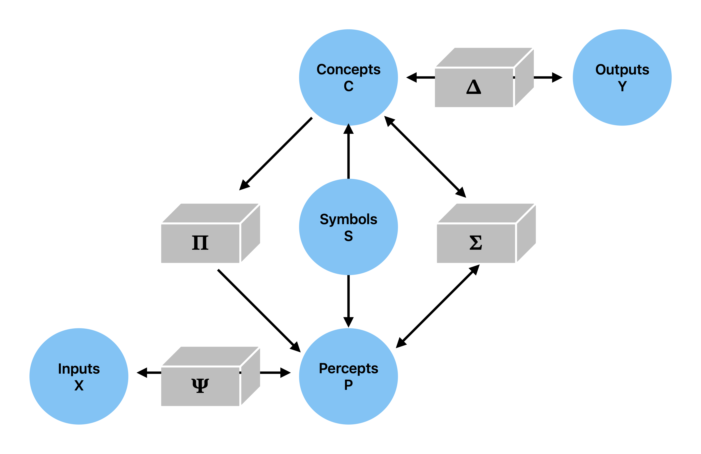

# BasicModel

## Basic Model of Cognition



*The basic model of cognition relies on conceptual hyperplanes and perceptual prototypes to synthesize and analyze the input space. It uses a high-dimensional embedding to characterize mental space and integrates symbolic computation. Its three major operations are intersection (which forms percepts from concepts), union (a bidirectional mapping between concepts and percepts), and equality (where symbols are elements that map across perceptual and conceptual domains).*

## Overview

BasicModel is a parameterized neural architecture with three independent levers:

- **Ergodic** — adaptive bias-variance control via a gradient energy sensor (not gradient descent)
- **Certainty** — certainty-weighted cross-entropy loss
- **Quantized** — vector quantization of the conceptual space

Model configurations are specified in XML and can be compared side-by-side. See [doc/Architecture.md](doc/Architecture.md) for the full mathematical treatment.

## Files

| File | Description |
|------|-------------|
| [bin/BasicModel.py](bin/BasicModel.py) | Main entry point: DerivedModel, training loop, comparison plots, HTML report |
| [bin/Model.py](bin/Model.py) | Layer library: SigmaLayer, ErgodicLayer, LinearLayer, spaces, and utilities |
| [bin/SigmaPi.py](bin/SigmaPi.py) | Standalone demo of the SigmaPi network solving XOR |
| [data/](data/) | XML model configurations and static embeddings |
| [doc/Architecture.md](doc/Architecture.md) | Algorithm details: Sigma/Pi layers, ergodic exploration, gradient energy sensor |
| [test/](test/) | Unit tests |

## Quick Start

```bash
# Set up virtual environment
make venv

# Run a single model
make simple          # data/simple.xml
make ergodic         # data/ergodic.xml

# Compare two models side-by-side
make compare         # defaults: data/simple.xml vs data/ergodic-only.xml
make compare XML1=data/simple.xml XML2=data/ergodic.xml

# Run tests
make test

# Generate PDF documentation
make doc_pdf
```

## XML Configuration

Models are configured via XML files in `data/`:

```xml
<model>
  <architecture>
    <nConcepts>20</nConcepts>
    <ergodic>true</ergodic>
    <certainty>true</certainty>
    <quantized>false</quantized>
    <normed>false</normed>
    <reverse>false</reverse>
    <invert>false</invert>
  </architecture>
  <training>
    <dataset>mnist</dataset>
    <numTrials>1</numTrials>
    <numEpochs>20</numEpochs>
    <batchSize>10</batchSize>
  </training>
</model>
```

## Output

Each run produces an HTML report (timestamped in `output/`) containing:

- **Error per Epoch** — training and test loss curves
- **Accuracy per Digit** — per-class accuracy breakdown

In compare mode, additional overlay plots show combined loss and accuracy across models with color-coded legends.
