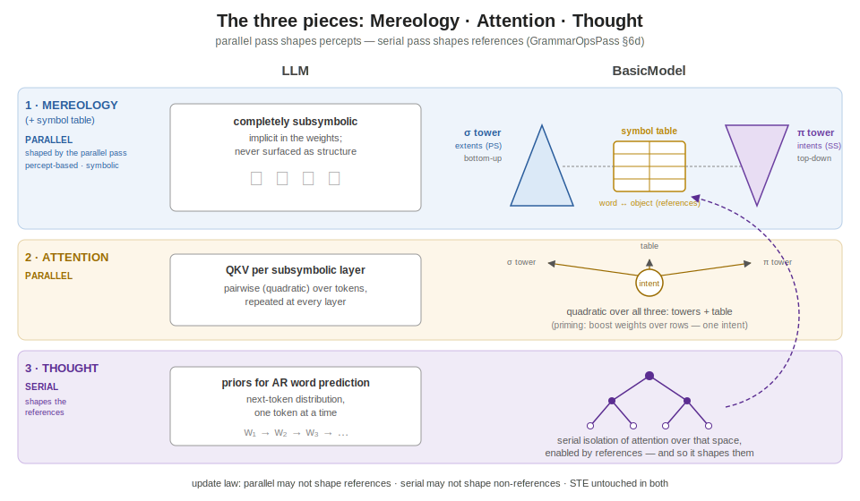

# Architecture

## The three pieces: Mereology, Attention, Thought (2026-06-11)



> **Terminology (2026-06-21 convention).** One noun per-space: a **percept** is
> a perceptual thing (PartSpace/WholeSpace, dimensionally-embedded, extensional;
> *part* and *whole* are its two subtypes); a **concept** is a ConceptualSpace
> relation tying one part-percept to one whole-percept (the Concept codebook);
> a **symbol** is a SymbolSpace 0-D reference to a concept. The CS "symbol
> table" is therefore the **Concept codebook** below.

The architecture decomposes into three pieces; the first two run in
parallel, the third is serial:

1. **The mereological towers (and the Concept codebook).** In an LLM the
   mereology is completely subsymbolic — implicit in the weights,
   never surfaced. In BasicModel it is percept-based and symbolic: two
   towers — the σ tower ascending bottom-up (part-percept extents, the PS
   codebook) and the π tower descending top-down (whole-percept intents, the
   SS codebook) — linked by the word/object Concept codebook
   (`bin/References.py`), whose rows are the concepts (part↔whole references).
2. **Attention.** In an LLM, attention is QKV per subsymbolic layer.
   In BasicModel, attention is quadratic over all three structures —
   both towers and the Concept codebook — realized as priming (boost weights
   over codebook rows; the single intent of GrammarOpsPass §5).
3. **Thought.** In an LLM, thought is the computation of priors for
   autoregressive word prediction. In BasicModel, thought is a
   **subsequent isolation of attention over that space, enabled by
   references** — the serial pass: referential lookup, shift/reduce
   composition, story selection. Because thought is the only process
   that invokes the referential taxonomy *qua references*, it is the
   only process licensed to **shape the references**.

This yields the codebook update law (GrammarOpsPass §6d,
implemented): **percepts are shaped by the parallel pass; references
are shaped by the serial pass.** STE is untouched in both modes; the
partition governs row updates — parallel mode may not shape
references, serial mode may not shape non-references
(`Spaces.reference_update_mask`; the `update_mask_fn` chokepoint on
`VectorQuantize`). Rational by construction — though possibly an
overly optimistic arrangement with respect to human thinking.

See [SymbolFirewall.md](SymbolFirewall.md) for the governing principle this
update law (and the codebook/meronomy ownership model generally) instances: all
computation is composed over typed, symbol-attached units — read/write masks,
no anonymous global residual stream.

#### Addressable attention — the typed `.where`

Global attention (`GlobalAttention`, `bin/Spaces.py`; gated `<globalAttention>`)
ranges over a **typed addressable space**: one distribution competes across every
store at once and emits a typed `.where` = `(space-id, bracket)` plus a soft-read
`Σ αₖ·keyₖ`. Six stores (the `SPACE_*` ids):

| id | store |
|---|---|
| `INPUT` | the staged input window (per-span percept content) |
| `STM` | the live short-term-memory rows |
| `LTM` | the consolidated truth store (rows + trust value) |
| `PART` | the PartSpace codebook (part-percepts) |
| `WHOLE` | the WholeSpace codebook (whole-percepts + meronomy/taxonomy) |
| `SYMBOL` | the SymbolSpace codebook (symbols, 1:1 with concepts) |

`PART`/`WHOLE` appear whenever their tower has a codebook; `SYMBOL` only under
`<symbolTower>`. Pointing `.where` at a codebook/LTM store is recall; at the input
window it is reading — one mechanism, the type tag distinguishes them. Under
`<globalAttentionConsume>` the soft-read is fed back into the head as a zero-init
gated residual, so the output loss trains the retrieval.

The symbol codebook is a **reference**, not a learned copy: it tracks the concept
codes so the two cannot diverge or dissociate. Its training objective is kept
separate from reconstruction (the source concepts are shaped by their own pass),
which is why the symbol leg detaches.

These six stores are the substrate for the four foundations of mindfulness; the
mapping (and the trust-sign-as-vedana / luminosity-as-joy reading of `LTM`) is in
[Philosophy.md](Philosophy.md#the-four-foundations-of-mindfulness).

> **Status (2026-05-29 update):** further architectural pivots landed
> on top of the 2026-05-27 substrate refactor:
>
> - **PerceptStore → RadixLayer.** The radix-trie input encoder is
>   now a first-class `Layer` subclass in `bin/Layers.py`;
>   `PartSpace.reverse` invokes `RadixLayer.reverse` for the
>   structural decode.
> - **MetaLayer → SymbolizeLayer.** The binary GrammarLayer that
>   promotes a freshly-seen percept to a symbolic prototype is now
>   `SymbolizeLayer`; no semantic change.
> - **Auto-META moves PS → CS.** The cross-codebook bind (META entry:
>   PS chunk-id $\leftrightarrow$ SS prototype-id) fires from
>   `ConceptualSpace._maybe_autobind_meta` at stage 0; PS no longer
>   holds a back-ref to SS.
> - **Clean-stack STM.** `ConceptualSpace.forward` bypasses
>   `sigma_in` / `sigma_cs` on forward — `folded = primary` at stage
>   0, `folded = sym` at k > 0. The Stage-10 additive composition is
>   retired; per-stage space-role attribution is trivially invertible.
> - **`basis=` kwarg for grammar reverses.** `UnionLayer.reverse(parent,
>   basis=None)` / `IntersectionLayer.reverse(parent, basis=None)`
>   accept a Codebook / Basis object (typically
>   `WholeSpace.subspace.what`) instead of a raw `W` tensor;
>   `bin/Language.py::unreduce()` dispatches accordingly.
> - **LSE soft-max kernels.** `Ops._disjunction_kernel` /
>   `Ops._conjunction_kernel` default to LogSumExp smooth variants
>   when `monotonic=False`; the hard branch is retained for
>   monotonic-mode and exact idempotency tests.
> - **LBG-style SS codebook splitting.** Gray (1990) EMA + per-row
>   variance tracking; rows whose running variance exceeds a
>   threshold split along the top-variance eigendirection.
>
> See [doc/old/2026-05-29-clean-stack-stm-basis-arg-radixlayer.md](old/2026-05-29-clean-stack-stm-basis-arg-radixlayer.md)
> for the consolidated rationale.

> **Status (2026-05-27):** the **substrate refactor** has landed end-to-end
> ([doc/old/2026-05-26-two-loop-pi-sigma-substrate.md](old/2026-05-26-two-loop-pi-sigma-substrate.md)).
> PS is a single-arg input processor (pi + sigma). CS is a STM container +
> grammatical CPU (no atomic forward fold; sigma_percept retired). SS owns
> the unified word lexicon codebook with paired (orth, semantic) rows. The
> CKY `Chart` and STM shift-reduce parsers retire entirely; `LanguageLayer`
> (signal router) is the canonical parser. `LiftLayer` / `LowerLayer` are
> binary `GrammarLayer` subclasses with internal Sigma / Pi (no longer
> borrowing substrate folds). `GrammarLayer` gains an optional butterfly
> cascade mode for cross-position mixing — closes the XOR convergence
> target. Two operating modes selected by `<serial>`: **SERIAL/GRAMMATICAL** (per-word PS with
> grammar dispatch over STM) and **PARALLEL** (T = `<subsymbolicOrder>`
> iterations of PS over CS). The `<parserBackend>`, `<routerKind>`,
> `<chartTau>`, `<chartTopK>`, `<chartNoiseEps>` XML knobs are retired;
> `<symbolicOrder>` is now the symbolic / relational loop budget.

## Overview

BasicModel is a bidirectional neural architecture organized as a pipeline of five
**spaces** plus a symbol host (`SymbolSpace`), each implementing a distinct
representational transformation:

```
Forward:  InputSpace -> PartSpace -> ConceptualSpace -> WholeSpace -> OutputSpace
Reverse:  OutputSpace -> WholeSpace -> ConceptualSpace -> PartSpace -> InputSpace
```

The pre-2026-05-27 "two feedback loops" (S → C symbolic loopback per stage,
C → P subsymbolic loopback cross-forward) collapse under the substrate
refactor:

- **Subsymbolic loop dissolves.** PS is a single-direction input processor.
  No recurrent C → P feedback at the substrate level. In PARALLEL mode,
  iteration happens by passing `CS` to the same `PS.forward(x)` for T
  refinement passes (the `<subsymbolicOrder>` knob).
- **Symbolic loop generalizes** to pairwise grammar ops over STM, dispatched
  by the signal router (`LanguageLayer`). `Lift` and `Lower` join the same
  GrammarLayer dispatch surface as `Intersection`, `Union`, etc.

The forward pass transforms raw input into predictions; the reverse pass
reconstructs the original input from the symbolic representation. Both
directions are trained simultaneously with a single optimizer minimizing a
combined loss:

```
totalLoss = (1 - reconRatio) * outputLoss + reconRatio * reconstructionLoss
```

The legacy `SubwholeSpace` and `SyntacticSpace` classes have been
retired. The subsymbolic role is filled by `PartSpace`; syntax /
grammar dispatch lives on `SymbolicSubSpace.languageLayer` (the signal router,
which subsumes the retired `Chart`). The `MereologicalTree` sidecar that
backed `part` / `equals` / `query` is also retired --- those operations are
pure-geometric clipped-cosine projections over WholeSpace codebook
activations.

`PartSpace` and `WholeSpace` (renamed 2026-06-12 from `PerceptualSpace`
/ the original `SymbolSpace`) both subclass a thin shared
`PerceptualSpace(Space)` base: both views are perceptual. At the corpus
callosum, objects are analysed and synthesized by sending them back to
PerceptualSpace — wholes get split, parts get chunked. In symbolic
"mode" the objects sent back are symbols. Terminologically there are
objects and references; a reference is a *sign* (a quantized version of
the referent) or a *symbol* (an unrelated version of the referent, of
much lower dimensionality). The freed name `SymbolSpace` was
**reintroduced 2026-06-19** with new semantics — it is now the
grammar/word space-role (formerly `WordSpace` / `WordSubSpace`, abbrev `ss`;
the WholeSpace stream is now `ws`). See the full rename mapping in
`doc/old/2026-06-19-handoff.md`.

The corpus callosum **builds a single meronomy out of the two towers**: a part
`A` (PartSpace) and a whole `B` (WholeSpace) carry `.what` codes from different
codebooks (incomparable), but their `.where` is comparable, so the callosum links
**`A isa B`** (token `isa` type) when `A.where` is contained in `B.where` with no
greater-part/lesser-whole intervening. Word↔object — too unlike to link directly —
is bridged by a **second-order meta-object** (synthesized in PartSpace, outside
`.where`/`.when`: the MetaSymbol). The correctness signal is the **part/whole
ratio** (many-parts→one-whole = under-analysed; one-part→one-whole = over-analysed),
which requests further σ-synthesis / π-analysis in the offending `.where` — and is
the principled fix for the MM_20M mean-collapse. Full design:
[doc/old/mereological-order-raising.md](old/mereological-order-raising.md).

### Spaces

| Space | Role | Owns | Notes |
|-------|------|------|-------|
| **InputSpace** | Lifts raw data into working dimensionality; surface tokenization | LiftingLayer; lexer wiring (text mode) | Reaches PS's lexicon via back-ref; no own lexicon |
| **PartSpace** | Bottom-up SYNTHESIS branch (Pi/Sigma swap, rev. 2026-06-09): sigma fold + `<synthesis>` front ends + MPHF lookup | one `self.sigma` (SigmaLayer — the union fold), MPHF + index table | `forward(x_subspace)` takes one positional arg (the atom-view stem). Result = `sigma(x)` after the front end embeds. PS Lexicon (`self.vocabulary`) holds per-word vectors; MPHF maps surface → row. |
| **ConceptualSpace** | STM container + main grammatical CPU | STM (`ShortTermMemory`, depth ~8) | No atomic forward fold (`sigma_percept` retired). `forward(new_idea_subspace)` does STM shift / push. Dispatches read-only grammar ops via the signal router. |
| **WholeSpace** | Top-down ANALYSIS branch: pi fold + `<analysis>`/`<lexer>` knobs; unified word lexicon codebook owner; dispatch site for codebook-write ops | one `self.pi` (PiLayer — the intersection fold), unified codebook with paired (orth, semantic) rows | `forward(CS_subspaceForWS, IS_concepts=None)` — stage 0 reads the unity view. `insert_paired_word(word, vec)` creates an orth row + random semantic row, parented via `Codebook.set_part_parent`. Lookup chain: surface → MPHF → orth row → semantic via parthood. |
| **OutputSpace** | Final prediction | LinearLayer | nActive, nDim, nVectors |

The cross-space fold contract has changed:

```
PS.forward(x):  return self.pi(x.materialize()) + self.sigma(x.materialize())
CS.forward(new_idea):  STM[0..6] = STM[1..7];  STM[7] = new_idea  (mode-dispatched)
SS:  no atomic forward operator; hosts insert_paired_word + write-required grammar ops
```

The legacy composition `C = sigma_percept(pi_input(IS) + pi_concept(C_prev))`
is **retired**. Per-stage feedback is absent at the substrate; grammar
dispatch over STM provides the recurrent character via the signal router.

See [Spaces.md Section "Sigma / Pi ownership"](Spaces.md#sigma--pi-ownership-2026-05-27-substrate-refactor)
for the cognitive rationale and the migration trail.
See [Logic.md Section 8](Logic.md) for the algebraic constraints on sigma/pi.

Dimensions (`nDim`) are read from `TheObjectEncoding`. Codebook sizes
(`nVectors`) are likewise on `TheObjectEncoding`; the factory validates
`nVectors >= nActive`.


Layer selection by `invertible` (the `<reconstruct>` element / `reconstructEnum`
were **RETIRED** in A1, 2026-06-09; reconstruction is now seeded from concepts
**unconditionally**, gated only by `reconstructionScale`):

1. **Non-invertible, forward-only layers** (`PiLayer`, `SigmaLayer`):
   forward-only, no reverse pipeline.
2. **`invertible`**: Single invertible layer
   (`PiLayer(invertible=True)`, etc.) serves both directions, sharing weights.
3. **Not `invertible`** (but reconstructed): Two layers with separate
   weights --- `forward()` on one, `reverse()` on the other. Avoids the
   expressivity limitation where a non-invertible layer can't represent the
   inverse of another. Reverse uses matrix `pinv` (may be numerically
   unstable from SVD convergence). `<invertible>true</invertible>` avoids
   this via shared-weight inversion.

### Reconstruction Symbols

The symbolic bottleneck can lose information needed for reconstruction. XOR
maps 2 inputs to 1 output, but `XOR(0,0)=0` and `XOR(1,1)=0` are distinct
inputs producing the same output. A single output symbol cannot reconstruct
which input was presented.

`nSymbols` is split:

- **`nOutputSymbols`** `= OutputSpace.nActive` --- fed to OutputSpace for prediction
- **`nReconSymbols`** `= nSymbols - nOutputSymbols` --- carried in `end_state`
  for reconstruction

A skip connection through the symbolic bottleneck. Reconstruction symbols
receive gradient only from reconstruction loss.

### Single Optimizer with Overlapping Weight Spaces

The forward and reverse passes share a **single Adam optimizer** that
minimizes the combined loss. Forward and reverse weight spaces **partially
overlap** --- neither disjoint (allowing independent optimizers) nor identical
(creating destructive interference). Some layers share weights between
directions (shared embeddings, the symbolic bottleneck); others are
direction-specific (`pi1`/`pi2`, `sigma1`/`sigma2`, `linear1`/`linear2`).

- **Shared weights** receive gradient from both losses, learning
  representations useful in both directions.
- **Direction-specific weights** specialize without interference.
- **No ping-pong**: separate optimizers on overlapping parameters would pull
  weights in alternating, conflicting directions each step.

When `invertible=true`, overlap is total: one invertible layer serves both
directions and receives the full combined gradient.

Reference: A.M. Rogers, T.T. Shannon, and G.G. Lendaris, "A comparison of DHP
based antecedent parameter tuning strategies for fuzzy control,"
*Proceedings Joint 9th IFSA World Congress and 20th NAFIPS International
Conference*, 2001, doi:
[10.1109/NAFIPS.2001.944317](https://ieeexplore.ieee.org/document/944317).

### Training Loop

Single Adam optimizer with persistent state (momentum/variance accumulate
across epochs):

1. Forward pass: input $\to$ prediction + `end_state`
2. Compute `outputLoss` from prediction vs. target
3. Reverse pass: `end_state` $\to$ reconstructed input
4. Compute `reconstructionLoss` from reconstruction vs. original input
5. Backpropagate combined `totalLoss`
6. If ergodic: run `paramUpdate()` (gradient energy sensor updates alpha)
7. Optimizer step (embedding params excluded when `trainEmbedding` is `NONE`,
   `CBOW`, or `SBOW`)
8. If `trainEmbedding` is `CBOW`, `SBOW`, or `BOTH`: run embedding update step

Alpha annealing (ergodic): starts at `1.0` (full exploration), decays to
`0.0` within the first 5% of epochs via `alpha = max(0, 1 - epoch / warmup)`
where `warmup = numEpochs // 20`. Code convention (`alpha=1` means explore)
is the inverse of the ergodic math convention; layers translate internally.

See [Params.md](Params.md) for all XML parameters. See
[Training.md](Training.md) for embedding modes.

### The three cognitive operations (2026-06-14)

Processing decomposes into three operations, in increasing order of
abstraction. Each maps to a knob (or, for the first, to the folds themselves):

1. **Granularity of analysis and synthesis** — done *automatically* by the
   two perceptual views' folds, per pass. PartSpace's **Sigma synthesizes**
   (union; count-reducing: many atoms → fewer chunks); WholeSpace's **Pi
   analyses** (intersection; count-increasing: one unity → many parts). How
   finely the scene is carved, or how coarsely it is chunked, is set by the
   folds — there is no separate granularity knob. The InputSpace feeds the two
   views directly: the **Atom** view (`[B, N, D]`, which PartSpace synthesizes
   bottom-up) and the **Universe** view (`_unity_view`, the whole as one event,
   which WholeSpace analyses top-down). Optionally (`<mereologyRaise>`),
   perception builds a meronymic lattice over the towers and **raises
   abstraction order** as attention requires — see
   [Mereology.md → Order-raising](Mereology.md) and
   [doc/old/mereological-order-raising.md](old/mereological-order-raising.md).

2. **Subsymbolic order** (`<subsymbolicOrder>`) — *iterating* the folds:
   codes are passed back to PartSpace / WholeSpace across `subsymbolicOrder`
   passes (the CS→PS loop). Synthesis chunks the codes into higher-order
   percepts (fewer each pass); analysis re-expands, attention selecting what
   to expand (a top-k over the priming, applied after the WholeSpace
   codebook lookup). Symbolic composition is no longer a separate CS→PS
   passback flag: the recurrent symbolic leg always flows through
   `WholeSpace.forward(prevCS_forSS)`, and the symbolic-iteration codebook
   handles higher-order symbolic composition on the CS→SS path.

   > **Proposed refinement (mereological-order-raising spec).** This single
   > subsymbolic loop is really **two** moves CS should choose between *per
   > representation*, by reading the **contiguity of `.where`**: a *contiguous*
   > extent → **refine granularity** (chunk finer / tile — drive the radix), same
   > order; a *discontiguous* extent → **raise order** (another σ/π fold, lifting
   > out of `.where`/`.when`); a *zero* `.where` → null. The number of contiguous
   > runs in a whole's `.where` *is* its part/whole ratio, so the same read also
   > routes integrate-vs-disintegrate (→PartSpace σ vs →WholeSpace π). See
   > [doc/old/mereological-order-raising.md](old/mereological-order-raising.md)
   > "The three-aspect loop". As of 2026-06-16 the contiguity read has its
   > substrate: `.where` / `.when` are **endpoint-sum brackets** `[start, end]`
   > (`WhereEncoding.decode_span`), so extent and gaps are read directly off a
   > code (a zero-extent instant vs a span); see [doc/Spaces.md](Spaces.md).

3. **Symbolic order** (`<symbolicOrder>`) — the symbolic / relational loop
   budget. In serial mode (`<serial>true</serial>`), words are read **one at a
   time** from WholeSpace (reading isolated words to ConceptualSpace *is*
   attention) and processed grammatically in ConceptualSpace's STM and on the
   PartSpace side. `symbolicOrder` limits how many symbolic / SS loops may run;
   `<serial>` selects whether the per-word traversal is active.

So: granularity is intrinsic to the folds, subsymbolic order iterates the
subsymbolic passes (composing higher-order percepts), symbolic order budgets
the relational pump, and `serial` selects the serial grammatical loop over
words.

> **Current order semantics.** This section supersedes the older mode-selector
> wording in [doc/old/orders.md](old/orders.md). The three order axes now have
> separate semantics, bounds, and composition rules:
>
> - **`subsymbolicOrder`** — the **analysis/synthesis refinement-pass count and
>   the area of attention**. `T` parallel CS→PS/WS iterations; each pass
>   *refines* (contiguous `.where`) or *raises* (discontiguous), and attention
>   scopes via a `.where` on the dual-input SECOND ARGUMENT (the top-down WS→PS
>   handoff, gated `<mereologyRaise>`; see
>   [mereological-order-raising.md](old/mereological-order-raising.md)). The
>   serial-word reading supplies word `.where`s through the **same** channel.
> - **`symbolicOrder`** — the **relational pump** budget. It spreads activation through the relation
>   graph to surface *higher-order* (relations-of-relations) features that have
>   **no mereological `.where`** and so can't be primed off `.where` contiguity.
>   `subsymbolicOrder` pumps the mereological substrate; `symbolicOrder` pumps the
>   relational one. `<serial>` separately selects whether traversal is per-word
>   serial or whole-slab parallel.
> - **`syntacticOrder`** *(NEW — implemented 2026-06-19)* — the **parse-tree
>   composition DEPTH** per sentence, bounded by the word count. `0` = unbounded
>   (byte-identical); a positive value caps the NULL-seal reduce sweep to that
>   many fold levels (static `min(syntacticOrder, cap−1)`; `≤W` structural).
>   Inert in parallel mode.
>
> Composition (serial run): `<serial>true</serial>` loops words × `syntacticOrder`
> bounds the parse-tree depth per sentence × `subsymbolicOrder` pumps per node;
> the **basic-level stop** is shared (synthesis halts at words, so the tree's
> leaves are words). `syntacticOrder` **layers over** the serial traversal
> loop (it bounds depth; it does not replace the parallel-vs-serial switch).
>
> **Where this is headed (historical design note in [orders.md §6](old/orders.md)):** the three
> orders become **pump counts** over one connectionist attention substrate — a
> cumulative priming hierarchy (mereological entries → relations/concepts →
> higher-order, each seeing all below) where reading is a learned `.where`
> attention (text-mode next-word loss) that replaces the serial for-loop.

### Modes of operation

Two operating modes, selected by `<architecture><serial>` (replaced the
`conceptualMode` enum; legacy configs that omit `serial` derive the mode from
`symbolicOrder > 0`):

| Mode | Trigger | PS.forward argument | Iterations | STM behavior |
|---|---|---|---|---|
| **SERIAL / GRAMMATICAL** | `<serial>true</serial>` | `IS_t` per word | one per word; PS pushes one idea per word | shift-and-push (oldest dropped, newest at slot 7); signal router dispatches over STM contents per word or at sentence boundary |
| **PARALLEL** | `<serial>false</serial>` | `IS` once, then `CS` for T-1 iterations | T = `<subsymbolicOrder>` | parallel write of T slots; signal router dispatches after STM population |

SERIAL and GRAMMATICAL are not architecturally distinguished — grammar
dispatch is a chart / rule-catalog config, not a substrate mode. PS.forward
takes a single positional argument in both modes; the argument is whatever
input is being processed (IS in SERIAL, IS then CS in PARALLEL refinement).

**Pre-2026-05-27 "two feedback loops" retired.** The legacy S → C symbolic
loopback (per-stage) and C → P subsymbolic loopback (cross-forward) collapse
under the substrate refactor:

- PS is a single-direction input processor; no recurrent C → P feedback at
  the substrate. CS state enters PS only via `PS.forward(CS)` in PARALLEL
  mode's refinement iterations.
- Symbolic loop becomes pairwise grammar ops over STM (the signal router's
  copy/reduce dispatch). `Lift` and `Lower` are binary GrammarLayer
  subclasses dispatched alongside `Intersection`, `Union`, etc.

The recurrent character of the architecture lives in (a) STM accumulation
across words in SERIAL mode, and (b) the T-pass PARALLEL refinement loop.
Cross-call serial-cache (`subspace.serial_cache`) for streaming /
autoregressive contexts is preserved; gated by
`PartSpace._recurrent_pass_idx == 0`.

### Pipeline as a unit, two-space-role reset

`runBatch` is a pure compute brick: forward $\to$ loss $\to$ backward $\to$
optimizer.step. It does **not** decide when to reset per-row state, does
**not** consume `_end_of_stream` for control flow, and (after Section 6
vectorization) does **not** issue any GPU$\to$host sync inside the brick.

Reset lives in `runEpoch`. The same loop drives both byte cursor (AR text
byte) and trial cursor (non-AR); `next_tick` is universal dispatch:

```
while not ds.all_done():
    inp, out, hard_eos = ds.next_tick()              # 3-tuple, host-side
    runBatch(inp, out)                                # compute brick
    flush_word_buffers()                              # materialize subspace.word
    dispatch_per_row_reset(hard_eos)                  # hard resets
    dispatch_soft_reset()                             # grammar <start> reductions
    post_tick_compact()                               # truth_layer.compact
```

For AR text byte, `inp` is a byte slab and `hard_eos[b]` flips True when
row b's cursor exhausts a doc. For non-AR / numeric data, each tick yields
one batch of trials with `hard_eos = [True] * B`.

**Hard reset.** `TheData` walks each document one slab of $\le$1024 bytes at a
time. `hard_eos` flips True on cursor exhaustion. Full row-state cascade
fires for that row only; other rows continue mid-document with state
preserved.

**Soft reset.** The active parser signals when a row's parse reduces to
`<start>`. `wordSpace._sentence_completed` is drained per-tick: re-arms
`_stm_fired[b]`, clears `_last_svo[b*K..]` and parse-stack rows for `b`,
but **preserves discourse history** (discourse accumulates across sentences
within a document and clears only on hard reset).

**No truncation.** Documents longer than `slab_bytes` span multiple ticks;
concatenating per-tick slabs for any row reproduces the original document
byte-exact. `valid_mask: [B, K]` handles partial-fill tails via NULL-padding.

**Compute-brick contract.** No `.item()`, no `.tolist()`, no Python
conditional on a tensor value, no GPU$\to$host copy inside `runBatch`. The
chart's residual `.tolist()` calls retired with the `Chart` class itself in
the substrate refactor; remaining graph-break sites are documented in
[`doc/BrickHostSyncStatus.md`](BrickHostSyncStatus.md).

### Two-File Architecture

| File | Contents | Managed by |
|------|----------|-----------|
| **XML config** (e.g. `BasicModel.xml`) | Architecture, hyperparameters | Hand-edited |
| **Weights checkpoint** (e.g. `BasicModel.ckpt`) | Full integrated bundle: model parameters, register-buffer state, embedding vectors, vocabulary mappings, BPE codebook | Training (`save_weights`) |

The 2026-05-12 *integrated-weights* refactor retired the separate
`.kv` embedding artifact: embeddings, vocabulary mappings, and the
BPE codebook now ride inside the single `.ckpt` bundle alongside the
model's other parameters. The bundle layout is:

* `state_dict`: every `nn.Parameter` and `register_buffer` in the
  module tree (model weights, `wv._vectors`, `TruthLayer.truths`,
  etc.) --- serialised by the normal PyTorch path.
* `vocab_extras`: the WordVectors Python-side mappings that don't
  live in `state_dict` (`index_to_key`, `counts`, `total_count`).
* `bpe_extras`: the ChunkLayer's pure-Python state (merges list,
  vocab dict, `id_to_bytes`, growth cursors). Required because
  `ChunkLayer` stores its merge table as Python dicts/lists, not
  tensors.

`bin/embed.py` still produces standalone `.kv` artifacts for
CBOW/SBOW *pre-training* studies, but those artifacts are no longer
part of the runtime artifact set. Cold-start training initialises
the vocabulary and BPE codebook from scratch and learns them
end-to-end alongside the model weights.

---

## Language System

The grammar dispatch runs through the **signal router** (`LanguageLayer`,
`bin/Language.py`) — the single canonical parser. `SymbolicSubSpace` owns it
directly as `self.languageLayer`. The pre-substrate CKY `Chart` and STM
shift-reduce parsers retired in Stage 3 of the substrate refactor.

The signal router represents STM as a slab `[B, N, D]`; per-layer scorers
emit per-position copy/reduce scores; `binary_tiling_soft_dp` produces
marginals at training (soft superposition), `binary_tiling_viterbi`
produces the best tiling at eval. `Grammar.rule_probability(body)` is
generalized to the per-position, per-op score head — dormant defaults
(fold ops fire, negation ops don't) carry over as initial biases. Single-
application enforcement via `_fired_bodies` / `reset_derivation` carries
over unchanged.

Grammar ops are GrammarLayer subclasses dispatched by the router as
unary (copy-side) or binary (reduce-side):

- **Unary symbolic operators**: `not(S)`, `non(S)`, `swap`, `copy`,
  `true`, `false`.
- **Binary symbolic operators**: `intersection(S, S)`, `union(S, S)`,
  `conjunction`, `disjunction`.
- **Mereological operators**: `part(S, S)`, `equals(S, S)`, `query(S, S)`.
  Pure-geometric — the `MereologicalTree` sidecar that formerly stored
  explicit parent / equality links retired in favor of clipped-cosine
  parthood on codebook activations. See [Mereology.md](Mereology.md).
- **`lift` and `lower`**: now binary `GrammarLayer` subclasses (Stage 4 of
  the substrate refactor). Each owns an internal `SigmaLayer` (`LiftLayer`)
  or `PiLayer` (`LowerLayer`) for the pairwise math. No longer
  "substrate-borrowing" — fully self-contained binary grammar ops with
  `arity=2`, `space_role='C'`. Typed grammar signatures still determine result
  order (e.g., `S4 = lift(NP3, VP1)`). See [Language.md](Language.md).
- **Butterfly mode on `GrammarLayer`** (Stage 5): all GrammarLayer
  subclasses accept `butterfly=True, N=N` for efficient cross-STM
  pairwise composition via a packed `nn.Parameter[n_levels, N//2, 2D, 2D]`
  cascade with bit-reversal permutations. Wired into the space folds
  (`PartSpace.sigma` / `WholeSpace.pi` post the Pi/Sigma swap,
  rev. 2026-06-09) by default in butterfly-enabled configs. Closes the
  XOR convergence target.

Parthood (`part`) is the **fundamental** mereological operation, realized
as clipped cosine projection on symbolic activations. The full suite
(`whole`, `equal`, `overlap`, `underlap`, `boundary`) composes through
`part` on `Basis`. `equals(S, S)` is propositional identity on S; delegates
to `Basis.equal`.

### Short-Term Memory on ConceptualSpace

`ConceptualSpace.stm` (an instance of `ShortTermMemory`) is a per-batch
stack of unquantized CS "ideas" — the working set the signal router
dispatches grammar ops over. Capacity defaults to 7 (Miller, ±2);
`<ConceptualSpace><stmCapacity>N</stmCapacity></ConceptualSpace>` overrides.

Post-substrate-refactor, `CS.forward(new_idea_subspace)` is **STM
bookkeeping** — shift slots left, push the new idea onto slot 7. The
legacy atomic forward fold (`sigma_percept`) is retired; CS no longer
holds a Layer that transforms its input. The mode dispatch:

- **SERIAL / GRAMMATICAL**: one idea pushed per word; STM shifts (oldest
  dropped from slot 0). Grammar ops dispatched per word or at sentence
  boundary.
- **PARALLEL**: T = `<subsymbolicOrder>` iteration outputs written to STM
  slots simultaneously; no shift.

STM is cleared on hard `Reset` (sentence boundary) and survives soft
reset. The signal router consumes `stm.snapshot()` for its slab input.
See [Spaces.md](Spaces.md#shorttermmemory).

The STM data model, the predict-then-perceive cadence (serial and
parallel), the in-STM and inter-sentence predictors, masked-word
reconstruction, relative-vs-absolute end-states, and the LTM chain are
documented in full in the dedicated [STM.md](STM.md) chapter. Note in
particular that **serial mode runs WITH attention by design** (the old
serial-vs-attention guard was lifted; `MentalModel.xml` is serial +
`hasAttention`) — see [STM.md Section 4](STM.md#4-attentional-filtering).

### Per-word operational flow (SERIAL mode)

In SERIAL / GRAMMATICAL mode, each word traverses a per-word path:

```
byte stream  ->  PS.forward(IS_t)    # MPHF surface lookup → PS lexicon
                                     # then pi(x) + sigma(x), no outer tanh
             ->  CS.forward(idea)    # STM shift; push idea onto slot 7
             ->  signal router dispatches grammar ops over STM
                                     # (read-only via CS; write-required via SS)
```

PS's `self.vocabulary` (Embedding) holds the per-word vectors keyed by
MPHF. SS's codebook holds **paired (orthographic, semantic) rows** for
the unified lexicon — the orth row is a copy of PS's per-word vector at
insert time; the semantic row is random; the two are parented via
`Codebook.set_part_parent`. Lookup chain: surface → MPHF → orth row →
parented semantic row.

**POS rides the codebook for free.** The WholeSpace reference
codebook carries two POS-bearing fields per atom: `category_ids: [V]`
(hard POS tag — one of the grammar's nonterminals) and `category_logits:
[V, C]` (learnable soft POS distribution per atom). So per-word snap
returns `(word_id, POS)` simultaneously — no separate POS tagger needed.
The router uses POS for typing reduce candidates; POS is learned through
parsing alongside the codebook.

**POS rides the codebook for free.** The WholeSpace reference
codebook carries two POS-bearing fields per atom: `category_ids: [V]`
(hard POS tag --- one of the grammar's nonterminals, e.g. NP / VP / N /
V / ADJ) and `category_logits: [V, C]` (learnable soft POS distribution
per atom, EMA-updated by the chart's `_apply_codebook_pos_seed`
mechanism in [Language.py](../bin/Language.py)). So per-word snap
returns `(word_id, POS)` simultaneously --- no separate POS tagger
needed. The parser uses POS for typing reduce candidates ($NP + VP \to S$,
etc.); POS is *learned through parsing* alongside the codebook.

See [Logic.md](Logic.md), [Mereology.md](Mereology.md), and
[Language.md](Language.md).

**Shamatha Speech target.** Planned narrow grammar for one-pointed object
speech: complete DNF over active percepts, permitting each `conjunction` /
`disjunction` only when operands' `where()` supports are connected and
`when()` supports are continuous. See
[Language.md](Language.md#shamatha-speech-mode).

---

## Sigma and Pi Layers

For weight matrix $W \in \mathbb{R}^{m \times n}$ and input $x \in
\mathbb{R}^n$:

Sigma layer:

$$y_j = W x + b = b_j + \sum_{i=1}^{n} W_{ji} x_i$$

Pi layer (log-space linear):

$$s_i = \log\!\frac{1 + x_i}{1 - x_i} = 2\,\mathrm{atanh}(x_i)$$
$$z_j = \sum_i W_{ji}\, s_i + b_j$$
$$y_j = \frac{e^{z_j} - 1}{e^{z_j} + 1} = \tanh(z_j / 2)$$

Forward maps $[-1,1] \to (0,\infty)$ via `_to_mult`, log, linear, exp,
`_from_mult`. Domain and range both $[-1,1]$. Reverse inverts each step:
`_to_mult(y)`, log, $W^{-1}(z - b)$, exp, `_from_mult`.

**Motivation.** The classical product form $y_j = b_j \prod_i (1 + W_{ji}
x_i)$ becomes, after taking logs, a sum. The code moves into a
log-multiplicative domain via atanh, performs a linear op there, returns
via tanh. The atanh transform stretches values near $\pm 1$ toward infinity,
making the layer sensitive to strong activations.

**Monotonicity of the lift / lower chain.** Under `monotonic=True`,
Pi/Sigma select non-negative linear layers, giving $W \geq 0$. Positive
matrices are monotone on the positive cone, so lift / lower preserve
parthood for activations represented in that cone. Truth-set bivectors
remain live for user-supplied truths; they are explicit truth/operator
surfaces rather than a space-wide output mode.
See [Spaces.md](Spaces.md#monotonicity-of-the-lift--lower-chain).

---

## Dimensionality Constraints

- Input layer output dim = perceptual layer output dim (conceptual operates
  on both).
- Symbolic layer input dim = perceptual layer input dim (both operate on
  conceptual output).
- Output layer input dim = sum of symbolic layers' output dims.

---

## Invertible Linear Layer (LDU)

Factors $W = L \cdot D_{\text{embed}} \cdot U$:

- $L$: unit lower-triangular ($nIn \times nIn$, diagonal = 1).
- **D**: diagonal vector of length `rank = min(nIn, nOut)`, embedded into
  $[nIn, nOut]$ by zero-padding.
- $U$: unit upper-triangular ($nOut \times nOut$).

**Exact inverse via triangular solves:** $W^{-1} = U^{-1} \cdot D^{-1} \cdot
L^{-1}$. Each factor inverted by `torch.linalg.solve_triangular`. No SVD;
inverse exact when all D entries are nonzero. Parameter count: $nIn^2 +
\mathrm{rank} + nOut^2$. Initialized at $L = I, d = 1, U = I$ (identity).

`naive=False` (default) applies L/D/U sequentially without materialising
`W_eff` as a full matrix. `naive=True` materialises `W_eff` and its inverse.

Ergodic noise injection at the factor level, plus the `stable=True` clamp
and the noise lifecycle, are documented in [Ergodic.md](Ergodic.md).

---

## Ergodic Exploration

See [Ergodic.md](Ergodic.md).

---

## Sentence-level AR (`InterSentenceLayer`)

Within-sentence training is IR-only (BERT-style masked-LM at the
subsymbolic (PS); see `doc/Spaces.md` Section "Within-sentence AR retirement"). The
**autoregressive** signal in this architecture lives one scale up:
between sentences, on a per-sentence representation `s_t`. That's the
job of `InterSentenceLayer` (alias `wordSpace.discourse`).

### Sentence representation

`s_t` is the **root SS slot** of the body's final stage: the
single vector the start-symbol reduction wrote into. The chart's
parse trace already commits to this slot at sentence end; the layer
pools `[B, N, D] -> [B, D]` by taking row 0 (root). Width is
`sentence_dim = n_dim` (one vector per row), **not** the full
`n_symbols * n_dim` flatten that the pre-2026-05-14 contrastive layer
used --- that broader rep would have blown the predictor's Linear past
the allocator budget on large MM_5M-scale configs.

### ARMA(p, q) predictor

`InterSentenceLayer` runs an autoregressive moving-average predictor:

```
s_hat_t = predictor(s_{t-1..t-p}, e_{t-1..t-q})
e_t     = s_t - s_hat_t
loss    = MSE(s_hat_t, s_t)        # accumulated per batch
```

- `p` = AR lag count (default 5) --- last p sentence reps.
- `q` = MA lag count (default 2) --- last q prediction errors.
- `predictor` = `nn.Sequential(Linear(p*D + q*D, H), Tanh,
  Linear(H, D))`, with `H = min(1024, 2*sentence_dim)`.

The MA term lets the predictor correct for systematic bias in the AR
extrapolation: if the AR model consistently under-predicts the
sentence rep, the residual `e_t` carries that signal forward.

Buffers (per row, non-persistent):

- `_s_history`: `[B, p, sentence_dim]` ring of last p sentence reps
  (most recent at index `-1`).
- `_e_history`: `[B, q, sentence_dim]` ring of last q residuals.
- `_s_count` / `_e_count`: `[B]` long, fill levels (cap at p / q).

`ensure_batch(B)` resizes these on cascade from
`SymbolSpace.ensure_batch`; `Reset()` clears them on hard / discourse
boundary. Default behaviour is to **not** auto-reset across document
boundaries --- the AR lags carry information through discourse
continuity unless the caller explicitly calls `Reset`.

### Wiring into the training loop

1. After the body finishes (sentence end), `_forward_per_stage`
   stashes the SS event on `_current_discourse_s`.
2. In `runBatch`, when training, `discourse.observe(s_tensor)`:
   - Pools `s_t = sigma_S(s_tensor[:, 0, :])`.
   - Computes `s_hat_t = predictor(_s_history, _e_history)`.
   - Returns `MSE(s_hat_t, s_t)` (None on the first call per row
     when the ring is empty).
   - Computes `e_t = s_t - s_hat_t`, pushes both into the rings.
3. `runBatch` adds the loss to `TheError` under category
   `"discourse"` with weight `armaScale` (training XSD knob, default
   0.1).

### Inference (chat-loop seeding)

`BasicModel.generate_sentence(seed_text)`:

1. Calls `discourse.predict_next()` for the ARMA-predicted
   sentence-rep prior `s_hat_{t+1}`.
2. Lifts it through `discourse.cast` to `concept_dim` and stages on
   `ConceptualSpace._c_prior`.
3. Runs the IR forward --- the body's first sigma_percept output gets
   `_c_prior` summed in as a sentence-level conditioning bias before
   the codebook lookup. Cleared after the forward consumes it.
4. The post-body perceptual event is decoded by nearest-neighbour
   against the perceptual codebook, producing the
   `(slot, original, predicted)` triples for the seed text's masked
   positions.
5. Commits the produced sentence's SS root to the ARMA ring via
   `discourse.observe(s_tensor)`.

The IR head plays no role at inference --- the prediction lives at the
masked subsymbolic (PS) positions, decoded against the (frozen) perceptual
codebook.

### Configuration

| XSD knob | Section | Default | Notes |
|---|---|---|---|
| `<armaP>` | `<SymbolSpace>` | 5 | AR lag count |
| `<armaQ>` | `<SymbolSpace>` | 2 | MA lag count |
| `<armaHiddenDim>` | `<SymbolSpace>` | `2*sentence_dim` (cap 1024) | predictor hidden width |
| `<armaScale>` | `<architecture><training>` | 0.1 | ARMA loss weight added to `TheError` |
| `<sentencePrediction>` | `<architecture><training>` | false | Gates `InterSentenceLayer` construction |

The retired pre-2026-05-14 knobs (`<sentenceContextWindow>`,
`<sentenceCentroidHistory>`, `<sentenceLambda>`,
`<sentencePredictionScale>`, `<sentencePredictiveScale>`,
`<sentenceContrastiveScale>`) shaped the legacy contrastive cosine
machinery (recent-centroid attraction + older-centroid repulsion).
They are not parsed; configs that still set them are tolerated
silently.
