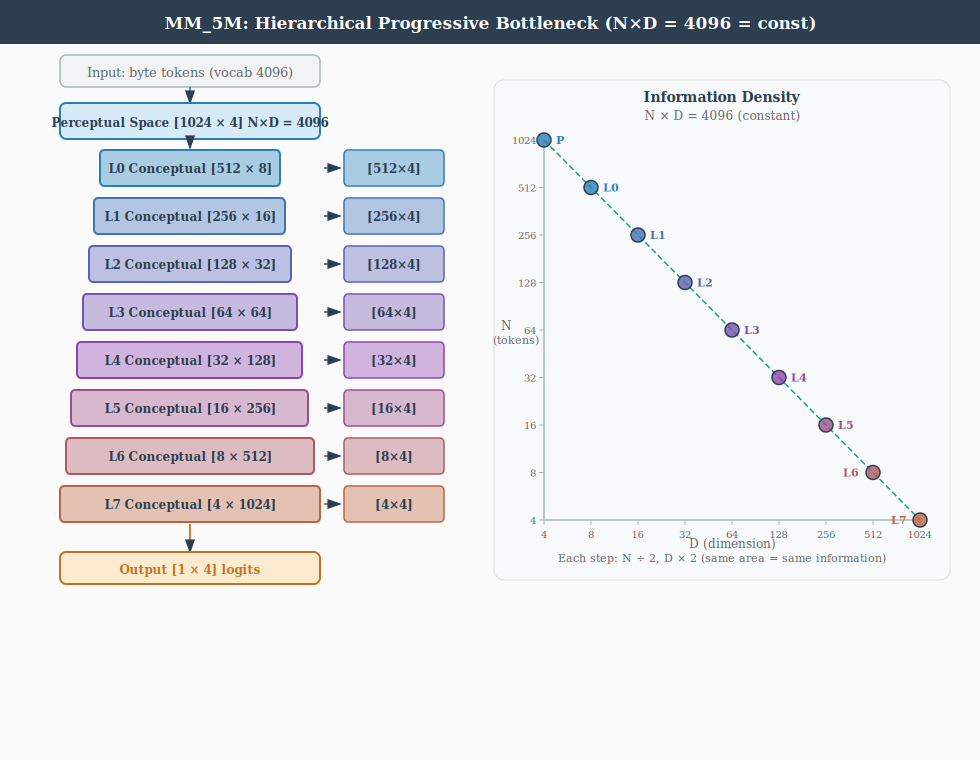

# Architecture

## Overview

BasicModel is a bidirectional neural architecture organized as a pipeline of six
**spaces**, each implementing a distinct representational transformation:

```
Forward:  InputSpace → PerceptualSpace → ConceptualSpace → SymbolicSpace → SyntacticSpace → OutputSpace
Reverse:  OutputSpace → SyntacticSpace → SymbolicSpace → ConceptualSpace → PerceptualSpace → InputSpace
```

The forward pass transforms raw input into predictions. The reverse pass
reconstructs the original input from the symbolic representation. Both directions
are trained simultaneously with a single optimizer minimizing a combined loss:

```
totalLoss = (1 - reconRatio) * outputLoss + reconRatio * reconstructionLoss
```

### Spaces

| Space | Role | Layer Type | Parameters |
|-------|------|-----------|------------|
| **InputSpace** | Lifts raw data into working dimensionality | LiftingLayer | nActive, nDim, nVectors |
| **PerceptualSpace** | Multiplicative feature extraction | PiLayer | nActive, nDim, nVectors, invertible |
| **ConceptualSpace** | Additive abstraction | SigmaLayer | nActive, nDim, nVectors, invertible |
| **SymbolicSpace** | Discrete activation bottleneck | PiLayer (monotonic, invertible) + Codebook | nActive, nVectors, passThrough, codebook |
| **SyntacticSpace** | Binary derivation tree (CNF grammar) | Grammar + WordEncoding | nActive, nDim, nVectors |
| **OutputSpace** | Final prediction | LinearLayer | nActive, nDim, nVectors |

Dimensions (`nDim`) are not passed to Space constructors; each subclass reads its
content dimensionality from `TheObjectEncoding` (e.g., `TheObjectEncoding.perceptDim`
for PerceptualSpace).  Codebook sizes (`nVectors`) are likewise stored on
`TheObjectEncoding` and may differ from the active count (`nActive`); the factory
validates `nVectors >= nActive` for every space.



Layer selection depends on `<reconstruct>` and `invertible`:

1. **`reconstruct=NONE`**: Use non-invertible layers (`PiLayer`, `SigmaLayer`) for
   the forward pass only. No reverse pipeline is created.
2. **`reconstruct=<any>` + `invertible`**: A single invertible layer (`InvertiblePiLayer`,
   `InvertibleSigmaLayer`) serves both directions, sharing weights.
3. **`reconstruct=<any>` + not `invertible`**: Two layers with separate weights —
   call `forward()` on one and `reverse()` on the other.  This avoids the
   expressivity limitation where a non-invertible layer's forward pass cannot
   represent the inverse of another (e.g., PiLayer's product structure is not
   closed under inversion).  **Note:** The reverse path uses a matrix
   pseudoinverse (`pinv`) which may be numerically unstable due to SVD
   convergence issues.  Setting `<invertible>true</invertible>` avoids this
   by using shared-weight inversion instead.

### Reconstruction Symbols

The symbolic bottleneck can lose information needed for reconstruction. For example,
XOR maps 2 inputs to 1 output, but `XOR(0,0)=0` and `XOR(1,1)=0` are distinct inputs
producing the same output. A single output symbol cannot reconstruct which input was
presented.

To solve this, the `nSymbols` produced by SymbolicSpace are split:

- **`nOutputSymbols`** `= OutputSpace.nActive` — fed to OutputSpace for prediction
- **`nReconSymbols`** `= nSymbols - nOutputSymbols` — carried in `end_state` for reconstruction

This is essentially a skip connection through the symbolic bottleneck: an extra channel
that preserves information lost in the output projection. Reconstruction symbols receive
gradient only from reconstruction loss, never from output loss.

For XOR with `nSymbols=3`, `nOutput=1`: symbol 0 predicts the output; symbols 1-2 carry
enough information to distinguish all 4 input patterns, enabling perfect reconstruction.

### Single Optimizer with Overlapping Weight Spaces

A critical design choice: the forward and reverse passes share a **single Adam
optimizer** that minimizes a combined loss:

```
totalLoss = (1 - reconRatio) * outputLoss + reconRatio * reconstructionLoss
```

This works because the forward and reverse weight spaces **partially overlap**.
They are neither disjoint (which would allow independent optimizers) nor identical
(which would create destructive interference). Instead, certain layers share
weights between directions (e.g., shared embeddings, the symbolic bottleneck
itself) while others are direction-specific (e.g., `pi1`/`pi2`, `sigma1`/`sigma2`,
`linear1`/`linear2`).

The partial overlap means:
- **Shared weights** receive gradient from *both* output and reconstruction loss,
  learning representations useful in both directions simultaneously.
- **Direction-specific weights** receive gradient from only their respective loss,
  specializing freely without interference.
- **No ping-pong**: separate optimizers on overlapping parameters would pull weights
  in alternating, conflicting directions each step. A single optimizer sees the
  combined gradient and finds a consistent descent direction.

This resolves the fundamental tension between forward prediction and backward
reconstruction in bidirectional architectures — a problem first identified in
A.M. Rogers, T.T. Shannon, and G.G. Lendaris, "A comparison of DHP based
antecedent parameter tuning strategies for fuzzy control," *Proceedings Joint
9th IFSA World Congress and 20th NAFIPS International Conference*, Vancouver,
BC, Canada, 2001, pp. 580-585, doi:
[10.1109/NAFIPS.2001.944317](https://ieeexplore.ieee.org/document/944317).
See also `doc/research/` for a local copy.

When `invertible=true`, the overlap is total: a single invertible layer serves both
directions, and its weights receive the full combined gradient. The single-optimizer
approach handles this case naturally.

### Training Loop

Training uses the single Adam optimizer with persistent state (momentum/variance
accumulate across epochs):

1. Forward pass: input → prediction + `end_state`
2. Compute `outputLoss` from prediction vs. target
3. Reverse pass: `end_state` → reconstructed input
4. Compute `reconstructionLoss` from reconstruction vs. original input
5. Backpropagate `totalLoss = (1 - reconRatio) * outputLoss + reconRatio * reconstructionLoss`
6. If ergodic: run `paramUpdate()` (gradient energy sensor updates alpha)
7. Optimizer step (embedding params excluded when `trainEmbedding` is `NONE`, `CBOW`, or `SBOW`)
8. If `trainEmbedding` is `CBOW`, `SBOW`, or `BOTH`: run embedding update step on same sentence

Alpha annealing (ergodic mode): the code-level exploration parameter starts at
`1.0` (full exploration) and decays to `0.0` (full exploitation) within the first
5% of epochs via `alpha = max(0, 1 - epoch / warmup)` where
`warmup = numEpochs // 20`.  Note: the code convention (`alpha=1` means explore)
is the inverse of the ergodic math convention (`alpha=0` means explore); layers
translate between them internally.

When `<ramsified>true</ramsified>` and `conceptualOrder > 1`, the
Sigma-Pi loop switches from a flat concatenation-based cycle to a
hierarchical butterfly-merge architecture with per-level layers and a
geometrically partitioned symbol dimension.  See
[Reasoning.md](Reasoning.md) §Ramsified vs Non-Ramsified Architecture
for the full comparison.

See [Params.md](Params.md) for all XML configuration parameters.
See [Training.md](Training.md) for embedding pretraining, SBOW, masked prediction
modes, and the `<trainEmbedding>` control.

### Three-File Architecture

Model behaviour is partitioned across three independent artifacts:

| File | Contents | Managed by |
|------|----------|-----------|
| **XML config** (e.g. `BasicModel.xml`) | Architecture, hyperparameters, paths | Hand-edited |
| **Embedding artifact** (e.g. `BasicModel.kv`) | Word vectors (codebook) | Phase 1: `embed.py` |
| **Weights checkpoint** (e.g. `BasicModel.ckpt`) | Model layer parameters (excludes embeddings) | Phase 2: `BasicModel.py` |

The `save_weights()` method explicitly filters out embedding parameters
(`_emb.weight`) from the checkpoint. Embedding vectors live in the `.kv`
artifact and are loaded separately. This separation allows:

- Retraining embeddings without touching model weights
- Retraining model layers with frozen embeddings
- Swapping codebooks between models that share the same architecture

---

## Language System

The symbolic and syntactic spaces implement a binary deep-structure grammar in
Chomsky Normal Form. SymbolicSpace maps continuous concept activations to a
discrete one-hot encoding via an invertible layer and codebook. SyntacticSpace
generates a derivation tree from the active symbols, stored as word tuples
`(batch, vector, rule)`.

See [Language.md](Language.md) for the full grammar, word encoding, and open
implementation questions about differentiable tree structure and rule operations.

---

## Sigma and Pi Layers

Given a weight matrix $( W \in \mathbb{R}^{m \times n})$ and input vector $( x \in \mathbb{R}^n )$, the output vector $( y \in \mathbb{R}^m )$ is computed as:

For the Sigma layer:

 $$y_j = W x + b$$
 $$y_j = b_j + \sum_{i=1}^{n} W_{ji} x_i$$

For the Pi layer (code implementation — log-space linear):

 $$s_i = \log\!\frac{1 + x_i}{1 - x_i} = 2\,\mathrm{atanh}(x_i)$$
 $$z_j = \sum_i W_{ji}\, s_i + b_j$$
 $$y_j = \frac{e^{z_j} - 1}{e^{z_j} + 1} = \tanh(z_j / 2)$$

The forward path maps $[-1,1] \to (0,\infty)$ via `_to_mult`, takes the log,
applies a linear transform (InvertibleLinearLayer), exponentiates, and maps
back via `_from_mult`.  Domain and range are both $[-1,1]$.  The reverse
path inverts each step exactly: `_to_mult(y)`, log, $W^{-1}(z - b)$, exp,
`_from_mult`.

**Conceptual motivation.**  The classical product form
$y_j = b_j \prod_i (1 + W_{ji} x_i)$ becomes, after taking logs, a sum
$\log y_j = \log b_j + \sum_i \log(1 + W_{ji} x_i)$.  The code
generalises this idea: it moves into a log-multiplicative domain via atanh,
performs a standard linear operation there, and returns via tanh.  The atanh
transform stretches values near $\pm 1$ toward infinity, making the layer
sensitive to strong activations — the multiplicative structure emerges from
the nonlinear domain transform rather than from literal products.

---

## Dimensionality Constraints

* The output dimensionality of the input layer must be equal to the output dimensionality of the perceptual layer, since the conceptual layer operates on both.
* The input dimensionality of the symbolic layer must be equal to the input dimensionality of the perceptual layer, since they both operate on the output of the conceptual layer.
* The input dimensionality of the output layer must be equal to the sum of the output dimensionalities of the symbolic layers.

---

## Pi Layer Derivation (Historical)

The original motivation for the multiplicative layer was to factorise an
exponential sum into a product of linear terms:

$$e^{y_j} =  e^{b_j} + \sum_{i=1}^{n} e^{1+W_{ji} x_i}$$
$$y_j = b_j \cdot \prod_{i=1}^{n} (1+W_{ji} x_i)$$

The current implementation replaces this with the log-space linear form
described above, which achieves the same multiplicative semantics through
atanh/tanh domain transforms while guaranteeing exact invertibility via the
LDU-factored InvertibleLinearLayer.

---

## Invertible Linear Layer (LDU)

### InvertibleLinearLayer — LDU Factorisation

The core invertible linear primitive factors the weight matrix W as:

```
W = L @ D_embed @ U
```

where:

- $L \in \mathbb{R}^{nIn \times nIn}$: unit lower-triangular matrix (diagonal fixed at 1). Stored as
  `raw_L`; the strict lower triangle is extracted and the diagonal is forced to 1 at
  each forward call.
- **D**: diagonal vector of length `rank = min(nIn, nOut)`, embedded into a rectangular
  `[nIn, nOut]` matrix `D_embed` by zero-padding.
- $U \in \mathbb{R}^{nOut \times nOut}$: unit upper-triangular matrix (diagonal fixed at 1). Stored as
  `raw_U`; the strict upper triangle is extracted symmetrically.

**Exact inverse via triangular solves.**

```
W^{-1} = U^{-1} @ D^{-1} @ L^{-1}
```

Each factor is inverted by a triangular solve (`torch.linalg.solve_triangular`). No SVD
is required, and the inverse is exact as long as all diagonal entries of D are nonzero.

**Parameter count.** nIn² + rank + nOut² total parameters. Initialized at L = I, d = 1,
U = I so that the initial map is the identity.

### Ergodic Noise Injection (Factor-Level)

Rather than the matrix-level blend `W_eff = b·W + t·N` (which destroys the LDU
structure and makes the inverse approximate), noise is injected directly into the raw
parameters of each factor before the triangular structure is extracted:

```
L_eff = I + strict_lower(raw_L + t · noise_raw_L)
U_eff = I + strict_upper(raw_U + t · noise_raw_U)
d_eff = b · d_effective + t · noise_d
W_eff = L_eff @ D_eff_embed @ U_eff
```

Because `W_eff` is still in LDU form, its exact inverse is always available by the same
triangular solves — no approximation, regardless of the noise level.

### stable=True

When `stable=True`, `_d_effective()` clamps each diagonal entry `d_i` to magnitude
`[eps, 1]` with sign preserved before the ergodic blend:

```
d_clamped_i = sign(d_i) * clamp(|d_i|, eps, 1)
d_eff = b · d_clamped + t · noise_d
```

This keeps `d_eff` bounded away from zero, preventing `W_eff` from becoming singular.
`stable=True` is the only place the stability constraint is enforced; no additional
clamp on `d_eff` is needed.

### noise_d

Noise for the diagonal factor is sampled with $|d_i| \in [\text{eps}, 1]$ and random sign, so
the noise factor is itself always invertible. This ensures that even at full temperature
(`b=0, t=1`) the effective matrix is still well-conditioned.

### naive Flag

| `naive` | Forward path | Reverse path |
|---------|-------------|-------------|
| `False` (default) | Apply L, D, U sequentially to x; backprop through each factor separately | Triangular solves: $U^{-1}$, $D^{-1}$, $L^{-1}$ applied in sequence |
| `True` | Materialise `W_eff` as a dense matrix; apply `W_eff @ x` | `pinv(W_eff) @ y` |

The `naive=False` path never materialises W_eff as a full matrix, saving memory and
allowing each factor's gradients to flow independently.

### Noise Lifecycle in Ergodic Mode

Noise buffers (`noise_raw_L`, `noise_raw_U`, `noise_d`) are:

1. **Resampled at the start of every ergodic `forward()`** — new noise is drawn before
   constructing `W_eff`.
2. **Resampled again at the end of every ergodic `reverse()`** — fresh noise is drawn
   after the reverse computation completes.

The window between the two calls is exactly when `reverse()` needs to reconstruct the
same `L_eff`, `U_eff`, `d_eff` that `forward()` used. Because the buffers are not
resampled during that window, `reverse()` reads the stored buffers directly — no
explicit caching of `W_eff` is required.

### Class Renames

The LDU layer supersedes the previous SVD-based implementation:

| Old name | New name | Status |
|----------|----------|--------|
| `LULayer` | `InvertibleLinearLayer` | Renamed |
| `InvertibleLinearLayer` (SVD) | — | Removed |
| `InvertibleSigmaLayer` | `SigmaLayer(invertible=True)` | Merged |
| `InvertiblePiLayer` | `PiLayer(invertible=True)` | Merged |

---

## Ergodic Exploration

The ergodic bias-variance control system is documented in [Ergodic.md](Ergodic.md).
