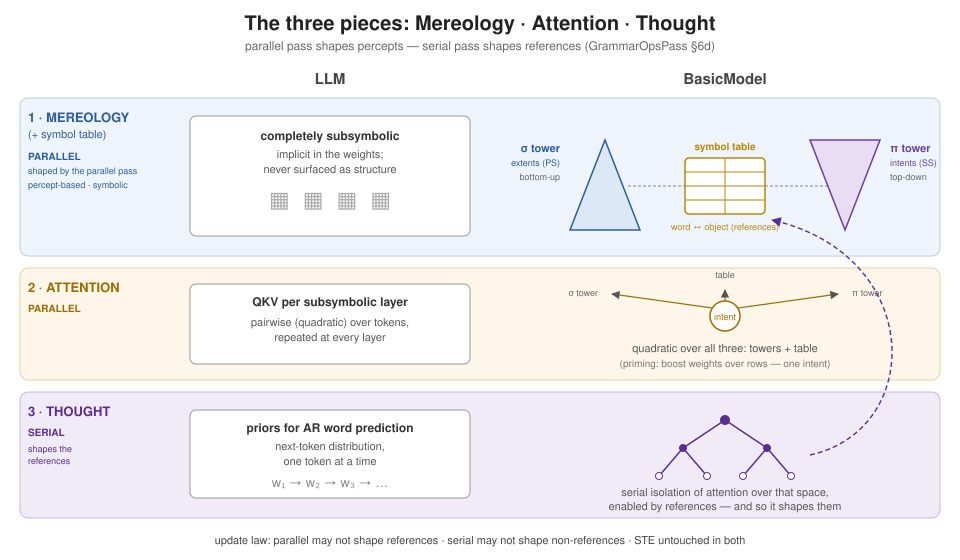
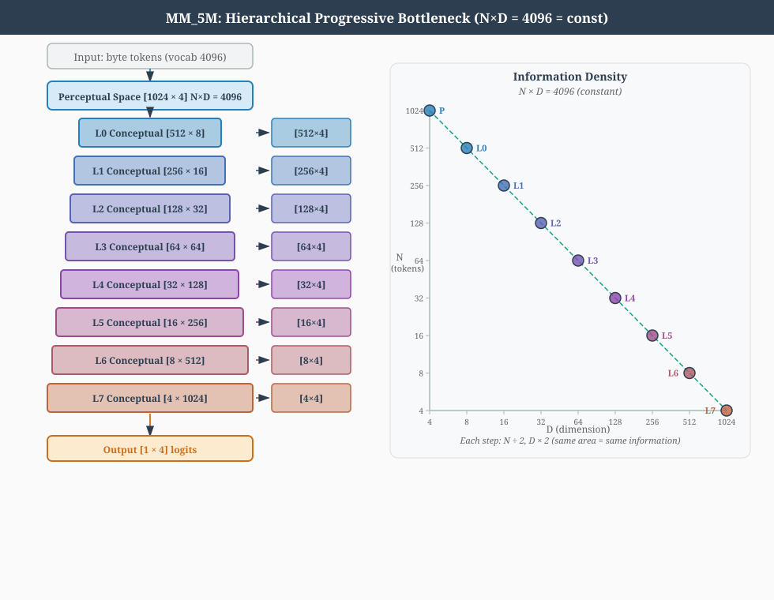

# Architecture

For the current loss paths, stop-gradient boundaries, parameter ownership and
joint learning rule across representation, prediction, thinking and output, see
[Gradient flow across the architecture](GradientFlow.md).

> This document describes the cognitive and mathematical architecture. For the
> live software ownership map—including configuration, training, STM, losses,
> checkpoints, reconstruction, and proposed consolidation boundaries—see
> [Runtime Architecture and Componentization](Componentization.md).

## The three pieces: Mereology, Attention, Thought (2026-06-11)



> **Terminology (2026-06-21 convention).** One noun per-space: a **percept** is
> a perceptual thing (PartSpace/WholeSpace, dimensionally-embedded, extensional;
> *part* and *whole* are its two subtypes); a **concept** is a ConceptualSpace
> relation tying one part-percept to one whole-percept (the Concept codebook);
> a **symbol** is a SymbolSpace 0-D reference to a concept. The CS "symbol
> table" is therefore the **Concept codebook** below.

The architecture decomposes into three pieces; the first two run in
parallel, the third is serial:

1. **The mereological towers (and the Concept codebook).** In an LLM the
   mereology is completely subsymbolic — implicit in the weights,
   never surfaced. In BasicModel it is percept-based and symbolic: two
   towers — the $\sigma$ tower ascending bottom-up (part-percept extents, the PS
   codebook) and the $\pi$ tower descending top-down (whole-percept intents, the
   WS property codebook) — bound by location into the ConceptualSpace
   dictionary, whose rows are concepts (part$\leftrightarrow$whole relations).
   SymbolSpace references those concept ids downstream.
2. **Attention.** In an LLM, attention is QKV per subsymbolic layer.
   In BasicModel: **bases of relevance guide attention; attention
   determines the contents of awareness.** Relevance is carried as
   weights on the percepts; ATTENTION is the single selection process
   (at CS) that reads the integrated priority out; AWARENESS is what the
   selection admits. (The priority-map synthesis — Fecteau & Munoz 2006;
   Bisley & Goldberg 2010 — with attention as the readout, never the
   sources; attention distinct from awareness per Koch & Tsuchiya 2007.)
   Relevance factors as **ORIGIN $\times$ AXIS**, realized as **ONE
   QUADRATIC PRIMING SURFACE per space with two write channels** (the
   simplified law): **bottom-up things are primed in virtue of BEING
   SEEN** (perception itself writes the surface: fired rows bump, the
   surface decays toward neutral) and **top-down things are primed in
   virtue of being DESIRED or HATED** (signed intent: desire boosts,
   hate suppresses with floor 0 — suppression, never a veto). "Top-down"
   is therefore a DIRECTION of writes on the one surface, not a second
   mechanism — matching biased competition (Desimone & Duncan: the
   template IS conceptual content) while keeping the two channels'
   automatic/strategic dissociation distinct (§C). `readingAttention` is
   HARD-CODED over the same surface: the reading scope is the span of
   the hottest-primed word-whole. Two AXES, orthogonal to origin ("Parse
   time" §C): HORIZONTAL (which parts within the level) and VERTICAL
   (which properties — fixing Rosch's Basic Level and, through it, which
   objects exist at all).
3. **Thought.** In an LLM, thought is the computation of priors for
   autoregressive word prediction. In BasicModel, thought is a
   **subsequent isolation of attention over that space, enabled by
   references** — the serial pass: referential lookup, shift/reduce
   composition, story selection. Because thought is the only process
   that invokes the referential taxonomy *qua references*, it is the
   only process licensed to **shape the references**.

This yields the codebook update law (GrammarOpsPass §6d,
implemented): **percepts are shaped by the parallel pass; references
are shaped by the serial pass.** STE is untouched in both modes; the
partition governs row updates — parallel mode may not shape
references, serial mode may not shape non-references
(`Spaces.reference_update_mask`; the `update_mask_fn` chokepoint on
`VectorQuantize`). Rational by construction — though possibly an
overly optimistic arrangement with respect to human thinking.

See [SymbolFirewall.md](SymbolFirewall.md) for the governing principle this
update law (and the codebook/meronomy ownership model generally) instances: all
computation is composed over typed, symbol-attached units — read/write masks,
no anonymous global residual stream.

## Relation to LLMs, Formal Concept Analysis, and DisCoCat

BasicModel is best read as an explicit decomposition of functions that a
transformer LLM usually folds into attention heads, feed-forward blocks, and an
unrestricted residual stream. The LLM comparison in this document is therefore
architectural, not merely benchmark-oriented:

- **LLMs:** a conventional LLM learns fluent priors over token sequences with
  latent attention and hidden residual state. BasicModel keeps the language-model
  goal of prediction and generation, but separates perception, concept
  formation, attention, grammar, truth, and reconstruction into named stores and
  typed operations. The wager is that some behavior now implicit in LLM weights
  should become inspectable state.
- **Formal Concept Analysis:** the PartSpace/WholeSpace towers and Concept
  codebook form a neural, fuzzy analogue of a formal context. Part-percepts play
  the role of objects or extents, whole-percepts play the role of attributes or
  intents, and concepts are the order-bearing links between them. The resulting
  meronymic structure is not a classical binary FCA lattice, because support and
  trust are graded and trainable, but it uses the same extent/intension
  discipline as its organizing constraint.
- **DisCoCat:** the grammar path is a DisCoCat-like composition engine: typed
  grammatical reductions decide how word/object meanings compose into sentence
  meanings in vector space. BasicModel differs from standard categorical
  compositional distributional semantics by making the reductions bidirectional,
  tying them to part/whole codebooks, and feeding their results into truth,
  reconstruction, and memory.

In short: LLMs are the operational baseline, Formal Concept Analysis supplies
the lattice and extension/intension reading of concepts, and DisCoCat supplies the
grammar-to-vector-composition reading of sentence meaning.

### Addressable attention — the typed `.where`

Global attention (`GlobalAttention`, `bin/Spaces.py`; gated `<globalAttention>`)
ranges over a **typed addressable space**: one distribution competes across every
store at once and emits a typed `.where` = `(space-id, bracket)` plus a soft-read
$\sum_k \alpha_k \cdot \mathrm{key}_k$. Six stores (the `SPACE_*` ids):

| id | store |
|---|---|
| `INPUT` | the staged input window (per-span percept content) |
| `STM` | the live short-term-memory rows |
| `LTM` | the consolidated truth store (rows + trust value) |
| `PART` | the PartSpace codebook (part-percepts) |
| `WHOLE` | the WholeSpace property codebook (whole-percepts only) |
| `SYMBOL` | the downstream SymbolSpace reference namespace (1:1 with concepts) |

`PART`/`WHOLE` appear whenever their tower has a codebook; `SYMBOL` only under
`<symbolTower>`. Pointing `.where` at a codebook/LTM store is recall; at the input
window it is reading — one mechanism, the type tag distinguishes them. Under
`<globalAttentionConsume>` the soft-read is fed back into the head as a zero-init
gated residual, so the output loss trains the retrieval.

The symbol namespace is a **reference**, not a learned copy: it tracks concept
ids so the two cannot diverge or dissociate. A symbol's IDENTITY is that integer
concept reference and allocates no independent learned or EMA row; its VALUE,
the signed 0-D activation from the symbolic phase, is grad-bearing. (Two-phase
update, 2026-07-02: the activations' gradient path is
the conceptual SBOW over the settled slab parked at the post-pump cutover --
the once-built SS leg itself is a state-contract sync whose product no loss
consumes; pre-P3 the in-loop leg carried the gradient.)

These six stores are the substrate for the four foundations of mindfulness; the
mapping (and the trust-sign-as-vedana / luminosity-as-joy reading of `LTM`) is in
[Philosophy.md](Philosophy.md#the-four-foundations-of-mindfulness).

> **Status (2026-05-29 update):** further architectural pivots landed
> on top of the 2026-05-27 substrate refactor:
>
> - **PerceptStore $\to$ RadixLayer.** The radix-trie input encoder is
>   now a first-class `Layer` subclass in `bin/Layers.py`;
>   `PartSpace.reverse` invokes `RadixLayer.reverse` for the
>   structural decode.
> - **MetaLayer $\to$ SymbolizeLayer.** The binary GrammarLayer that
>   promotes a freshly-seen percept to a symbolic prototype is now
>   `SymbolizeLayer`; no semantic change.
> - **Auto-META moves PS $\to$ CS.** The cross-codebook bind (META entry:
>   PS chunk-id $\leftrightarrow$ SS prototype-id) fires from
>   `ConceptualSpace._maybe_autobind_meta` at stage 0; PS no longer
>   holds a back-ref to SS.
> - **Clean-stack STM.** `ConceptualSpace.forward` bypasses
>   `sigma_in` / `sigma_cs` on forward — `folded = primary` at stage
>   0, `folded = sym` at k > 0. The Stage-10 additive composition is
>   retired; per-stage space-role attribution is trivially invertible.
> - **`basis=` kwarg for grammar reverses.** `UnionLayer.reverse(parent,
>   basis=None)` / `IntersectionLayer.reverse(parent, basis=None)`
>   accept a Codebook / Basis object (typically
>   `WholeSpace.subspace.what`) instead of a raw `W` tensor;
>   `bin/Language.py::unreduce()` dispatches accordingly.
> - **LSE soft-max kernels.** `Ops._disjunction_kernel` /
>   `Ops._conjunction_kernel` default to LogSumExp smooth variants
>   when `monotonic=False`; the hard branch is retained for
>   monotonic-mode and exact idempotency tests.
> - **LBG-style WS property splitting.** Gray (1990) EMA + per-row variance
>   tracking can split a dynamic property along its top-variance
>   eigendirection. This grows properties, never concepts or symbols.

> **Historical status (2026-05-27; ownership superseded 2026-07-20):** the
> **substrate refactor** had landed end-to-end.
> PS is a single-arg input processor (synthesis front end + sigma fold). CS is a STM container +
> grammatical CPU (no atomic forward fold; sigma_percept retired). The paired
> word-codebook ownership described then no longer belongs to WholeSpace. The
> CKY `Chart` and STM shift-reduce parsers retire entirely; `LanguageLayer`
> (signal router) is the canonical parser. `LiftLayer` / `LowerLayer` are
> binary `GrammarLayer` subclasses with internal Sigma / Pi (no longer
> borrowing substrate folds). `GrammarLayer` gains an optional butterfly
> cascade mode for cross-position mixing — closes the XOR convergence
> target. Two operating modes selected by `<serial>`: **SERIAL/GRAMMATICAL** (per-word PS with
> grammar dispatch over STM) and **PARALLEL** (T = `<subsymbolicOrder>`
> iterations of PS over CS). The `<parserBackend>`, `<routerKind>`,
> `<chartTau>`, `<chartTopK>`, `<chartNoiseEps>` XML knobs are retired;
> `<symbolicOrder>` is now the symbolic / relational loop budget.

## Symbolic weights, reconstruction, parse-time, attention (2026-06-30)

A design pass clarifying four coupled pieces (PS = PartSpace, WS = WholeSpace,
CS = ConceptualSpace, SS = SymbolSpace).

### A. Symbolic weights (the two-phase forward; reworked 2026-07-02, forward composition superseded 2026-07-10)

**Implemented 2026-07-02**, superseding the forward-transform parts of the
prior sparse-layer conceptual-embedding design, as a dedicated
**`SparseLayer`** (`bin/Layers.py`), NOT a SigmaLayer option: SigmaLayer's
atanh-entry contract expects logit-domain codes in $[-1, 1]$, while these
maps consume *presences/activations* -- a different input domain deserves its
own class. The substrate contract is the transpose autoencoder pair:
forward $= \tanh(W x)$, reverse $= \tanh(W^T y)$; export-safe scatter-add
kernel by default, `torch.sparse.mm` opt-in. Edges append host-side at mint
(`add_edge`, idempotent, tail-preserving value growth) and are removed by
pruning rounds (`remove_edges`; `ConceptualSpace.prune_concept_links` keeps
the closest links using within-tower relations only). The iterated-loop
rework (v3, landed 2026-07-03) kept this substrate and collapsed the
per-order families into ONE square untyped **`ConceptualAttentionLayer`**
subclass; its *forward composition* was in turn superseded by the
2026-07-10 dual-towers rev-2 feedforward sigma-pyramid (below) -- the
`SparseLayer` substrate itself (edges, COO forward/reverse, `add_edge` /
`remove_edges`) is unchanged by either rework.

**The forward is TWO PHASES with one terminal cutover.** Phase A reads
PartSpace and WholeSpace, then the order-0 conceptual field, on each of at
most `subsymbolicOrder` passes. PartSpace combines located parts; WholeSpace
divides the field by primitive properties. Perception has no learned
sigma/pi fold layers. `subsymbolicLoop` selects which later passes may
retarget the region or mereological level. The symbolic loop and the serial
loop over words keep their independent bounds.

**Pass-back scales, never gates (Alec, September 24).** Attribution of the
current conceptual demand yields a strength `a ∈ [0,1]` for each PartSpace
slot. Its content is scaled by `0.5 + 0.5*a`: attributed parts approach full
strength, while unattributed parts retain half their input strength on every
pass. The where/when band is unchanged. New content within the extent stays
visible and can form a concept even when existing concepts do not define it.

Phase B symbolizes the terminal field and runs the bounded higher-order
pyramid. It performs sigma over the preceding order's symbols; no pi edge
exists in this loop. Codes support similarity and tied reconstruction,
while the feature definitions supply evidence. The paired field reaches the
symbol leg and conceptual losses without replacing the native carriers.

**The `ConceptualAttentionLayer` is SYMBOLIC-ONLY and owns BOTH readings of concept
structure (dual-towers rev 2 -- landed 2026-07-12).** The
weighted reading uses disjunctive and conjunctive COO matrices, each
$[S \times 2(S+1)]$, over one bounded concept inventory (`ConceptualAttentionLayer`, bin/Layers.py) -- named for
what it IS, bottom-up attention over the concept inventory (see "Parse
time" sec C); `SparseLayer` is how it works (it subclasses the substrate
above). The per-order role-split families and their dyadic capacities are
RETIRED. Edges carry nonnegative exponents and address a positive or negative
symbol pole. Population from existing concept records
writes one edge per SYMBOLIC constituent (row = the relation, col = the
constituent); order-0 native references write the feature definition. A
trailing-bias-column edge (col $S$) supplies the bound for relations under
the EVERYTHING pole
(bias-bounded chain links, un-refined asserted concepts; a concrete whole
retires it). Self-edges raise (the Quine atom $x = \{x\}$); longer cycles
are deliberate -- a documented fact of un-ramsified taxonomies and of human
minds, which nothing in the current codebase observes or damps at runtime
(the diagnostic that used to watch them, `cs_groundedness_probe`, is
retired -- see below).

The feedforward concept pyramid (`cs_forward_content`) retains
`[concept, batch, extent, 2]`. The order-0 membership read composes field
requirements before encoding; subsequent rungs only union symbol evidence.
The taper ranks the stronger pole and admits the pair together. Extents
remain separate. The [current equations](#decided-in-direction-a-concept-is-sigma-over-pi-alec-2026-09-21)
define independent pole reductions and attribution descent.

`_order_caps()` sizes the per-rung taper. While the sparse concept
transform is active (`_sparse_active`: `symbolicOrder > 0` in parallel
mode), it is a tile-based taper `[base, base>>1, .., 1]` ($K{+}1$ entries,
`base = min(outputShape[0], nVectors)`, shrunk until the taper fits the
inventory) -- inventory rows past `sum(caps)` stay inert. Off that path,
the caps fall back to the pre-rev-2 `(n_snap, n_pool)` 50/50 split
(`n_snap = max(1, N // 2)`), a fossil of the superseded design below.

> **Historical note (forward composition superseded 2026-07-10).** The v3
> iterated-symbolic-loop design (landed 2026-07-03)
> ran the store as an ITERATED WAVE with an additive source term every
> step, $a^{i+1} = \tanh(W [a^i \mid 1] + s)$, $i = 0..K{-}1$, over a row
> space split 50/50 into a SNAP block (rows $[0, n_{\text{snap}})$,
> order-0 concepts, no in-edges) and a RELATION POOL (the rest, minted
> relations, first-come with a loud overflow warning). A fresh probe on
> `MM_sparse_concept` found the wave DARK end-to-end -- sign-then-clamp
> annihilation at the order-0 rectifier, scale-blindness between the
> settled field and the codebook, and a capacity gap where `<nVectors>`
> never reached the per-stage store (the dual-towers rev-2 design's
> "Why"). Rev 2's correction: the concept base is the 8-tile corpus-callosum
> frame, not the codebook inventory, so attention is a top-K taper over
> that frame rather than a settling recurrence -- replacing the wave with
> the feedforward pyramid above closes the darkness (no trivial fixed
> point left to go dark). The `(n_snap, n_pool)` split above is the only
> surviving trace of the v3 design, kept as the `_order_caps` off-path
> fallback.

Alongside this weighted reading, the store holds the DISCRETE relation
table: ordered role-tagged constituent records (`embed_pair` stores the
sec-4c ordered pair
$[\text{whole}, \text{part}]$, whole first: whole $\Rightarrow$ part / if
$\to$ then; `discretize_row` is exact on the binary-ordered subset). A thin
shared `ConceptAllocator` owns global concept ids, order derivation
(bookkeeping only under v3 -- nothing migrates by order), the
raise/retire/singleton sets, and the idempotency caches; ConceptualSpace
keeps orchestration only. Each bounded evidence activation IS a 0-D
symbol: the once-built SS leg retains the two poles at the row-aligned identity
(order-0 codes follow their feature definitions; the leg syncs the SS state contract, while the
activations' GRADIENT path is the conceptual SBOW over the settled slab
parked at the cutover). The subsymbolic loop reads the attended percepts
into the order-0 field; conceptual demand may then retarget perception
to a region or mereological level. `<subsymbolicLoop>` selects the
retargeting passes (`all`, `off`, or indices `1..subsymbolicOrder-1`),
while `subsymbolicOrder` bounds the processing. Perception has no learned
$\sigma$/$\pi$ fold layers. Distributed codes serve similarity, retrieval and the
tied reconstruction; they do not determine conceptual presence.

#### Relation-table entry contract

At the sparse-entry level, one entry binds one concept row index to one symbol
column index, plus its signed membership weight. A concept definition is
therefore not limited to one symbol: the same concept index may occur in
multiple entries, each paired with a different symbol index. Those repeated
entries collectively form the concept's sparse, set-like definition; different
concept indices define different concepts.

The same representation is sufficient for a vine, with an important
qualification: one entry alone does not encode a total order. Each vine link is
the ordered pair $[\text{whole}=\text{current},\text{part}=\text{rest}]$, where
`rest` references the next relation concept. The discrete role-tagged records
preserve the whole/part distinction exactly, while recursive nesting and wave
iteration make the sequence order operational. In short: repeated entries for
one concept define a set; recursively nested relation concepts define a vine.

**Groundedness and cycles -- REMOVED (2026-07-10).** `cs_groundedness_probe`
does not exist in the current codebase (zero grep hits). It was the KRIPKE
grounded/ungrounded reading of the v3 iterated wave, in two runs (source-driven,
then source-released) -- a diagnostic over settling dynamics that the
feedforward pyramid does not have. The design pass that replaced the wave
accepted the loss outright ("the wave was dark anyway," per the rev-2
design's "Theory"). The posture on cycles it used to report stands as a design
statement even without the probe: loops are a documented FACT -- of
un-ramsified taxonomies and of human minds -- and nothing in the current
codebase observes or damps them at runtime. Solutions are invited -- for
both human and machine minds.

The lattice poles are VECTORS of the presence domain: **NOTHING**
$= [0,0,\ldots]$ (bottom; a part contributing $W \cdot 0 = 0$ -- no edge)
and **EVERYTHING** $= [1,1,\ldots]$ (top; a whole realized as the trailing
bias column). Order-0 concepts reserve their distributed row and read
their signed feature definitions over native PS percepts and WS properties.
A fresh object's standing bounds supply no perceptual membership; its
definition awaits testimony. Feature addresses preserve the source rows
by reference, without duplicating their codes. The word$\equiv$object META is the sec-4c ORDERED PAIR
$[\text{whole}=\text{word-symbol}, \text{part}=\text{object-symbol}]$ --
roles are positional slots of an ordered pair, not containment claims; the
typed read-out (`meta_word_object`) recovers (word, object) by INTERSECTING
the pair with the word-symbol class rather than trusting slot order. The
JOINT/sentence concept (`create_joint_concept`) is the ordered Gallistel
CHAIN over the row's word-symbols -- each link the pair
$[\text{whole}=\text{current}, \text{part}=\text{rest}]$, bias-bounded --
one head per sentence TYPE, so word order distinguishes sentence types. A
1:1 tie between SYM refs is the SINGLETON principle (Alec 2026-07-02): the
unit-set $\{x\}$ -- a whole containing exactly one symbolic part
(`singleton_concept`, min-support exempt) -- is the constructive primitive
behind if$\to$then ($\{x\} \Rightarrow x$) and the recursion vine, and it is
stored structure that `resolve_identities` never collapses (only ties
between concrete raw codes resolve away). Sequencing depth under strict
ramsification TRUNCATED the chain's weighted reading (same-order link
references were dropped at the order cap) -- the defect that motivated the
successor design (the iterated-symbolic-loop, landed 2026-07-03),
which FIXES it: iteration over the one untyped square `ConceptualAttentionLayer`
replaces stratification, so a link of any order simply arrives one rung
later (originally a wave hop, now a feedforward pyramid rung -- the
2026-07-10 historical note above); see "Parse time" sec C.

### B. Reconstruction (parts $\to$ `.what`, wholes $\to$ `.where`)

InputSpace maps two views of the *same* data, segmented differently: a
**universal view** to WS (which it analyses) and an **atomic view** to PS (which
it synthesises). WS yields **low-fidelity** information covering the **whole**
space; PS yields **high-fidelity** information over a **smaller** area
(`_paint_reconstruction`: the universal view paints the background, the atomic
view is averaged in where it has support). For verbal reconstruction of text the
**parts (PS) should reconstruct the `.what`** and the **wholes (WS) should
reconstruct the `.where`** — approximately the inverse of what happens at parse
time. The separate `what_scale` / `where_scale` / `when_scale` reconstruction
channels already exist to carry this.

For text, it would be foolish to insist on an *absolute* `.where` from WS: the
parts already know each word's size, so under a perfect tiling the placement is
just the running sum of part sizes (serial mode computes this as an AR1 increment
over the previous `.where`; the for-loop is time). WS may still supply **type**
information for the tiling — *word*, *space*, *word*, *punct*, … — even where it
does not supply coordinates.

### Tiling, subspace sizes, and consciousness

Whether the parts/wholes **perfectly tile** the input (a partition — so order
alone reconstructs, with no gaps between parts) is **NOT** entailed by
parallel-vs-serial mode. It is entailed by the **relative sizes of the InputSpace
subspace and the PS/WS subspaces**:

- In **serial mode** they are *forced* to match — the for-loop traverses **all**
  of input space — so the tiling is always perfect.
- In **parallel mode**, if they do not match because InputSpace is *larger* than
  PS/WS, that bounded mismatch is exactly where the two attentions **select what
  is most relevant to consciousness**: PS/WS cannot hold all of InputSpace, so
  attention picks the salient subset to surface. (When InputSpace $\le$ PS/WS — as
  in the current test fixtures — the tiling is again a partition and order
  suffices.)

### C. Parse time (relevance = origin $\times$ axis)

At parse time CS receives the overcomplete input representations from the PS
and WS mereological towers. **Bases of relevance — carried as weights on the
percepts — integrate into a priority signal; attention is the selection at
CS that reads it out; awareness is what the selection admits.** Relevance
factors as ORIGIN $\times$ AXIS: two origins (perceptual salience/novelty;
symbolic history) crossed with two axes (horizontal: which parts; vertical:
which properties/level).

- **Salience/novelty, HORIZONTAL (significant particles, PS)** — within
  the level the vertical axis fixed, WHICH items? The level may fix the
  word boundary of *wheelhouse*, but what makes *wheel* + *house* its
  building blocks rather than the equally-segmentable *wheelhou* + *se*?
  **Greedy longest-match** is the current easy approximation
  (`RadixLayer.longest_match`); particle salience should guide both
  parsing and reconstruction here. Under the simplified law the signal
  is SEEN-priming: rows that fire are primed by being perceived (bump +
  exponential decay toward neutral) — presence primes; no separate
  novelty computation.
- **Salience/novelty, VERTICAL (significant properties, WS)** — a
  property can be stimulus-significant too (a novel type-run, an
  unexpected region); property salience weights the wholes and thereby
  participates in fixing the **Basic Level** of analysis (E. Rosch): the
  size of parts and wholes. The scope handoff is the vertical axis's
  EFFECT ON PERCEPTION: the word-level isolates the regions that are type
  *word*, *punctuation*, and *space*, forming a **complete tiling** (the
  WS$\to$PS `_passback_scope_where` handoff) — the level of analysis
  governs which particular objects are chosen at all.
- **The single quadratic surface (SS and every space)** — ONE priming
  vector over each space's rows, with TWO WRITE CHANNELS: **SEEN**
  (bottom-up — fired rows bump, the surface decays exponentially toward
  neutral; `prime_seen`) and **DESIRED/HATED** (top-down — signed
  intent; desire boosts, hate suppresses with floor 0, never a veto;
  `prime_desire`). The two channels ARE the automatic/strategic
  dissociation (Posner & Snyder 1975; Neely 1977, the prime-target
  expectancy experiments): **AUTOMATIC** — fast, capacity-free,
  inhibitionless priming through use — versus **STRATEGIC** — slow,
  capacity-limited, goal-set (the SINGLE intent of GrammarOpsPass §5 —
  capacity limited by construction), able to suppress. They also
  dissociate from each other behaviorally (selection/reward history
  captures attention even AGAINST current goals: Awh, Belopolsky &
  Theeuwes 2012) — both channels WRITE, neither vetoes.
  (Since 2026-09-10 the wholes the symbols map onto are the units of the
  meronomy fold ladder, doc/plans/2026-09-10-meronomy-fold-ladder.md.)
  **`readingAttention` is HARD-CODED over this surface**: the reading
  scope is the span of the hottest-primed word-whole
  (`_primed_reading_step`, the learned producer's contract) — the
  symbols map onto the wholes that isolate words.

**Priming diffusion (`<primingSpread>`, default 0.25, LIVE by default,
Alec 2026-07-12).** Before the SEEN bump, `prime_seen` moves an `s =
<primingSpread>` fraction of each connected row's standing priming energy
to its neighbors via `_priming_edges` (the concept store's untyped edges,
ConceptualSpace-only; `None` elsewhere $\to$ no diffusion) — a conservative
transfer (dst gains exactly what src loses), not amplification, so
successive SEEN events propagate energy further out into the connected
symbols before decay + bump apply. `0` restores pure decay+bump (the
pre-diffusion behavior).

**Frozen concepts (`freeze_concept` / `_frozen_concepts`, Alec 2026-07-11).**
A concept's relational structure can be FROZEN: no FORMING of new edges, no
FORGETTING of existing ones, no WEIGHT drift on them
(`_refresh_frozen_values_hook` zeros backprop gradient on the frozen rows'
edge values) — the codebook row/content stays live and keeps tracking
perception; only its DEFINITION is fixed.

**The readout site is the concept pyramid's per-order top-K**
(`cs_forward_content`; the FF pyramid is COMPOSITION, not attention — the
selection over it is where attention acts). The CS surface projects
directly onto the inventory rows as the ranking score
(`_relevance_priority` $=$ boost $-$ 1; rank $= |cand| \cdot (1 +
\mathrm{score})$, spreading upward through edge magnitudes, admitted rows
only) — selection changes, activations never distort. The pyramid's
ADMITTED rows write back through `prime_seen`: awareness primes. Gated
`<architecture><relevance>` (default false, byte-identical);
`<primingDecay>` sets the seen decay.

**Attention and expectation are different faculties (2026-09-20).** This
surface is unsigned (floor 0), so what it expresses is the non-affirming
negation: the non-object is withdrawn and nothing is put in its place. That
is why attention needs no prediction in order to focus — neither write
channel reads the sentence predictor. Expectation is the other negation: the
predicted idea, sign-reversed, is added to the *sealed idea* (order 1 and
above, where a signed carrier exists), never to activations and never to
this surface, so what is conceived is what was not predicted and composition
stays pure. The one interaction is that the image is applied to everything
but the object of observation. Specified in the
[accessible-mind spec §2.6](specs/2026-09-20-accessible-mind-subsystems.md#26-expectation); letting the estimate
also lower row priority here is [FutureWork §9](FutureWork.md#9-exclusion-at-the-readout).

**The bases interact (cross-basis priming).** The psychological literature
is unambiguous that symbolic activation primes the subsymbolic layers:
automatic spreading activation vs. strategic expectancy in semantic priming
(Neely 1977 — the heat vs. intent split, exactly); word-level activation
feeding back to letter perception (McClelland & Rumelhart's interactive
activation); conceptual templates biasing early sensory competition
(Desimone & Duncan's biased competition); learned context guiding spatial
attention without awareness (Chun & Jiang's contextual cueing); labels
sharpening perception (Lupyan's label feedback). The architectural
consequence: **conceptual activation should be the ORIGIN of
`readingAttention`** — the reading template built from the currently
selected concepts (the pyramid's winners, `_concept_activations`) rather
than a free-standing query — making WS's vertical basis the conceptual
tower's own downward projection, as biased competition prescribes.

### D. Attention indexing (`.where` / `.when` / codebooks)

The three addressing roles are disjoint: **`.where` indexes over the input
buffer** (positional; period = config-derived `<wherePeriod>`, default 8192
input bytes — the 2026-07-04 encoding pass corrected the earlier
"½·InputSpace" claim here: the pre-change period was actually
$\Sigma$ nVectors, raised-never-lowered at the build seam, and is now
decoupled from `nObjects` entirely, with a warn-once raise-to-fit for
longer inputs), **`.when` indexes over LTM** (the 4-dim start-ladder band
is the SIMILARITY channel; ABSOLUTE addressing rides the exact long-int
clock `BasicModel.when_time` — the Option-C hybrid; see
[Spaces.md](Spaces.md) "Encodings"), and the **codebooks are
content-addressable** (identity is the row index; the cross-codebook `.where`
slice registry was retired). Reconstruction re-derives the input tiling
from the `.where` band alone — the BLIND decode (Gate 2b,
`test_blind_decode.py`; the forward scaffold survives as the explicit
debug/regression path and the scaffold-masking curriculum bridges
scaffold-fed to blind as training allows).

## Cognitive grounding: dense-perceptual vs sparse-symbolic (2026-07-02)

The design splits representation into a **dense, invertible, subsymbolic**
integrator (the corpus-callosum mixing matrix, which mixes part/whole *content*
in high dimension) and a **sparse, symbolic** composer (the `ConceptualAttentionLayer`,
which composes *scalar activations* of named concepts; it subclasses the
`SparseLayer` substrate). This is not an
arbitrary engineering choice; the split, and specifically *why sparsity belongs
only on the symbolic side*, tracks several convergent findings on human
cognition.

- **Complementary Learning Systems** (McClelland, McNaughton & O'Reilly 1995).
  Neocortex uses slow, dense, *overlapping* distributed codes that extract
  statistical structure across experiences; hippocampus uses fast, *sparse,
  pattern-separated* codes to bind individuated episodes. The reason
  hippocampal codes are sparse is **interference avoidance among individuated
  bindings**, not compression: dense overlapping codes suffer catastrophic
  interference when made to hold many discrete conjunctions. This is the
  cognitive answer to "why sparse, and why only symbolically" — the perceptual
  manifold wants the dense mixing; the binding of individuated things into
  reusable conjunctions (the joint/sentence concept over word-symbols) wants
  sparsity. A **symbol is a scalar handle on a grounded direction** (the atom),
  which is precisely a hippocampal index into cortex; the transpose decode
  ($\tanh(W^\top y)$) is pattern **reinstatement**. Caveat: this maps the
  *sparse-symbolic vs dense-perceptual* axis onto hippocampus-vs-cortex — NOT
  the ramsified *orders* (abstraction is a separate, graded
  anterior-temporal / prefrontal axis).

- **Dual-process cognition** (Sloman 1996; Kahneman). A fast, parallel,
  similarity-driven associative system and a slow, serial, rule-based symbolic
  one. The subsymbolic (parallel content-mixing) and symbolic (sparse
  relational) loops instance this split. The sparsity and the serial
  capacity-limit are the *same fact*: a sparse composer has low fan-in per
  concept, the computational shadow of working-memory span (Miller's $7 \pm 2$;
  the STM depth $\approx 8$ the model already carries).

- **The neuro-symbolic interface / systematicity** (Fodor & Pylyshyn 1988). The
  architecture is a concrete stance on the oldest fight in cognitive science:
  **content stays connectionist** (dense, continuous, invertible mixing),
  **structure becomes symbolic** (discrete, reusable, composable edges), and the
  **interface is the activation readout** — the point where mixed content is
  read through feature memberships into the two symbols of a named thing. The discrete edges buy the
  compositionality/systematicity that pure distributed codes are accused of
  lacking, while the dense mixing keeps perception continuous and
  gradient-trainable.

- **Grounded cognition** (Barsalou 1999; contra amodal symbol systems). Because
  the distributed code follows the concept's definition and its two
  activations carry the observed evidence, the symbols are not amodal Fodorian tokens — they are
  grounded pointers-with-magnitude, closer to perceptual-symbol "simulators."
  Retaining graded memberships is cognitively load-bearing: graded activation *is* typicality / salience
  (Rosch's graded membership), which a cosine would discard.

- **Basic-level categories are perceptual, not content-free** (Rosch et al.
  1976). "Subsymbolic" $\ne$ "category-free": the mixing output at order 0 is
  already carved toward basic-level regions, because that is what perceptual
  integration *for a categorizing organism* produces. This suggests the
  feature-defined conceptual regions are the **pre-linguistic Gärdenfors regions**
  (prototype centers, basic-level, perceptual) and the sparse symbol graph is
  the *post-linguistic* labelling-and-composition that points at them — three
  cognitively distinct stages (integrated field $\to$ unnamed category region
  $\to$ named composable symbol), not two layers with a bookkeeping detail
  between.

**Where the mechanism is deliberately cleaner than cognition.** (1) The order-0
boundary is a *default flow*, not a wall: perception is concept-penetrated
(top-down / predictive coding), and it is the TOP-DOWN attention channel —
goal/emotion-weighted properties fixing the level of analysis, delivered to
perception through the scope handoff — that carries that penetration back down;
the priming/heat loop is the BOTTOM-UP horizontal channel and touches
perception only through what it makes retrievable. The division must never
become impermeable.
(2) *Invertibility* is instrumental (reconstruction, gradient), not a biological
claim; brains approximate and predict, they do not compute exact inverses. The
extensional/intensional semantics this grounding implies for a **single**
conceptual space is developed in
[BasicModel.md](BasicModel.md) "Conceptual Space." The memory, two-truths,
expectation, testimony and feeling side of the grounding, with its discrepancy
list, is in [Philosophy.md](Philosophy.md#psychological-grounding-2026-09-16).

**References.** McClelland, McNaughton & O'Reilly (1995), *Why there are
complementary learning systems in the hippocampus and neocortex*, Psychological
Review 102(3). Sloman (1996), *The empirical case for two systems of reasoning*,
Psychological Bulletin 119(1); Kahneman (2011), *Thinking, Fast and Slow*.
Miller (1956), *The magical number seven, plus or minus two*, Psychological
Review 63(2). Fodor & Pylyshyn (1988), *Connectionism and cognitive
architecture*, Cognition 28. Barsalou (1999), *Perceptual symbol systems*,
Behavioral and Brain Sciences 22(4). Rosch, Mervis, Gray, Johnson &
Boyes-Braem (1976), *Basic objects in natural categories*, Cognitive Psychology
8(3). Gärdenfors (2000), *Conceptual Spaces: The Geometry of Thought*, MIT
Press. Olshausen & Field (1996), *Emergence of simple-cell receptive field
properties by learning a sparse code*, Nature 381 (sparse *activation* over a
dense dictionary — the dictionary/atom side here — as distinct from the sparse
*relational graph* of the `ConceptualAttentionLayer`).

## Overview

BasicModel is a bidirectional neural architecture organized as a pipeline of five
**spaces** plus a symbol host (`SymbolSpace`), each implementing a distinct
representational transformation:

```
Forward:  InputSpace -> {PartSpace, WholeSpace} -> ConceptualSpace -> SymbolSpace -> OutputSpace
Reverse:  OutputSpace -> SymbolSpace -> ConceptualSpace -> {PartSpace, WholeSpace} -> InputSpace
```

The pre-2026-05-27 "two feedback loops" (S $\to$ C symbolic loopback per stage,
C $\to$ P subsymbolic loopback cross-forward) collapse under the substrate
refactor:

- **Subsymbolic loop dissolves.** PS is a single-direction input processor.
  No recurrent C $\to$ P feedback at the substrate level. In PARALLEL mode,
  iteration happens by passing `CS` to the same `PS.forward(x)` for T
  refinement passes (the `<subsymbolicOrder>` knob).
- **Symbolic loop generalizes** to pairwise grammar ops over STM, dispatched
  by the signal router (`LanguageLayer`). `Lift` and `Lower` join the same
  GrammarLayer dispatch surface as `Intersection`, `Union`, etc.

The forward pass transforms raw input into predictions; the reverse pass
reconstructs the original input from the symbolic representation. Both
directions are trained simultaneously with a single optimizer minimizing a
combined loss:

```
totalLoss = (1 - reconRatio) * outputLoss + reconRatio * reconstructionLoss
```

The legacy `SubwholeSpace` and `SyntacticSpace` classes have been
retired. The subsymbolic role is filled by `PartSpace`; syntax /
grammar dispatch lives on `SymbolSubSpace.languageLayer` (the signal router,
which subsumes the retired `Chart`). The `MereologicalTree` sidecar that
backed `part` / `equals` / `query` is also retired --- those operations are
pure-geometric clipped-cosine projections over WholeSpace codebook
activations.

`PartSpace` and `WholeSpace` (renamed 2026-06-12 from `PerceptualSpace`
/ the original `SymbolSpace`) both subclass `Space` directly — both views
are perceptual, but there is no shared intermediate base class. A thin
`PerceptualSpace(Space)` base briefly existed (holding no params/submodules;
only `NULL_PERCEPT_KEY` and isinstance sites) but was **removed 2026-07-10**
as part of the dual-towers rev-2 pyramid rework
(decision 3): PS/WS became symmetric duals with the same `forward(in_sub,
CS_out)` signature instead. At the corpus callosum, objects are analysed
and synthesized by sending them back through the towers — wholes get
split, parts get chunked. In symbolic "mode" the objects sent back are
symbols. Terminologically there are
objects and references; a reference is a *sign* (a quantized version of
the referent) or a *symbol* (an unrelated version of the referent, of
much lower dimensionality). The freed name `SymbolSpace` was
**reintroduced 2026-06-19** with new semantics — it is now the
grammar/word space-role (formerly `WordSpace` / `WordSubSpace`, abbrev `ss`;
the WholeSpace stream is now `ws`).

Gated `<mereologyRaise>` (default false, byte-identical off; the cross-tower
binding is `ConceptualSpace._autobind_cross_tower`, the part/whole-ratio
read-out is `RunStructureLayer` via `WholeSpace`'s `_mereology_ratio_obs`,
threaded read-only, never persisted), the corpus callosum **builds a single
meronomy out of the two towers**: a part
`A` (PartSpace) and a whole `B` (WholeSpace) carry `.what` codes from different
codebooks (incomparable), but their `.where` is comparable, so the callosum links
**`A isa B`** (token `isa` type) when `A.where` is contained in `B.where` with no
greater-part/lesser-whole intervening. Word$\leftrightarrow$object — too unlike to link directly —
is bridged by a **second-order meta-object** (synthesized in PartSpace, outside
`.where`/`.when`: the MetaSymbol). The correctness signal is the **part/whole
ratio** (many-parts$\to$one-whole = under-analysed; one-part$\to$one-whole = over-analysed),
which requests further $\sigma$-synthesis / $\pi$-analysis in the offending `.where` — and is
the principled fix for the MM_20M mean-collapse.

### Spaces

| Space | Role | Owns | Notes |
|-------|------|------|-------|
| **InputSpace** | Lifts raw data into working dimensionality; surface tokenization | LiftingLayer; lexer wiring (text mode) | Reaches PS's lexicon via back-ref; no own lexicon |
| **PartSpace** | Bottom-up ordered part synthesis | Radix parts, native codes and `<synthesis>` policy | Recurrence forms parts; codes are max over constituents. Canonical ids and ordered containment determine presence. |
| **ConceptualSpace** | STM container + main grammatical CPU + (when sparse-active) the POST-PUMP symbolic phase | STM (`ShortTermMemory`, depth ~8); the single untyped square `ConceptualAttentionLayer` (a `SparseLayer` subclass; registered via the `_sparse_fam` shim) + concept dictionary (`similarity_codebook`) + the relation store (`ConceptAllocator` + ordered records) when sparse-active | `forward(subspace, word_subspace=None)`: STM bookkeeping only — the pump is purely subsymbolic (P3 two-phase); the symbolic transform fires ONCE post-pump (`cs_symbolic_phase`: membership read + FF concept pyramid, $K$ = `symbolicOrder`, driven by `_forward_body`'s cutover). Dispatches read-only grammar ops via the signal router. |
| **WholeSpace** | Top-down division by primitive properties | Property codebook (`self.subspace.what`) and `<analysis>` policy | Max over allowed primitives per position, min pervasion over a run. Readings share the attended field with PS; there is no perceptual pi layer. |
| **OutputSpace** | Final prediction | LinearLayer | nActive, nDim, nVectors |

The native perception and conceptual carrier contract is:

```
PS.forward(x):  return native_part_read(x)
CS.forward(subspace, word_subspace):
    STM[1..7] = STM[0..6];  STM[0] = folded          # newest at slot 0, shift toward higher indices, oldest (slot 7) drops off; mode-dispatched, the pump stays subsymbolic
# POST-PUMP cutover (sparse-active, once per forward, in _forward_body):
#   content, acts = cs.cs_symbolic_phase(last_cs.materialize(), extents=extents, percepts=native)
#   # membership read -> concept pyramid (K = symbolicOrder)
#   last_cs._concept_activations = acts;  SS leg built ONCE;  SBOW parks the settled slab
SS:  no atomic forward operator; hosts write-required grammar ops
     (the CS->SS symbol bind leg is SymbolSpace.forward_concept_to_symbol, .forward()-mediated)
```

The legacy composition `C = sigma_percept(pi_input(IS) + pi_concept(C_prev))`
is **retired**. Per-stage feedback is absent at the substrate; grammar
dispatch over STM provides the recurrent character via the signal router.

**Attention-to-relation promotion** (gated `<attentionPromotion>`, default
off $\to$ byte-identical): the pyramid's admitted field is also the
DISCOVERY surface for latent taxonomic wholes. The cutover stashes the
admitted activations; `ConceptualSpace.Reset(hard)` consumes them (the same
compile-safety hoist as `learn_relations_from_stm`) into a bounded
candidate cache keyed by context signature --- each active order-0 row is a
focal member observation over the rest of the active set, with EWMA
member/context weights and cosine fold-in of near contexts. Recurrent,
contrasted member sets face the SAME acceptance law as sentence learning
(learn-score $\ge$ `truthCriterion` AND `truthCriterion` $< 1$, the
three-factor product over the Task-6c seams); accepted sets mint a
higher-order whole via `synthesize_higher_order` (member edge values from
the candidate statistics, top context concepts as weighted `sym_part`
intent), which then competes in the pyramid like any other row.
Re-support strengthens (Hebbian) instead of re-minting; unsupported
wholes decay and retire.

See [Spaces.md Section "Sigma / Pi ownership"](Spaces.md#sigma-pi-ownership)
for the cognitive rationale and the migration trail.
See [Logic.md Section 8](Logic.md) for the algebraic constraints on sigma/pi.

Dimensions (`nDim`) are read from `TheObjectEncoding`. Codebook sizes
(`nVectors`) are likewise on `TheObjectEncoding`; the factory validates
`nVectors >= nActive`.



Layer selection by `invertible` (the `<reconstruct>` element / `reconstructEnum`
were **RETIRED** in A1, 2026-06-09; reconstruction is now seeded from concepts
**unconditionally**, gated only by `reconstructionScale`):

1. **Non-invertible, forward-only layers** (`PiLayer`, `SigmaLayer`):
   forward-only, no reverse pipeline.
2. **`invertible`**: Single invertible layer
   (`PiLayer(invertible=True)`, etc.) serves both directions, sharing weights.
3. **Not `invertible`** (but reconstructed): Two layers with separate
   weights --- `forward()` on one, `reverse()` on the other. Avoids the
   expressivity limitation where a non-invertible layer can't represent the
   inverse of another. Reverse uses matrix `pinv` (may be numerically
   unstable from SVD convergence). `<invertible>true</invertible>` avoids
   this via shared-weight inversion.

### Single Optimizer with Overlapping Weight Spaces

Representation learning and response learning use one optimizer step over
explicitly owned parameters. Reconstruction, expectation and generation have
separate state paths. Output treats the concluded idea and its contextual
operands as given; expectation can train live preceding ideas while its target
stays detached. Shared operators receive ordinary summed gradients from their
uses in each computation. Independent heads specialize in their own paths.

The global reconstruction-priority projection is retired. The run harness
logs reconstruction versus output/expectation cosine per shared operator at
`branchDiagnosticsEvery` intervals. Persistent opposition names a specific
operator for investigation; the diagnostic never changes its gradient. See
[GradientFlow](GradientFlow.md) and the
[superseding contract](plans/2026-09-15-next-sentence-as-the-production-objective.md#84-gradient-boundaries-and-learning-evidence).

An invertible transform uses its same learned mapping in the forward and
inverse directions ([`InvertibleLinearLayer`](../bin/Layers.py#L1066)); its gradient
follows the configured joint-learning policy.

Reference: A.M. Rogers, T.T. Shannon, and G.G. Lendaris, "A comparison of DHP
based antecedent parameter tuning strategies for fuzzy control,"
*Proceedings Joint 9th IFSA World Congress and 20th NAFIPS International
Conference*, 2001, doi:
[10.1109/NAFIPS.2001.944317](https://ieeexplore.ieee.org/document/944317).

### Training Loop

Single Adam optimizer with persistent state (momentum/variance accumulate
across epochs):

1. Forward pass: input $\to$ prediction + `end_state`
2. Compute `outputLoss` from prediction vs. target
3. Reverse pass: `end_state` $\to$ reconstructed input
4. Compute `reconstructionLoss` from reconstruction vs. original input
5. Backpropagate combined `totalLoss`
6. If ergodic: run `paramUpdate()` (gradient energy sensor updates `bias`/`var`)
7. Optimizer step (embedding params excluded when `trainEmbedding` is `NONE`,
   `CBOW`, or `SBOW`)
8. If `trainEmbedding` is `CBOW`, `SBOW`, or `BOTH`: run embedding update step

Ergodic exploration is not epoch-annealed. `ErgodicLayer` starts in
pure-exploit mode (`bias=1`, `var=0`) and updates those buffers from observed
gradient variance after backward. See [Ergodic.md](Ergodic.md).

See [Params.md](Params.md) for all XML parameters. See
[Training.md](Training.md) for embedding modes.

### The three cognitive operations (2026-06-14)

Processing decomposes into three operations, in increasing order of
abstraction. Each maps to a knob (or, for the first, to the folds themselves):

1. **Granularity of analysis and synthesis** — done *automatically* by the
   two perceptual views' folds, per pass. PartSpace's **Sigma synthesizes**
   (union; count-reducing: many atoms $\to$ fewer chunks); WholeSpace's **Pi
   analyses** (intersection; count-increasing: one unity $\to$ many parts). How
   finely the scene is carved, or how coarsely it is chunked, is set by the
   folds — there is no separate granularity knob. The InputSpace feeds the two
   views directly: the **Atom** view (`[B, N, D]`, which PartSpace synthesizes
   bottom-up) and the **Universe** view (`_unity_view`, the whole as one event,
   which WholeSpace analyses top-down). Optionally (`<mereologyRaise>`),
   perception builds a meronymic lattice over the towers and **raises
   abstraction order** as attention requires — see
   [Mereology.md $\to$ Order-raising](Mereology.md).

2. **Subsymbolic order** (`<subsymbolicOrder>`) — *iterating* the folds:
   live carriers iterate through PartSpace / WholeSpace across
   `subsymbolicOrder` passes. Synthesis chunks the codes into higher-order
   percepts (fewer each pass); analysis re-expands, attention selecting what
   to expand (a top-k over the priming, applied after the WholeSpace
   property lookup). Conceptual feedback may condition a later perceptual fold,
   but concepts and symbols remain owned downstream; no feedback value is
   inserted into the WholeSpace property inventory.

   **Refinement, answered in 11c.** A contiguous extent is refined by pi
   within the order-0 field; a discontiguous region is combined through
   sigma over symbols and symbolized at a higher order. Symbols cannot be
   divided. Field brackets express location, and rank is mereological level.

3. **Symbolic order** (`<symbolicOrder>`) — the symbolic / relational loop
   budget. In serial mode (`<serial>true</serial>`), words are read **one at a
   time** from InputSpace and processed grammatically in ConceptualSpace's STM
   and SymbolSpace. `symbolicOrder` limits how many symbolic loops may run;
   `<serial>` selects whether the per-word traversal is active.

So: granularity is intrinsic to the folds, subsymbolic order iterates the
subsymbolic passes (composing higher-order percepts), symbolic order budgets
the relational pump, and `serial` selects the serial grammatical loop over
words.

> **Current order semantics.** This section supersedes the older mode-selector
> wording. The three order axes now have
> separate semantics, bounds, and composition rules:
>
> - **`subsymbolicOrder`** — the **analysis/synthesis refinement-pass count and
>   the area of attention**. `T` parallel CS$\to$PS/WS iterations; each pass
>   *refines* (contiguous `.where`) or *raises* (discontiguous), and attention
>   scopes via a `.where` on the dual-input SECOND ARGUMENT (the top-down WS$\to$PS
>   handoff, gated `<mereologyRaise>`). The
>   serial-word reading supplies word `.where`s through the **same** channel.
> - **`symbolicOrder`** — the **relational pump** budget. It spreads activation through the relation
>   graph to surface *higher-order* (relations-of-relations) features that have
>   **no mereological `.where`** and so can't be primed off `.where` contiguity.
>   `subsymbolicOrder` pumps the mereological substrate; `symbolicOrder` pumps the
>   relational one. `<serial>` separately selects whether traversal is per-word
>   serial or whole-slab parallel.
> - **`syntacticOrder`** *(NEW — implemented 2026-06-19)* — the **parse-tree
>   composition DEPTH** per sentence, bounded by the word count. `0` = unbounded
>   (byte-identical); a positive value caps the NULL-seal reduce sweep to that
>   many fold levels (static `min(syntacticOrder, cap-1)`; $\le W$ structural).
>   Inert in parallel mode.
>
> Composition (serial run): `<serial>true</serial>` loops words × `syntacticOrder`
> bounds the parse-tree depth per sentence × `subsymbolicOrder` pumps per node;
> the **basic-level stop** is shared (synthesis halts at words, so the tree's
> leaves are words). `syntacticOrder` **layers over** the serial traversal
> loop (it bounds depth; it does not replace the parallel-vs-serial switch).
>
> **Where this is headed (historical design note):** the three
> orders become **pump counts** over one connectionist attention substrate — a
> cumulative priming hierarchy (mereological entries $\to$ relations/concepts $\to$
> higher-order, each seeing all below) where reading is a learned `.where`
> attention (text-mode next-word loss) that replaces the serial for-loop.

### Modes of operation

Two operating modes, selected by `<architecture><serial>` (replaced the
`conceptualMode` enum; legacy configs that omit `serial` derive the mode from
`symbolicOrder > 0`):

| Mode | Trigger | PS.forward argument | Iterations | STM behavior |
|---|---|---|---|---|
| **SERIAL / GRAMMATICAL** | `<serial>true</serial>` | `IS_t` per word | one per word; PS pushes one idea per word | shift-and-push (newest at slot 0, oldest dropped from the high end); signal router dispatches over STM contents per word or at sentence boundary |
| **PARALLEL** | `<serial>false</serial>` | `IS` once, then `CS` for T-1 iterations | T = `<subsymbolicOrder>` | parallel write of T slots; signal router dispatches after STM population |

SERIAL and GRAMMATICAL are not architecturally distinguished — grammar
dispatch is a chart / rule-catalog config, not a substrate mode. PS.forward
takes a single positional argument in both modes; the argument is whatever
input is being processed (IS in SERIAL, IS then CS in PARALLEL refinement).

**Pre-2026-05-27 "two feedback loops" retired.** The legacy S $\to$ C symbolic
loopback (per-stage) and C $\to$ P subsymbolic loopback (cross-forward) collapse
under the substrate refactor:

- PS is a single-direction input processor; no recurrent C $\to$ P feedback at
  the substrate. CS state enters PS only via `PS.forward(CS)` in PARALLEL
  mode's refinement iterations.
- Symbolic loop becomes pairwise grammar ops over STM (the signal router's
  copy/reduce dispatch). `Lift` and `Lower` are binary GrammarLayer
  subclasses dispatched alongside `Intersection`, `Union`, etc.

The recurrent character of the architecture lives in (a) STM accumulation
across words in SERIAL mode, and (b) the T-pass PARALLEL refinement loop.
Cross-call serial-cache (`subspace.serial_cache`) for streaming /
autoregressive contexts is preserved; gated by
`PartSpace._recurrent_pass_idx == 0`.

### Pipeline as a unit, two-space-role reset

`runBatch` is a pure compute brick: forward $\to$ loss $\to$ backward $\to$
optimizer.step. It does **not** decide when to reset per-row state, does
**not** consume `_end_of_stream` for control flow, and (after Section 6
vectorization) does **not** issue any GPU$\to$host sync inside the brick.

Reset lives in `runEpoch`. The same loop drives both byte cursor (AR text
byte) and trial cursor (non-AR); `next_tick` is universal dispatch:

```
while not ds.all_done():
    inp, out, hard_eos = ds.next_tick()              # 3-tuple, host-side
    runBatch(inp, out)                                # compute brick
    flush_word_buffers()                              # materialize subspace.word
    dispatch_per_row_reset(hard_eos)                  # hard resets
    dispatch_soft_reset()                             # grammar <start> reductions
    post_tick_compact()                               # truth_layer.compact
```

For AR text byte, `inp` is a byte slab and `hard_eos[b]` flips True when
row b's cursor exhausts a doc. For non-AR / numeric data, each tick yields
one batch of trials with `hard_eos = [True] * B`.

**Hard reset.** `TheData` walks each document one slab of $\le$1024 bytes at a
time. `hard_eos` flips True on cursor exhaustion. Full row-state cascade
fires for that row only; other rows continue mid-document with state
preserved.

**Soft reset.** The active parser signals when a row's parse reduces to
`<start>`. `wordSpace._sentence_completed` is drained per-tick, clearing `_last_svo[b*K..]` and parse-stack rows for `b`,
but **preserves discourse history** (discourse accumulates across sentences
within a document and clears only on hard reset).

**No truncation.** Documents longer than `slab_bytes` span multiple ticks;
concatenating per-tick slabs for any row reproduces the original document
byte-exact. `valid_mask: [B, K]` handles partial-fill tails via NULL-padding.

**Compute-brick contract.** No `.item()`, no `.tolist()`, no Python
conditional on a tensor value, no GPU$\to$host copy inside `runBatch`. The
chart's residual `.tolist()` calls retired with the `Chart` class itself in
the substrate refactor.

### Two-File Architecture

| File | Contents | Managed by |
|------|----------|-----------|
| **XML config** (e.g. `BasicModel.xml`) | Architecture, hyperparameters | Hand-edited |
| **Weights checkpoint** (e.g. `BasicModel.ckpt`) | Full integrated bundle: model parameters, register-buffer state, embedding vectors, vocabulary mappings, BPE codebook | Training (`save_weights`) |

The 2026-05-12 *integrated-weights* refactor retired the separate
`.kv` embedding artifact: embeddings, vocabulary mappings, and the
BPE codebook now ride inside the single `.ckpt` bundle alongside the
model's other parameters. The bundle layout is:

* `state_dict`: every `nn.Parameter` and `register_buffer` in the
  module tree (model weights, `wv._vectors`, `TruthLayer.truths`,
  etc.) --- serialised by the normal PyTorch path.
* `vocab_extras`: the WordVectors Python-side mappings that don't
  live in `state_dict` (`index_to_key`, `counts`, `total_count`).
* `bpe_extras`: the ChunkLayer's pure-Python state (merges list,
  vocab dict, `id_to_bytes`, growth cursors). Required because
  `ChunkLayer` stores its merge table as Python dicts/lists, not
  tensors.

`bin/embed.py` still produces standalone `.kv` artifacts for
CBOW/SBOW *pre-training* studies, but those artifacts are no longer
part of the runtime artifact set. Cold-start training initialises
the vocabulary and BPE codebook from scratch and learns them
end-to-end alongside the model weights.

---

## Language System

The grammar dispatch runs through the **signal router** (`LanguageLayer`,
`bin/Language.py`) — the single canonical parser. `SymbolSubSpace` owns it
directly as `self.languageLayer`. The pre-substrate CKY `Chart` and STM
shift-reduce parsers retired in Stage 3 of the substrate refactor.

The signal router represents STM as a slab `[B, N, D]`; per-layer scorers
emit per-position copy/reduce scores; `binary_tiling_soft_dp` produces
marginals at training (soft superposition), `binary_tiling_viterbi`
produces the best tiling at eval. `Grammar.rule_probability(body)` is
generalized to the per-position, per-op score head — dormant defaults
(fold ops fire, negation ops don't) carry over as initial biases. Single-
application enforcement via `_fired_bodies` / `reset_derivation` carries
over unchanged.

Grammar ops are GrammarLayer subclasses dispatched by the router as
unary (copy-side) or binary (reduce-side):

- **Unary symbolic operators**: `not(S)`, `non(S)`, `swap`, `copy`,
  `true`, `false`.
- **Binary symbolic operators**: `intersection(S, S)`, `union(S, S)`,
  `conjunction`, `disjunction`.
- **Mereological operators**: canonical `part(S, S)`, converse `whole(S, S)`,
  and `equal(S, S)`. Their structural faces are pure-geometric; their checked
  thought faces run only at a completed boundary. The `MereologicalTree` sidecar that formerly stored
  explicit parent / equality links retired in favor of clipped-cosine
  parthood on codebook activations. See [Mereology.md](Mereology.md).
- **`lift` and `lower`**: now binary `GrammarLayer` subclasses (Stage 4 of
  the substrate refactor). Each owns an internal `SigmaLayer` (`LiftLayer`)
  or `PiLayer` (`LowerLayer`) for the pairwise math. No longer
  "substrate-borrowing" — fully self-contained binary grammar ops with
  `arity=2`, `space_role='CS'`. Typed grammar signatures still determine result
  order (e.g., `S4 = lift(NP3, VP1)`). See [Language.md](Language.md).
- **Butterfly mode on `GrammarLayer`** (Stage 5): all GrammarLayer
  subclasses accept `butterfly=True, N=N` for efficient cross-STM
  pairwise composition via a packed `nn.Parameter[n_levels, N//2, 2D, 2D]`
  cascade with bit-reversal permutations. These are grammatical operators;
  native perception has no fold layers. The 11c XOR gate learns located
  field cases and unions their symbols at order 1.

Parthood (`part`) is the **fundamental** mereological operation, realized
as clipped cosine projection on symbolic activations. The full suite
(`whole`, `equal`, `overlap`, `underlap`, `boundary`) composes through
`part` on `Basis`. `equal(S, S)` is propositional identity on S; it delegates
to `Basis.equal` when selected as a thought operator. The historical
`isEqual`/`query` layers remain compatibility-only.

### Short-Term Memory on ConceptualSpace

`ConceptualSpace.stm` (an instance of `ShortTermMemory`) is a per-batch
stack of unquantized CS "ideas" — the working set the signal router
dispatches grammar ops over. Capacity defaults to 8 (within Miller's 7±2 band);
`<ConceptualSpace><stmCapacity>N</stmCapacity></ConceptualSpace>` overrides.

Post-substrate-refactor, `CS.forward(subspace, word_subspace=None)` is **STM
bookkeeping** — shift existing slots toward higher indices, push the new idea
onto slot 0 (newest-at-slot-0; `_stm_shift_and_push`). The legacy
atomic forward fold (`sigma_percept`) is retired. (The symbolic
transform no longer runs inside `forward` — P3 two-phase rework: the pump
stays purely subsymbolic and `cs_symbolic_phase` fires ONCE at the post-pump
cutover in `_forward_body`; its outputs feed the SS leg and the losses, never
the STM content. See Architecture.md sec A.) The mode dispatch:

- **SERIAL / GRAMMATICAL**: one idea pushed per word; STM shifts (newest to
  slot 0, oldest dropped from the high end). Grammar ops dispatched per word
  or at sentence boundary.
- **PARALLEL**: T = `<subsymbolicOrder>` iteration outputs written to STM
  slots simultaneously; no shift.

STM is cleared on hard `Reset` (sentence boundary) and survives soft
reset. The signal router consumes `stm.snapshot()` for its slab input.
See [Spaces.md](Spaces.md#shorttermmemory).

The STM data model, the predict-then-perceive cadence (serial and
parallel), the in-STM and inter-sentence predictors, masked-word
reconstruction, relative-vs-absolute end-states, and the LTM chain are
documented in full in the dedicated [STM.md](STM.md) chapter. Note in
particular that **serial mode runs WITH attention by design** (the old
serial-vs-attention guard was lifted; `MentalModel.xml` is serial +
`hasAttention`) — see [STM.md Section 4](STM.md#4-attentional-filtering).

### Per-word operational flow (SERIAL mode)

In SERIAL / GRAMMATICAL mode, each word traverses a per-word path:

```
byte stream  ->  PS.forward(IS_t)    # MPHF surface lookup -> PS lexicon
                                     # then pi(x) + sigma(x), no outer tanh
             ->  CS.forward(idea)    # STM shift toward higher indices; push idea onto slot 0
             ->  signal router dispatches grammar ops over STM
                                     # (read-only via CS; write-required via SS)
```

PS's `self.vocabulary` (Embedding) holds the per-word vectors keyed by
MPHF, including the authoritative `key_to_index` forward map. Lookup
chain: surface $\to$ MPHF $\to$ PS lexicon row. The 2026-05-27 tied-storage
plan (`insert_paired_word`: an orth row copied from PS's per-word vector,
paired with a random semantic row via `Codebook.set_part_parent`, both
living on WS's codebook) was **retired 2026-06-10** — the lexicon keeps
PS-local, untied storage permanently. Decode (row $\to$ word) resolves
through the INVERSE of `key_to_index`, not positional `index_to_key`
(the two coincide for an untied lexicon).

**Category information rides the symbol machinery.** The live category
codebook learns role participation for MetaSymbols, and the router uses that
context when ranking grammar routes. So per-word symbol handling does not
depend on a separate POS tagger. The parser still uses category information
for typing reduce candidates ($NP + VP \to S$, etc.); that information is
learned through parsing alongside the codebook.

See [Logic.md](Logic.md), [Mereology.md](Mereology.md), and
[Language.md](Language.md).

**Shamatha Speech target.** Planned narrow grammar for one-pointed object
speech: complete DNF over active percepts, permitting each `conjunction` /
`disjunction` only when operands' `where()` supports are connected and
`when()` supports are continuous. See
[Philosophy.md](Philosophy.md#shamatha-speech-and-single-pointedness).

---

### Concepts are opaque; percepts and symbols are located (2026-09-14)

Percepts are specifically characterised entities: they exist in space and
time, so a percept event carries `.what`, `.where` and `.when` as separate
coordinates, and the perceptual spaces read and write those coordinates
(`architecture.canonical_shape` gives InputSpace, PartSpace, WholeSpace
and SymbolSpace a where/when band). Symbols are a kind of percept: they
represent concepts but occur, leaving a trace in the mind, so the
symbolic layer keeps the band and muxes and demuxes around its `execute`.
Concepts are generally characterised: a word resolved to its object
concept is one code from a codebook lookup that has generalised over the
where and when modalities as well as the content, so the conceptual event
has no separate localising dimensions and cannot be cleanly divided.
`canonical_shape("ConceptualSpace")` is therefore `(0, 0)`, the
conceptual event width is the whole code, and nothing at the conceptual
level splits, copies through or shifts a `.where` or `.when`: the CS
grammar ops (lift, lower, verb, adverb, preposition) compose and reverse
the whole event, the tense and aspect ops are the identity there (tense
is part of the concept code; the symbolic realisation owns the `.when`
coordinate), the STM holds whole codes, and the reconstruction traversal
scores whole codes. Where and when re-enter when a concept is realised as
a symbol or a percept.

All concepts are read within one attentive field; none is individually
located. Retained occurrence brackets are coordinates of that field beside
the opaque event. They support level finding and selection of a region of
interest without adding location coordinates to concept identities.

### Loop and parameter ownership (tied reconstruction, 2026-09-16)

`forward()` composes and seals the input, publishing the existing 21-value
sentence state. BasicModel selects `reconstructionPlacement=compiled`, a
separate fullgraph reconstruction call. With the MPS `eager` capture backend,
that call uses `aot_eager` to capture backward as well. Its compiler retains
saved buffers for repeated gradient reads by the joint balance rule; the caller's
global donation setting is preserved ([Models.py:11257](../bin/Models.py#L11257)). Configurations without
the placement setting retain the historical in-graph default; the
`BASICMODEL_RECON_PLACEMENT` diagnostic can override either for comparison.
Completion owns the result once during understanding, including
valid zero-valued results ([Models.py:7278](../bin/Models.py#L7278),
[Models.py:8025](../bin/Models.py#L8025),
[Models.py:11226](../bin/Models.py#L11226)).

The reconstruction traversal has three bounded passes: an integer-only replay
identifies operand occurrences; seal reversal recovers each completed sentence's
stack; then a reverse word walk undoes unary/post folds, pops and scores the
word, and undoes its pre-fold. Repeated concept rows retain their own signed
occurrence activations. Packed sentences have separate boundaries and costs.
The two floating passes use gradient-bearing carries; the metadata pass needs
no backward tape ([Models.py:11300](../bin/Models.py#L11300)).

Reconstruction owns no learned decoder. Selected compose transforms supply
affine inverses, known-operand residuals or explicitly bounded approximate
reconstruction. A missing inverse reports incompleteness. Dictionary snapshots
and witnesses are detached and retained for backward; targets only score the
result ([Language.py:14346](../bin/Language.py#L14346),
[Models.py:11642](../bin/Models.py#L11642)). Recovered word ideas pass through
the shared numerical input reverse chain using a fresh carrier; they never
enter the free generate chart ([Models.py:8063](../bin/Models.py#L8063)).

Output keeps its generate policy, answer-side state and termination budget.
It receives no input reconstruction witnesses or basis. Selected numerical
kernels remain shared pending the separate comprehension/generation catalog
migration in [integrated §10.6](plans/2026-09-15-next-sentence-as-the-production-objective.md#10-consolidated-implementation-and-verification-order).
Its final modality readout uses the output-relevant rectangular LDU factors,
with all generated percept coordinates available to the learned projection.
This preserves the former forward function and gradients while avoiding an
input-width square allocation. Existing checkpoint adapters retain their full
factor layout; new checkpoints carry a compact-layout marker
([Layers.py:1637](../bin/Layers.py#L1637),
[Spaces.py:30277](../bin/Spaces.py#L30277),
[Models.py:9007](../bin/Models.py#L9007)). This head is independent of the
input reconstruction inverse and belongs to the answer optimizer parameters
([Models.py:9129](../bin/Models.py#L9129)).
`resolveAnswer(understanding, questions)` prepares an owned `AnswerDerivation`
before `reverseOutput(understanding, derivation)` realizes it. Output requires
that value and never invokes the resolver; repeated realization retains the
same derivation and target-free presentation metadata. Its conceptual clone
retains the current step's gradient. The remaining levelled-controller
migration must finish all internal thoughts before the final surface call;
the explicit API boundary alone does not complete that work
([Models.py:8171](../bin/Models.py#L8171),
[Models.py:9182](../bin/Models.py#L9182),
[Output.py:48](../bin/Output.py#L48)).


### Full-description existence evidence

Boundary `Exist` evaluation checks accepted LTM facts against all occupied
NP1/VP/NP2 roles, bindings, scope and constituent references. It retains
positive and negative support plus occurrence provenance independently;
missing evidence is unknown. Observations, questions, estimates and unverified
legacy records cannot certify their own referents. `ConceptualMeaning` is an
owned value; `TernaryTruthStore` remains the durable evidence owner.
[Lookup](../bin/reasoning.py#L156),
[value](../bin/Meaning.py#L67),
[store](../bin/Layers.py#L8674).

The existing checkpoint sidecar now retains semantic context and source text,
bound to stable occurrence IDs and tensor fingerprints. Required metadata
missing on restore makes the corresponding evidence unavailable. This
foundation does not complete grammatical VP dispatch or levelled thought
history. Conceptual-taxonomy evidence is implemented separately below. See [Existence evidence](ExistenceEvidence.md)
for the exact migration and gradient boundaries.
[Restore checks](../bin/Layers.py#L8823).

### Conceptual-taxonomy thought evidence

The canonical `part` thought operator reads bounded conceptual reference
records, preserving native proof sources. Perceptual edges, vector overlap and
world-relation rows cannot certify this domain. The grammar-spelled `whole`
form carries the converse permutation; unsupported domains fail explicitly.
The derived read view adds no memory or learned parameters. The normal
controller and linguistic integration consume the shared-VP contract below.
The historical `PartOf` reader is compatibility-only. See [Taxonomy
queries](TaxonomyQueries.md).
[Reader](../bin/Taxonomy.py#L117),
[query dispatch](../bin/reasoning.py#L586),
[model entry](../bin/Models.py#L22259).

### Thought-operator contracts and shared grammatical VPs

Grammar loading derives structural contracts from role-labelled compose/generate
faces, then selects its immutable thought catalogue from the model's explicit
`<thought>` section. The legacy `<Queries>` spelling and rule attributes are
rejected. Every selected executable face has grammar-owned roles and
executor-owned domain, evidence semantics, and capability scope; a structural
face omitted from `<thought>` is not a controller action. At setup, the
grammatical thought registry binds one native named ConceptualSpace concept per
`(domain, semantic_id)`. Pure candidate formation preserves canonical roles,
grammatical mode, polarity, and scope. Selected execution derives its operation
from the middle VP and role occupancy, retaining the evaluated proposition with
its detached evidence.

Structural faces receive only stream, conceptual-space, and priming
capabilities. Boundary thought faces receive those same frozen values plus
descriptor-scoped LTM/taxonomy views and one meter; neither receives the model
or reasoner. No new learned parameters or parallel semantic memory are added.
See [Thought-operator contracts](QueryContracts.md) for current behavior and
remaining gates.

## Sigma and Pi Layers

For weight matrix $W \in \mathbb{R}^{m \times n}$ and input $x \in
\mathbb{R}^n$:

Sigma layer:

$$y_j = W x + b = b_j + \sum_{i=1}^{n} W_{ji} x_i$$

Pi layer (log-space linear):

$$s_i = \log\!\frac{1 + x_i}{1 - x_i} = 2\,\mathrm{atanh}(x_i)$$
$$z_j = \sum_i W_{ji}\, s_i + b_j$$
$$y_j = \frac{e^{z_j} - 1}{e^{z_j} + 1} = \tanh(z_j / 2)$$

Forward maps $[-1,1] \to (0,\infty)$ via `_to_mult`, log, linear, exp,
`_from_mult`. Domain and range both $[-1,1]$. Reverse inverts each step:
`_to_mult(y)`, log, $W^{-1}(z - b)$, exp, `_from_mult`.

**Motivation.** The classical product form $y_j = b_j \prod_i (1 + W_{ji}
x_i)$ becomes, after taking logs, a sum. The code moves into a
log-multiplicative domain via atanh, performs a linear op there, returns
via tanh. The atanh transform stretches values near $\pm 1$ toward infinity,
making the layer sensitive to strong activations.

**Monotonicity of the lift / lower chain.** Under `monotonic=True`,
Pi/Sigma select non-negative linear layers, giving $W \geq 0$. Positive
matrices are monotone on the positive cone, so lift / lower preserve
parthood for activations represented in that cone. Truth-set bivectors
remain live for user-supplied truths; they are explicit truth/operator
surfaces rather than a space-wide output mode.
See [Spaces.md](Spaces.md#monotonicity-of-the-lift--lower-chain).

### Proposal: bounded pi and sigma folds as normalized means (Alec, 2026-09-21)

Under evaluation as [todo](../todo.md) item 10. Not implemented. Alec's text,
then the evaluation.

#### 1. Problem

The current SigmaLayer is tanh(W·atanh(x) + b) and the current PiLayer is
tanh((W·2atanh(x) + b)/2). These are the same map up to a factor of 2 in W
and b. Multiplying odds is adding log-odds, so pi and sigma operate in the
same chart, and any stack pi(sigma(...)) collapses to a single affine map
in the atanh chart followed by one tanh (verified numerically to 1e-16).
The network can only express a nonlinearity by driving values into the
clamp at ±(1 − eps), where the chart derivative 1/(1 − x²) explodes.
This is the root of both the wasted tanh/atanh pairs and the gradient
blow-up in the packed-row folds.

#### 2. Principle

A sigma-pi network gets its nonlinearity from the mismatch between the
chart where it multiplies and the chart where it adds. Therefore:

- sigma adds in the raw chart, with no entry or exit transform;
- pi multiplies in the log chart, and exits back to the raw chart.

Boundedness comes from making both folds *means*: every output lies between
the min and max of its inputs. A stack of means of any depth stays inside
the interval with no squashing and no clamp (only a log floor for pi).

#### 3. Definitions

All folds run on the perceptual chart u in [0, 1]. Conceptual space
x in [-1, 1] enters through u = (x + 1)/2 and leaves through x = 2u − 1.
Both maps are affine and exactly invertible; a signed product would give
parity rather than AND, so the rescale is not optional for pi.

Row-vector convention as in Layers.py: y = u @ W, so columns are outputs.

Weights. W = L D U as in NonNegativeInvertibleLinearLayer (softplus, so
every entry >= 0; init raw = −5 so W ~ I). Define the column sums
s = 1ᵀ W (a vector of length nOutput, s_j >= nInput · eps > 0) and

    W_n = W / s          (each column of W_n sums to 1)

W_n is a convex combination per output. It is invertible iff W is,
because W_n = W diag(1/s) and diag(1/s) is invertible.

Sigma (weighted arithmetic mean):

    forward:  y = u @ W_n
    reverse:  u = (y * s) @ W^-1          (the existing LDU solve)

Pi (weighted geometric mean):

    forward:  y = exp( log(max(u, EPS_LOG)) @ W_n )
    reverse:  u = exp( (log(y) * s) @ W^-1 ).clamp(0, 1)

Bias. An additive bias is what broke boundedness. Replace it with a convex
mix against a learned constant c in [0, 1] and a gate beta in [0, 1):

    sigma:  y = (1 − beta) * (u @ W_n) + beta * c
    pi:     y = (u-fold)^(1 − beta) * c^beta      (same thing in log chart)

with beta = sigmoid(raw_beta) and c = sigmoid(raw_c), init raw_beta = −5
so beta ~ 0 (no bias at init, matching today's near-identity init).
Reverse: u @ W_n = (y − beta c)/(1 − beta), then the solve above. Exact
because beta < 1 by construction.

#### 4. Invertibility and reconstruction

- The normalization is a rescale of the *weights*, computed from W alone,
  so it is a fixed positive diagonal and inverts exactly. It does not
  normalize activations and loses no degree of freedom in the data.
- Uniform averaging (W = 11ᵀ / n) is rank one and NOT invertible. That is
  why the fold must be a learned convex combination, not a plain average.
  Near-identity init gives an invertible start.
- Unary reverse: exact when y is in the image of the interval under W_n.
  When y is a reconstruction seed that no in-interval u produces, the
  solve can leave [0, 1]; clamp on the way out, as PiLayer2.reverse
  already does. No other guard is needed.
- Binary compose (chart parser): y = w_l * a_l + w_r * a_r per element
  (sigma) or the same in log chart (pi), with w_l + w_r = 1.
  Balanced split: a_l = a_r = y. The mean of equal operands is the
  operand itself, so generate() becomes the identity instead of
  tanh(s/2). synthesize_over_set: all M constituents = y.
  Known-reference split: a_r = (y − w_l a_l)/w_r, requires w_r > 0,
  which softplus guarantees; clamp to [0, 1].
- Gate on the LDU diagonal: unchanged. It scales columns before
  normalization; s is recomputed from the gated W.

#### 5. Sharpness (optional, same framework)

Means have no saturation, so crisp fits (XOR) may converge more slowly
than with tanh. If needed, both folds are members of the power-mean
family, which stays bounded for every exponent:

    M_p(u) = ( u^p @ W_n )^(1/p)

p = 1 is sigma, p -> 0 is pi, p -> +inf is max (OR), p -> −inf is min
(AND). One learned or scheduled p per layer buys sharpness without
leaving the interval. Reverse for fixed p: u^p = (y^p * s) @ W^-1, then
the 1/p root, clamped at 0 from below.

#### 6. Cost

Per element and layer today: atanh, clamp, matmul, tanh, plus a
singular gradient. Proposed: sigma is one matmul; pi is log, matmul,
exp. The reverse adds one elementwise multiply by s to the existing
solve. No custom autograd Function, no slope cap, no clamp inside the
grammar folds.

#### 7. Minimal implementation path

1. NonNegativeInvertibleLinearLayer: add a `normalize=True` mode that
   computes s = 1ᵀ W in compute_W_current and returns W / s; the
   reverse multiplies by s before the LDU solve. Gate flows as today.
2. SigmaLayer(nonlinear=False, invertible=True, monotonic=True,
   normalize=True): remove the atanh/tanh branches on this path; add the
   (beta, c) convex bias in place of the additive bias.
3. PiLayer: same inner layer; forward log -> matmul -> exp with the
   EPS_LOG floor; reverse as in section 3; drop _to_mult/_from_mult and
   _BoundedLogMult on this path.
4. generate / generate_functional / factorize_over_set: balanced split
   returns y; known-reference split per section 4.
5. Conceptual-space call sites: wrap with the [-1, 1] <-> [0, 1] affine
   rescale.
6. Tests: 30-deep alternating stack stays in [0, 1] without clamp;
   round-trip reverse(forward(u)) == u to solve tolerance; compose /
   generate round-trip; test_sigmapi and test_explicit_dimensions
   (crisp XOR) as the regression gate for section 5.

#### Evaluation (Claude, 2026-09-21)

Measured with small scratch scripts outside the repository, unseeded, every
run reported. Codex repeats them in the real layers under item 10.

**The algebra holds.** Sigma and Pi are one map in the atanh chart today, so
the diagnosis is right (the item 10 seed audit reached the same identity).
Weighted arithmetic and geometric means with convex weights stay inside
`[min, max]` of their inputs at any depth; `W_n = W diag(1/s)` is invertible
iff `W` is; the reverse formulas and the convex bias invert exactly; and the
rescale to `[0, 1]` is needed for pi.

**1. As written this is the monotone form, and that is its place.** Every
fold is non-decreasing in every input, for every power-mean exponent, and so
is any stack of them. That is what parts and wholes need — it is what keeps
parthood through a fold — and it is why this form cannot fit XOR (MSE .2500
in every run, a constant ½), and need not. The monotone form belongs to the
perceptual towers.

**2. XOR belongs to conceptual space, with the monotonic flags off** (Alec,
2026-09-21). Conceptual space needs no monotone operations, so its folds
take signed weights, and a negative weight *is* the complement: weight `−w`
on `x` is weight `w` on `not x`. No second rail is needed. What conceptual
space does need is that sigma and pi stop sharing a chart, and that they are
not *both* normalised: a mean has gain at most one, and a crisp XOR needs one
fold that can amplify. Inputs ±.9, targets ±1, eight runs each:

| signed pair in conceptual space | 2 hidden | 4 hidden |
|---|---|---|
| today: sigma and pi both in the log-odds chart | 0 of 8 (MSE 1.0) | 0 of 8 |
| pi → sigma in the raw chart, plain weights, tanh exit | 2 of 8 | 8 of 8 |
| **mean sigma in the raw chart → pi as it is today** | 6 of 8 | **8 of 8** |
| mean sigma → pi with normalised exponents too | 0 of 8 (MSE ≥ .63) | 0 of 8 |

The third row is the pair to try: **sigma** a signed, normalised combination
in the raw chart, with the convex bias toward a learned `c` in `[−1, 1]`,
inverting exactly as in §3 with `s` the column norm — feeding **pi
unchanged**, linear in the log-odds chart, where a signed exponent is a
literal (`m(−x) = 1/m(x)`) and the exit tanh bounds the result whatever the
weights. The gate should have at least four hidden units: at two it is
solved in six runs of eight, and a gate written at the minimal width invites
a seed again.

**Which norm: L2 for signed weights, L1 for the monotone means** (Alec,
2026-09-21: "signed weights will need an L2 norm, not an L1 norm (or both),
otherwise they might go unstable"). Measured on a signed near-identity
`L D U` (off-diagonals ±.0067):

| signed fold, column-normalised by | own-input weight at width 1032 | energy kept by one layer | gain of the reverse | 20 layers at width 264: energy kept / reverse gain |
|---|---|---|---|---|
| L1, `Σ|W|` | .13 | .13 | 10.8 | .0000 / 1.3 × 10⁹ |
| L2, `‖W‖₂` | .98 | 1.00 | 1.4 | 1.00 / 2.3 |

Under L1 the many small signed entries count in full in the normaliser and
cancel in the output, so the signal dies and its reverse explodes. L2 keeps
the energy and keeps the reverse tame, and it removes finding 4's width
problem for signed folds. Its bound is Cauchy–Schwarz, `|y| ≤ ‖w‖₂ ‖x‖₂`, so
it is exact on inputs of **at most unit energy** — which conceptual vectors
are, their codes lying on the unit sphere. On cube-valued activations
(coordinates near ±1, energy above one) L2 alone overshoots into pi's clamp:
with XOR inputs of ±.9 per coordinate it was solved in 4 of 8 runs with a
third of sigma's outputs at the clamp, against 8 of 8 and none at the clamp
once the input vectors had energy .9. So: L2 for signed folds over unit-energy
vectors; L1, the plain column sum, for the non-negative means over
memberships; and where a signed fold must take cube-valued activations, both
— rescale to unit energy at entry, or keep the L1 bound there.

For the record, the monotone form can be made to fit XOR by giving it the
complement `[u, 1 − u]` and a learned power-mean sigma (`p` → 20): unsolved
with an arithmetic sigma (MSE .1669 every run; .125 is the best possible,
above the test's bar of .1), solved in 2 of 8 runs at two hidden units and
8 of 8 at four. That is not the recommended route — it puts negation into
the chart that does not carry it.

**3. The power mean must be computed in the log chart.** The literal
`(u^p @ W_n)^(1/p)` returned NaN in every run once an input sat at the floor.
`exp(logsumexp(p·log u + log W_n) / p)` is stable, and it is what the
complement runs above used.

**4. Near-identity does not survive normalisation at width.** With the
documented init (`raw = −5`, off-diagonals ≈ .007) the dense `L D U` product
has many small entries per column, and after column normalisation:

| width | own-input weight | spread kept by one layer | cond(W_n) |
|---|---|---|---|
| 8 | .95 | .96 | 1.1 |
| 64 | .66 – .70 | .68 | 1.5 |
| 264 | .23 – .36 | .27 | 4.4 |
| 1032 | .03 – .13 | .06 | 33 |

At production width one layer is already close to the uniform average the
proposal rules out as rank one. The off-diagonal init has to scale with
width (`raw ≈ −10` restores .95 at 1032), or the normalisation has to be per
node in butterfly mode, where every 2 × 2 node stays near identity whatever
the width. §7 step 1 should say which.

**5. The singular gradient moves; it does not vanish.** The atanh chart is
singular at both rails. The geometric mean is singular only at zero — but
zero is the common value of a sparse membership, and for a weight `w < 1`
the slope `w·u^(w−1)` is unbounded there. "No slope cap" needs checking in
the packed-row folds: a larger floor, or a cap at the floor only.

**6. Where inputs sit near ½, pi and sigma agree.** For `u = ½ + δ`,
`AM − GM ≈ (δ₁ − δ₂)² / 4`: second order. Coordinates of unit-norm codes at
production width are ≈ ½ ± .015, so folds over idea vectors stay close to
linear under this design, as they do under today's. The mismatch does its
work on memberships and activations, which span the interval. That may be
the right division — superposition is what keeps an idea decodable — but it
should be measured: the distribution of fold inputs in a trained model.

**7. A stack of means drifts to consensus.** Each layer's Jacobian is a
stochastic matrix, so spread and gradient both contract with depth (row 4
shows how fast when the weights are not near identity). The 30-deep test
should assert that spread survives, not only that the range holds.

**8. It does not help stored-idea generativity.** The balanced split returns
the parent for both children, which is what the reference-free inverse does
today (todo item 6). A mean is bundling: two codes are recovered from it by
correlation against the codebook, and their order only if the two weights
differ.

**9. Cost.** Sigma loses its chart entirely (one matmul and the bias mix);
pi goes from about nine elementwise kernels to about six; the custom
autograd function and the rail clamps go. The model is bound by kernel
launches, so that is where a gain would come from. Swapping one chart for
another, by itself, measured no faster.

**10. Where sigma alone builds higher orders, a normalised mean kills the
signal** (Alec's question, 2026-09-21). The concept pyramid is sigma only:
one hop per rung, a higher-order symbol from its members. A higher-order
symbol is a class — any of its members — and activity is sparse, so usually
one member of several is active. A mean then gives the symbol the *share* of
its members that is active, and the shares multiply up the orders. With
equal weights and the leaf at 1:

| sigma at each rung, 8 members | one member active, orders 1 → 4 | all members active |
|---|---|---|
| normalised arithmetic mean (L1) | .125 → .016 → .002 → .000 | 1 at every order |
| L2-normalised, non-negative | .354 → .125 → .044 → .016 | 2.8 → 8 → 23 → 64 |
| power mean, `p = 20` | .90 → .81 → .73 → .66 | 1 at every order |
| max (`p → ∞`) | 1 at every order | 1 at every order |
| probabilistic sum `1 − ∏(1 − u)` | 1 at every order | 1 at every order |
| today, `tanh` of the sum at weight 1 | .76 → .64 → .57 → .51 | 1 at every order |

At 32 members the mean is at .001 by the second order. The L2 form is worse
here: it still decays when one member is active and it grows without bound
when all are. So the arithmetic mean is the wrong sigma wherever sigma means
*union*. The laws this document already gives for sigma — identity 0,
absorber 1 — say the same: a mean has neither (`mean(x, 0) ≠ x`), while max
and the probabilistic sum have both, and neither decays. In the family of §5
that places the pyramid's sigma toward `p → ∞`. The probabilistic sum is the
other candidate, and it may be the cleaner monotone form: it is pi's De
Morgan dual, adding in the chart `log(1 − u)` where pi adds in `log u` — two
charts, so §2's mismatch holds — with non-negative exponents that need **no
normalisation** to stay in `[0, 1]`, and the same exact reverse through the
`L D U` solve. Its risk is the opposite of the mean's: many weakly active
members accumulate toward 1, which learned exponents below one and the
pyramid's top-K taper have to hold down. The arithmetic mean remains right
where an average is what is meant.

*Does pi build higher orders too?* In the perceptual towers, yes: each
subsymbolic pass routes a code through the sigma fold or the pi fold, and the
ramsification table records which. In the concept pyramid, no: every rung is
one additive hop, `tanh(W[a|1])`, then the top-K taper. That matters for
this finding in two ways. A pi rung is a *conjunction* — these members
together — and there a normalised geometric mean is harmless: all members
present gives 1 at every order, and a missing member is supposed to lower
it. The decay belongs to a mean-type sigma asked to be a union. And in
conceptual space pi is the fold that keeps gain (finding 2), so a rung that
alternates the normalised sigma with today's pi restores what the mean took:
`tanh(g · atanh(.125))` is .76 at `g = 8` and .97 at `g = 16`, a gain of
about the fan-in, which is learnable. A sigma-only pyramid has no such stage;
today its tanh with weights above one is what does that work. So either the
pyramid alternates pi with sigma — conjunctions of members, then unions of
alternatives, which is the disjunctive normal form XOR itself needs — or its
sigma has to be a union that does not decay.

**Recommendation.** Evaluate behind a `normalize` mode, turned on
selectively. First the two XOR gates, in conceptual space with the monotonic
flags off: the signed mean sigma in the raw chart feeding today's pi, at
least four hidden units. Then the membership folds of the perceptual towers,
which already live on `[0, 1]`, comparing the monotone means as proposed
against the union forms of finding 10; the concept pyramid keeps a sigma that
does not decay. The grammar's idea-vector folds last, after finding 6 is
measured. Where a form
is adopted, the path it replaces is deleted rather than kept as a second
mode.

#### Decided in direction: a concept is sigma over pi (Alec, 2026-09-21)

> The best psychological support is for sigma-over-pi (DNF), not just
> successive sigma. […] Since we have symbols mapping 1:1 to concepts, then
> concepts from symbols (and perhaps even from percepts) should be sigma-pi
> DNF.

Todo item 11. The best-supported models of categorisation have this shape:
similarity to each stored exemplar is a *product* over feature matches, and
the evidence for a category is the *sum* over its exemplars (Medin & Schaffer
1978; Nosofsky 1986); the difficulty people have with a Boolean concept
tracks the length of its shortest formula (Feldman 2000), and the rational
rules model represents concepts as disjunctive normal form (Goodman,
Tenenbaum, Feldman & Griffiths 2008); ventral-stream models alternate
template matching with MAX pooling, and chose MAX over averaging because an
average dilutes one active input (Riesenhuber & Poggio 1999), which is
finding 10. It is graded DNF — sets with similarity, not logic formulas:
people find explicit disjunctive rules hard (Bruner, Goodnow & Austin 1956)
and natural categories are graded (Rosch & Mervis 1975).

**Concepts are assemblages of wholes and parts** (Alec, 2026-09-22). Every
row of the concept store is a concept; there are no kinds of row. A
concept's *parts* are the concepts it is computed from and its *wholes* are
the concepts it enters. With the pi stage on, a concept's parts are of two
kinds: **conjunctive** parts, all of which it needs, and **disjunctive**
parts, any of which suffices. A concept whose parts are all conjunctive is a
conjunction; one whose parts are all disjunctive is a union; most are both.

**Two structures, and the taxonomy is the higher-order concepts** (Alec,
2026-09-22: "let's leave the taxonomy the same as the higher order concepts.
That means that by default, we are doing sigma, not sigma+pi for increasing
order").

- *The meronomy of percepts*: parts and wholes at order 0, in the perceptual
  towers and their `.where`; below it, WholeSpace's property rows type the
  percept field. This is the hierarchy that is learned directly over letters
  and words.
- *The hierarchy of concepts*: the pyramid's higher-order concepts **are**
  the knowledge hierarchy — a meronomy of types, and so the taxonomy. A
  higher-order concept is a type: any of its members suffices, which is the
  union, and that is why **sigma alone is the default** for increasing
  order, as today. Taxonomic access keeps walking this structure
  ([taxonomic access](specs/2026-09-20-accessible-mind-subsystems.md)); the
  concept-level index of [two truths §3.4](specs/2026-09-16-two-truths-ideas-and-relations.md#34-meta-and-the-taxonomy-decided)
  is this structure, and the seal is one of its writers. The pi stage is an
  optional discriminative extension in the order-0 field, `<conceptualPi>`,
  off by default: conjunctions with negation, for XOR-type concepts.
- *Two ways in, and a maxim.* **What co-occurs is a necessary part of the
  whole it forms; what substitutes is a sufficient part of the kind it
  forms** (Alec, 2026-09-22). Necessary parts are pi, and make a meronomy of
  concepts; sufficient parts are sigma, and make the taxonomy. The pyramid
  is a **taxonomy of kinds, not a meronomy** (Alec): by default it discovers
  kinds, and wholes of co-present concepts are the grammar's — an idea is
  exactly that, with roles. A kind over things the mind **witnesses** — words
  and other percepts — is **discovered** by substitution: concepts that fill
  the same context on different occasions, the same where at different
  times, which is the evidence the promotion observer's context weights
  already collect. A kind over **objects** cannot be witnessed until the
  mind has a video feed; its membership rests on **testimony**: the
  two-truths seal writes the asserted part row ("cats are animals") into
  this same structure, between the object concepts the words resolve to —
  the identity the expectation layer carries
  ([two truths §3.5](specs/2026-09-16-two-truths-ideas-and-relations.md#35-object-permanence-a-word-may-translate-to-an-earlier-occurrence-decided-2026-09-21))
  — with the source's trust kept on the LTM row, never on the edge. With
  `<conceptualPi>` on, the pyramid also discovers **wholes** from presence
  in the same space and time, and every co-present concept is a necessary
  part of the whole it forms; the XOR gate needs this, for conjunctions with
  negation. Substitution in a context ("the cat / the dog sat on the mat")
  is evidence of a word's part of speech or sense, according to the grain
  of the context; it is never evidence of an object's kind.

**The computation (11c, Alec, September 24).** A concept carries
`(c⁺, c⁻) ∈ [0,1]²`. A negated literal swaps its poles. On each pole
independently, required evidence uses **min over nonzero contributions**,
or zero if none; alternatives use **max**. A = `(1,0)` and B = `(0,1)`
therefore give `(1,1)` for A and B, and `(1,0)` for A and not B.
`(0,0)` is complete uncertainty and contributes nothing. Negation changes
the selected pole, never the reducer. A literal's nonnegative exponent
qualifies its membership as `q**w` for a requirement and
`1-(1-q)**w` for an alternative. Zero is an unwritten weight.

`W_π` connects order-0 concepts in the field, and only there.
`W_σ` unions alternatives at order 0, or the preceding order's symbols
above it. **Symbolization raises order; sigma and pi do not.**
`conceptualPi` defaults off and enables field conjunctions; it never
permits a pi edge in the symbolic loop. Sparse gathers and scatter
min/max evaluate the two poles with the same exponent. The taper ranks
the stronger pole and keeps the pair together. Repetition cannot inflate
a union: max(.8, .8) is .8, at any number of positions or alternatives.

**Why symbols combine but cannot be cut.** A symbol names a region after
its occurrence readings have been pooled within an extent. Its identity
has no internal coordinates, although its occurrence is a located percept.
Union commutes with this pooling: `max_x A(x) ∨ max_x B(x)` equals
`max_x (A(x) ∨ B(x))`. Intersection does not: A on the left and B on the
right activate both names without an overlapping region. Pi must return
to their retained field occurrences. Higher orders therefore contain sigma
and symbolization, never pi over pooled symbols. A both corner diagnoses
heterogeneity; it is not itself an intersection or a learned XOR row.

**Negation exists only for concepts, not percepts (or symbols).** Present
percepts supply one-sided memberships. A signed conceptual definition
sorts them into support and counterevidence. Absence supplies neither;
`c⁻` is never `1-c⁺`, and there is no De Morgan dual reducer.
Distributed codes serve similarity, retrieval and tied reconstruction;
the membership definition supplies the read. The historical measurements
remain in the [item 11](benchmarks/2026-09-23-item11/README.md) and
[item 11a](benchmarks/2026-09-23-item11a/README.md) receipts.

**The open points, settled (Alec, 2026-09-22).**

1. **The store is a sparse matrix, and now two.** The concept store already
   is a sparse `(I, J, weight)` matrix: `SparseLayer` holds host COO rows
   and columns with one learnable value per edge, and
   `_populate_concept_weights` writes one edge per constituent of a minted
   concept. The allocator's `(whole, part)` records are the host-side list
   of the same matrix. With the pi stage on there are two such matrices,
   `W_π` for conjunctive parts and `W_σ` for disjunctive parts; a concept's
   parts are the columns of its rows, and it gains a part by `add_edge`.

   **1a. Sequences leave the concept store.** The `(whole, part)` table was
   also designed for sequence learning: `conceptualize_chain` builds a
   tail-recursive `[whole, part]` list (Gallistel unitisation) and the
   JOINT / sentence concept is built on it. Now that LTM rows carry `refs`
   and leaf-code columns, **LTM references are the source of sequences**
   (Alec): a sequence is an episode, a conjunction of particular things in
   order, and it is the chain of rows the two-truths seal writes
   ([accessible mind §2.7.1](specs/2026-09-20-accessible-mind-subsystems.md));
   the predictor learns its regularities. `conceptualize_chain`, `chain_idx`
   and the JOINT concept are deleted when item 7 lands.

   **1b. One-hot and distributed — keep both, as now (confirmed, Alec
   2026-09-22).** The *identity* of a concept is its persistent concept id, and a symbol is
   that concept's activation times its aligned identity, so the one-hot
   symbol comes free with the row. Item 11b's membership read
   (`cs_read_memberships`) supplies the paired presence at the entrance to
   the conceptual layer, and the symbolic readout retains both poles at
   that shared row identity
   ([spec §2.0](specs/2026-09-20-accessible-mind-subsystems.md)). The
   *content* of a concept is its code, a distributed vector on the unit
   sphere, used by similarity, retrieval by cue, composition into
   off-codebook ideas and the tied reconstruction, and placed by
   distribution ([plan §8.4](plans/2026-09-15-next-sentence-as-the-production-objective.md)).
   The DNF operates on the per-row activations, its edges run between rows,
   and it never touches the codes.

2. **Unknown weights start at zero; witnessing writes each pole.** A
   present percept co-active with a concept's positive symbol writes a
   positive weight; co-active with its negative symbol it writes a negative
   weight. Nothing is written from absent percepts. Signed weights are
   stored as a nonnegative exponent and a source pole. Learning refines the
   magnitude; the seal can assert either pole. Witnessing runs at the sentence
   boundary over retained position pairs, before the next field is bound.

3. **Field conjunctions and symbolic unions.** Both matrices use sparse
   gathers and reductions. Dependencies within order 0 are evaluated in
   topological order. Located requirements match their designated brackets
   inside the subject before the readout union. Above order 0, each row
   reads only the preceding order's symbols through sigma. `symbolicOrder`
   bounds symbolizations, independently of the subsymbolic processing bound.

4. **Idempotent union.** Max replaces probabilistic union. Weak repeated
   evidence stays weak and exact zero stays zero at every scope. No floor,
   accumulation limit, or extra regularizer is required. The existing
   definition-sparsity penalty applies to feature and concept weights.

5. **Descent is attribution.** With an observed field, intersect a demand
   with its cases' evidence to select the supported cases. Without a field,
   choose a case by the existing weighted chooser. Descend through sigma,
   then attribute order-0 requirements through their native memberships.
   There is no sigma inverse or balanced probabilistic split. Attention and
   expectation use this concept-to-percept route.

6. **A pool of unminted concepts, learning all the time, with a gate on
   participation — in place of minting by significance** (Alec, 2026-09-22:
   "the minting of a term is difficult, since it may mean that we miss
   things that are not seen as significant, but they turn out to have large
   effect. I would prefer to have some number of 'unminted' concepts
   learning at any given time, with a gate that allows them to participate
   as concepts… almost like unassigned vectors in a VQ pool"). Concrete
   form, settled by the September 22 handoff:

   - **The pool becomes rows.** Each order keeps `P` provisional concepts
     in the store beside its minted ones (`P` a `model.xml` element). A
     provisional concept computes forward like any concept, but the next
     rung, the taper and the symbolic layer read it only through its
     **participation gate** `g ∈ [0, 1]`: they see `g · y`.
   - **Assignment, as in VQ.** By default (kinds): when two concepts'
     contexts match above a bar — the same where on different occasions —
     and no kind already holds both, the pair is assigned to the least-used
     provisional concept as its first two disjunctive parts; a concept whose
     context matches an existing kind's is added to it. With `<conceptualPi>`
     on (wholes as well): an incoming co-present set that no whole matches
     above the bar — cosine over conjunctive parts, as now — is assigned to
     the least-used provisional concept as its conjunctive parts, all of
     them, each necessary. Assignment is among unminted concepts only;
     minted concepts do not compete for input.
   - **Learning before minting.** A provisional concept's parts are tracked
     by EWMA — as the entry's member weights are now — and trained by the
     ordinary gradient through `g`, as the pyramid's weights are. Its
     context signature, the entry's context weights, is its where. This
     applies to what the mind witnesses: words and other percepts.
     Object-concepts are not witnessed, so their kinds are written by the
     seal from testimony, not discovered by the pool. The gate is **use,
     not gradient**: an EWMA of the concept's own activation being above a
     floor on recent inputs — earned by recurring, never optimised, so a
     concept cannot learn to participate by making itself cheap. `g` rises
     with use and decays without it.
   - **Where, for a concept, is its context — and that makes co-presence
     and substitution one rule** (proposal for Alec's question of
     2026-09-22: "We need to integrate the 'same space and time' that
     creates wholes and parts, and the 'substitution' that creates
     syntactic categories and parts of speech. I think we proceed by
     defining 'where' in terms of context, or perhaps by using the location
     as embedded in conceptual space (which reflects previous embeddings)").
     A percept has a `.where`, its span in the input. A concept has none;
     define its **where as its context**: what else is present in the field
     when it is — the leave-one-out bag the promotion observer already keeps
     as an entry's context weights, and the rotation updater already uses to
     place codes. Then one rule has two consequences:

     | | same time, different where | same where, different time |
     |---|---|---|
     | what it is | co-presence: parts of one whole | substitution: alternatives at one position |
     | fold | pi, a conjunction over what is present together | sigma, a union over what fills the same context |
     | in the towers | adjacent spans at one `.when`: a whole of its parts — its presence the conjunction of theirs, its extent the union of their spans (the synthesis fold) | one span position filled differently on other occasions: a type (WholeSpace's property rows) |
     | in the pyramid | with the switch on, the assigned co-present set: conjunctive parts, a whole | concepts whose contexts match: disjunctive parts, a kind — the default |
     | in linguistics | the syntagmatic axis | the paradigmatic axis (Saussure; Harris 1954) |

     Sigma over pi is then paradigmatic over syntagmatic: a concept is a
     union, over occasions, of conjunctions over what was present. The two
     definitions Alec offers are one thing at two time scales. The
     occurrence's where is its context *now*, and the code's location in
     conceptual space is its where *accumulated* — the rotation updater is
     the EMA that turns the first into the second, so "codes by
     distribution" is exactly substitution learned over time. Discovery uses
     the first within a pass (two concepts whose contexts match; with the
     switch on, a co-present set) and the second as the cue across passes (a
     nearby code is a candidate alternative). Geometry is the *evidence*; the edge is the
     *record*: a category is still membership, written when two concepts'
     wheres coincide above a bar, and a nearby code that is never seen in a
     matching context writes nothing. The category this discovers is the
     one the contexts distinguish: syntactic when the context is the frame
     ("the __ is": Mintz 2003; Redington, Chater & Finch 1998), semantic
     when it is the predicates ("__ purrs"), which is the distributional
     hypothesis at each grain. It applies to what the mind witnesses.
     Object-concepts have no witnessed where until there is a video feed, so
     their categories still come only from testimony; a word's discovered
     categories reach its object only through what language asserts.
     The context weights therefore stay in the pool: they are the where.
     The philosophical reading — particulars now, universals over time; the
     paradigm as the domain of exclusion; testimony for the unwitnessed — is
     in [Philosophy](Philosophy.md#where-is-context-particulars-universals-and-the-two-axes-2026-09-22).

   - **Discovery.** At `g ≥ θ_mint`, the
     concept is discovered: it gets its symbol and its code, LTM may
     reference it, and it is no longer recyclable. Use management is cleared
     and its gate is fixed at one, so its symbol survives non-use. Below `θ_recycle`, the
     least-used provisional concept is recycled when a new set needs one.
     Nothing is missed for being insignificant at first sight: every
     recurring substitution, and with the switch on every recurring
     co-present set, has a concept from its first recurrence, and an effect
     that shows late raises the gate then.
   - **Cost.** `P` rows per order in the store, dense within the pool's
     edges at first and pruned to the strong edges at minting; the host
     dictionaries go. The forward cost is that of `P` more rows per rung.
   - **The XOR gate.** Four or eight provisional conjunctions observe
     located primitive-input cases, without seeded selection. A sigma row
     learns which symbolized cases supply XOR. Its positive pole must match
     the truth table; a corner read cannot satisfy the gate.
   - **The switch, restated.** `<conceptualPi>` (default off) is whether the
     pyramid discovers wholes from co-presence as well as kinds from
     substitution: off, it is a taxonomy of kinds and every discovered
     concept is a union of sufficient parts; on, co-present sets also mint
     wholes of necessary parts, and the two stages of the computation both
     run.

**Implementation and evidence (September 22–23).** The original
[landing record](benchmarks/2026-09-22-item11/README.md) records the union
replacement, both sparse part matrices, provisional rows and context weights,
transpose, checkpoint and optimizer ownership. The default remains sigma
alone; `conceptualPi` enables the conjunction stage. The
[review correction](benchmarks/2026-09-23-item11/README.md) implements the
paired representation, scoped dual folds, measured admission floor, dense
host contexts, permanent discovered gates and one sidecar owner for part
values. Rung and declared-part XOR checks establish composition. At those
commits, the two unseeded learning gates remained null and the serial
reconstruction baseline was unchanged; the trained live parallel measurement
records its weak-evidence limitation. Item 11a below supplies learned
primitive properties and replaces the expected-failure learning assertions;
its reconstruction and calibration differences are recorded separately.

#### Item 11a: primitive properties and grounded extents (September 23)

WholeSpace analyzes properties of the input; PartSpace composes its parts.
Both start from the same observed byte positions, but own independent
distributed codes. Byte identity and the observed-position mask are the
primitive observations. A code in one tower never identifies a code in the
other. The bridge is a shared input extent, with the positions or roles
inside that extent retained.

**The property basis.** A WholeSpace property is a learned membership over
the complete set of 256 byte primitives. Its coefficients are bounded in
`[0, 1]`. For primitive presences `x_b` and memberships `w_rb`, its read is
the union `q_r = max_b (w_rb x_b)`. On a single observed byte this
reduces to reading that primitive's learned coefficient. The implementation
may gather that coefficient without constructing a dense one-hot tensor;
there is no fixed byte-tag lookup supplying the answer beside the learned
definition. The complement of a property is available only on observed
positions: `observed · (1 − q_r)`. A missing observation supplies neither
presence nor complement.

The familiar letter, digit, whitespace and punctuation properties, and
their capital/control/high-byte/pad refinements, are a priori teaching
examples over byte primitives. Their names and initial teaching data are
the prior; their runtime definitions are learned coefficients, owned and
checkpointed once with the property inventory. Later training reads and
updates those same coefficients. An arbitrary byte subset can be learned;
the vocabulary of predefined property names does not bound the algebra.
The old property-tag and signature lookup must not remain an alternate
forward path. Old checkpoint tags are intake evidence for migration only.

**Folds and reverse.** WholeSpace unions alternatives and intersects
properties to narrow a region. Runs with a constant property signature
retain the existing segmentation contract; boundary and singleton policies
continue to be learned separately. PartSpace conjoins the required parts
of a whole, each at its own position. These are bounded max/min
operations, not the normalized means proposed in item 10. Changing the
learned membership folds to those means still requires item 10's separate
measurement. The reverse of a property read distributes support through
the same primitive memberships; it is an attribution, not an inverse of
a many-to-one classification. Exact surface reconstruction retains its
ordered byte witness, as PartSpace already does.

#### Item 11b: membership read and extent truth corners (September 23)

**Alec's formulation, with the 11c evidence correction.** A concept's
own signed weights read the towers' feature memberships at occurrences in
one attentive field. Required evidence uses min independently on each pole,
ignoring zero contributions; alternatives and readout use max. Precision
exists only for location (`.where`), never at the conceptual level. In
location, parts ⊆ concept ⊆ wholes; in presence the entailment runs back
to the required parts. See [Where Is Context](Philosophy.md#where-is-context-particulars-universals-and-the-two-axes-2026-09-22).

**The membership read.** PartSpace and WholeSpace have independent native
addresses. A present feature contributes its membership raised to the
weight's magnitude, on the positive pole for a positive weight and the
negative pole for a negative weight. Each pole reduces its nonzero required
contributions by min, and returns zero if empty. No numeric complement of an
absent feature supplies evidence. Alternative definitions use max on each
pole; there is no dual fold at the seam.

**Pervasion is necessary for a whole, not a part.** PartSpace containment
is a lookup over the ordered canonical part ids inside the subject extent,
shared by its positions. WholeSpace first reads its allowed primitive set
at each observed position, then takes ordinary min across all positions in
the run. An observed zero rules out pervasion; missing support asserts
nothing. The pervasion calculation and the conceptual evidence reducer
have different domains. Negation exists only for concepts, not percepts
(or symbols).

For a word such as "love", the PS literal is the ordered group of existing
part ids, with repetition and adjacency retained. A first witness creates
no PartSpace row. The same containment reader reads either that group or
a single percept id inside the subject extent. Positions carry the radix's
canonical longest-match tiling; the read neither expands bytes nor searches
other tilings. Recurrence may promote the group into one percept. The radix
records its id ancestry, and the definition then addresses that row without
changing its membership read or learned exponent. A part formed in a turn
does not aggregate further in that turn: formation stops aggregation.
The WholeSpace literal is the word-like property pervading the span. A word
usually has one such part and whole; a concept can have several necessary
percepts in each of several sufficient alternatives. Witnessing writes
those weights on the concept pole co-active with each present percept. Graded support from incomplete
letter composition belongs to item 10's membership-fold evaluation.
The meronomic refinement and pruning pass treats each alternative's own
conjunction separately; accumulated references across different witnesses
are not one over-collected conjunction and cannot retire the union.

**The attended field.** Alec: eight parts from PartSpace and eight wholes
from WholeSpace are the attended space of perception, a span in `.what`
restricting both mereological level and location. Conceptual space arises
from that field. Order-0 rows are therefore bound per turn. A read gathers
definitions referencing the attended memberships, admits them up to the
caps by membership support, and composes the existing taper over that field.
Sparse definitions and their weights persist in the inventory keyed by
concept id; an attended row has no permanent owner. Sparse views gather
those weights without copying their learning state. Sentences in a batch
bind independently within the same caps. Retained evidence carries its own
concept ids and code snapshot after the view is released.
Context weights use persistent inventory addresses resolved from concept
ids, stored sparsely; a reused field slot cannot transfer another concept's
context. Checkpoints, the priming bridge, symbols and thought effects resolve
concept ids instead of treating packed field offsets as identities.

**Occurrences and extents.** Constant-signature runs remain positions;
word units remain subject extents. PartSpace part spans and WholeSpace
runs retain their input brackets. The two towers' features meet on those
brackets; identical spans count once. With raw analysis, uniform carrier
regions are clipped to each input's last observed byte and wholly padded
regions are empty. Each subject retains its own position evidence: the
extent's part containment meets each position's property pervasion, then
the definition reads sigma over its percept conjunctions. The separate
union at readout ranges over occurrences wholly inside
the subject's extent, separately for each symbol. Both can arise across these occurrences or from conflicting required
evidence within one occurrence. Retained pairs and brackets belong to the
shared field; no concept owns a `.where`. They travel beside the field,
symbol readout and checkpoints. Above order 0, sigma reads the preceding
order's symbols, within each subject extent.

**Codes and learning.** `PerceptRead`, its two learned coordinate maps, the
projection onto atoms, `conceptEvidenceFloor`, its calibration harness and
the projection residual are removed. Distributed codes remain for similarity,
retrieval and tied reconstruction. Their order-0 rows follow the signed
feature definition at the sentence boundary; changing a code cannot change
a membership read. The existing definition-sparsity penalty also reads
feature weights. There is no additional regularizer.
The boundary replaces order-0 distributed rows with their definitions'
codes, so the SBOW gradient on those rows is inert as a lasting update.
It does not teach the membership definition through the stored code.

An observed positive definition can offer zero-magnitude candidates from
its lower-order context, including the opposite source pole. Gradients can
make a candidate nonzero. A present feature witnessed with the negative
symbol can write a negative weight directly. Candidate preparation occurs at the sentence
boundary beside `promotion_observe`. `getParameters` only reads parameters.
Sparse growth preserves optimizer ownership and frozen-row gradient barriers.
Participation remains an EWMA of use, never a gradient parameter.

**The primitive-input XOR gate.** P = "is a one" reads `(1,0)` on
`11`, `(0,1)` on `00`, and `(1,1)` on `01`/`10`. Those are diagnostic
corners. The learned XOR row's **positive pole** is the asserted output.
The retained position pairs let order-0 conjunctions match the two pure
mixed cases: P⁺ on the left with P⁻ on the right, and the converse.
All requested located witnesses must occur inside the subject; a missing
witness is no match, and invents no counterevidence. Ordinary per-pole min
then reduces their support. Symbolizing those field cases lets an order-1
sigma row learn their union. Every pi edge remains at order 0.

The gate trains from primitive byte input, with four and eight provisional
conjunctions and three unseeded runs each. All four located cases are offered
without selecting for XOR. The output alternatives start at zero; the row
must improve from its initial error and learn the two mixed cases. Tests
inspect the located pi definitions, prohibit pi in the symbolic loop, and
require unrelated content to read exactly zero at position, extent and
symbol scope. `(A ∨ B) ∧ ¬(A ∧ B)` is a composition check in the field,
not the training target. No selected seed, floor or accumulation ceiling is
allowed; null results are reported as null.

**Normalization lifetime, accepted.** Post-optimizer maximum normalization
applies only to assigned provisional disjunctive rows. Discovered and
seal-written definitions retain their learned exponent scale. This closes
the 11a normalization residue. The 11a prior memberships and segmentation
remain unchanged. The [11c receipt](benchmarks/2026-09-24-item11c/README.md)
records the current learned-row gate, controls, serial reconstruction against
`d4dc385` without a tolerance gate, and source-matched validation. The
[11b receipt](benchmarks/2026-09-23-item11b/README.md) preserves the preceding
membership-read measurements. The [September 24 review correction](benchmarks/2026-09-24-item11b-review/README.md)
records located parts and alternative percept definitions. Its first-witness
fusion and permanent order-0 field assignment are superseded by the correction
above. Item 11c amends the negative-pole formula, witnessing and XOR gate
as specified here. The [attended-field correction receipt](benchmarks/2026-09-24-item11b-corrections/README.md)
records recurrent parts, canonical-id containment and per-turn binding.
The [extent correction receipt](benchmarks/2026-09-24-item11b-extent/README.md)
records containment at the subject extent, raw spans clipped to observed
input, and the restored raw smoke's positive-only read of each present word.

**Shared symbol index.** Concept id `c` has logical symbol addresses `2*c`
and `2*c+1`. A parallel carrier packs two poles per attended concept and
retains the ids beside those packed offsets; rebinding an offset cannot
rename a symbol. The codebook keeps one code per inventory concept. Serial
word references already carry their inventory addresses and are not halved.
Readers use their declared index domain.


---

## Dimensionality Constraints

- Input layer output dim = perceptual layer output dim (conceptual operates
  on both).
- Symbolic layer input dim = perceptual layer input dim (both operate on
  conceptual output).
- Output layer input dim = sum of symbolic layers' output dims.

---

## Invertible Linear Layer (LDU)

Factors $W = L \cdot D_{\text{embed}} \cdot U$:

- $L$: unit lower-triangular ($nIn \times nIn$, diagonal = 1).
- **D**: diagonal vector of length `rank = min(nIn, nOut)`, embedded into
  $[nIn, nOut]$ by zero-padding.
- $U$: unit upper-triangular ($nOut \times nOut$).

**Exact inverse via triangular solves:** $W^{-1} = U^{-1} \cdot D^{-1} \cdot
L^{-1}$. Each factor inverted by `torch.linalg.solve_triangular`. No SVD;
inverse exact when all D entries are nonzero. Parameter count: $nIn^2 +
\mathrm{rank} + nOut^2$. Initialized at $L = I, d = 1, U = I$ (identity).

`naive=False` (default) applies L/D/U sequentially without materialising
`W_eff` as a full matrix. `naive=True` materialises `W_eff` and its inverse.

Ergodic noise injection at the factor level, plus the `stable=True` clamp
and the noise lifecycle, are documented in [Ergodic.md](Ergodic.md).

---

## Ergodic Exploration

See [Ergodic.md](Ergodic.md).

---

## Sentence-level AR (`InterSentenceLayer`)

Within-sentence training is IR-only (BERT-style masked-LM at the
subsymbolic (PS); see `doc/Spaces.md` Section "Within-sentence AR retirement"). The
**autoregressive** signal in this architecture lives one scale up:
between sentences, on a per-sentence representation `s_t`. That's the
job of `InterSentenceLayer` (alias `wordSpace.discourse`).

### Sentence representation

The production inter objective uses each sealed sentence's occupied local
NP1/VP/NP2 roles, with an explicit mask. `SentenceExpectation` preserves
role and chronological position and predicts independent role vectors plus
occupancy logits. The packed observer reads the existing live end-slot/depth
outputs, including the final seal, and adapts newest-first STM layout into
canonical infix order. The structured inter objective is distinct from the
legacy ARMA objective described below. Compound-reference retention and
prediction are tracked separately in the integrated spec's nesting migration.

Source addresses from the corpus cursor select the document for every packed
sentence. A change clears only that row's transient prediction context and
pending estimate, retaining already-scored losses and durable memory. Soft resets
after a packed brick preserve that stream, its document key and ARMA rings;
hard EOS resets start it cold. Restoring
weights starts prediction context cold. Neither global LTM recency nor internal
thoughts initialize an external-observation sequence. See
[`begin_document`](../bin/Layers.py#L10027) and the
[packed observer](../bin/Models.py#L12837).

When the unified LTM is enabled and a warm stream has durable source
occurrences, the owner retains a separate `estimate` row before the matching
external `observation`/`question` row. The pair has explicit source,
stream/document and bidirectional occurrence provenance. Only the actual input
joins the transient predictor view; estimates never become extra observations,
facts, self-supervision, or untyped global-LTM keys. Provisioning and
request-ingestion run with external observations suspended, so their ordinary
source rows never bind a caller's prediction stream. Their role vectors, mask,
confidence and derived residual are detached checkpoint evidence. The current
predictor does not yet generate bindings or scope for a novel estimate, so it
records that limitation rather than copying target metadata. [Expectation
retention](ExpectationRetention.md)
describes the sidecar, capacity, checkpoint and gradient boundaries.

### Historical root / ARMA representation

`s_t` is the **root SS slot** of the body's final stage: the
single vector the start-symbol reduction wrote into. The chart's
parse trace already commits to this slot at sentence end; the layer
pools `[B, N, D] -> [B, D]` by taking row 0 (root). Width is
`sentence_dim = n_dim` (one vector per row), **not** the full
`n_symbols * n_dim` flatten that the pre-2026-05-14 contrastive layer
used --- that broader rep would have blown the predictor's Linear past
the allocator budget on large MM_5M-scale configs.

### ARMA(p, q) predictor

`InterSentenceLayer` runs an autoregressive moving-average predictor:

```
s_hat_t = predictor(s_{t-1..t-p}, e_{t-1..t-q})
e_t     = s_t - s_hat_t
loss    = MSE(s_hat_t, s_t)        # accumulated per batch
```

- `p` = AR lag count (default 5) --- last p sentence reps.
- `q` = MA lag count (default 2) --- last q prediction errors.
- `predictor` = `nn.Sequential(Linear(p*D + q*D, H), Tanh,
  Linear(H, D))`, with `H = min(1024, 2*sentence_dim)`.

The MA term lets the predictor correct for systematic bias in the AR
extrapolation: if the AR model consistently under-predicts the
sentence rep, the residual `e_t` carries that signal forward.

Buffers (per row, non-persistent):

- `_s_history`: `[B, p, sentence_dim]` ring of last p sentence reps
  (most recent at index `-1`).
- `_e_history`: `[B, q, sentence_dim]` ring of last q residuals.
- `_s_count` / `_e_count`: `[B]` long, fill levels (cap at p / q).

`ensure_batch(B)` resizes these on cascade from
`SymbolSpace.ensure_batch`; `Reset()` clears them on hard / discourse
boundary. The addressed sentence observer resets the selected row's AR lags
at a document change. Unaddressed direct callers must supply an explicit
boundary rather than relying on an inferred corpus identity. Historically,
the AR lags carried information through discourse
continuity unless the caller explicitly calls `Reset`.

### Wiring into the training loop

1. After the body finishes (sentence end), `_forward_per_stage`
   stashes the SS event on `_current_discourse_s`.
2. In `runBatch`, when training, `discourse.observe(s_tensor)`:
   - Pools `s_t = sigma_S(s_tensor[:, 0, :])`.
   - Computes `s_hat_t = predictor(_s_history, _e_history)`.
   - Returns `MSE(s_hat_t, s_t)` (None on the first call per row
     when the ring is empty).
   - Computes `e_t = s_t - s_hat_t`, pushes both into the rings.
3. `runBatch` adds the loss to `TheError` under category
   `"discourse"` with weight `armaScale` (training XSD knob, default
   0.0; this auxiliary predictor is off in production).

### Expectation at comprehension and generation boundaries

Composition is pure. At the seal, the estimate is sign-reversed per role:
`c = o - expectationGain * (1-object_mask) * presence * estimate`.
The observation row keeps `o`, and the linked pair derives the conceived view.
The chooser sees that detached view; prediction learns the all-role `o-estimate`
residual regardless of gain. No image changes the order-zero field or reading
attention. See [ExpectationRetention](ExpectationRetention.md).

`BasicModel.generate_sentence(seed_text)` understands the text normally, then
uses the positive predicted idea as the existing `<generate>` walk's seed.
It returns generated words through the full owned spelling inverse and never
feeds generated output to the external observation stream.

### Configuration

| XSD knob | Section | Default | Notes |
|---|---|---|---|
| `<armaP>` | `<SymbolSpace>` | 5 | AR lag count |
| `<armaQ>` | `<SymbolSpace>` | 2 | MA lag count |
| `<armaHiddenDim>` | `<SymbolSpace>` | `2*sentence_dim` (cap 1024) | predictor hidden width |
| `<armaScale>` | `<architecture><training>` | 0.0 | ARMA loss weight added to `TheError` |
| `<sentenceExpectation>` | `<architecture><training>` | true | Enables the structured expectation cycle; replaces `sentencePrediction` |

The retired pre-2026-05-14 knobs (`<sentenceContextWindow>`,
`<sentenceCentroidHistory>`, `<sentenceLambda>`,
`<sentencePredictionScale>`, `<sentencePredictiveScale>`,
`<sentenceContrastiveScale>`) shaped the legacy contrastive cosine
machinery (recent-centroid attraction + older-centroid repulsion).
They are not parsed; configs that still set them are tolerated
silently.

### Checked thought execution phases

`resolveAnswer()` temporarily permits checked thought execution only for the
completed program rows owned by its `Understanding`. Input execution,
reconstruction and output realization mask that permission; the checked
registry validates the guard before operand reads. The permission is transient
host state, so it adds no architectural tensor, parameter, memory owner or
forward-result slot. See [Query phases](QueryPhases.md).

### Shared selected-thought work

One QueryWorkBudget on ThoughtGrammarContext carries one transient allowance
across selected VP/operand preparation, executor invocation, occurrence and
fact reads, taxonomy capture/traversal, codebook candidates, and predictor
context. Local read limits only tighten that meter; a nested selected call must
reuse it. The meter is host bookkeeping, not a semantic feature, memory owner,
checkpoint field, parameter, loss, or additional compiled-result slot.
Standalone audited readers may use their existing local bounds without one.
The normal selected-meaning controller now instantiates the meter from
`selectedThoughtBudget`, charges its own query/finish/descent/return choices,
and records each exact delta once in the row-local ordinary history. `what(Q)`
reuses that object rather than starting a child allowance. The meter remains
host accounting: it creates no semantic feature, learned parameter, residual
reward or learned-utility claim. See [shared query work](QueryWork.md).

### Retained grammatical occurrences

The durable LTM owner retains the transitive closure of records addressed by
surviving rows and ordinary-thought roots. A bounded derived view preserves
ordered role edges, repeated references, scope and each occurrence's own
evidence; it does not add a parallel semantic store. Withdrawing a request
origin removes its fact authority without turning retained content into a
truth. See [nested retention](NestedRetention.md).
