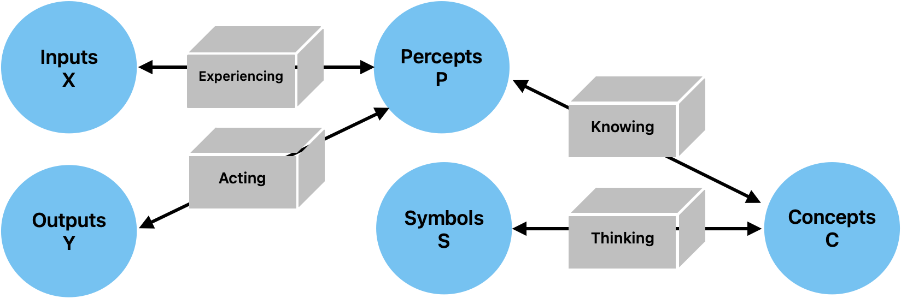

**Basic Model**

***The Basic Model of Cognition is a neural network that consists of four spaces: real space, perceptual space, conceptual space, and symbolic space.***

**Model Entities:**

| Entity | Meaning |
| --- | --- |
| $x$, $\widehat{x}$, $X$ | Actual and predicted input (experiences), input space |
| $y$, $\widehat{y}$, $Y$ | Actual and predicted output (actions), output space |
| $p$, $P$ | Percepts, perceptual space |
| $c$, $C$ | Concepts, conceptual space |
| $s$, $S$ | Symbols, symbolic space |
| $W_e$ | Experiencing, experiential weights |
| $W_a$ | Acting, action weights |
| $W_k$ | Knowing, knowledge weights |
| $W_t$ | Thinking, thought weights |

***Background***

Much of this work is based on the Basic Model of Cognition described briefly [*[https://cognitivesciencesociety.org/framework-cognitive-science/]{.underline}*](https://cognitivesciencesociety.org/framework-cognitive-science/). More details are provided in the book [*[The Whole Part]{.underline}*](https://thewholepart.com).{width="1.6487751531058619in" height="1.0387292213473316in"}

***Inputs and Outputs***

Inputs and outputs derive from a real space that is ineffable. This essay merely characterizes them relative to other things.

The adaptable parameters of a mind are initially zero, a state known as *tabula rosa*. Learning is initiated by random perturbations of a map relative to its territory, and the degree of that exploration is referred to as *temperature*.

Input are normalized and lie on a hypersphere. They are nonnegative because negative entities do not exist. To paraphrase Saint Augustine, *negative is the privation of the positive*.

Outputs and Inputs are dehumanizing terms: the world is a living world, so it helps to call outputs "actions" and inputs "experiences". When minds perceive and act within the world, their mistakes are called expectation errors and performance errors.

Action is a function of perceptual space and our expectation, where that space is often filtered by conceptual projections.

Performance errors are defined relative to action, desired effect, and exhaustion.

Expectation errors are defined relative to perception and perception-as-reconstructed.

To accommodate an input context window which changes, the input is augmented with relative spatiotemporal encoding by extending its dimensionality. While much of the network can treat these as simply additional features of the input, the attention mechanism must deal with them explicitly since attention is directed within space and time (i.e. it treats the what and where pathways separately).

***Perceptual Space***

Perceptual spaces are composed of perceptual prototype vectors, or ***percepts***.[^1]

Perceptual spaces map onto reality in a straightforward way, at least in so far as we perceive correctly They are bidirectional, although not necessarily symmetric. Technically, they are real similarity spaces with arbitrarily high dimensionality, where logical negation is not defined.

Percepts that do not correspond to objects are *hallucinations*.

Percepts generalize a perceptual space by forming a Voronoi tessellation using prototype and/or exemplar vectors. They are related to one another in virtue of a connection which define a Self Organizing Map. Percepts operate in parallel. Insofar as categories are concerned, they form an embodiment of prototype theory.

The perceptual error function is defined by the mismatch between perception and existing percepts, where that mismatch may exert an influence on the world.

Perceptual accuracy is a measure of the distance between inputs and prototype vectors. That distance is similar to cosine similarity, although to the extent we don't know a perceptual well, it is a simple distance measure in the range (0-1).

Attraction and aversion within a perceptual space manifest as weighted prototype vectors: attraction is a pole at the percepts's location, and aversion is a zero at that location. As a result, they warp perceptual space, making us more or less likely to perceive things that we love or hate.

Perfectly recognized percepts lie on the unit hypersphere within conceptual space.

Two percepts can be joined into one concept without loss of characterization.

***Conceptual Space***

***Concepts*** create boundaries in conceptual space, a space which is grounded in the support vectors of perception. By creating boundaries, they support logical negation. Due to this relativity, they may refer to negative entities which may or may not exist on perceptual or objective levels.

Conceptual spaces are capable of representing negative entities.

Concepts are references that do not exist in the space in which the percepts are defined, but in the space formed by the collections of perceptual activations. Thus, the space of concepts can not be directly overlaid on the space of percepts, because it occurs at a different epistemic level, although conceptual space can be projected onto perceptual space.

Concepts that do not correspond to percepts are *false*.

Concepts collect percepts into fuzzy sets. Percepts are weighted by a degree of membership, which allow concepts to perform several logical operations such as and, or, and not. They can be seen either as linear separating hyperplanes which partition conceptual space into two parts, or as sets which are defined as a linear combination of the percept activations.

Concepts are relative: they are meaningful only insofar as they create a partition of a meaningful space.

As the concepts of a mind approach certainty, the slope of the decision boundary becomes infinite.

There is a single state of unknowing which is common to all knowledge vectors, which does not categorize space because the slope of the activation function is zero.

It is also the case that knowledge vectors of length zero are undirected, which seems like a state of unknowing which is slightly different than slightly different the measure of certainty. Informally, the concept must be learned before its certainty can be assessed.

Thus, conceptual spaces are similarity spaces that are partitioned by decision boundaries that impose positivity and negativity on a hypersphere of knowing.

Percepts are incorporated into meronomies through the use of concepts, which create transitive part hierarchies.

When symbols are so incorporated, the referential nature of symbols creates intransitive part hierarchies.

Within conceptual space, attraction and aversion to concepts can be expressed as a hyperplane bias (i.e. the tendency to partition reality in a biased way).

Within conceptual space, certainty is expressed as the slope of the activation function. Is it tuned after the other parameters have ceased to change as a result of correct categorization.

Certainty (or clarity) can also be grounded in symbolic space, where symbolic support vectors are taken as *a priori* truth (or at least learned with some certainty reflected in their nonzero magnitude).

Concepts can be split into two precepts without loss of characterization.

***Symbolic Space***

*Symbolic Spaces* are composed of percepts that are references to concepts. They are therefore a subtype of perceptual spaces that map onto conceptual spaces.

Because symbols do not have any spatial context, they exist as zero-dimensional points within perceptual space. If we dont have feeling receptors in the brain, there is no positional encoding for this layer.

In virtue of that representation, symbols can be conceptualized and collected into sets. The creation of sets of symbols, since they have no inherent ordering, creates equivalence classes.

In humans, perceptual space is projected onto a 3D subspace within the cerebellum before symbolic encoding.

Symbols are independent, permanent, and integral (at least when interpreted *as* references, even though they ultimately exist within a dependent, temporary, and continuous space).

The top-down, serial activation of a symbolic space differs from the bottom-up activation of perceptual spaces because it casts shadows.

The formation of symbols increases the dimensionality of conceptual space (as would an outer product).

The formation of concepts from percepts decreases the dimensionality of perceptual space (as would an inner product).

Symbols are zero-dimensional entities, or epistemological points. As references, symbols form a discrete perceptual space and can be represented as a binary array.

The participation of symbols in multiple sets creates structural relations which takes the place of positional information.[^2]

Symbols are erroneous if their associated concept is not true.

***Reasoning***

Reasoning within symbolic spaces involves computing with parts and wholes. This may be seen as using Venn diagrams to perform computations on a space, which results in ability to perform Bayesian-type statistics dynamically.

Those probabilities, once learned, can be stored as unidirectional connection weights between concepts, perhaps in conjunction with a part-whole structure imposed on those concepts by their corresponding symbols.

***Symmetric Perception: the Single Layer Linear Case***

- A symmetric perception network predicts both input and output. By taking advantage of functions that may be surjective in two directions, it is able to compute a bijective mapping.

- The term "*symmetric perception*" refers to the fact that perception is bidirectional: it is an interaction in which we see the world and in which the world sees us. The later fact is often forgotten from an egocentric point of view; culturally, as Edward has observed, perception is seen as a passive process. In the context of neural networks, which often serve as models of the mind, this egocentric view continues: functions are computed that map inputs onto outputs, and the influence of the outputs on the inputs is forgotten. This essay explores the technical aspects of symmetric perception as well as several guiding principles for humanistic mental models.

Symmetric Perception, in the general case, finds a function f(x) which minimizes the MSE with respect to the following:

$$\left( \begin{array}{r}
in \\
out
\end{array} \right) \cdot \begin{pmatrix}
f(x) & 0 \\
0 & f^{- 1}(x)
\end{pmatrix} = \left( \begin{array}{r}
out \\
in
\end{array} \right)$$

In the linear case, $f(x)$ becomes a single invertible matrix A. In general, the mapping from input to output may not be linear, and the inverse may not exist, in which case the previous set of input/output equations is written as:

$$\left( \begin{array}{r}
in \\
out
\end{array} \right) \cdot \begin{pmatrix}
f(x) & 0 \\
0 & g(x)
\end{pmatrix} = \left( \begin{array}{r}
out \\
in
\end{array} \right)$$

This problem bears some resemblance to the standard regression problem $Ax = b$, except that x is known and we wish to find the set of points $A$ (or weights) that map one linear space to another. So the familiar Linear Least-Squares solution to the equation$x = \left( A^{T}A \right)^{- 1}A^{T}b$ becomes an attempt to find a matrix A such that:

$Ax = b$ and $A^{- 1}b = x$

This solution is seen as the "best" solution by neural networks that wish to determine a weight matrix A that maps from x onto b. That much is shared between the two problems, although there are nonlinearities in the general neural network case which enable a much better fit. This solution is optimal in the sense that it minimizes the Sum of Squared Errors, where the errors are defined as the residuals when b is projected into the column space of A.

However, the principle of retrocausality suggests an additional objective; namely, we wish to create a matrix such that it is optimal both for the the transformation of the input to the output and the output to the input. \[It is not clear to me the properties of such a transformation, in either a linear or nonlinear context, so that is what I'm exploring\].

In general, we want a matrix $A$ such that minimizes reconstruction loss over both $Ax = b$ and $A^{- 1}b = x$. Since we are simultaneously minimizing the error vectors of each, and since the column space of a matrix is identical to the column space of its inverse, we will end up with a matrix $A$ that contains the vectors $x$ and $b$ within both its column space and row space (which is necessary because we are seeking a bijective function).

As a first approximation, we might write $A$ as a product of two matrices, each of which performs a perfect surjection: $A \cdot A^{- 1} = I$

$$(\frac{b}{2}*x^{- 1}) \cdot (\frac{x}{2}*b^{- 1}) = I$$

However, this will still be only an approximate solution, since it is unlikely that a somewhat arbitrary combination of both matrices will result in the correct orthogonal matrix. To find the best matrix $A$ involves either an iterative solution as would be performed by NN learning, ping-pong style, or (theoretically?) via multiple round trips consisting of Gram-Schmitt orthogonalization with respect to the matrices $A$ and $A^{- 1}$.

***Symmetric Perception: the Single Layer Nonlinear Case***

If $f(x)$ and $g(x)$ share a common weight matrix $W$, we may write the equations for symmetric perception as:

Forward computation and gradient:

$$\widehat{y} = f(g^{- 1}(x)W)$$

$$e_{y} = \frac{1}{2}(\widehat{y} - y)^{2}$$

$$\frac{\partial e_{y}}{\partial\widehat{y}} = \widehat{y} - y$$

$$\frac{\partial\widehat{y}}{\partial W} = \delta_{f}(W^{T} \cdot g^{- 1}(x))$$

$$\frac{\partial W}{\partial x} = \delta_{g}(x)$$

$$\Delta W_{y} = \eta\frac{\partial e_{y}}{\partial\widehat{y}}\frac{\partial\widehat{y}}{\partial W}g^{- 1}(x)$$

$$\Delta W_{y} = \eta(\widehat{y} - y)\delta_{f}(W^{T} \cdot g^{- 1}(x))g^{- 1}(x)$$

Reverse computation and gradient:

$$\widehat{x} = g(W^{T}f^{- 1}(y))$$

$$e_{x} = \frac{1}{2}(\widehat{x} - x)^{2}$$

$$\frac{\partial e_{x}}{\partial\widehat{x}} = \widehat{x} - x$$

$$\frac{\partial\widehat{x}}{\partial W} = \delta_{g}(W \cdot f^{- 1}(y))$$

$$\frac{\partial W}{\partial y} = \delta_{f}(y)$$

$$\Delta W_{x} = \eta\frac{\partial e_{x}}{\partial\widehat{x}}\frac{\partial\widehat{x}}{\partial W}f^{- 1}(y)$$

$$\Delta W_{x} = \eta(\widehat{x} - x)\delta_{g}(W \cdot f^{- 1}(y))f^{- 1}(y)$$

Since the single matrix $W$ is shared, we might combine the partial derivatives of the input and output errors via sum and set the gradient to zero to explore the solution space, which seems to minimize the cross-covariance between the input and output spaces:

$$\frac{\partial e_{y}}{\partial W} + \frac{\partial e_{x}}{\partial W} = \eta(\widehat{y} - y)\delta_{f}(W^{T} \cdot g^{- 1}(x))g^{- 1}(x) + \eta(\widehat{x} - x)\delta_{g}(W \cdot f^{- 1}(y))f^{- 1}(y)$$

If we assume that the gradients never go to zero, then we have the sum of the partial derivatives with respect to the error going to zero when both $x = i$ and $y = o$. However, it may be the case that $xy - iy = ox - yx$, which means that the simultaneous gradient descent is ping-ponging between the two cost functions. So a better cost function would be a multiplication of the two error partials, which is an intersection of the space that satisfies both equations. In that case, we can multiply the terms to get a better understanding of the error surface that we are minimizing with respect to the input and the output:

$$\frac{\partial e_{y}}{\partial W}\frac{\partial e_{x}}{\partial W} = \eta(\widehat{y} - y)\delta_{f}(W^{T} \cdot g^{- 1}(x))g^{- 1}(x)(\widehat{x} - x)\delta_{g}(W \cdot f^{- 1}(y))f^{- 1}(y)$$

***Distance Metrics***

$$d(x_{1},x_{2}) = \frac{\parallel x_{1} \parallel^{n} \cdot \parallel x_{2} \parallel^{n}}{\parallel x_{1} - x_{2} \parallel^{2n}}$$

Which can be written in the Z-plane as:

$$d(x_{1},x_{2}) = \parallel x_{1} - x_{2} \parallel \cdot \frac{(x - z_{1})}{(x - z_{2})}$$

Where $z_{1}$ is a zero and $z_{2}$ is a pole.

***Exploration/Exploitation as a function of temperature:***

$$y = x \cdot \frac{(W + rt)}{\parallel W \parallel}$$

Where:

- ***x***, ***y*** are the input and output vectors

- ***W*** is the weight matrix

- ***r*** is a random vector

- ***t*** represents temperature

***Transfer Functions***

By using rotation matrices with a tunable parameter $\Theta$ before and after the projection from one space to the other, and by restricting the projection matrix to be diagonal, it is possible to restrict the solution space to an eigendecomposition of the orthonormal basis that maps input to output (i.e. it calculates the SVD of the matrix). For the 2D case, this can be written:

$$y = \begin{bmatrix}
\cos\theta_{1} & - \sin\theta_{1} \\
\sin\theta_{1} & \cos\theta_{1}
\end{bmatrix}\begin{bmatrix}
\Sigma_{1} & 0 \\
0 & \Sigma_{2}
\end{bmatrix}\begin{bmatrix}
\cos\theta_{2} & - \sin\theta_{2} \\
\sin\theta_{2} & \cos\theta_{2}
\end{bmatrix}x$$

It may also be possible to use a nontunable scalar function as the transfer function and not restricting the matrix to be diagonal, which is approximately how neural networks apply nonlinearities to the sum of products by weight matrices.

$$f(x) = \sin(x)$$

$$g(x) = \cos(x)$$

$$f^{- 1}(x) = \arcsin(x)$$

$$g^{- 1}(x) = \arccos(x)$$

$$\partial_{f}(x) = \cos(x)$$

$$\partial_{g}(x) = \sin(x)$$

$$\partial_{f^{- 1}}(x) = \frac{1}{\cos(\arcsin(x))}$$

$$\partial_{g^{- 1}}(x) = \frac{1}{\sin(\arccos(x))}$$

If we write the forward equations and gradients of $f()$ and $g()$ using these functions, we end up with the following formulation:

$$\widehat{y} = \sin(\cos^{- 1}(x)W)$$

$$\widehat{x} = \cos(W^{T}\sin^{- 1}(y))$$

$$\Delta W_{y} = \eta(\widehat{y} - y)\cos(W^{T} \cdot \cos^{- 1}(x))\cos^{- 1}(x)$$

$$\Delta W_{x} = \eta(\widehat{x} - x)\sin(W \cdot \sin^{- 1}(y))\sin^{- 1}(y)$$

The important thing to notice is that the reconstruction of the reverse perception and the calculation of the gradient of forward perception involve common terms, and may be simplified:

$$\widehat{y} = f(g^{- 1}(x)W)$$

$$\widehat{x} = g(W^{T}f^{- 1}(y))$$

$$\Delta W_{y} = \eta(\widehat{y} - y)\delta_{f}(W^{T} \cdot g^{- 1}(x))g^{- 1}(x)$$

$$\Delta W_{x} = \eta(\widehat{x} - x)\delta_{g}(W \cdot f^{- 1}(y))f^{- 1}(y)$$

$$\Delta W_{y} = \eta(f(g^{- 1}(x)W) - y)\delta_{f}(W^{T} \cdot g^{- 1}(x))g^{- 1}(x)$$

$$\Delta W_{x} = \eta(g(W^{T}f^{- 1}(y)) - x)\delta_{g}(W \cdot f^{- 1}(y))f^{- 1}(y)$$

$$\Delta W_{y}\Delta W_{x} = \eta(f(g^{- 1}(x)W) - y)\delta_{f}(W^{T} \cdot g^{- 1}(x))g^{- 1}(x) \cdot (g(W^{T}f^{- 1}(y)) - x)\delta_{g}(W \cdot f^{- 1}(y))f^{- 1}(y)$$

If we take the product of both:

$$\Delta W_{y}\Delta W_{x} = \eta(\widehat{y} - y)\delta_{f}(W^{T} \cdot g^{- 1}(x))g^{- 1}(x) \cdot (\widehat{x} - x)\delta_{g}(W \cdot f^{- 1}(y))f^{- 1}(y)$$

$$\Delta W_{y}\Delta W_{x} = \eta(\widehat{x} - x)(\widehat{y} - y)\delta_{f}(W^{T} \cdot g^{- 1}(x))\delta_{g}(W \cdot f^{- 1}(y))f^{- 1}(y)g^{- 1}(x)$$

[^1]: Perceptual space is known as ["]{dir="rtl"}embedding space" in the current literature on transformer neural net architectures.

[^2]: For example, {0,1} and {0,1}, if those sets are orthogonal to one another, pose no constraint on the location of the 1 within the 2x2 grid that they partition. However, {0,1,1} and {0,1} partition a 3x2 space and simultaneously impose the constraint that two 1[']{dir="rtl"}s must lie on the same row. This is a fact which is not present in either the row set or the column set.
