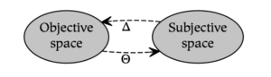
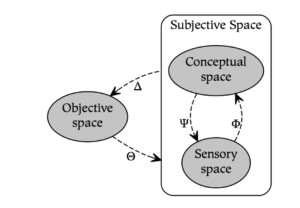
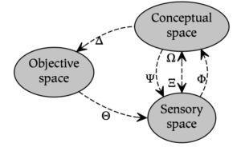
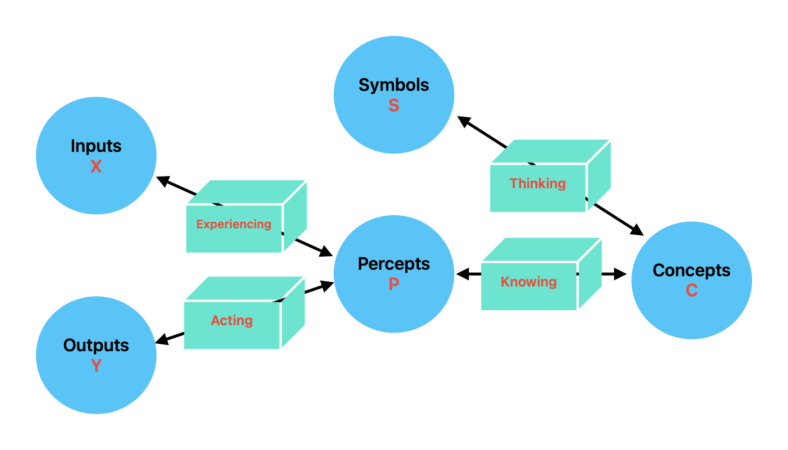

**A Basic Model for Cognition**

This essay explores a basic model of human cognition. The possible implementations of such a model create a spectrum of complexity with two theoretical extremes. On the simple end of the spectrum are models such as behaviorism that treat all of cognition as a subjective ["]{dir="rtl"}black box" about which nothing can be said (as in Figure A). Modern LLMs are example implementations of this paradigm. On the complex end of the spectrum are models that describe numerous and detailed aspects of cognition and their corresponding biological implementation, which also tend to be opaque.

***Figure A*: The behaviorist model analyzes the world in terms of the stimuli (Θ) and responses (Δ) that occur between objective (or environmental) spaces and subjective (or mental) spaces.**

Perhaps the most simple modification of the behaviorist model divides subjectivity into two constituents. Although there are different ways to accomplish this division, one of the most common ways distinguishes conceptual and nonconceptual content. In [Dual Process Theory](https://en.wikipedia.org/wiki/Dual_process_theory), for example, this distinction creates two systems called System 1 and System 2. In [ACT-R](https://en.wikipedia.org/wiki/ACT-R), a similar distinction differentiates declarative and procedural knowledge. In [theoretical linguistics](https://en.wikipedia.org/wiki/Theoretical_linguistics), this fundamental dividing line differentiates syntax from semantics. However, despite the prevalence of these parallel distinctions within cognitive science, they do not serve as a unifying theme. As Johnathan Evans summarizes in a discussion of Dual Process Theory:

*The distinction between two kinds of thinking, one fast and intuitive, the other slow and deliberative, is both ancient in origin and widespread in philosophical and psychological writing. Such a distinction has been made by many authors in many fields, often in ignorance of the related writing of others. \[[Evans & Stanovich, 2013](https://journals.sagepub.com/doi/10.1177/1745691612460685)\].*

A novel diagram representing this basic model of cognition is presented here to unify this disparate terminology. Subjective space is divided into sensory and conceptual spaces to approximate the conceptual/nonconceptual distinction referenced above. As a result, while the perception of a tree in the behaviorist model is characterized only in terms of the response to that perception, the basic model of cognition described below further analyzes subjective experience in terms of the bottom-up concepts formed in response to sensation (**Φ**) and the top-down visualization of those concepts (**Ψ**).

**Figure B: Dividing subjective space into sensory and conceptual spaces allows modeling bottom-up *conceptualization* (Φ) and *top-down visualization* (Ψ).**

In Figure B, although sensory and conceptual spaces are depicted as discrete entities, these nodes represent a single space that ranges from increasingly sensory parts to increasingly conceptual wholes. In other words, sensory content becomes *increasingly* conceptual as one moves bottom-up from sensory space to conceptual space, and conceptual content becomes *increasingly* sensory as one moves top-down from conceptual space to sensory space.

A significant limitation of using the model in Figure B, however, is that it only describes symbolic processes. In particular, *conceptualization* (**Φ**) and *visualization* (**Ψ**) are subsymbolic rather than symbolic, and correspond to the relation between parts and wholes. As a result, there is no way within the model of Figure B to capture the notion that the symbol ["]{dir="rtl"}tree" is a representation of the concept tree, since they are not related to one another as parts or wholes (i.e., symbols are references to what they symbolize). Therefore, the description of symbolic processes requires the addition of two further relations: *symbolization* (**Ξ**), which creates symbolic references from conceptual content, and *interpretation* (**Ω**), which dereferences symbols to activate their associated concepts. These relations allow one to model both the interpretation (or understanding) of the symbol of a tree as well as the symbolization (or naming) of the concept of a tree.

Adding these two relations to the model in Figure B results in the following *basic model of cognition*, which consists of three spaces and six relations:

**Figure C: The basic model of cognition.\**

While this model is quite simple, it extends the more basic rubric of Dual Process Theory by adding terminology for both subsymbolic and symbolic operations. One of its key strengths is that it provides a common foundation for a number of existing theories in cognitive science; for example, [first-order logic](https://en.wikipedia.org/wiki/First-order_logic), [syntactic hierarchies,](https://en.wikipedia.org/wiki/Syntactic_hierarchy) and [mathematical sets](https://en.wikipedia.org/wiki/Set_theory) can all be recursively constructed using conceptualization and symbolization (this is illustrated in the book The Whole Part \[[Rogers, 2020](https://thewholepart.com/)\]). In distinction to these formalisms, however, the basic model of cognition also allows one to model animal cognition and other subsymbolic processes.

