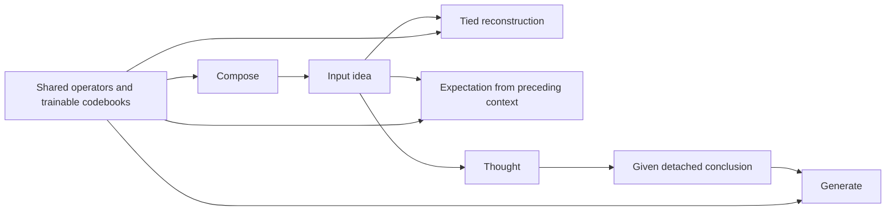

# Gradient flow across the architecture

Current contract, September 20: each objective differentiates its own
computation. Output receives a **given concluded idea**, so its error stops at
that state boundary. Reconstruction, expectation and generation still share
operator parameters. The former global reconstruction-priority projection is
removed, including its configuration and optimizer helpers. This implements
[the superseding §8.4 decision](plans/2026-09-15-next-sentence-as-the-production-objective.md#84-gradient-boundaries-and-learning-evidence).

## State paths and shared parameters

| Objective | Differentiable path | Given or detached values |
|---|---|---|
| Reconstruction | Compose, the recorded derivation's tied inverse, recovered words and byte scoring | Rule/reference addresses, retained constituent witnesses, candidate spellings, targets and dictionary snapshots |
| Expectation | Predictor and preceding ideas still live in the current optimizer step | Arriving target, previous-step context, durable observation/estimate records |
| Output matching | Generate, its numerical operators, conceptual conditioner, tied reverse chain and output readout | Concluded idea, answer symbol, question-conditioning state and named conceptual/perceptual context |
| Thought policy | The selected controller's chooser through explicit log-probability credit | Root, active and candidate meanings; attended memory; evidence, reward and work meter |
| Generate policy | Generate chooser through supplied-answer action credit | Top-idea features and the reward; no input parse used as an answer teacher |

`resolveAnswer()` prepares an owned `AnswerDerivation`; `reverseOutput()`
consumes it without repeating resolution. Ownership and gradient permission
are separate: an owned clone can remain live for reconstruction/expectation,
but generation detaches it **before** applying its trainable conditioner.
Both the indexed grammar walk and the dense synthesis path enforce this cut.
The named contextual operands detach as well. Consequently, an answer error
cannot train a predictor or composer through the concluded-state path.
It can update an operator that is used again by generation.
[Implementation](../bin/Models.py), [owned values](../bin/Output.py).

Ideas are composed-space values and need not be individual codebook atoms.
Detaching an idea does not quantize it, discard its role structure, or invent a
free answer vector. Integer concept/occurrence IDs remain addresses rather
than semantic magnitudes. The full NP1/VP/NP2 payload and mask survive.

The forward grammar's hard choice uses its existing straight-through
surrogate. Replaying a recorded integer derivation adds no new estimator.
A bounded inverse differentiates selected operator uses and candidate scores,
while candidate retrieval remains detached. The output readout is an
independent head; its gradient remains live into its generated percept input,
which is already downstream of the conclusion cut.

## Trained total and diagnostic objectives

`runBatch` constructs the actual sum explicitly. `record_loss` reports a cost;
it does not train it. The primary weights remain
`reconstructionScale * inputLoss + (1 - reconstructionScale) * answerLoss`.
Expectation and enabled auxiliary objectives have their own configured
weights. There is one ordinary backward and one optimizer step. AMP scales
that same sum. No global projection, downstream norm allowance, or hidden
second backward replaces shared gradients.

For diagnostics, the same graph carries three weighted branches:

- Reconstruction includes the primary input loss, tied reverse loss and
  active reconstruction auxiliaries, with their actual weights.
- Output includes the supplied-answer loss, enabled generate action credit,
  and the generate component of an annotated grammar lesson.
- Expectation includes enabled ARMA, inter-sentence and contrastive terms.

The grammar curriculum's compose component remains its own supervised
objective; it is not renamed reconstruction or output to manufacture overlap.
Grammar lessons train the existing compose/generate policies and operators.
There is no external interpreter or decoder. The bounded natural-wording gate
for item 1 is complete; it is supervised language evidence, not proof of
unsupervised language acquisition or useful learned questioning.
[Lessons](../bin/GrammarLessons.py), [wording evidence](Testing.md#working-grammar-wording-gate-september-20).

Truth-based contextual scaling is detached and applied equally to the total
and diagnostic branches. Otherwise answer loss multiplied by a live context
score would reopen the state boundary. Additive truth/balance costs remain
separate auxiliary objectives. Sparse concept-readout L1 is a detached
reporting cost and one proximal optimizer update, not duplicate autograd loss.

## Per-operator agreement

`branchDiagnosticsEvery` samples before backward, at one parameter version.
Zero disables it; BasicModel sets 100. The existing state-branch report remains
available; the run log also emits `[operator-gradients]` JSON. Each named
shared operator/codebook reports weighted gradient norms and the cosines of
reconstruction with output and with expectation.
[Diagnostic implementation](../bin/GradientDiagnostics.py),
[run harness](../bin/Models.py).

Names come from the actual grammar registry and registered parameter owners.
Aliases/tied parameters are counted once, and only optimizer-owned parameters
are differentiated. Independent synthesis heads are excluded. A missing or
zero gradient has a null cosine, not agreement. Sparse codebook comparisons
use touched rows without allocating a dense capacity slab. Stable norm
calculation handles large finite gradients. Inspection leaves `.grad` and
parameter values unchanged and preserves the graph for the normal backward.

Three consecutive negative observations name persistent opposition on that
operator. A missing, zero or nonnegative observation resets that streak.
This is evidence to examine, never automatic clipping or projection. No
operator-specific guard is installed by this change. A few diagnostic batches
do not demonstrate persistent incompatibility or useful learning.

The production ConceptualSpace dictionary is optimizer-owned again:
`conceptualContextLearningRate=0` disables the older detached rotation updater.
Shared row parameters use sparse gradients and one optimizer owner. Existing
rotation-only experimental configurations remain explicit; their diagnostic
entry reports unavailable cosines and names the non-autograd update owner.
They are not evidence of objective credit to the codebook. `trainEmbedding`
likewise determines participation in the main optimizer.

## Thought, memory and graph lifetime

Thought faces and hard native/taxonomy/LTM reads are parameter-free. Checked
`ThoughtResult` payloads, including selected truth effects, detach immediately.
Set members, code results and prediction effects cannot reopen their readers'
graphs through output. The chooser observes detached state and learns only from
its explicit policy objective; its reward and actual shared-work charge are
also detached. Residual-based query credit remains item 2, and held-out causal
utility remains unproven under item 4.
[Controller](SelectedMeaning.md), [thought contracts](QueryContracts.md).

Ordinary episode history may retain a composed request while that episode is
live. It supplies no answer-state derivative after this cut. Finished episodes
release their retained graphs at the optimizer boundary. Durable LTM writes
and checkpoint sidecars always detach. Restoring an estimate/observation pair
restores evidence, not a delayed predictor graph. Targets, other streams and
unseen future sentences never become current-step expectation context.
[History](ThoughtHistory.md), [expectation retention](ExpectationRetention.md).

Query phase masks, reference matching, taxonomy traversal, retention/compaction
and `QueryWorkBudget` are hard bookkeeping. None adds a parameter, gradient or
learning objective. Discrete retrieval needs explicit policy credit if it is
to learn. Measured work and semantic correctness alone do not establish learned
utility.

## Verification and retired checks

[Boundary tests](../test/test_prepared_answer_boundary.py) check zero output
state credit and nonzero credit on shared generation operators for both output
paths. [Factorization tests](../test/test_gradient_factorization.py) check
weighted cosine, zero/missing gradients, sparse and large finite gradients,
policy/effect detachment, stale configuration rejection and normal-batch logging.
[Joint-objective tests](../test/test_joint_objectives.py) retain actual packed
expectation learning, source-encoder reach, detached previous-step context,
optimizer ownership, independent heads, ties, sparse updates, AMP and one step.

The old projection-only algebra and tolerance/ratio validation cases are
retired with the implementation. Their still-applicable numerical and ownership
coverage is preserved in the two files above. An invertible-family learning
probe still checks that prediction can improve an exactly reconstructable
representation. Full source-matched receipts and explicit test dispositions
belong in [Testing](Testing.md).
