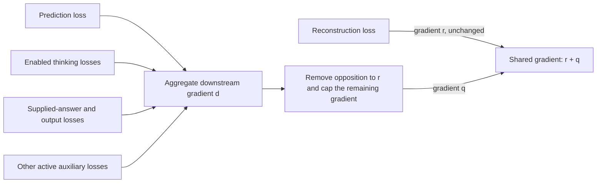

# Gradient flow across the architecture

Current reference, September 16. The objective is one internal NP/VP
representation that preserves the input **and** is informative for prediction
and answers. Reconstruction constrains fidelity; prediction and answer error
help choose among representations that reconstruct well. Separate modules do
not imply detached inputs. This is the decided contract in
[integrated specification §8.4](plans/2026-09-15-next-sentence-as-the-production-objective.md#84-joint-representation-learning-and-gradient-balance).

Reconstruction's surface loss scores each word's bytes through its first NUL
terminator (`0`), using the existing 256-byte alphabet. This distinguishes a
word from a longer candidate with the same prefix. Bytes after NUL are ignored,
as required by the [token-buffer contract](../bin/Spaces.py#L1617). Targets and candidate
spellings remain detached. Input percept IDs expand to full byte targets at
eager staging so a promoted whole word or prefix cannot disappear from the
objective ([target staging](../bin/Models.py#L11016),
[byte objective](../bin/Models.py#L11719)).
The scorer also has a uniform fallback for an unknown spelling. That fallback
distributes probability over these same 256 bytes; it is not another byte value.

The tied reconstruction implementation passes full-suite verification; the controller,
nested meaning, query-credit and compose/generate catalog migrations are still
open. The table below distinguishes executable paths from those remaining
requirements. See the [implementation order](plans/2026-09-15-next-sentence-as-the-production-objective.md#10-consolidated-implementation-and-verification-order)
and [reconstruction measurements](benchmarks/2026-09-16-tied-input-reconstruction.md).

## The four pieces and their losses

The intended execution order is input understanding and reconstruction,
reasoning over that understanding and LTM, then surface generation. Expectation
uses preceding context to predict the arriving input; the observed input then
supplies its target. Thinking adds queries and subgoals to prediction, with
explicit credit for whether that work helped. It is not established by merely
running the predictor without another input. These phase and credit requirements
are specified in [§8.6](plans/2026-09-15-next-sentence-as-the-production-objective.md#86-understanding-prediction-and-response-production)
and [§8.10](plans/2026-09-15-next-sentence-as-the-production-objective.md#810-queries-as-tools-at-inter-sentence-prediction-decided).

| Piece / objective | Directly trained computation | Reach into representation | Stops and current limits |
|---|---|---|---|
| **Representation and reconstruction:** weighted input surface error | Recovered word ideas, the selected compose operators' tied reverse calculations, and the live forward encodings they consume | This is the reconstruction reference `R` on shared weights. It retains its gradient unchanged. | The identified input derivation is fixed during reverse traversal; retained constituent references, dictionary snapshots and byte targets are detached. No gradient through an integer rule or dictionary index. [Reconstruction](../bin/Models.py#L11300), [snapshot](../bin/Models.py#L11654), [owned byte objective](../bin/Models.py#L13820). |
| **Prediction:** occupied-role MSE plus role-presence BCE | The sentence predictor and its live preceding NP1/VP/NP2 context | May train the encoder of a preceding sentence still in the **same optimizer step**. It shares the downstream budget below. | The arriving sentence's encoding is a detached target. Durable context and previous-step encodings are detached. A cold start has no predicted target. [Prediction and observation](../bin/Layers.py#L10064), [graph lifetime](../bin/Layers.py#L10689). |
| **Thinking:** enabled query/subgoal policy objectives | Currently, a sampled What choice receives score-function credit from supplied-answer error minus work costs; optional legacy reasoning and teacher-trace losses have separate gates | Only through live inputs actually consumed by the trained policy or soft reasoning computation. Its shared-parameter contribution belongs to the same downstream budget. | Hard choices and deductions have no ordinary derivative. The current What context includes detached scalar summaries, so policy training does not prove semantic encoder feedback. Residual-based credit on ordinary corpus inputs is a required migration. [Policy](../bin/Models.py#L8325), [summary](../bin/Models.py#L7940), [loss gates](../bin/Models.py#L14126), [required residual credit](plans/2026-09-15-next-sentence-as-the-production-objective.md#810-queries-as-tools-at-inter-sentence-prediction-decided). |
| **Output:** supplied-answer error and, when enabled, output-action policy loss | The answer path, conditioner and synthesis heads; sampled generation choices receive policy credit | Differentiable use of a live question/answer representation can train its upstream producer, under the same shared budget. Independent output heads retain their ordinary gradients. | Desired answers are supervision, not generation inputs. Output policy reward is detached: credit flows through action log probabilities, not through the reward calculation. The input parse is not a gold answer parse. [Answer resolution](../bin/Models.py#L8186), [head ownership](../bin/Models.py#L9158), [action credit](../bin/Models.py#L9293). |

An answer loss trains the sentence predictor only if the answer computation
actually consumes a live prediction. The gradient balancer permits that path;
it does not create it. The current resolver selects current/recalled
representations before generation. `resolveAnswer` prepares the owned
derivation; `reverseOutput` consumes it without repeating reasoning. The owned
conceptual clone preserves its input gradient. Completing the levelled thought
controller and connecting complete predicted meaning remain separate work.
[Prepared boundary](../bin/Models.py#L8171),
[realization](../bin/Models.py#L9182), [owned clone](../bin/Output.py#L90),
[required handoffs](plans/2026-09-15-next-sentence-as-the-production-objective.md#86-understanding-prediction-and-response-production).

The forward grammar's hard selection already uses a straight-through
approximation: its forward value is the selected operation, while backward
uses a soft surrogate. Replaying the recorded integer derivation during tied
reconstruction does **not** introduce another estimator. A bounded lossy inverse
can differentiate its candidate scores and selected operator parameters while
keeping candidate retrieval and reference values detached.
[Forward selection](../bin/Language.py#L14029),
[unary selection](../bin/Language.py#L14083),
[tied binary reverse](../bin/Language.py#L14346).

During sampled generation, the policy also reads a **detached top idea**.
Thus the current output-action policy loss trains the choice head, while the
separate differentiable answer-value path can send balanced credit upstream.
Detaching the reward and detaching the policy's input are distinct boundaries.
[Sampled policy input](../bin/Models.py#L12308),
[detached action reward](../bin/Models.py#L9293).

The final answer readout is an independent output head. New instances use the
rectangular factors of the same LDU forward projection, retaining every
generated percept coordinate while avoiding an input-width square allocation.
Answer-value gradients still pass through that projection into its live input;
its parameters receive the ordinary output-head gradient. It supplies no input
reconstruction inverse. Legacy checkpoint adapters retain their original
layout. [Readout](../bin/Layers.py#L1637),
[construction](../bin/Spaces.py#L30277),
[checkpoint restoration](../bin/Models.py#L9007),
[optimizer ownership](../bin/Models.py#L9129).

### Current configuration matters

The primary blend is `(1 - reconstructionScale) * answerLoss +
reconstructionScale * inputLoss`. BasicModel's FineWeb configuration uses
`reconstructionScale=1.0` and `interLossWeight=0.1`; expectation is added
separately. The supplied-answer benchmark uses `reconstructionScale=0.5`.
Adding labels to a configuration whose primary answer weight is zero would
not by itself train that answer objective.
[Blend](../bin/Layers.py#L16800), [FineWeb weights](../data/BasicModel.xml#L168),
[prediction weight](../data/BasicModel.xml#L195),
[supervised weights](../data/BasicModel_answers_tied_benchmark.xml#L51).

The legacy `answerLossWeight`, `thinkingLossWeight` and
`whatThinkingPolicyWeight` default to zero; `outputPolicyWeight` also defaults
to zero. A permitted credit path is therefore not evidence that a particular
configuration trains it. The residual-based query policy remains an open
migration, rather than an implicit consequence of enabling expectation.
[Legacy policy defaults](../bin/Models.py#L15607),
[output policy default](../bin/Models.py#L2523),
[required query credit](plans/2026-09-15-next-sentence-as-the-production-objective.md#810-queries-as-tools-at-inter-sentence-prediction-decided).

## Where the gradients meet

`runBatch` assembles the actual trained total explicitly. It partitions that
total into weighted reconstruction `R` and **all remaining objectives together**
`D = total - R`: prediction, supplied-answer error, thinking, output policy and
other active auxiliaries. Pipeline reconstruction terms and truth modulation
must also be reflected in `R`. Merely calling `record_loss` trains nothing.
[Primary partition](../bin/Models.py#L14005),
[auxiliary partition](../bin/Models.py#L14109),
[truth modulation](../bin/Models.py#L14235),
[backward entry](../bin/Models.py#L2746),
[reporting registry](../bin/Models.py#L9539).

For a shared encoder or grammar weight, the enabled losses meet as follows.
Independent heads receive their ordinary total-loss gradient instead
([gradient assembly](../bin/Optimizer.py#L193)).



With `reconstructionPriority=true`, the following rule applies independently
to every protected parameter tensor. Let:

- `r = grad(R)` and `d = grad(D)` at the same parameter version;
- `a = r` when `abs(R) > reconstructionLossTolerance`, otherwise zero;
- `alpha = outputGradientRatio`, default `0.5`, with `0 <= alpha < 1`.

First remove only the part of `d` that opposes reconstruction:

```text
q = d - min(0, dot(d, a)) / dot(a, a) * a    if a is nonzero
q = d                                       otherwise
```

Then calculate `budget = alpha * (norm(a) + norm(q))`, using `q` **before**
this cap. Shrink `q` only if its norm exceeds that budget. The final shared
gradient is `r + q`. Independent heads receive their ordinary total-loss
gradients. Missing reconstruction gradient is a zero reference; at zero
reference the default retains half of `d`, allowing an already faithful
representation to become more informative. Setting the ratio to zero stops
downstream credit on protected weights while independent heads can learn.
[Exact numerical implementation](../bin/Optimizer.py#L113).

The fidelity tolerance defaults to `1e-8` and compares the unscaled, weighted
loss. It only disables the projection reference; it does not discard `r`.
AMP scales both branches equally after this comparison. Backward clears the
protected downstream gradients before accumulating reconstruction, avoiding
the numerical cancellation that subtracting a very large downstream gradient
from a total gradient could cause. There is one later optimizer step.
[Loss scaling and tolerance](../bin/Models.py#L2746),
[separate accumulation](../bin/Optimizer.py#L193),
[optimizer step](../bin/Models.py#L14380).

The separate reconstruction compiler preserves saved buffers across these
gradient reads. It disables donation during compilation and normalizes the
disabled metadata used by this PyTorch build, so an ordinary first backward
cannot make later retained reads unsafe. The global compiler setting remains
unchanged ([compiled reconstruction](../bin/Models.py#L11257)).

### What the rule guarantees, and what it does not

At an active reference, the retained downstream contribution has no negative
projection on that parameter tensor's reconstruction gradient. Useful aligned
or orthogonal contributions can survive. **Prediction, thinking and output
are first aggregated into `d`; the rule does not prevent them from cancelling
one another.** Nor does this local gradient condition guarantee monotonic
reconstruction loss after Adam's momentum, adaptive scaling and a finite step.
Measure reconstruction, prediction and answer quality together; gradient norms
alone do not establish useful learning. [Projection](../bin/Optimizer.py#L113),
[joint partition](../bin/Models.py#L2746),
[learning acceptance](plans/2026-09-15-next-sentence-as-the-production-objective.md#84-joint-representation-learning-and-gradient-balance).

## Parameter ownership and non-gradient updates

Protection is based on actual optimizer ownership: PartSpace, WholeSpace and
ConceptualSpace representation parameters, plus grammar transforms registered
on SymbolSpace, deduplicated by tensor address (`data_ptr`). Independent synthesis heads
are excluded. Simply adding an `nn.Module` attribute does not put its parameters
in an optimizer; the explicit space lists and adopted synthesis modules decide
what is stepped. Catalog separation must test parameter identity and live input
gradients separately. [Protected set](../bin/Models.py#L2708),
[optimizer assembly](../bin/Models.py#L2796),
[catalog contract](plans/2026-09-15-next-sentence-as-the-production-objective.md#89-separate-comprehension-and-generation-catalogs-decided).

This map describes autograd credit. Context-rotation dictionaries that are
non-gradient buffers retain their own update ownership. Sparse concept-readout
L1 uses a separate proximal update in the optimizer; its detached reporting
cost is not differentiated again through the balance rule. These mechanisms
must not be counted as evidence that prediction error reached an encoder
parameter. [Ownership exclusions](../bin/Models.py#L2708),
[single proximal update](../bin/Models.py#L2771).

Embedding updates also depend on optimizer membership. With `trainEmbedding`
set to `NONE`, `CBOW` or `SBOW`, embedding parameters are excluded from the
main optimizer even if a lookup has a gradient. An enabled separate embedding
update has its own objective and is outside this main-loss projection rule.
`JOINT` adds its embedding objective to the main trained total instead.
[Mode selection](../bin/Models.py#L2578),
[optimizer filter](../bin/Models.py#L2892),
[separate update](../bin/Models.py#L10382),
[joint loss](../bin/Models.py#L13924).

## Evidence to keep with each migration

Check actual optimizer membership, nonzero gradients, and parameter changes
separately. Test source-versus-target reach, detached history across steps,
aligned/opposing/orthogonal and zero-reference cases, sparse gradients, and
one aggregate downstream allowance on batches without supplied answers.
Then measure held-out fidelity and predictive/answer quality with the declared
gradient settings. Existing mathematical checks are in
[test_reconstruction_priority.py](../test/test_reconstruction_priority.py);
the full migration's required learning evidence is in
[§8.4](plans/2026-09-15-next-sentence-as-the-production-objective.md#84-joint-representation-learning-and-gradient-balance).

## Fact evidence and query values

`ConceptualMeaning` clones retain the current computation's gradient. Durable
fact/observation writes detach it. `Exist` matching, eligibility checks,
thresholds and support aggregation use hard reads and scalar evidence; they
provide no ordinary derivative through selected facts. This migration adds
no learned parameter or loss. Query selection still requires its separately
declared policy credit; storing an estimate does not supply an observation or
a new training target. See [Existence evidence](ExistenceEvidence.md).
[Live value](../bin/Meaning.py#L67),
[detached write](../bin/Layers.py#L8925),
[hard lookup](../bin/reasoning.py#L156).

## Conceptual-taxonomy reads

`PartOf` traverses native concept references and returns hard structural
evidence with provenance. There is no derivative through reference or path
selection, and no added trainable parameter. Existing legacy operation-head
behavior cloning now uses native taxonomy paths; it does not establish
learned question utility or residual policy credit. Continuous semantic
payloads and discrete policy decisions retain the architecture-wide credit
contract above. [Taxonomy queries](TaxonomyQueries.md) documents the limits.
[Evidence](../bin/reasoning.py#L376),
[curriculum](../bin/thinking.py#L621),
[operation loss](../bin/thinking.py#L610).

## Checked query and grammatical payload boundaries

The checked registry adds no learned parameter or trained loss. Pure VP/operand
formation clones the existing conceptual payloads without detaching live
continuous inputs; concept and occurrence IDs remain addresses, never numeric
semantic features. Hard taxonomy/fact matching and discrete interface choice
have no ordinary derivative. `arma` preserves the full predictor output graph
without changing the pending external prediction. Durable occurrence reads
return detached descriptions; the later episode controller must provide a live
read from its existing owner to retain within-episode credit.
[Formation](../bin/Queries.py#L431),
[durable read](../bin/Queries.py#L348),
[prediction](../bin/Queries.py#L284).

Future policy credit and continuous feedback into representation remain subject
to the aggregate downstream rule above. These API checks do not establish
trained query usefulness. See [Query contracts](QueryContracts.md).
