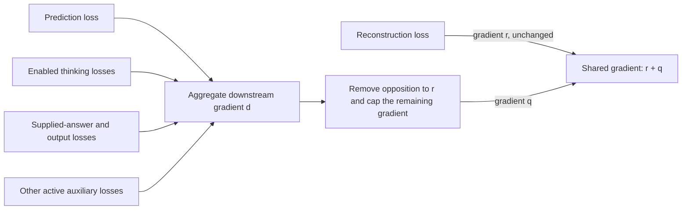

# Gradient flow across the architecture

Current reference, September 20. The objective is one internal NP/VP
representation that preserves the input **and** is informative for prediction
and answers. Reconstruction constrains fidelity; prediction and answer error
help choose among representations that reconstruct well. Separate modules do
not imply detached inputs. This is the decided contract in
[integrated specification §8.4](plans/2026-09-15-next-sentence-as-the-production-objective.md#84-joint-representation-learning-and-gradient-balance).

Reconstruction's surface loss scores each word's bytes through its first NUL
terminator (`0`), using the existing 256-byte alphabet. This distinguishes a
word from a longer candidate with the same prefix. Bytes after NUL are ignored,
as required by the [token-buffer contract](../bin/Spaces.py). Targets and candidate
spellings remain detached. Input percept IDs expand to full byte targets at
eager staging so a promoted whole word or prefix cannot disappear from the
objective ([target staging](../bin/Models.py),
[byte objective](../bin/Models.py)).
The scorer also has a uniform fallback for an unknown spelling. That fallback
distributes probability over these same 256 bytes; it is not another byte value.

The tied reconstruction implementation passes its recorded verification; the
thought-operator catalogue is now the production grammar interface, while
residual credit, learned utility, and the remaining end-to-end gates are still
open. The table below distinguishes executable paths from those remaining
requirements. See the [implementation order](plans/2026-09-15-next-sentence-as-the-production-objective.md#10-consolidated-implementation-and-verification-order)
and [reconstruction measurements](benchmarks/2026-09-16-tied-input-reconstruction.md).

## The four pieces and their losses

The intended execution order is input understanding and reconstruction,
reasoning over that understanding and LTM, then surface generation. Expectation
uses preceding context to predict the arriving input; the observed input then
supplies its target. Thinking adds queries and subgoals to prediction, with
explicit credit for whether that work helped. It is not established by merely
running the predictor without another input. These phase and credit requirements
are specified in [§8.6](plans/2026-09-15-next-sentence-as-the-production-objective.md#86-understanding-prediction-and-response-production)
and [§8.10](plans/2026-09-15-next-sentence-as-the-production-objective.md#810-queries-as-tools-at-inter-sentence-prediction-decided).

| Piece / objective | Directly trained computation | Reach into representation | Stops and current limits |
|---|---|---|---|
| **Representation and reconstruction:** weighted input surface error | Recovered word ideas, the selected compose operators' tied reverse calculations, and the live forward encodings they consume | This is the reconstruction reference `R` on shared weights. It retains its gradient unchanged. | The identified input derivation is fixed during reverse traversal; retained constituent references, dictionary snapshots and byte targets are detached. No gradient through an integer rule or dictionary index. [Reconstruction](../bin/Models.py), [snapshot](../bin/Models.py), [owned byte objective](../bin/Models.py). |
| **Prediction:** occupied-role MSE plus role-presence BCE | The sentence predictor and its live preceding NP1/VP/NP2 context | May train the encoder of a preceding sentence still in the **same optimizer step**. It shares the downstream budget below. | The arriving sentence's encoding is a detached target. Durable context and previous-step encodings are detached. A retained estimate/observation pair is also fully detached: its roles, confidence, provenance and reconstructed residual are evidence, never a delayed autograd route. A cold start has no predicted target. [Prediction and observation](../bin/Layers.py), [retention](ExpectationRetention.md), [graph lifetime](../bin/Layers.py). |
| **Thinking:** one selected-controller policy objective | `SelectedThoughtChooser` receives REINFORCE credit from each eligible row's later supplied-answer loss plus `0.01 * actual_shared_work`, including child execution and reader costs, with one EMA baseline | Full-width root and active role payloads remain live into the chooser; candidate roles are detached. Log probability trains the chooser and the live payloads it consumes. A selected truth meaning supplies its live role triples to the answer; prediction, set and code payloads are checked detached values. | Choices, native references, hard evidence and rewards have no ordinary derivative. `thinkingLossWeight` and `whatThinkingPolicyWeight` migrate to this same term once; the old heads are deleted. Residual query credit remains item 2. [Controller and credit](SelectedMeaning.md), [required residual credit](plans/2026-09-15-next-sentence-as-the-production-objective.md#810-queries-as-tools-at-inter-sentence-prediction-decided). |
| **Output:** supplied-answer error and, when enabled, output-action policy loss | The answer path, conditioner and synthesis heads; sampled generation choices receive policy credit | Differentiable use of a live question/answer representation can train its upstream producer, under the same shared budget. Independent output heads retain their ordinary gradients. | Desired answers are supervision, not generation inputs. Output policy reward is detached: credit flows through action log probabilities, not through the reward calculation. The input parse is not a gold answer parse. [Answer resolution](../bin/Models.py), [head ownership](../bin/Models.py), [action credit](../bin/Models.py). |

An optional annotated grammar curriculum adds `grammarLessonWeight *
(compose_loss + generate_loss)` to this same trained total after student output.
Compose teacher leaves and candidate values detach; choice cross entropy trains
the existing grammar MLP, including its copy-neighbor inputs. Generate teacher
roles/children detach; choice cross entropy trains the existing generate policy,
and child-value error trains the selected operator's numerical generator.
`surface` currently shares its marker map between composition and generation,
so the normal reconstruction-priority budget also applies to that map. The
in-operator marker prior and generate policy are answer-only computation.
No annotation chooses student input/output actions or writes accepted facts.
The optional curriculum is supervised structural learning, not evidence of
unsupervised language acquisition. [Lessons](../bin/GrammarLessons.py),
[configuration](../data/MM_grammar_wording.xml).

An answer loss trains the sentence predictor only if the answer computation
actually consumes a live prediction. The gradient balancer permits that path;
it does not create it. The current resolver selects current/recalled
representations before generation. `resolveAnswer` prepares the owned
derivation; `reverseOutput` consumes it without repeating reasoning. The owned
conceptual clone preserves its input gradient. The levelled controller and typed answer adapters are implemented; learning
residual query utility remains separate work.
[Prepared boundary](../bin/Models.py),
[realization](../bin/Models.py), [owned clone](../bin/Output.py),
[required handoffs](plans/2026-09-15-next-sentence-as-the-production-objective.md#86-understanding-prediction-and-response-production).

The forward grammar's hard selection already uses a straight-through
approximation: its forward value is the selected operation, while backward
uses a soft surrogate. Replaying the recorded integer derivation during tied
reconstruction does **not** introduce another estimator. A bounded lossy inverse
can differentiate its candidate scores and selected operator parameters while
keeping candidate retrieval and reference values detached.
[Forward selection](../bin/Language.py),
[unary selection](../bin/Language.py),
[tied binary reverse](../bin/Language.py).

During sampled generation, the policy also reads a **detached top idea**.
Thus the current output-action policy loss trains the choice head, while the
separate differentiable answer-value path can send balanced credit upstream.
Detaching the reward and detaching the policy's input are distinct boundaries.
[Sampled policy input](../bin/Models.py),
[detached action reward](../bin/Models.py).

The final answer readout is an independent output head. New instances use the
rectangular factors of the same LDU forward projection, retaining every
generated percept coordinate while avoiding an input-width square allocation.
Answer-value gradients still pass through that projection into its live input;
its parameters receive the ordinary output-head gradient. It supplies no input
reconstruction inverse. Legacy checkpoint adapters retain their original
layout. [Readout](../bin/Layers.py),
[construction](../bin/Spaces.py),
[checkpoint restoration](../bin/Models.py),
[optimizer ownership](../bin/Models.py).

### Current configuration matters

The primary blend is `(1 - reconstructionScale) * answerLoss +
reconstructionScale * inputLoss`. BasicModel's FineWeb configuration uses
`reconstructionScale=1.0` and `interLossWeight=0.1`; expectation is added
separately. The supplied-answer benchmark uses `reconstructionScale=0.5`.
Adding labels to a configuration whose primary answer weight is zero would
not by itself train that answer objective.
[Blend](../bin/Layers.py), [FineWeb weights](../data/BasicModel.xml#L168),
[prediction weight](../data/BasicModel.xml#L195),
[supervised weights](../data/BasicModel_answers_tied_benchmark.xml#L51).

`answerLossWeight` is retired and nonzero values are rejected.
`selectedThoughtPolicyWeight` and `outputPolicyWeight` default to zero. Old `thinkingLossWeight`
and `whatThinkingPolicyWeight` values migrate by maximum into the selected
weight; they do not enable separate objectives or controllers. A permitted credit path
is therefore not evidence that a particular configuration trains it. The
residual-based query policy remains an open migration, rather than an implicit
consequence of enabling expectation.
[Legacy policy defaults](../bin/Models.py),
[output policy default](../bin/Models.py),
[required query credit](plans/2026-09-15-next-sentence-as-the-production-objective.md#810-queries-as-tools-at-inter-sentence-prediction-decided).

## Where the gradients meet

`runBatch` assembles the actual trained total explicitly. It partitions that
total into weighted reconstruction `R` and **all remaining objectives together**
`D = total - R`: prediction, supplied-answer error, thinking, output policy and
other active auxiliaries. Pipeline reconstruction terms and truth modulation
must also be reflected in `R`. Merely calling `record_loss` trains nothing.
[Primary partition](../bin/Models.py),
[auxiliary partition](../bin/Models.py),
[truth modulation](../bin/Models.py),
[backward entry](../bin/Models.py),
[reporting registry](../bin/Models.py).

For a shared encoder or grammar weight, the enabled losses meet as follows.
Independent heads receive their ordinary total-loss gradient instead
([gradient assembly](../bin/Optimizer.py)).



With `reconstructionPriority=true`, the following rule applies independently
to every protected parameter tensor. Let:

- `r = grad(R)` and `d = grad(D)` at the same parameter version;
- `a = r` when `abs(R) > reconstructionLossTolerance`, otherwise zero;
- `alpha = outputGradientRatio`, default `0.5`, with `0 <= alpha < 1`.

First remove only the part of `d` that opposes reconstruction:

```text
q = d - min(0, dot(d, a)) / dot(a, a) * a    if a is nonzero
q = d                                       otherwise
```

Then calculate `budget = alpha * (norm(a) + norm(q))`, using `q` **before**
this cap. Shrink `q` only if its norm exceeds that budget. The final shared
gradient is `r + q`. Independent heads receive their ordinary total-loss
gradients. Missing reconstruction gradient is a zero reference; at zero
reference the default retains half of `d`, allowing an already faithful
representation to become more informative. Setting the ratio to zero stops
downstream credit on protected weights while independent heads can learn.
[Exact numerical implementation](../bin/Optimizer.py).

The fidelity tolerance defaults to `1e-8` and compares the unscaled, weighted
loss. It only disables the projection reference; it does not discard `r`.
AMP scales both branches equally after this comparison. Backward clears the
protected downstream gradients before accumulating reconstruction, avoiding
the numerical cancellation that subtracting a very large downstream gradient
from a total gradient could cause. There is one later optimizer step.
[Loss scaling and tolerance](../bin/Models.py),
[separate accumulation](../bin/Optimizer.py),
[optimizer step](../bin/Models.py).

The separate reconstruction compiler preserves saved buffers across these
gradient reads. It disables donation during compilation and normalizes the
disabled metadata used by this PyTorch build, so an ordinary first backward
cannot make later retained reads unsafe. The global compiler setting remains
unchanged ([compiled reconstruction](../bin/Models.py)).

### What the rule guarantees, and what it does not

At an active reference, the retained downstream contribution has no negative
projection on that parameter tensor's reconstruction gradient. Useful aligned
or orthogonal contributions can survive. **Prediction, thinking and output
are first aggregated into `d`; the rule does not prevent them from cancelling
one another.** Nor does this local gradient condition guarantee monotonic
reconstruction loss after Adam's momentum, adaptive scaling and a finite step.
Measure reconstruction, prediction and answer quality together; gradient norms
alone do not establish useful learning. [Projection](../bin/Optimizer.py),
[joint partition](../bin/Models.py),
[learning acceptance](plans/2026-09-15-next-sentence-as-the-production-objective.md#84-joint-representation-learning-and-gradient-balance).

## Parameter ownership and non-gradient updates

Protection is based on actual optimizer ownership: PartSpace, WholeSpace and
ConceptualSpace representation parameters, plus grammar transforms registered
on SymbolSpace, deduplicated by tensor address (`data_ptr`). Independent synthesis heads
are excluded. Simply adding an `nn.Module` attribute does not put its parameters
in an optimizer; the explicit space lists and adopted synthesis modules decide
what is stepped. Catalog separation must test parameter identity and live input
gradients separately. [Protected set](../bin/Models.py),
[optimizer assembly](../bin/Models.py),
[catalog contract](plans/2026-09-15-next-sentence-as-the-production-objective.md#89-separate-comprehension-and-generation-catalogs-decided).

This map describes autograd credit. Context-rotation dictionaries that are
non-gradient buffers retain their own update ownership. Sparse concept-readout
L1 uses a separate proximal update in the optimizer; its detached reporting
cost is not differentiated again through the balance rule. These mechanisms
must not be counted as evidence that prediction error reached an encoder
parameter. [Ownership exclusions](../bin/Models.py),
[single proximal update](../bin/Models.py).

Embedding updates also depend on optimizer membership. With `trainEmbedding`
set to `NONE`, `CBOW` or `SBOW`, embedding parameters are excluded from the
main optimizer even if a lookup has a gradient. An enabled separate embedding
update has its own objective and is outside this main-loss projection rule.
`JOINT` adds its embedding objective to the main trained total instead.
[Mode selection](../bin/Models.py),
[optimizer filter](../bin/Models.py),
[separate update](../bin/Models.py),
[joint loss](../bin/Models.py).

## Evidence to keep with each migration

Check actual optimizer membership, nonzero gradients, and parameter changes
separately. Test source-versus-target reach, detached history across steps,
aligned/opposing/orthogonal and zero-reference cases, sparse gradients, and
one aggregate downstream allowance on batches without supplied answers.
Then measure held-out fidelity and predictive/answer quality with the declared
gradient settings. Existing mathematical checks are in
[test_reconstruction_priority.py](../test/test_reconstruction_priority.py);
the full migration's required learning evidence is in
[§8.4](plans/2026-09-15-next-sentence-as-the-production-objective.md#84-joint-representation-learning-and-gradient-balance).

## Fact evidence and thought values

`ConceptualMeaning` clones retain the current computation's gradient. Durable
fact/observation/estimate writes detach it. A retained expectation pair derives
its residual from those two detached rows and detached confidence, so neither a
later lookup nor residual-guided work can reopen the prediction graph. Generic
LTM recurrence and attention exclude forecast rows; the explicit pair reader is
also detached. `Exist` matching, eligibility checks,
thresholds and support aggregation use hard reads and scalar evidence; they
provide no ordinary derivative through selected facts. This migration adds
no learned parameter or loss. Thought selection still requires its separately
declared policy credit; storing an estimate does not supply an observation or
a new training target. See [Expectation retention](ExpectationRetention.md)
and [Existence evidence](ExistenceEvidence.md).
[Live value](../bin/Meaning.py),
[detached write](../bin/Layers.py),
[hard lookup](../bin/reasoning.py).

## Conceptual-taxonomy reads

The canonical `part` thought operator traverses native concept references and returns hard structural
evidence with provenance. There is no derivative through reference or path
selection, and no added trainable parameter. The legacy operation head and its trace-cloning loss are deleted. Native
paths supply checked evidence, not training labels for another selector. Continuous semantic
payloads and discrete policy decisions retain the architecture-wide credit
contract above. [Taxonomy queries](TaxonomyQueries.md) documents the limits.
[Evidence](../bin/reasoning.py), [normal controller](SelectedMeaning.md).

## Thought and grammatical payload boundaries

The checked thought registry adds no learned parameter or trained loss. The
model's `<thought>` allow-list is detached configuration metadata: choosing
membership there neither supplies a gradient nor lets an unselected structural
face execute. Pure VP/operand formation keeps live structural operands on their configured compose/generate
gradient paths; concept and occurrence IDs remain addresses, never numeric
semantic features. Thought contexts, primed snapshots, native/taxonomy/LTM
reader data, and `ThoughtResult` are detached hard-boundary data. Hard
taxonomy/fact matching and discrete interface choice have no ordinary
derivative. `arma` returns a detached typed prediction result without changing
the pending external prediction. Durable occurrence reads return detached
descriptions; the later episode controller must provide a live read from its
existing owner to retain within-episode credit.
[Formation](../bin/Queries.py),
[durable read](../bin/Queries.py),
[prediction](../bin/Queries.py).

`LanguageSpace.program_meaning()` preserves the same split for a recovered
direct relation, including an unreduced lexical `[NP1, VP, NP2]`: the native
VP reference is a discrete grammar/provenance address, and its arbitrary
surface leaf is not an operand value. The two signed noun leaves are installed
as the live `I1`/`I2` role tensors, so a selected truth answer can still send
ordinary output credit to them. Any gradient through the canonical native VP
follows its declared registry/structural path, never a numeric ID or the
unreduced middle surface tensor. The eager forward maps the PartSpace-owned
segmented surface to a grammar-form string (for example `whole`) keyed by the
retained WORD row. Capture gathers that resolved classification without another
text lookup; the row is only a dispatch key. The detached form selects a
declared converse permutation but has no gradient, and the program retains no
raw spelling. The direct-leaf probe checks this separation.

The same rule holds for a recovered direct unary `concept` operation such as
`quantize`: its registered VP is grammar metadata while the one signed selected
leaf is installed as the live occupied operand role, so ordinary selected
controller credit can reach that leaf. A `description` or reference unary form
does not receive a fabricated occurrence from a leaf or concept ID, and thus
has no invented reader or gradient route. The direct-unary boundary is only
formation; execution, LTM reads, code results, and retained `ThoughtResult`
evidence remain detached at their existing boundaries.

Future policy credit and continuous feedback into representation remain subject
to the aggregate downstream rule above. These API checks do not establish
trained thought usefulness. See [Thought-operator contracts](QueryContracts.md).

## Live ordinary episode history

An ordinary thought record clones its complete `ConceptualMeaning` without a
detach while its episode is live. A selected `thought` occurrence operator reads
that same live value; durable LTM reads remain detached. At the optimizer
boundary, an explicit finished episode detaches retained values, including
legacy prompt and grammar-trace tensors. Structural checkpoint sidecars save
detached copies, so restoring history cannot reconnect an old graph. The normal
controller's explicit policy term consumes live root/active role payloads
and detached candidate payloads; hard evidence and work accounting remain
nondifferentiable.
In contrast, an actual checked `ThoughtResult` saved on an executed, returned,
or finished record is detached immediately, including nested dataclass evidence
such as `MeaningExpectation`: its request, tensors and evidence cannot send a
reader, predictor, or output gradient through ordinary history or its
checkpoint sidecar. A nested `ConceptualMeaning` result payload restores as
that same detached typed meaning, never as a live reader value or an untyped
role mapping. Residual attribution and learned utility remain open. See
[ordinary thought history](ThoughtHistory.md).

## Thought phase permission

Sentence masking and completed-row thought permission add no parameter, loss, or
tensor detachment. They constrain when a checked thought may read or execute;
live prepared meanings retain their current-step gradient routes. A hard
controller choice remains nondifferentiable and needs explicit policy credit.
Compiled numerical execution keeps host phase bookkeeping outside the graph,
while thought tracing fails explicitly. See [Query phases](QueryPhases.md).

## Shared selected-thought work

QueryWorkBudget is host integer accounting only: it adds no tensor, parameter,
loss, optimizer group, checkpoint field, or derivative. Charging before a
native payload, live thought occurrence, fact row, taxonomy edge, or predictor
read does not detach that reader's existing value. Durable LTM descriptions
remain detached through their established owner boundary, while live
thought-occurrence meanings retain their episode route until the explicit
credit boundary. Discrete reference matching and structural traversal remain
hard choices, so the meter supplies neither policy credit nor learned utility.
The normal controller now owns final cost recording and its supplied-answer
policy reward. The host meter itself still supplies no derivative, residual
attribution or learned utility. See [shared query work](QueryWork.md).

## Retained grammatical occurrences

Durable `read_structure()` views are detached copies. Discovering
thought-owned LTM roots reads only typed addresses and metadata, so it does not
detach a live episode meaning. Normal TruthSet replacement passes those roots
before compaction; existing live episode credit remains available until its
explicit optimizer boundary. Retention introduces neither a learned loss nor
an optimizer-owned parameter.
[Roots](../bin/Thoughts.py),
[replacement](../bin/Models.py), and
[durable reads](../bin/Layers.py).
See [nested retention](NestedRetention.md).

## Grammar-owned linguistic alignment

Natural word → operator associations must train compose/generate. The separate
codec, its supervision API and loss are removed. The old codec test is not
accepted language-learning evidence. The architecture/wiring increment does not
complete item 1: its working natural-wording gate remains open. There is no replacement
auxiliary interpreter or decoder loss.

The compose MLP's binary `operand_order` projection adds signed left/right
concept and role differences to its existing first hidden layer. Ordinary
reconstruction and answer derivatives train it with the other chooser weights;
the detached local `forwardGrammarWeight` objective, when enabled, also uses
that same scorer. There is no additional objective. It joins SymbolSpace's
explicit optimizer owner once. Old checkpoints initialize it to zero with
fresh optimizer state, while keeping existing weights and named moments.

BasicModel now enables the declared generate walk and supplied-answer action
credit (`outputInLoop=true`, `outputPolicyWeight=1.0`). The existing gradient
contract is unchanged: desired answers are consulted after generation, policy
rewards/features detach, and missing supervision gives no policy update.

The thought MLP's metadata encoding has no learned parameters. Its bounded
attention uses a live active query and detached visible memory, so policy
credit can reach the query and chooser but not recalled records. Native
references are alpha-renamed categorical metadata. A discarded old context
schema also discards its optimizer moments. See [SelectedMeaning](SelectedMeaning.md).
