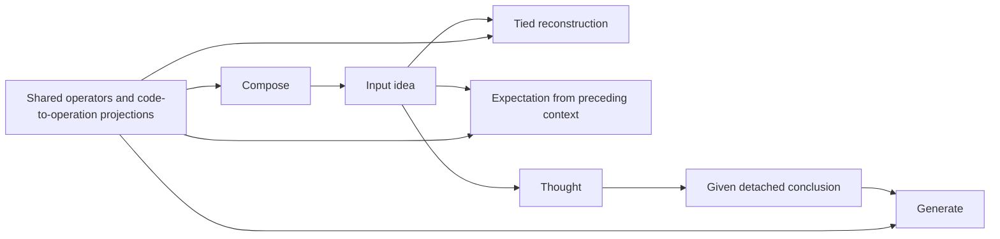

# Gradient flow across the architecture

Current contract, September 21: each objective differentiates its own
computation. Prepared-answer output receives a **given concluded idea**, so its error stops at
that state boundary. Reconstruction, expectation and generation still share
operator parameters. The former global reconstruction-priority projection is
removed, including its configuration and optimizer helpers. This implements
[the superseding §8.4 decision](plans/2026-09-15-next-sentence-as-the-production-objective.md#84-gradient-boundaries-and-learning-evidence).

## State paths and shared parameters

The output state cut below applies to the prepared-answer path
(`answerSynthesis=true`, including production). The direct supervised head
still differentiates its entire input state. Configurations combining
reconstruction with supplied outputs and `answerSynthesis=false` warn at
configuration and on first use if the data is supplied later. This warning
makes that boundary explicit; it does not claim the direct head is factored.

| Objective | Differentiable path | Given or detached values |
|---|---|---|
| Reconstruction | Compose, the recorded derivation's tied inverse, recovered words and byte scoring | Rule/reference addresses, retained constituent witnesses, candidate spellings, targets and dictionary snapshots |
| Expectation | Predictor and preceding ideas still live in the current optimizer step | Arriving target, previous-step context, durable observation/estimate records |
| Output matching | Generate, its numerical operators, conceptual conditioner, tied reverse chain and output readout | Concluded idea, answer symbol, question-conditioning state and named conceptual/perceptual context |
| Thought policy | The selected controller's chooser through explicit log-probability credit | Root, active and candidate meanings; attended memory; evidence, reward and work meter |
| Generate policy | Generate chooser through supplied-answer action credit | Top-idea features and the reward; no input parse used as an answer teacher |

`resolveAnswer()` prepares an owned `AnswerDerivation`; `reverseOutput()`
consumes it without repeating resolution. Ownership and gradient permission
are separate: an owned clone can remain live for reconstruction/expectation,
but generation detaches it **before** applying its trainable conditioner.
Both the indexed grammar walk and the dense synthesis path enforce this cut.
The named contextual operands detach as well. Consequently, an answer error
cannot train a predictor or composer through the concluded-state path.
It can update an operator that is used again by generation.
[Implementation](../bin/Models.py), [owned values](../bin/Output.py).

The generation catalogue snapshots the declared interfaces in both output
modes. `outputInLoop` controls its learned walk chooser, not the existence of
the catalogue. Ordinary output inverse dispatch enters a model-local scope
and resolves only declared generation interfaces; input reconstruction retains
its recorded compose dispatch. Both resolve to the same numerical host,
including an existing two-pass natural-fold adapter. Scope restoration covers
nested calls and exceptions. No operator is copied, adopted a second time by
the optimizer, or given a new checkpoint key.
Default natural-fold interfaces are included only where that space has an
actual host. An inactive space's declaration neither creates a walk action
nor borrows a differently shaped fold from another space.

Chooser weights and Adam moments still migrate by rule meaning when actions
move, disappear or are introduced. New actions keep their initialized weights
and zero moments. Shared numerical maps keep their existing host names and
moments. The catalogue adds no numerical-state migration or independent loss.
[Catalogue and integration checks](../test/test_generation_catalog.py),
[chooser migration checks](../test/test_output_walk.py).

Ideas are composed-space values and need not be individual codebook atoms.
Detaching an idea does not quantize it, discard its role structure, or invent a
free answer vector. Integer concept/occurrence IDs remain addresses rather
than semantic magnitudes. The full NP1/VP/NP2 payload and mask survive.

The forward grammar's hard choice uses its existing straight-through
surrogate. Replaying a recorded integer derivation adds no new estimator.
A bounded inverse differentiates selected operator uses and candidate scores,
while candidate retrieval remains detached. The output readout is an
independent head; its gradient remains live into its generated percept input,
which is already downstream of the conclusion cut.

## Trained total and diagnostic objectives

`runBatch` constructs the actual sum explicitly. `record_loss` reports a cost;
it does not train it. The primary weights remain
`reconstructionScale * inputLoss + (1 - reconstructionScale) * answerLoss`.
Expectation and enabled auxiliary objectives have their own configured
weights. There is one ordinary backward and one optimizer step. AMP scales
that same sum. No global projection, downstream norm allowance, or hidden
second backward replaces shared gradients.

For diagnostics, the same graph carries three weighted branches:

- Reconstruction includes the primary input loss, tied reverse loss and
  active reconstruction auxiliaries, with their actual weights.
- Output includes the supplied-answer loss, enabled generate action credit,
  and the generate component of an annotated grammar lesson.
- Expectation includes enabled ARMA, inter-sentence and contrastive terms.

The grammar curriculum's compose component remains its own supervised
objective; it is not renamed reconstruction or output to manufacture overlap.
Grammar lessons train the existing compose/generate policies and operators.
There is no external interpreter or decoder. The bounded natural-wording gate
for item 1 is complete; it is supervised language evidence, not proof of
unsupervised language acquisition or useful learned questioning.
[Lessons](../bin/GrammarLessons.py), [wording evidence](Testing.md#working-grammar-wording-gate-september-20).

Truth-based contextual scaling is detached and applied equally to the total
and diagnostic branches. Otherwise answer loss multiplied by a live context
score would reopen the state boundary. Additive truth/balance costs remain
separate auxiliary objectives. Sparse concept-readout L1 is a detached
reporting cost and one proximal optimizer update, not duplicate autograd loss.

## Per-operator agreement

`branchDiagnosticsEvery` samples before backward, at one parameter version.
Zero disables it; BasicModel sets 100 and the supplied-answer tied benchmark
sets 1. The existing state-branch report remains
available; the run log also emits `[operator-gradients]` JSON. Each named
shared operator reports weighted gradient norms, the cosines of reconstruction
with output and expectation, and `output_reconstruction_norm_ratio` /
`expectation_reconstruction_norm_ratio`. Each ratio is the other objective's
norm divided by reconstruction's norm: 2,400 means 2,400 times larger, even
when the gradients point in the same direction. A zero reconstruction norm
gives a null ratio; a zero other norm with nonzero reconstruction gives zero.
[Diagnostic implementation](../bin/GradientDiagnostics.py),
[run harness](../bin/Models.py).

Names come from the actual grammar registry and registered parameter owners.
Aliases/tied parameters are counted once, and only optimizer-owned parameters
are differentiated. Independent synthesis heads are excluded. A missing or
zero gradient has a null cosine, not agreement. Sparse operator comparisons
use touched rows without allocating a dense capacity slab. Stable norm
calculation handles large finite gradients. Inspection leaves `.grad` and
parameter values unchanged and preserves the graph for the normal backward.

Three measured negative observations name persistent opposition on that
operator. A missing or zero gradient leaves the streak unchanged; a measured
nonnegative cosine resets it. The integrated checkpoint retains the streak.
Diagnostic failures warn without aborting training.
This is evidence to examine, never automatic clipping or projection. No
operator-specific guard is installed by this change. A few diagnostic batches
do not demonstrate persistent incompatibility or useful learning.

**Codes by distribution, maps by the objectives** (plan §8.4 point 2).
The 11 canonical configurations changed by `7c2fa5a` again set
`conceptualContextLearningRate=0.01`. Their shared concept dictionary is a
persistent non-grad buffer, updated only by the existing sentence-local
unit-sphere rotation reducer. No objective gradient reaches those code
positions. Objectives train the operators and code-to-operation projections;
the unit atoms preserve the magnitude convention of their inner products.
Codebooks are excluded from the operator diagnostic, including its fallback
parameter names. The fixed-seed reconstruction comparison is recorded in
[Testing](Testing.md). Situation context and its three proposed XML variables
belong to two-truths §3.5 and are not implemented here.

## Thought, memory and graph lifetime

Thought faces and hard native/taxonomy/LTM reads are parameter-free. Checked
`ThoughtResult` payloads, including selected truth effects, detach immediately.
Set members, code results and prediction effects cannot reopen their readers'
graphs through output. The chooser observes detached state and learns only from
its explicit policy objective; its reward and actual shared-work charge are
also detached. Residual-based query credit is implemented; its expectation
learning gates remain in countdown item 9. Held-out causal utility remains
unproven under item 8.
[Controller](SelectedMeaning.md), [thought contracts](QueryContracts.md).

Ordinary episode history may retain a composed request while that episode is
live. It supplies no answer-state derivative after this cut. Finished episodes
release their retained graphs at the optimizer boundary. Durable LTM writes
and checkpoint sidecars always detach. Restoring an estimate/observation pair
restores evidence, not a delayed predictor graph. Targets, other streams and
unseen future sentences never become current-step expectation context.
[History](ThoughtHistory.md), [expectation retention](ExpectationRetention.md).

Query phase masks, reference matching, taxonomy traversal, retention/compaction
and `QueryWorkBudget` are hard bookkeeping. None adds a parameter, gradient or
learning objective. Discrete retrieval needs explicit policy credit if it is
to learn. Measured work and semantic correctness alone do not establish learned
utility.

## Verification and retired checks

[Boundary tests](../test/test_prepared_answer_boundary.py) check zero output
state credit and nonzero credit on shared generation operators for both output
paths. [Factorization tests](../test/test_gradient_factorization.py) check
weighted cosine, zero/missing gradients, sparse and large finite gradients,
policy/effect detachment, stale configuration rejection and normal-batch logging.
[Joint-objective tests](../test/test_joint_objectives.py) retain actual packed
expectation learning, source-encoder reach, detached previous-step context,
optimizer ownership, independent heads, ties, sparse updates, AMP and one step.

The old projection-only algebra and tolerance/ratio validation cases are
retired with the implementation. Their still-applicable numerical and ownership
coverage is preserved in the two files above. An invertible-family learning
probe still checks that prediction can improve an exactly reconstructable
representation. Full source-matched receipts and explicit test dispositions
belong in [Testing](Testing.md).

The preserved September 17 generation candidate's independently trained
copies and reconstruction-priority budget assertions are superseded by §8.4.
Its catalogue, alias, dispatch, checkpoint and supervised-output checks are
rebased onto shared ownership. The ordinary native fixture selects no shared
numerical map and trains its dedicated conditioner; the native output walk
trains shared `lift` and `lower` maps from supplied answers. Both cut the live
conclusion derivative. These are one-step mechanism checks, not an output
learning gate. [Item 11 evidence and probe dispositions](benchmarks/2026-09-21-item11/README.md).

## Expectation at the seal (September 21, item 2)

Compose has no prediction input. The signed image and the observation produce
`c = o - g*(1-m)*k*e` as detached chooser evidence. The predictor separately
minimizes **all-role** squared error plus presence BCE against detached `o`;
empty roles have a zero target, not a zero residual. Its gradients are identical
at gains zero and one. Neither this discrepancy nor a conceived norm trains
the fixed gain, grammatical object mask, or reading attention.

Optional `expectationPolicyWeight` credit replays frozen action features through
the same thought chooser. Its return is negative prediction error and actual
work, with an independent residual EMA baseline; there is no supplied answer.
It joins the explicit trained total and the expectation diagnostic branch.
A pending estimate survives a parameter update as detached evidence; credit
recomputes the current predictor/chooser instead of backpropagating an old
graph. The capped importance ratio and its bias are documented in
[ExpectationRetention](ExpectationRetention.md#residual-credit-on-the-existing-controller).
These gradient mechanisms do not prove useful anticipation or reasoning.
