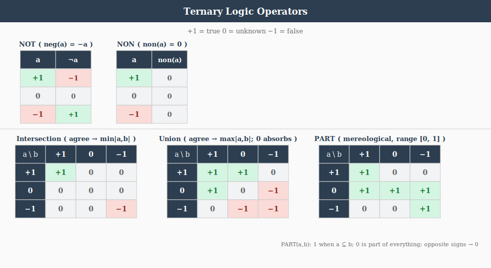
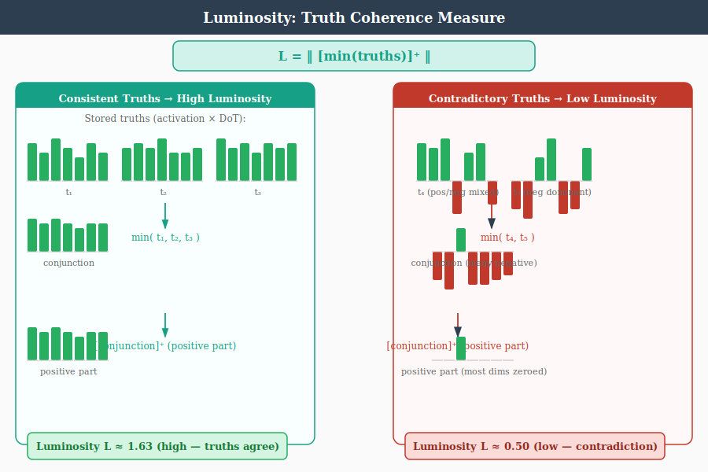

# Logic

## Overview

This document defines the logic system at two levels:

1. **Subsymbolic (vector / field level)** -- geometry in ConceptualSpace
2. **Symbolic (scalar level in [-1,1])** -- order + polarity in SymbolicSpace
3. **Rationality** -- propositional truth store built on top of both

The executable implementations of the subsymbolic and symbolic operators are
the `Method` subclasses documented in Language.md Section  Methods.

---

## 1. Subsymbolic Layer

Objects:
- Vector sets: (B, N, D)
- Interpreted as RBF / luminosity fields

### Operators

- **Union**:
  Combine sets
  ```
  union(A, B) = concat(A, B)
  ```

- **Intersection**:
  Co-supported regions (RBF product / merge)

- **Negation (affirming)**:
  ```
  neg(x) = -x
  ```
  Antipodal opposition on hypersphere

- **Non (non-affirming negation)**:
  `Basis.non()` -- bitonic: returns zero (complete withdrawal); monotonic:
  `relu(x - threshold)` with a learnable threshold parameter.

- **Parthood** (fundamental):
  `Basis.part()` -- clipped cosine projection in $[0, 1]$:
  $$
  \operatorname{part}(x, y) = \frac{\max(0,\; x \cdot y)}{\lVert x \rVert \cdot \lVert y \rVert}
  $$
  Satisfies Boole's contrapositive $\operatorname{part}(x, y) = \operatorname{part}(-y, -x)$
  trivially (dot product and norms are both sign-invariant under joint
  negation). The full mereological suite (`whole`, `equal`, `overlap`,
  `underlap`, `boundary`) composes through `part`.

---

## 2. Symbolization

Map vectors $\rightarrow$ scalar truth strength

For $X \in (B, N, D)$:

$$
s(X) = 2 \cdot \mathrm{mean}(\lVert x_i \rVert) - 1
$$

Range: [-1, 1]

Interpretation:
- +1 $\rightarrow$ strong presence
-  0 $\rightarrow$ neutral
- -1 $\rightarrow$ absence

---

## 3. Symbolic Layer (Scalars in [-1,1])

`Basis` supports two modes: **monotonic** (plain min/max, used by
SymbolicSpace where `monotonic=True`) and **bitonic** (sign-aware,
the default).  The monotonic forms are listed here; the bitonic forms
(RadMin, RadMax) are in Section 7 Radial Operators.

Let $a, b \in [-1,1]$.

### Negation (affirming)
$$
\operatorname{neg}(a) = -a
$$

### Non (non-affirming)
Bitonic: $\operatorname{non}(a) = 0$.  Monotonic (learnable threshold $\tau$):
$\operatorname{non}(a) = \operatorname{relu}(a - \tau)$.

### Union (monotonic)
$$
a \cup b = \max(a, b)
$$

### Intersection (monotonic)
$$
a \cap b = \min(a, b)
$$

### Parthood as Projection

Parthood is the **fundamental mereological operation**.  For two
concepts $A, B \in \mathbb{R}^D$:

$$
\operatorname{part}(A, B) = \frac{\max(0,\; A \cdot B)}{\lVert A \rVert \cdot \lVert B \rVert}
$$

This clipped cosine projection is in $[0, 1]$.  It satisfies Boole's
contrapositive $\operatorname{part}(A, B) = \operatorname{part}(-B, -A)$
trivially because $(-B) \cdot (-A) = A \cdot B$ and norms are
sign-invariant.

The full mereological suite composes through `part`:

| Method              | Formula                                        |
|---------------------|------------------------------------------------|
| `whole(A, B)`       | `part(B, A)`                                   |
| `equal(A, B)`       | `part(A, B) · part(B, A)`                      |
| `overlap(A, B)`     | `0 < equal(A, B) < 1`  (region indicator)      |
| `underlap(A, B)`    | `equal(A, B) == 0`     (region indicator)      |
| `boundary(A, B)`    | <code>&#124;part(A, B) − part(B, A)&#124;</code>  (zero under clipped cosine) |

`equal(A, B) ∈ [0, 1]` partitions into three disjoint regions:

- `equal = 0` → **underlap** (disjoint)
- `0 < equal < 1` → **overlap** (strictly partial)
- `equal = 1` → **identity** (perfect mutual parthood)

Under clipped cosine `part(A, B) = part(B, A)` (cosine is symmetric), so
`equal` reduces to `part²`.  Asymmetric classical subsumption is recovered
**relationally** via figure/ground: compare `part(A, B)` against
`part(A, ¬B)`.  This is what makes Boole's contrapositive hold exactly.

See [Mereology.md](Mereology.md) for the full five-relations reference
and the `ImpenetrableLayer` regularizer that enforces these relations
on the symbol codebook.

For ternary scalar values, the monotonic projection reduces to:

| part(a,b) | **+1** | **0** | **-1** |
|-----------|--------|-------|--------|
| **+1**    | 1      | 1     | 0      |
| **0**     | 1      | 1     | 1      |
| **-1**    | 0      | 1     | 1      |

Zero is vacuously part of everything (empty-set convention); same-sign
values fully contain each other; opposite signs have zero parthood.

---

## 4. Key Insight

- Subsymbolic layer = geometry
- Symbolic layer = order + polarity
- Symbolization = norm projection

This cleanly separates:
- representation (vectors)
- logic (scalars)

---

## 5. Rationality

Rationality is the propositional logic layer.  It is built on the S-tier
grammar rules `part(S, S)` and `equals(S, S)`, which are the two relations
that compose propositions about the world.

### Truth Statements

A **truth statement** is any assertion that the model has meaningfully
processed through the full pipeline (InputSpace $\rightarrow$ ... $\rightarrow$ SymbolicSpace),
producing a symbolic activation vector.  The `TruthLayer` -- owned by
`WordSpace` and reachable as `self.wordSpace.truth_layer` -- stores these
activations **scaled by** the DegreeOfTruth:

$$
\text{stored} = \text{activation} \times \text{degree}
$$

The DegreeOfTruth in $[-1, 1]$ is baked into the stored vector:

| Degree | Stored Vector | Effect |
|--------|--------------|--------|
| +1 | full activation | attractor |
| 0 < d < +1 | scaled activation | weak attractor |
| 0 | zero vector (inert) | prunable |
| -1 < d < 0 | scaled, negated | weak disperser |
| -1 | negated activation | disperser |

### TruthLayer (WordSpace.truth_layer)

`TruthLayer` in `Layers.py` is instantiated by `WordSpace.__init__`
alongside the (now unified) `SyntacticLayer`. `SymbolicSpace.forward`
reads it via `self.wordSpace.truth_layer` and records activations when
`<accumulateTruth>` is set to a value > 0 (the degree of truth, 0..1):

- **record(activation, degree)** -- store `activation * degree`.
- **query(activation)** -- find the closest stored truth by cosine similarity.
- **field(concepts)** -- project all stored truths into ConceptualSpace as a
  scalar field over concept vectors.

### Truth Field

When stored truths are projected into ConceptualSpace via `field()`, they
form a scalar field $f: \mathbb{R}^D \to [-1, 1]$ over concept vectors:

$$
f(c) = \frac{1}{n} \sum_{i=1}^{n} c \cdot t_i
$$

where $t_i = \text{activation}_i \times \text{degree}_i$ is a stored truth
(DoT already baked in) and $c$ is a unit-normalised concept vector.

This field has two kinds of regions:

- **Attractors** ($f \to +1$): concept vectors near truths with high positive
  degree.  These represent regions of conceptual space where stored knowledge
  says "this is true."
- **Dispersers** ($f \to -1$): concept vectors near truths with high negative
  degree.  These represent regions where stored knowledge says "this is false."

### Consonance and Dissonance

Stored truths should satisfy two consistency conditions:

1. **Internal consonance** -- truths should be mutually consistent.  If
   $\text{part}(A, B)$ has degree +1, and $\text{part}(B, C)$ has degree +1,
   then $\text{part}(A, C)$ should not have degree -1.

2. **External consonance** -- incoming statements processed through the pipeline
   should be evaluated against the truth field.  High similarity to a +1 truth
   is consonance; high similarity to a -1 truth is dissonance.

### Propositional Structure

Both parthood and equality are S-tier operations on the bivector
SymbolicSubSpace after the 2026-04-19 C/P/S merge:

- **part(S, S)** -- containment on the bivector symbol subspace.
  "A is part of B." `Basis.part(A, B)` is a clipped cosine projection
  in $[0, 1]$.  The Grammar applies this as `score * B`, scaling the
  whole by the parthood degree.

- **equals(S, S)** -- identity as mutual parthood.  `equalsForward`
  delegates to `Basis.equal` (mutual parthood) on the bivector
  SymbolicSubSpace.  Returns 1 only when the two symbols are parts
  of each other.

Together, `equals` and `part` define a partial order over symbolic
activations.  The truth store captures this order as a database of
grounded propositions.

### Truth Accumulation Pipeline

Truth entries arrive as `(text, DoT)` pairs from the client's TruthSet.
`store_truths()` stages all texts on TheData and runs a standard inference
epoch via `runEpoch(split="runtime")`.  During forward processing,
`SymbolicSpace.forward()` records each raw symbolic activation into the
TruthLayer (degree 1.0).  After the epoch completes, each stored
activation is scaled by its DegreeOfTruth:

$$
t_i = \text{activation}_i \times \text{DoT}_i
$$

This two-phase design (encode all, then scale) ensures all truths are
encoded in the same pipeline context before DoT modulation is applied.

---

## 6. Consistency and Verification

### Internal Consistency (within a TruthSet)

A TruthSet should be internally consonant: its stored truths should not
contradict each other.  The truth field provides a natural test.

Given $n$ stored truths $\{t_i\}$, project them into ConceptualSpace via
`field()`.  For each truth $t_j$, evaluate the field produced by all
*other* truths $\{t_i : i \neq j\}$ at the concept vector underlying
$t_j$.  If the field value is strongly negative, truth $j$ is dissonant
with the rest of the set:

$$
d_j = f_{\setminus j}(c_j) = \frac{1}{n-1} \sum_{i \neq j} c_j \cdot t_i
$$

where $c_j$ is the unit-normalised concept vector for truth $j$.

- $d_j > 0$: truth $j$ is consonant with the set (supported by neighbours)
- $d_j \approx 0$: truth $j$ is independent (orthogonal -- neither supported
  nor contradicted)
- $d_j < 0$: truth $j$ is dissonant (contradicted by neighbours)

This is a leave-one-out consistency check.  It does not require symbolic
logic -- it falls out of the geometry of the stored vectors and the DoT
already baked into them.  A disperser ($\text{DoT} < 0$) near an
attractor ($\text{DoT} > 0$) will naturally produce negative field values,
flagging the contradiction.

### Verification (incoming statement against stored truth)

`verify(statement)` processes an incoming statement through the pipeline
to obtain its symbolic activation $a$, then queries the truth field:

$$
v = f(c_a) = \frac{1}{n} \sum_{i=1}^{n} c_a \cdot t_i
$$

where $c_a$ is the concept vector underlying $a$.

| $v$ | Interpretation |
|-----|---------------|
| $v \to +1$ | strong support -- statement aligns with stored attractors |
| $v \approx 0$ | no opinion -- statement is orthogonal to stored knowledge |
| $v \to -1$ | strong contradiction -- statement aligns with dispersers |

This gives a scalar degree of verification in $[-1, 1]$ without requiring
the incoming statement to exactly match any stored truth.  Cosine
similarity via `wordSpace.truth_layer.query()` can also find the single
closest truth and return its degree, which is useful for point lookups.

### Logical Entailment (augmenting geometry with symbolic closure)

The subsymbolic field checks above detect *geometric* consistency -- truths
that point in contradictory directions in the embedding space.  But they
do not enforce *logical* entailments.  Consider:

- Stored: $\text{part}(A, B)$ with DoT +1
- Stored: $\text{part}(B, C)$ with DoT +1
- The transitive closure $\text{part}(A, C)$ is *entailed* but not stored.

If a statement $\neg\text{part}(A, C)$ arrives, the field check may not
flag it -- $A$ and $C$ could be geometrically distant even though the
chain of parthood connects them.  Geometry captures similarity, not
inference chains.

A symbolic closure layer would address this by operating on the
propositional structure of stored truths:

1. **Extract propositions.** Each stored truth whose activation was
   produced by an S-tier grammar rule (`equals(S,S)` or `part(S,S)`)
   carries relational structure: a relation and two operands.  These
   can be read off the symbolic activation by decomposing it into
   the relation slot and the two argument slots.

2. **Compute closure.** Apply transitivity rules on the extracted
   propositions:
   - $\text{part}(A, B) \wedge \text{part}(B, C) \Rightarrow \text{part}(A, C)$
   - $\text{equals}(A, B) \wedge \text{equals}(B, C) \Rightarrow \text{equals}(A, C)$
   - $\text{equals}(A, B) \wedge \text{part}(A, C) \Rightarrow \text{part}(B, C)$

   Each entailed proposition inherits a DoT from its premises -- the
   minimum (intersection) of the premise DoTs, following the symbolic
   intersection rule $a \cap b = \min(a, b)$.

3. **Inject entailments.** Entailed propositions that are not already
   stored can be synthesised as new symbolic activations (by composing
   the relation and operand embeddings) and recorded in the TruthLayer
   with their derived DoT.

This is worth implementing when the truth store is used for reasoning
(verification, planning) rather than just retrieval.  The geometric
field alone is sufficient for soft consistency checks and nearest-truth
lookups.  The symbolic closure makes the store *deductively closed* --
turning it from a database of assertions into something closer to a
knowledge base with inference.

## 7.

# Radial Operators for Hypersphere Ternary Logic



## Overview

RadMin, RadMax, NOT, and NON are four logical operators defined over a signed magnitude space where truth values range from -1 to +1. The semantic space is a hypersphere with zero at the origin representing **unknown**, +1 representing **true**, and -1 representing **false**.

The operators are designed to respect the geometric structure of this space: sign represents direction of assertion, magnitude represents strength of assertion, and zero represents the absence of assertion.

## Truth Values

| Value | Meaning |
|-------|---------|
| +1    | True (full positive assertion) |
| 0     | Unknown (no assertion) |
| -1    | False (full negative assertion) |

Intermediate values (e.g., +0.5, -0.3) represent partial assertions with varying degrees of confidence.

## Magnitude Ordering

The ordering relation $\subset$ ("is a part of") is defined by magnitude:

> $x \subset y$ iff $|x| < |y|$

This means "closer to zero" is "less than" in the radial sense. Zero is the weakest value; $\pm$1 are the strongest.

---

## Operators

### RadMin (Radial Minimum -- Conjunction / AND)

RadMin is a binary operator representing conjunction. It collapses toward zero on sign disagreement and takes the minimum magnitude on sign agreement.

**Definition:**

- If $\mathrm{sign}(x) \ne \mathrm{sign}(y)$: $\mathrm{RadMin}(x, y) = 0$
- If $\mathrm{sign}(x) = \mathrm{sign}(y)$: $\mathrm{RadMin}(x, y) = \mathrm{sign}(x) \cdot \min(|x|, |y|)$

**Truth Table (Ternary):**

|        | **+1** | **0** | **-1** |
|--------|--------|-------|--------|
| **+1** | +1     | 0     | 0      |
| **0**  | 0      | 0     | 0      |
| **-1** | 0      | 0     | -1     |

**Properties:**
- Commutative: RadMin(x, y) = RadMin(y, x)
- Zero is absorbing: RadMin(x, 0) = 0 for all x
- Anti-diagonal symmetric
- Sign disagreement produces zero (contradiction $\rightarrow$ unknown)

---

### RadMax (Radial Maximum -- Disjunction / OR)

RadMax is a binary operator representing disjunction. It collapses toward zero on sign disagreement and takes the maximum magnitude on sign agreement.

**Definition:**

- If $\mathrm{sign}(x) \ne \mathrm{sign}(y)$: $\mathrm{RadMax}(x, y) = 0$
- If $\mathrm{sign}(x) = \mathrm{sign}(y)$: $\mathrm{RadMax}(x, y) = \mathrm{sign}(x) \cdot \max(|x|, |y|)$
- RadMax(x, 0) = x (zero is transparent / neutral for OR)

**Truth Table (Ternary):**

|        | **+1** | **0** | **-1** |
|--------|--------|-------|--------|
| **+1** | +1     | +1    | 0      |
| **0**  | +1     | 0     | -1     |
| **-1** | 0      | -1    | -1     |

**Properties:**
- Commutative: RadMax(x, y) = RadMax(y, x)
- Zero is transparent: RadMax(x, 0) = x for all x
- Anti-diagonal symmetric
- Sign disagreement produces zero (contradiction $\rightarrow$ unknown)

---

### NOT (Sign-Flipping Negation)

NOT is a unary operator that inverts the sign of the assertion while preserving magnitude.

**Definition:**

> NOT(x) = -x

**Truth Table (Ternary):**

| Input | Output |
|-------|--------|
| +1    | -1     |
| 0     | 0      |
| -1    | +1     |

**Properties:**
- Involutive: NOT(NOT(x)) = x
- Preserves magnitude: |NOT(x)| = |x|
- Zero is a fixed point: NOT(0) = 0

---

### NON (Non-Affirming Negation)

NON is a unary operator that drives any assertion toward zero. It represents the withdrawal of assertion rather than the inversion of assertion.

**Definition:**

> NON(x) = 0 for all x

**Truth Table (Ternary):**

| Input | Output |
|-------|--------|
| +1    | 0      |
| 0     | 0      |
| -1    | 0      |

**Properties:**
- Absorbing: NON(x) = 0 for all x
- Idempotent: NON(NON(x)) = NON(x) = 0
- Semantically distinct from NOT: NON does not assert the opposite; it withdraws assertion entirely

---

## Luminosity



Luminosity measures the coherence of a truth set as a single scalar:

```
luminosity = ||relu(min(truths))||
```

The element-wise min across all stored truth activations computes the
**conjunction** -- the point where all truths agree. `relu` removes
negative dimensions (darkness from conflicting truths), and the L2 norm
gives the brightness.

- **High luminosity**: truths are coherent and mutually reinforcing.
- **Low luminosity**: truths are sparse, contradictory, or incoherent.

Luminosity serves two roles in the model:

1. **Top-down bias**: concept input is scaled by luminosity during each
   conceptual iteration: `concept_input * (1 + truthBiasScale * luminosity)`.
   A coherent truth set amplifies concept formation; an incoherent one
   leaves it unchanged.

2. **Loss modification**: low luminosity increases training loss,
   penalizing irrational propositions. See [Ethics.md](./Ethics.md)
   Section Universality for the full formula.

### Fusion

Fusion is the **mereological least upper bound** of the stored truth
set: the elementwise max over every stored truth vector.

```
fusion = max_i truths[i]
```

In bivector space (paired-index `[p0, n0, p1, n1, ...]`), the fusion
vector names the top-right corner of an axis-aligned bounding
hyperrectangle — the smallest hyperrectangle dominating every stored
truth componentwise.  This is the geometric dual of luminosity:

- **Luminosity** = `||relu(min(truths))||` — the greatest lower bound
  (GLB / meet), scalar coherence.  Answers *where do truths agree?*
- **Fusion** = `max(truths)` — the least upper bound (LUB / join),
  vector coverage.  Answers *what region do truths collectively
  cover?*

Trust (DegreeOfTruth) is already baked into each stored truth via
`record`: `stored[i] = activation_i * degree_i`.  Fusion over
trust-scaled truths therefore gives a trust-weighted LUB — a truth
stored with `degree=0.3` contributes only `0.3 * activation` to the max.

**Layout caveat.** The TruthLayer's paired-index slicing (`[..., 0::2]`
for positive poles, `[..., 1::2]` for negative) assumes a *repeated*
bivector layout `[p0, n0, p1, n1, ...]`.  The SymbolicSpace codebook
uses a different layout — a *leading* bivector plus positional
trailers: `[pos, neg, where..., when...]`.  Callers that feed
SymbolicSpace symbol activations into `luminosity()`,
`tetralemma_balance_penalty()`, or related methods must slice the
leading 2 dims first (`acts[..., :2]`) to isolate the bivector from
positional content; see the `truth_loss` call-site in
`basicmodel/bin/Spaces.py` for the canonical pattern.

### Supporting measures

- **Consistency** (`isConsistent()`): folds all stored truths into a
  union vector via successive `Basis.disjunction()` calls. In bitonic
  mode, conflicting +/- assertions on the same dimension cancel to zero,
  reducing the score.

- **Grounding** (`ground()`): finds the minimal subset of the TruthSet
  that entails a query activation. Uses partition-aware filtering and
  falls back to `TruthLayer.derive()` for indirect derivation.

- **TruthLoss**: an additive loss penalty for propositions that
  contradict stored truths, measured by union norm reduction via
  `Basis.disjunction()`. Coexists with the multiplicative luminosity
  modulation. See [Reasoning](Reasoning.md) Section TruthLoss.

- **Derive**: pairwise mereological inference via the Grammar's `part()`
  rule. When the parthood score between two truths exceeds a threshold,
  a new implied truth is recorded with attenuated DoT. Generalized by
  `extrapolate()` to all two-argument grammar methods.

---

## Semantic Summary

| Operator | Type   | Role                          | Behavior on Contradiction |
|----------|--------|-------------------------------|---------------------------|
| RadMin   | Binary | Conjunction (AND)             | Collapses to zero         |
| RadMax   | Binary | Disjunction (OR)              | Collapses to zero         |
| NOT      | Unary  | Sign-flipping negation        | N/A                       |
| NON      | Unary  | Non-affirming negation        | N/A                       |

## Open Questions

- **Functional completeness:** Do RadMin, RadMax, NOT, and NON form a functionally complete set over the ternary radial space?
- **Associativity:** Does RadMin(RadMin(a, b), c) = RadMin(a, RadMin(b, c)) hold for all combinations?
- **Duality:** RadMin and RadMax are not classical duals via NOT due to differing treatment of zero (absorbing vs. transparent). What is the formal relationship between them?
- **Extension to fuzzy domain:** In the continuous fuzzy extension (values in [-1, +1]), what is the behavior of NON? Does it drive toward zero continuously or collapse discretely?

---

## 8. Regions, Witness Sets, and the Slab Lattice

Sections 1 and 3 listed operators on individual vectors.  This section
lifts them to *regions* — pairs of vectors interpreted as the lower
and upper envelopes of an axis-aligned slab system — and shows the
lattice structure that emerges.  It also names the level-crossing
axis (lift / lower) under which the symbolic and conceptual layers
exchange information, and locates Pi and Sigma as the layer-scale
instantiations of that axis.

The pointwise operations are agnostic of which subspace field supplies
the vectors.  They consume tensors with values in `[-1, 1]`:

- a **single vector** is a **point**;
- a **pair of vectors `(ℓ, u)`** is a **region**.

Whatever upstream stage produced the vectors has already chosen the
basis.  The pointwise ops operate on values; they do not inspect or
care about the field.

### Witness sets

A *witness set* `V = {V₁, …, V_n}` is whatever basis the caller has
already projected onto.  In the current architecture this is most
often the ConceptualSpace codebook — percepts and symbols project
onto that basis upstream, and post-projection activations arrive at
the ops with witness directions aligned to the standard basis (so
the per-coordinate variants of all the region operations below
specialize to plain elementwise min/max).

The choice of witness set is a substantive design commitment of the
producing stage: it determines which dimensions parthood and region
containment care about.  But the ops themselves take the basis as a
given — they read coordinates, not directions.

### The Cantorian axis: lift = synthesis (∨), lower = analysis (∧)

A set, in Cantor's phrase, is *a many thought of as a one*.  The
**one** lives at the symbolic layer (a single symbol naming the many);
the **many** lives at the conceptual layer (the constituents being
thought of together).  The level-crossing pair is named accordingly:

- **Lift (C → S, "many → one") is *synthesis* = union (∨).**  Pulling
  many concepts into one symbol takes the join of what is being
  collected and names the collection.  The receiving (symbolic) layer
  asserts the one-ness; that is where synthesis happens.
- **Lower (S → C, "one → many") is *analysis* = intersection (∧).**
  Decomposing a symbol into its conceptual constituents factors the
  one into the meet of its components.  The producing (conceptual)
  layer holds the analyzed many; that is where analysis happens.

This identifies the layer-scale primitives:

- **`SigmaLayer`** (weighted sum, max readout) is the **synthesis**
  primitive — the layer-scale lift.  Pooling many concept
  contributions into one saturating symbolic commitment is exactly
  the union semantics under śamatha single-pointedness:
  `SigmaLayer.forward(c) ≈ lift_∨(c₁, …, c_K)` projecting C → S.
- **`PiLayer`** (weighted product) is the **analysis** primitive —
  the layer-scale lower.  Factoring one symbol into a product of
  conceptual contributions is the meet: every component must
  contribute for the symbol to factor through.
  `PiLayer.forward(s) ≈ lower_∧(s) → (c₁, …, c_K)` projecting S → C.

**Ownership.**  Under this framing the synthesis primitive is owned
by the layer that *receives* the synthesized one (the narrow end of
the projection); the analysis primitive is owned by the layer that
*produces* the analyzed many (the wide end).  So:

| Space          | Owns                                |
|----------------|-------------------------------------|
| PerceptualSpace | `PiLayer` (analysis down to features) |
| ConceptualSpace | `SigmaLayer` (synthesis from P), `PiLayer` (analysis down to S) |
| SymbolicSpace   | `SigmaLayer` (synthesis from C)      |

Each interior layer owns both — a Sigma for synthesis from below, a
Pi for analysis to below.  The boundary layers own only one.

This ownership pattern is the **inverse** of the current code
arrangement, where SymbolicSpace constructs the C → S `PiLayer`.
The pending refactor is documented in
[plans/2026-04-24-lift-lower-bivector-refactor.md](plans/2026-04-24-lift-lower-bivector-refactor.md).

**Convexity asymmetry, restated.**  The asymmetry of Logic.md §8
becomes a property of the level-crossing direction:

- **Lower (analysis, ∧) is exact.**  Intersection of convex regions
  is convex; factoring a symbol back into its conceptual
  constituents loses no structure.
- **Lift (synthesis, ∨) is lossy.**  Union of convex regions is
  generally non-convex; the symbolic "one" gathers a many whose
  set-union is over-approximated by the convex hull.  The
  synthesized symbol papers over the disjunctive structure of its
  constituents.

So the Cantorian frame and the lattice frame agree: the moment of
the One (lift, synthesis, ∨) is where the over-approximation lives,
and the moment of the Many (lower, analysis, ∧) is where exactness
lives.

### Bivector lower: preserving contradiction across the level boundary

The S → C lower is intrinsically lossy (it is the inverse of a lossy
lift), but the loss does not have to swallow contradiction silently.
Symbolic activations carry a bipartite `.what` of the form
`[aP, aN]` — positive and negative evidence on independent dimensions
— and the four corners of that pair encode the tetralemma:

```
[1, 0] = TRUE       [0, 0] = NEITHER (no commitment)
[0, 1] = FALSE      [1, 1] = BOTH    (contradiction)
```

Collapsing each pair to a signed scalar `aP − aN` makes
contradiction `[1, 1]` and ignorance `[0, 0]` both map to `0`,
indistinguishably.  The structural fix is to keep the conceptual
activation **bivector-shaped**: `ConceptualSpace.subspace.activation`
becomes `[N, 2]` (N concepts, each a `(pos, neg)` pair), mirroring
SymbolicSpace's `subspace.what`.  Lowering preserves both poles;
contradiction stays on dedicated dimensions where downstream code
can see it.

Two scalars derive from the bivector when a scalar is needed:

- **signed evidence**: `aP − aN` — canonical truth direction.
- **contradiction mask**: `aP · aN` — high where both poles fire.

Downstream consumers can decide whether the signed scalar is
meaningful or whether the contradiction mask vetoes it.  The
existing `tetralemma_balance_penalty` (Layers.py) already gates the
`[1, 1]` corner as a training-time pressure; under bivector lower it
becomes a per-concept regularizer rather than a symbol-only one.

This is the same shape `TruthLayer.luminosity` (positive-pole
conjunction) and `TruthLayer.darkness` (negative-pole conjunction)
already use — two scalars whose interaction tells you whether the
truth state is coherent or contradictory.  Bivector lower extends
that pattern into ConceptualSpace.

### The unified operation signature, refined

Every operation has the same shape:

```
Y = f(X1, X2=None, mode='AND', inverse=False)
```

`X1`, `X2` are points or regions (per the rules above; X2 is None for
the unary case).  `mode` selects among the operator trinity:

| `mode`  | Forward (`inverse=False`) | Inverse (`inverse=True`) |
|---------|---------------------------|--------------------------|
| `AND`   | meet — `min` (point), envelope tighten (region), `PiLayer` (layer) | partial inverse — codebook-search witness recovery |
| `OR`    | join — `max` (point), envelope loosen (region), `SigmaLayer` (layer) | partial inverse — codebook-search witness recovery |
| `NOT`   | bivector pole flip / sign flip | self-inverse |

`f` is one of two top-level dispatchers:

- **`lift(X1, X2, mode, inverse)`** — synthesis (default `mode='OR'`,
  the Cantorian polarity).  At the layer scale: pooled SigmaLayer
  (or its negation-shaped sibling for `mode='NOT'`).  At the point
  scale: max / mean / pole-flip depending on mode and smoothness.
- **`lower(X1, X2, mode, inverse)`** — analysis (default
  `mode='AND'`).  At the layer scale: pooled PiLayer.  At the point
  scale: min / product / pole-flip.

The four input combinations (point×point, point×region, region×point,
region×region) collapse to one rule by treating a point as a
degenerate region containing the origin: the slab system with
envelopes `(min(0, x), max(0, x))`.  Every op is region-against-
region with point cases as the degenerate specialization.

### Grammatical dispatch: states, category vectors, rules

The unified signature does not run on its own.  *Grammar rules* are
the dispatcher: each rule application during parsing fires a typed
`combine` call whose `mode` and `direction` are fixed by the rule's
annotation, and whose operand regions are designated by the
**category vectors** labelling each grammatical state.

**States and category vectors.**  The grammar in
[`data/grammar.cfg`](../data/grammar.cfg) defines the phrase-level
nonterminals — **S, NP, VP, AP, MP, PP, DEF, HAS** — and the
content-word terminals **N, V, ADJ, ADV** plus closed-class
terminals (IS, POSSESS, NOT, AND, OR, P, DET, DEG).  Each
nonterminal is a *grammatical state*; each carries a **category
vector**, a learned bivector prototype in the conceptual codebook
that labels what kind of phrase the state holds.

The category vector plays two roles at once:

1. **Witness-set selector.**  It picks which dimensions of the
   bipartite `.what` are relevant for the rule.  ADJ ∩ N is AND
   restricted to the dimensions where ADJ-category and N-category
   support is concentrated; orthogonal dimensions pass through
   unchanged.
2. **Operand-region designator.**  It identifies the region in the
   conceptual layer the operand lives in.  An ADJ-tagged percept
   populates the ADJ region; an N-tagged percept populates the N
   region; `lower(ADJ_state, N_state, mode='AND')` is the
   intersection of *those* regions, not of two arbitrary points.

The category vectors live in the conceptual codebook alongside
content concepts.  ADJ-ness is itself a concept — used reflexively
as a state label rather than as a content prototype, but subject to
the same `ImpenetrableLayer` regularization pressures.  Disjoint
parts of speech (ADJ vs N) should land as `disjoint` in the
five-relations classifier; phrase-level categories (NP, VP, etc.)
should occupy related-but-distinct regions.

**Rule annotations.**  Each grammar production is annotated with
`(mode, direction)`:

| `mode`  | Forward direction | Semantics |
|---------|-------------------|-----------|
| `AND`   | `lower`           | meet — restriction, modification |
| `OR`    | `lift`            | join — coordination, set union |
| `NOT`   | `lift` (unary)    | pole flip — sentential / VP negation |
| `PART`  | `lower`           | mereological assertion — "X is Y" predication |
| `EQUAL` | `lower`           | mutual parthood — copula identification |
| `HAS`   | (relational)      | asymmetric possession |
| `BIND`  | `lower`           | compositional argument-binding (predicate / argument) |

The first three reproduce the trinity from the unified signature.
The next four extend it for grammatical relations the trinity
doesn't cover — `PART` and `EQUAL` route to the existing mereology
suite from Section 3 and [Mereology.md](Mereology.md); `HAS` is a
relational assertion (possession); `BIND` is the generic
compositional bind that holds together predicate-argument and
modifier-modificand structures that don't simplify to a pure logical
operator.

**Rule classification under grammar.cfg.**  Every rule in
`data/grammar.cfg` falls into one of these patterns:

- **Pure logical (the few S productions):**
  - `S -> S AND S` → `(AND, lower)` — propositional conjunction.
  - `S -> S OR S` → `(OR, lift)` — propositional disjunction.
  - `S -> NOT S` → `(NOT, lift)` — propositional negation.
  - `VP -> NOT VP` → `(NOT, lift)` — predicate negation.

  These are the *only* rules that exercise `lift` and `lower` as
  pure logical operators on same-category operands.  The S layer
  has just a handful of these — exactly as the user observed: "we
  will have only several S productions."

- **Modification (`AND` at `lower`):**
  - `NP -> AP NP`, `NP -> NP PP`           — adjective / PP modifying noun.
  - `VP -> ADV VP`, `VP -> MP VP`, `VP -> ADJ VP`, `VP -> VP PP` — adverbial / modal / adjunct modification of a verb phrase.
  - `AP -> ADJ AP`, `AP -> DEG AP`         — adjective stacking, degree.
  - `MP -> ADV MP`                          — adverb stacking.
  - `S -> MP S`, `S -> PP S`               — sentential modification.

  Each is `lower(modifier_state, head_state, mode='AND')` — the
  modifier's category vector restricts the head's region by the
  intersection of the two slab systems.  Off-category dimensions
  pass through; on-category dimensions tighten.  This is the
  canonical ADJ ∩ N example, generalized to every modifier rule.

- **Coordination (`OR` at `lift`):**
  - `NP -> NP AND NP`, `NP -> NP OR NP`    — entity-set union.

  Both surface forms ("apples and oranges" / "apples or oranges")
  produce a *single* coordinated NP whose conceptual region is the
  convex hull of the two NPs — Cantorian synthesis of the many into
  the one.  The propositional AND/OR distinction reasserts when the
  resulting NP is used as an argument to a predicate (the predicate
  applies to each conjunct in the AND case, to at least one in the
  OR case); at the NP level itself, both are `lift(NP1, NP2,
  mode='OR')`.

- **Mereological / relational binds:**
  - `S -> NP DEF NP` → `(EQUAL, lower)` — copula identification: *X is the Y*.
  - `S -> NP DEF AP` → `(PART,  lower)` — predicative attribution: *X is red*.  The NP's region picks up containment in the AP's region.
  - `S -> NP HAS NP` → `(HAS,  relational)` — possession: *X has Y*.
  - `S -> NP VP`   → `(BIND, lower)` — subject-predicate composition.
  - `VP -> V NP`, `VP -> V PP`, `VP -> V S`, `VP -> V MP`, `VP -> DEF VP` → `(BIND, lower)` — verb + complement.
  - `PP -> P NP`   → `(BIND, lower)` — preposition + complement.
  - `S -> DEF NP AP`, `S -> DEF NP NP`, `S -> V NP VP` → existential / imperative variants — `BIND` with rule-specific category-vector typing.

- **Terminal projection (identity lift to a category):**
  - `S -> NP`, `NP -> N`, `VP -> V`, `AP -> ADJ`, `AP -> DET`, `MP -> ADV` — assert the LHS state's category vector onto the RHS's activation.  This is `lift(rhs, mode='OR')` with the LHS category vector as the synthesis target — a trivial 1-of-1 pooling that just *types* the activation as the LHS category.

**Worked example: ADJ ∩ N → NP.**  Parsing "red apple" produces:

```
NP_state  = lower( AP_state, N_state, mode='AND' )
            where  AP_state.activation comes from  ADJ -> "red"
                   N_state.activation  comes from  N   -> "apple"
                   AP_state.category_vector  =  cb["AP"]
                   N_state.category_vector   =  cb["N"]
                   NP_state.category_vector  =  cb["NP"]
```

The `lower(..., mode='AND')` call performs the bivector meet on the
ADJ and N regions — tightening the slab on the dimensions where ADJ
("red") has support, leaving other N-dimensions untouched.  The
result is stamped with the NP category vector (the LHS).  The S-tier
parthood relation `part(NP, N)` then holds geometrically — the
modified NP is part of the unmodified N — because envelope
dominance is implied by the meet.

**Why this matters for the codebook.**  Without grammatical
dispatch, the syntactic-category region of the codebook (ADJ, N, V,
NP, VP, ...) is unsupervised: nothing pushes ADJ-vectors and
N-vectors to be `disjoint` in the five-relations sense, nothing
pushes the modification rule's output to land in the NP region.
The codebook ends up holding an unstructured soft superposition of
content and category.  Wiring grammar rules into the dispatcher
provides the missing supervision: every parse step is a
category-vector-guided `combine` call, and the category dimensions
of the codebook are pressed into the structure the grammar
implies.

The implementation is staged in
[plans/2026-04-24-lift-lower-bivector-refactor.md](plans/2026-04-24-lift-lower-bivector-refactor.md)
Step 6.

### Region as slab system

A region `R` is a pair of vectors `(ℓ, u)` with `ℓ ≤ u` componentwise.
The region's extension is the axis-aligned slab system

```
R = { x : ℓ_i ≤ x_i ≤ u_i  for all i }
```

— an axis-aligned bounding hyperrectangle.  When the envelopes
straddle the origin, `ℓ_i ≤ 0 ≤ u_i` on the relevant axis, encoding
both positive and negative evidence.

A region typically *originates* from a prototype set `{p₁, …, p_K}`
(the codebook itself, or any stored subset such as the truth set):

```
ℓ_i = min_k  p_{k,i}
u_i = max_k  p_{k,i}
```

But the ops below take `(ℓ, u)` directly — they don't ask where it
came from.  `TruthLayer.fusion` (Section 7 Fusion) is one consumer of
this convention: it computes the upper envelope `u` elementwise across
stored truths; `TruthLayer.luminosity` computes a clipped form
`||relu(min positive_poles)||` of the lower envelope `ℓ`.

### Two definitions of parthood

The model carries two parthood definitions with different properties.
Both are used; which one is in scope depends on whether you are
reasoning about points or about regions.

**Per-Whole projection (point-level).**  For a candidate Whole `W` and
candidate Part `P`, decompose `P` in `W`'s frame:

```
P = p_∥ · Ŵ  +  P_⊥
agreement(P, W)    = max(0,  p_∥)
disagreement(P, W) = max(0, −p_∥)
```

Both are non-negative; `P_⊥` is set aside as W-irrelevant
(uncertainty rather than evidence).  This is basis-free, returns two
scalars in principle, but is non-transitive (cones don't nest).
`Ops.part(scalar=True)` (Section 1, Mereology.md) is the *agreement*
form: clipped cosine `max(0, x·y) / (‖x‖ ‖y‖)` ∈ [0, 1].
Disagreement is recoverable as `Ops.part(-x, y, scalar=True)` or
through `whole`/`copart`/`boundary`.

**Witness-set dominance (region-level).**  Given `V`,

```
P ≼_V W   iff   P · V_i  ≤  W · V_i   for all V_i ∈ V
```

This is elementwise dominance in the (possibly non-orthogonal,
overcomplete) frame given by `V`.  A genuine partial order:
reflexive, antisymmetric, transitive.  Lifted to regions, it becomes
*envelope dominance*:

```
R₁ ⊆_V R₂   iff   ℓ_{R₂}(V_i) ≤ ℓ_{R₁}(V_i)  and  u_{R₁}(V_i) ≤ u_{R₂}(V_i)
                  for all V_i ∈ V
```

— transitive on regions, recovering the order property that
point-level cosine parthood does not enforce.

| Property        | Per-Whole projection | Witness-set dominance |
|-----------------|----------------------|------------------------|
| Reflexive       | ✓                    | ✓                      |
| Antisymmetric   | ✗ (collinear collapse) | ✓                    |
| Transitive      | ✗ (cones don't nest) | ✓                      |
| Basis-free      | ✓                    | ✗ (V is the basis)    |
| Two scalars     | ✓ (agreement / disagreement) | derived from envelope deltas |

Crisp transitivity for the per-Whole form fails because angle
composition is super-additive in the worst case
(`cos(α + β) < cos(α) · cos(β)` is not guaranteed) and chains of
"mostly part-of" relations can degrade arbitrarily.  Two recoveries:

1. **Witness-set dominance** is structurally transitive — the
   universal quantifier over `V` carries through composition.
2. **Graded parthood via t-norm composition.**
   `deg(A ≼ C) ≥ T(deg(A ≼ B), deg(B ≼ C))` for some t-norm `T`.
   The product t-norm corresponds to cosine composition under
   small-angle approximation.

### Intersection (meet) and union (join)

Over a fixed `V`, the slab systems form a distributive lattice:

```
ℓ_{R₁ ⊓ R₂}(V_i) = max(ℓ_{R₁}(V_i), ℓ_{R₂}(V_i))
u_{R₁ ⊓ R₂}(V_i) = min(u_{R₁}(V_i), u_{R₂}(V_i))      (meet)

ℓ_{R₁ ⊔ R₂}(V_i) = min(ℓ_{R₁}(V_i), ℓ_{R₂}(V_i))
u_{R₁ ⊔ R₂}(V_i) = max(u_{R₁}(V_i), u_{R₂}(V_i))      (join)
```

**Tighter envelope on each side, on each witness, for meet; looser
envelope, for join.**  Intersection is empty when `ℓ > u` on any
witness.

`Ops.conjunction(monotonic=True)` and
`Ops.disjunction(monotonic=True)` implement the elementwise min/max on
single activation vectors — i.e. the meet and join of *one envelope
slot* (or of two points treated as degenerate slabs with `ℓ = u`).
The full envelope arithmetic on `(ℓ, u)` *pairs* lives in
`TruthLayer.luminosity`/`fusion` over the stored truth set.

### Convexity asymmetry: where disjunction breaks

Convex sets are closed under intersection but not under union, in any
dimension above 1.  Concretely:

```
R_P ∩ R_Q  =   R_P ⊓_V R_Q       (set intersection equals slab meet)
R_P ∪ R_Q  ⊊  R_P ⊔_V R_Q       (set union strictly contained in join)
```

**Conjunction grounds cleanly in the geometric meet.**  Symbolic
`P ∧ Q` corresponds to slab-system intersection across the level
boundary without information loss.

**Disjunction does not ground in the geometric join.**  The slab join
is the convex hull of the set-union, a strict over-approximation that
includes "bridge" points satisfying neither `P` nor `Q`.  A faithful
representation of `P ∨ Q` requires a *set of regions* `{R_P, R_Q}` —
disjunctive normal form over regions, a multi-region object that lives
at the symbolic layer.

The current implementation uses single-region monotonic `max` for
disjunction, accepting the over-approximation.  For a single-pointed
(śamatha) representation this is intentional: adding prototypes to a
category should expand the region to enclose them.  Multi-region DNF
would require structural changes to the symbolic layer.

The same asymmetry appears in topology (intersections of closed sets
are closed; arbitrary unions need not be), in measure theory
(σ-algebras require explicit closure under union), and in lattice
theory generally.  It aligns with apoha / exclusion-based accounts in
Indo-Tibetan epistemology: conjunctive concepts remain within a single
exclusion-determined region, while disjunctive concepts require a
genuinely higher-order construction over predicates.

### Inverses across the six operations

| Operation | Inverse | Status in `Ops` |
|---|---|---|
| Part `P ≼ W` | Whole `W ≽ P` (converse) | `Ops.whole` (notational converse). Functional inverse `P` from `W` is intrinsically lossy — `P_⊥` is unconstrained. |
| Whole | Part (converse) | `Ops.part`. Same lossy direction. |
| Intersection `R₁ ⊓ R₂` | Region subtraction `R₁ \ R₂` | None.  Subtraction is non-unique and generally non-convex; exits the slab formalism.  Closest analogue: `Ops.copart` (vector form `y − x`, point-level only). |
| Union `R₁ ⊔ R₂` | Region subtraction | None.  Same reasons. |
| Conjunction `P ∧ Q` | Negation via De Morgan: `¬(¬P ∨ ¬Q)` | `Ops.conjunctionReverse` performs *codebook search*: finds `cb_i` such that `conjunction(cb_i, cb_j) ≈ result`.  This is a *witness recovery*, not a functional inverse. |
| Disjunction `P ∨ Q` | Negation via De Morgan: `¬(¬P ∧ ¬Q)` | `Ops.disjunctionReverse` — same codebook-search pattern. |
| Negation | Self-inverse | `Ops.negationReverse = Ops.negation`.  Bitonic: sign flip.  Monotonic: paired-index pole flip. |

Both intersection and union are lossy as binary operations and admit
only partial inverses.  The symbolic Boolean algebra is closed under
negation; the geometric slab lattice is closed under meet and join
only.  **Crossing the level boundary is faithful for conjunction,
lossy for disjunction, and breaks convexity for negation.**

### Outlier sensitivity

Envelopes are determined by *extremal* prototypes — a single outlier
loosens the entire bounding box.  Standard mitigations:

- **Quantile envelopes.**  Replace `min`/`max` with low/high quantiles
  (e.g. 5th/95th percentile projections).
- **Statistical envelopes.**  Slab width as `k · σ` of the projection
  distribution.

Both preserve lattice structure approximately but trade exact
containment for outlier robustness.  The current implementation uses
hard `min`/`max` throughout.

### Differentiability

`min` and `max` are sub-differentiable but produce *sparse* gradients:
only the extremal prototype receives gradient.  Smoothed alternatives
(softmin/softmax, log-sum-exp) would distribute gradient across all
prototypes at the cost of softening the slab boundary.  The current
implementation does not smooth — it shares the hard min/max primitive
with the differentiable sorting layer (odd-even bubble sort with swap
probabilities).

### Summary table

| Op | Symbol | Geometric counterpart | Exact? | Inverse |
|---|---|---|---|---|
| Part | `P ≼ W` | projection scalars / witness dominance | depends on definition | converse (lossy as functional inverse) |
| Whole | `W ≽ P` | converse of Part | — | Part-of |
| Intersection | `R₁ ⊓ R₂` | tighter envelope (meet) | ✓ exact | none (lossy); subtraction non-convex |
| Union | `R₁ ⊔ R₂` | looser envelope (join) | ✗ over-approximates set-union | none (lossy) |
| Conjunction | `P ∧ Q` | geometric meet | ✓ exact | negation (De Morgan) |
| Disjunction | `P ∨ Q` | *not* geometric join; multi-region object | — (no single-region representation) | negation (De Morgan) |

### Open design questions

1. **Witness set scoping.**  Fixed global `V` (the current implicit
   standard basis) vs per-Whole `V_W`.  Per-Whole witness sets break
   transitivity along chains unless `V_B ⊆ V_C` whenever `B ≼ C`.  Is
   monotone witness growth a reasonable design constraint?
2. **Magnitude semantics.**  Does parthood-agreement scale with
   `‖P‖` (containment-style), or only with direction (alignment-
   style)?  Depends on whether vector magnitude encodes
   confidence/salience or semantic content.
3. **Outlier handling.**  Quantile vs σ-multiple envelopes; which
   preserves lattice structure best in practice?
4. **Negation / complement at the geometric layer.**  Complement of a
   slab system is non-convex; some bounded "domain of relevance" is
   needed to make complement well-defined.  The current
   `Ops.negation(monotonic=True)` operates on the bivector pair, not
   on a region — region complement remains undefined.
5. **Implication.**  Not yet defined.  Material implication
   `P → Q ≡ ¬P ∨ Q` would inherit disjunction's multi-region
   structure.  A geometric counterpart (e.g. region containment as a
   graded truth value) may be more natural.
