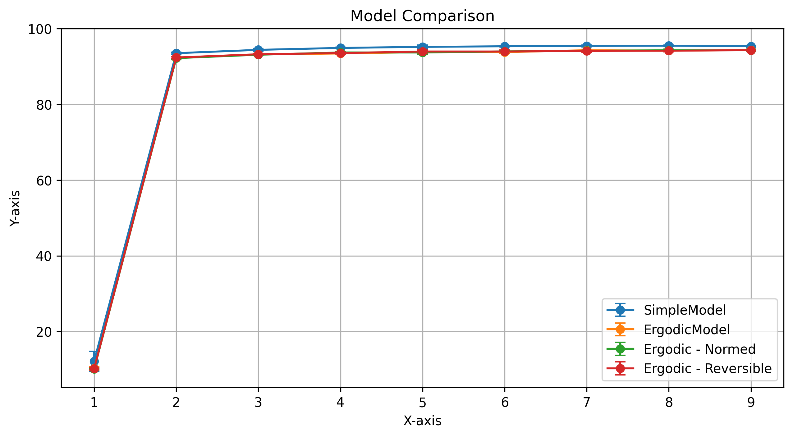
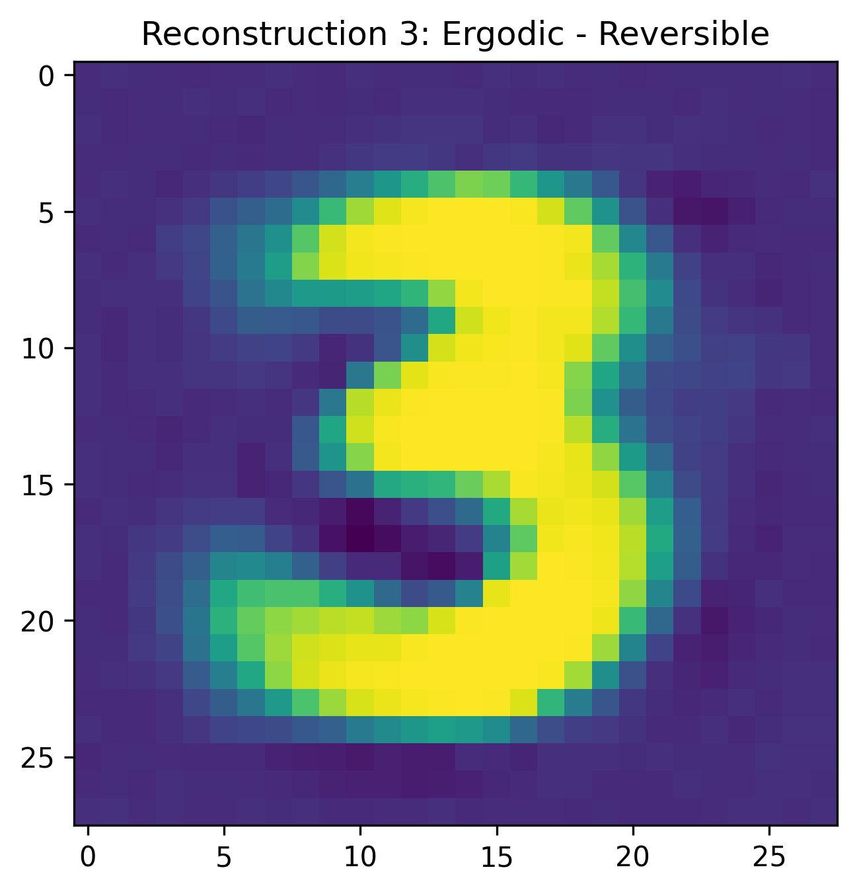
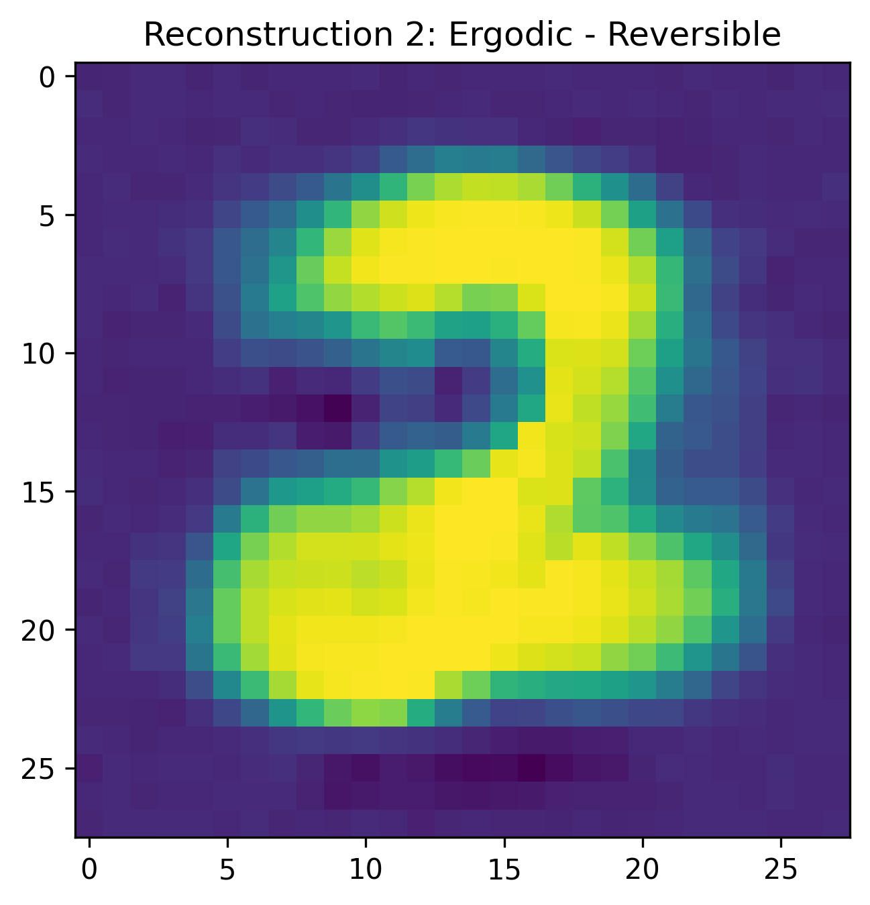
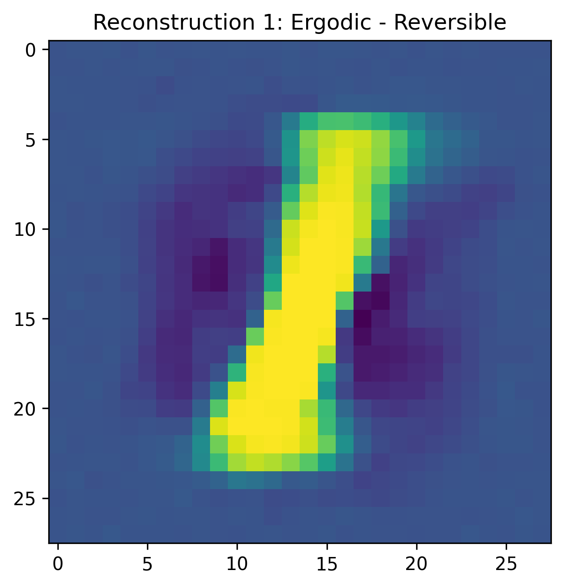

Alec Rogers

September 24, 2025

[]{#_Toc .anchor}Table of Contents

Table of Contents [2](#_Toc)

Abstract [3](#_Toc1)

Background [5](#_Toc2)

Methods [8](#_Toc3)

Results [10](#_Toc4)

Discussion [11](#_Toc5)

Conclusion [12](#_Toc6)

References [12](#_Toc7)

[]{#_Toc1 .anchor}Abstract

*Problem*

*Society has become highly dependent on machine minds, but we do not have a good theory of those minds. Although human and machine minds have considerable functional overlap, their design goals are considerably different, and treating a machine mind as a human mind can have significant negative consequences. Therefore, we should have a different ["]{dir="rtl"}theory of mind" when we interact with machine minds, and our theory should be informed by how those minds are designed and trained.*

*Background*

*To develop this theory of mind, it is helpful to anthropomorphize machines because we naturally understand them in relation to human minds. Therefore, this essay focusses on three main questions: what are machine minds, what do machine minds feel, and what do machine minds know.*

*While these changes do not allow us to adopt a human theory of mind, they do permit of a theory of mind that is significantly less broken and inhumane.*

*Solution*

*As a result of this analysis, we also propose three specific measures to make a machine mind more humanistic or natural: weight ergodicity, network invertibility, and output certainty. Weight ergodicity refers to the fact that weights are samples from a random (ergodic) process, rather than fixed constants. Network invertibility refers to the fact that the network architecture is bidirectional and partially invertible. Output certainty refers to the fact that a network should know that it does not know, as opposed to merely knowing the probability of one answer as opposed to another. To illustrate these principles, the performance of several models implementing these paradigms is compared to a traditional model. All models are configured with a 20-neuron, single hidden layer and tested on the MNIST dataset.*

*Network invertibility is important with respect to developing a meaningful semantic embedding: the symbols of an LLM should correspond to something and we should be able to know to what they correspond, as opposed to being merely abstract tokens inside of Searl[']{dir="rtl"}s Chinese translation engine.*

[]{#_Toc2 .anchor}Background

The scope of this paper is Large Language Models, or reinforcement learning where the inputs and outputs are known and the weights of the network are unknown (i.e. the transformer architecture).

Weight Ergodicity

Measurement theory, when applied to a neural network, views the weights as samples from a random (ergodic) distribution. According to that insight, the network parameters and especially the weight matrix W is represented as follows:

$$W = \mu M + \sigma V$$

where $\mu$ and $\sigma$ are the bias and variance parameters that determine the contribution of the random process. The bias and variance parameterize a noisy signal where $M$ has a norm of 1 and variance of zero and an unbiased variance $V$ with unit variance. Note that the matrix $M$ is analogous to the weight matrix in a typical neural network while $V$ is sampled from a standard normal distribution.

For simplicity, the mean and variance of all weights are characterized here by a single *temperature* parameter for each layer that is updated via the ADAM algorithm. While it may be desirable to have a temperature associated with each input weight, this is not necessary to compare to a normal network in order to measure performance.

Another simplification in this context is to use the temperature parameter to determine both the basis and the variance. Given the temperature $temp$, the $\mu$ and $\sigma$ parameters are calculated as follows:

$$\mu = 1 - temp$$

$$\sigma = temp$$

In this experiment, the temperature of the ergodic weight process begins at 1 and decreases to 0 using the ADAM algorithm \[make sure there are the same number of parameters here\].

There are three significant advantages to using ergodic weights. The first advantage is that a learning rate is not necessary, since the biases have different contributions as a result of the randomness and converge as the temperature decreases. Thus, the adaptive learning rate schedule is reinterpreted as a process of simulated annealing. The second advantage is that the weights can be initialized to zero, since they find different locations in weight space over time. It is hypothesized that this process of annealing will help the model to bounce out of local minima and saddle points within its weight space more often than taking a step in the direction opposite to the gradient, which is often prone to deterministic and oscillatory behavior. The third advantage is described in the literature on simulated annealing, according to which there is a theoretical guarantee of convergence to the global optimum if run for an infinite number of iterations.

Note that the standard *dropout* algorithm may be interpreted as a per-neuron variance in the bias parameter. Thus, while dropout explicitly sets neurons to zero with some frequency, the same type of regularization will occur naturally as a result of the difference over time of the weight biases.

Network Invertibility

The egocentric point of view tends to see perception as a passive process, while physics suggests that it is bidirectional. That bidirectionally within a neural network can be approximated via the invertibility of its weight multiplications and activation functions. Even when the network is not invertible, bidirectionality provides an important role in backpropogation and network topologies such as autoencoders that perform a decoding step that is analogous to the reverse of the encoding step. In modern practice, the topological similarity of encoders and decoders does not typically extend to shared weights. Here, we briefly examine the possibility of simultaneously training the network in both the forward and reverse direction: the forward encoding step in which the outputs are predicted from the input, and the reverse decoding step in which the inputs are predicted from the (possibly predicted) outputs. For a related experiment in sharing the weight matrix between controller (policy) and critic (value) networks, see *Rogers et al 2001*.

In this experiment, the output is a one-hot encoded vector corresponding to the predicted MNIST digit, a classification task that is clearly not a bijective (invertible) function. To address this situation, the inputs are predicted from the outputs of the *penultimate* network layer; thus, the network is composed of a bijective front and a surjective back. We characterize these components respectively as the *recognizer* (or representer) and the *generalizer*.

Output Certainty

The error function of a neural network corresponds to its desire. Modern machine minds use cross-entropy loss, so their output distribution *must* classify the output. This does not allow the network to express the certainty that the input belongs to a given class or not; rather, it expresses the probability that the input belongs to one class *as opposed to another*. To remedy this situation, a variation of cross-entropy loss is used which blends standard cross-entropy loss with a product of cross-entropy loss and the norm of the prediction. An output value of zero is penalized by cross-entropy loss, but any incorrect prediction carries an additional penalty in proportion to its magnitude to penalize overconfidence. The formula for the certainty-weighted cross-entropy version of the loss function is:

$$error = - \overset{N}{\sum_{c = 1}}t_{c}\log(p_{c})$$

$$certainty = |\widehat{y}|$$

$$surprise = (\alpha) \cdot certainty \cdot error + (1 - \alpha) \cdot error$$

cosine similarity

Amplitude certainty

$$error = (\widehat{y} - y)^{2}$$

[]{#_Toc3 .anchor}Methods

The software used to run these experiments is a combination of Python and PyTorch (the Python code is provided in the appendices).

The data is the MNIST dataset, chosen because it is simple and well-known. It consists of 60,000 training images and 10,000 test images, each 28x28 pixels in size, with a monochromatic bit depth of 256. Their target labels are provided as output. The data is preprocessed by removing its mean and variance, and is shuffled between trials.

For all paradigms, the input is a 28x28 element array and the output is a one-hot encoded representation of the target class. The architecture for all paradigms is a 20 hidden unit neural network. The batch size is 10, and each network is run for 9 epochs. To generate confidence intervals for model accuracy, each paradigm is run for 7 trials to generate error bars reflecting the standard deviation of the accuracy values.

The standard architecture that serves as a benchmark for the other paradigms uses a RelU nonlinearity, and a learning rate of 0.01 that is updated via the ADAM method. Cross-entropy loss is used for the error function.

The base ergodic model uses weights initialized to zero and a single per-layer temperature parameter that governs the bias/variance trade-off of the ergodic weights. The temperature is updated with the ADAM method. Dropout is used for the middle layer, which means that both the bias and variance of the ergodic weights are set to zero with a frequency of 0.75.

Five models were evaluated: the base model and four models using the ergodic weight updating scheme. Of the models with ergodic weights, one model has simply ergodic weights, one has input normalization, one reversible model uses separate forward and backward layers, and one reversible model uses a single invertible weight matrix. For the invertible model, the inversion of the weight matrix is typically computationally expensive. Therefore, the weight matrix is represented in SVD form, as a rotation matrix followed by an eigenvalue matrix followed by another rotation matrix. In virtue of this sparsely-parameterized decomposition, the rotation matrices can be computed by Givens rotations, and the eigenvalue matrix stores only diagonal elements. Therefore, direct matrix inversion and its computational cost are avoided. That said, doing so requires a more computationally expensive forward pass and a somewhat circuitous back propagation step.

The weight update equations for the ergodic model do not use a learning rate. So compared to traditional gradient descent equations that look as follows for a given learning rate parameter $\alpha$:

$$err = (y - \widehat{y})^{2}$$

$$\bigtriangleup_{W} = \alpha(y - \widehat{y})\nabla_{F}x$$

$$err = (y - \widehat{y})^{2}$$

$$e = y - \widehat{y}$$

$$c = \alpha{\widehat{y}}^{2} + (1 - \alpha)$$

$$\bigtriangleup_{W} = (ce - \alpha\widehat{y}e^{2})x$$

This equation demonstrates that the network is simultaneously trying to minimize error and "incorrect certainty".

[]{#_Toc4 .anchor}Results

The most important result of this experiment is the model comparison with error bars, that demonstrates that the simple model performs slightly better than all proposed paradigms, and that all of the proposed paradigms perform a{width="6.05387467191601in" height="3.337696850393701in"}lmost identically:

Finally, although there is no invertible network to compare it to, we show the reconstruction of the input by running the network in reverse, which uses a separate weight matrix and MSE loss for input reconstruction:{width="1.8625087489063867in" height="1.9371817585301838in"}{width="1.890411198600175in" height="1.9662029746281715in"}{width="1.890411198600175in" height="1.9662029746281715in"}

[]{#_Toc5 .anchor}Discussion

The benefits of the novel paradigms described in this paper are as follows:

Random weight initialization is unnecessary, which makes performance less subject to arbitrary initialization. This is visually demonstrated by the error bars in the Model Comparison figure, which show that only the simple model (with random weight variation) has significant variation in performance.

The learning rate is unnecessary, since its role is replaced with weight noise variance, just as the role of dropout is replaced with weight bias variance (which in this experiment is just the regular dropout schedule). Since dropout is folded into the weight adaptation schedule, an integrated algorithm that controls both weight bias and weight variance (and which uses separate parameters for each weight) is suggested for future experiments that follow this paradigm.

The error function encapsulates a measure of certainty in the output in addition to a measure of certainty between the output choices.

However, there were several experiments that my hardware was not fast enough to evaluate and a number of implementation issues that I did not have the time to address:

The Pearson correlation between the certainty and the accuracy for each digit is insignificant, which suggests that the error function did *not* induce the network to be less certain when it was less accurate. This probably points to a problem in the implementation of the error function: instead of using $certainty = |\widehat{y}|$ to reduce the penalty for lack of certainty, we used $certainty = p_{c}$. This leads to prediction norms that are much higher than 1.0 (since softmax creates a unit-sum PDF at the output layer, while using the norm of the output vector to indicate certainty imposes a contradictory constraint). This might explain the lack of correlation between the certainty and accuracy, which theoretically should correlate quite strongly. Performing the experiment with corrected code (as by using a norm-weighted MSE with only one zero) should yield better correlation between certainty and accuracy for each target class.

Finally, **the use of the autograd algorithm within PyTorch led to weights being tuned directly**, which interferes with the simultaneous tuning of the temperature parameter in a way that is not explicitly captured in this paper. So while the addition of weight variance does make random weight initialization unnecessary, the intricacies of the interaction between the weight tuning and the temperature tuning is hidden behind the autograd mechanism.

[]{#_Toc6 .anchor}Conclusion

Overall, I am optimistic about the strength of the philosophical grounding behind several of the paradigms introduced in this paper. However, due to several implementation issues, I do not feel that the hypotheses were well-tested. Further, even if they had been, the effectiveness of these neural network paradigms in both multilayer neural networks and with more challenging tasks is not clear.

[]{#_Toc7 .anchor}References

Rogers, Shannon, Lendaris; 2001: *A comparison of DHP based antecedent parameter tuning strategies for fuzzy control*, Proceedings of the Joint 9th IFSA World Congress and 20th NAFIPS International Conference, IEEE

Rogers, A; 2003: *Analysis of the Instantaneous Estimate of Autocorrelation*, unpublished
