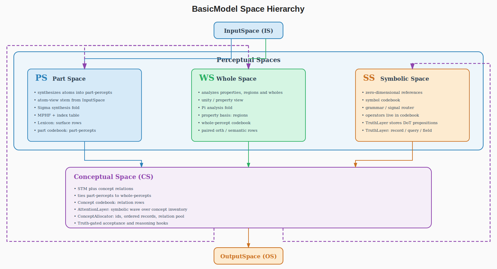

# Spaces

> **2026-06-21 terminology note (one noun per-space).** This doc follows the
> percept / concept / symbol convention
> (`doc/old/2026-06-21-terminology-percepts-concepts-symbols.md`): a **percept**
> is a PartSpace/WholeSpace thing (dimensionally-embedded, extensional; the two
> subtypes are **part-percepts** = atoms, σ, and **whole-percepts** =
> properties/regions, π); a **concept** is a ConceptualSpace relation tying one
> part-percept ↔ one whole-percept (the Concept codebook); a **symbol** is a
> SymbolSpace 0-D reference to a concept (the symbol codebook). The prose below
> reserves "symbol" for genuine SymbolSpace things; WholeSpace content is
> whole-percepts, and its compact `[0,1]` emission is the symbol that migrates to
> SymbolSpace. Code identifiers (e.g. `get_symbols`, `subspace.what`) are
> unchanged — those get a separate code pass.

> **2026-06-12 update (part/whole rename — the perceptual split).**
> `PerceptualSpace` → **`PartSpace`** and `SymbolSpace` →
> **`WholeSpace`**; both now subclass a thin shared
> `PerceptualSpace(Space)` base (no parameters, no submodules —
> state-dict keys unchanged). Both views are *perceptual*: PartSpace
> synthesizes bottom-up over atoms (Sigma), WholeSpace analyses
> top-down over unity (Pi). XML config sections and grammar-file
> scopes are renamed to `<PartSpace>` / `<WholeSpace>` to match. The
> PS/SS shorthand in older notes reads part-side/whole-side. The freed
> name `SymbolSpace` was **reintroduced 2026-06-19** as the grammar/word
> space-role (formerly `WordSpace`); see `doc/old/2026-06-19-handoff.md`.
>
> **At the corpus callosum, objects are analysed and synthesized** —
> by sending them back to PerceptualSpace: wholes get split and parts
> get chunked. In symbolic "mode", the objects that get sent back are
> *symbols*.
>
> **Terminology (semiotics).** There are **objects** and
> **references**. A reference is either a **sign** or a **symbol**. A
> *sign* is a quantized version of the referent (same space, snapped
> to a codebook row). A *symbol* is an unrelated version of the
> referent — an arbitrary code of much lower dimensionality (cf. the
> zero-banded symbol codes below: whole-percepts of symbols carry
> `.where = .when = 0`).
>
> **`subspace.what`: atoms vs properties.** On `PartSpace` the `.what`
> rows are **atoms** (letters and words — the existing lexicon / BPE /
> MPHF front ends, gathered by `Codebook.lookup`). On `WholeSpace` the
> `.what` rows are **properties** — things that range over the whole
> input rather than naming one character (a sinusoid value is the
> worked example; "whitespace"/"words" are content-keyed properties).
> `materialize` hands the per-position selection (`subspace._index`,
> renamed from `_active` 2026-06-12) to the codebook so it produces the
> materialized object: atoms via `lookup`, or a per-position **region
> membership** via `Codebook.materialize_property` (`mode="property"`) —
> the region that has the property (`> 0`) and the region that doesn't
> (`<= 0`). The property path is additive and opt-in
> (`Codebook.property_basis`); the continuous sinusoid backend is wired,
> the content-keyed (whitespace/words) backend reuses the meronymic
> analyzer's span segmentation and is a documented seam.
> Properties are **low-frequency by construction**: there is too much
> detail to learn a codebook over the whole input unless the atoms are
> low-frequency, so the property basis frequency is tied to the input
> length (the k-th harmonic completes only ~k/2 cycles over the whole
> field, mirroring `EndpointSumWhere`'s sub-half-period `div_term`). The
> learnable property row is the low-frequency atom; the basis enforces
> the coarseness.

> **2026-06-11 update (meronomy cutover — MeronomySpec/MeronomyPlan,
> Stage 9).** With `<architecture><meronomy>on</meronomy>` (now the
> `model.xml` default) the meronymic slots bind the membership
> kernels: `PartSpace.sigma` → `SigmaLayer2` and
> `WholeSpace.pi` → `PiLayer2`, each through the K3-wire
> `MeronymicFoldAdapter` (χ at the boundary; the wire keeps carrying
> signed scalars; the fold computes on memberships, near-identity at
> init). Additions this page should be read with:
>
> * **CS encoding**: stored reference rows are gauge-signed unit
>   directions (semantic embedding only); certainty is activation
>   magnitude, polarity activation sign; gauge fixed at mint
>   (`Spaces.gauge_orient`). Reference-half lookup is the pole
>   quotient (`embed._pole_aligned_score`); token/form codebooks keep
>   full-vector lookup.
> * **The callosum**: percepts cross NAMELESS and FACTORED
>   (`ConceptualSpace.factor_percept` — content selects the row,
>   evidence sets `a ∈ [0, +1]`); parallel mode is the `2N` mixing
>   matrix; serial mode bypasses it (fusion migrates into the shift).
> * **Two codebooks, one table**: the towers ARE the PS/SS codebooks
>   (extent/intent; shared with IS recognition — recognition is tower
>   lookup), linked by the word-keyed binding table
>   (`References.ReferenceTable`) hosted on WholeSpace
>   (search-then-mint gate; `adopt_stage0_evidence` stays ground-half
>   memory, not naming). Symbols are atomic, zero-banded codes —
>   whole-percepts of symbols carry `.where = .when = 0` (the Mind
>   marker).

> **2026-06-09 update (analysis/synthesis orientation — supersedes the
> ownership notes below).** The corrected orientation
> (doc/old/2026-06-08-analysis-synthesis-dual-input.md, rev.
> 2026-06-09; see [Philosophy.md](Philosophy.md)):
>
> * **InputSpace emits the DUAL VIEW**: `forward(x) -> (percepts_in,
>   concepts_in)` — the atom view (content `[B, N, 1]`) for the
>   perceptual branch and the unity view (`[B, 1, N]`) for the symbolic
>   branch.
> * **PS = bottom-up SYNTHESIS**: owns ONE `SigmaLayer` (`self.sigma`,
>   additive/union; the Pi/Sigma swap) and the `<synthesis>` front ends
>   (radix/bpe/byte/lexicon/mphf — was `<chunking>`).
> * **SS = top-down ANALYSIS**: owns ONE `PiLayer` (`self.pi`,
>   multiplicative/intersection), the `<analysis>` division knob
>   (byte/word/analyse), and the `<lexer>` intake knob (moved from
>   InputSpace). Stage 0 consumes the unity view as symbolic evidence
>   (per-part coarse means, snapped through the live SS codebook with
>   the asymmetric STE forward leg).
> * The meronymic analyzer (`bin/perceptual_analyzer.py`) is SS-side
>   analysis machinery now; PS `<synthesis>analyse` was removed.
>
> Sections below that predate this orientation are marked or should be
> read against it.

> **2026-06-02 update (subsymbolic analyzer).** New `ObjectSubSpace`
> (`bin/Language.py`) -- the PS-meronymic carrier analogue of
> `SymbolicSubSpace` (spans, parent/child links, route ids, marker-route
> replay fields). `WholeSpace` gains `insert_operations` (grammar
> operations in a dedicated operator codebook -- `_operation_vectors` /
> `_operation_positions` -- separate from the symbol codebook so the
> symbol/idea/`.where` namespace is untouched), `resolve_ps_terminal` /
> `null_sem` (PS-to-SS binding), and `operator_superposition`. The PS
> meronymic analyzer lives in `bin/perceptual_analyzer.py`. See
> [doc/old/2026-05-30-subsymbolic-analyzer-terminal-emitter.md](old/2026-05-30-subsymbolic-analyzer-terminal-emitter.md).

> **Status (2026-05-27):** updated for the substrate refactor. PS is a
> single-arg input processor (`self.pi` + `self.sigma`). CS is an STM
> container + grammatical CPU; no atomic forward fold. SS owns the
> unified word lexicon codebook with paired (orth, semantic) rows.
> Grammar dispatch lives on the signal router (`LanguageLayer`) at
> `SymbolicSubSpace.languageLayer`; the CKY `Chart` and STM shift-reduce
> parsers are retired. `LiftLayer` / `LowerLayer` are binary
> `GrammarLayer` subclasses with internal Sigma / Pi (no longer
> substrate-borrowing). `GrammarLayer` gains an optional butterfly
> cascade mode.

## Overview

BasicModel is a pipeline of five **spaces** plus a grammar host
(`SymbolSpace`), each performing a distinct representational
transformation. Data flows forward from raw input to task output; the
reverse pass reconstructs the original input from the symbolic
representation. The legacy `SubwholeSpace` and `SyntacticSpace`
classes have been retired — the subsymbolic role is filled by
`PartSpace` itself, and the grammar runs from
`SymbolicSubSpace.languageLayer` (the signal router; subsumed the retired
`Chart`).

```
Forward:  InputSpace -> PartSpace -> ConceptualSpace -> WholeSpace -> OutputSpace
Reverse:  OutputSpace -> WholeSpace -> ConceptualSpace -> PartSpace -> InputSpace
```

The pre-2026-05-27 "two feedback loops" (S → C per-stage, C → P
cross-forward) are retired. The recurrent character lives in (a) STM
accumulation across words in SERIAL / GRAMMATICAL mode, and (b) the T-pass
PARALLEL refinement loop driven by `<subsymbolicOrder>` via
`PS.forward(CS)` iterations.



---

## Base Class: Space

All spaces inherit from `Space`, which manages:

- **Shape management.** `inputShape` / `outputShape` as `[nObjects, nDim]`.
  Subclasses read dimensions from `TheObjectEncoding`.
- **Codebook / VQ quantization.** When `nVectors > nActive`, a codebook holds
  candidate vectors; top-k selection gives the bottleneck.
- **Reshape flag.** When in/out object counts differ, the `[B, nObj, nDim]`
  tensor is flattened before the next space and restored on the way back.
- **Attention.** The legacy boolean `hasAttention` is deprecated and inert
  (kept only as a backward-compat alias); use the `<attention>` element
  instead (`off` | `primer` | `second-order` | `low-rank`).
- **`set_sigma` propagation.** Ergodic-mode noise level cascades from the
  top-level model down through every child layer.

### Reset cascade --- hard vs. soft

Every space exposes `Reset(batch=None, hard=True)`. The signature is required
(legacy zero-arg fallback removed).

| Call form | Scope | Use |
|-----------|-------|-----|
| `space.Reset()` | All rows | Whole-state wipe (epoch boundary) |
| `space.Reset(batch=b, hard=True)` | Row `b` only | Document boundary |
| `wordSpace.soft_reset(batch=b)` | Row `b` sentence-scoped state | Grammar `<start>` reduction |

Hard-reset clears: parse stack, `_last_svo`, `_stm_fired`, codebook commit
accumulator, discourse history, `serial_cache`, `_ar_embedded`,
`_end_of_stream` for the affected rows.

Soft-reset clears per-sentence working buffers (parse stack rows, `_last_svo[b]`,
category and reconstruction stacks) and re-arms `_stm_fired[b]`. Does **not**
touch discourse history (`InterSentenceLayer` ring buffer) or codebook EMA ---
those are document-scoped.

Reset is dispatched from `runEpoch`, never from inside `runBatch` (the pure
compute brick --- see [Architecture.md](Architecture.md)).

---

## Sigma / Pi ownership (Pi/Sigma swap, rev. 2026-06-09)

History: the 2026-05-13 rebalance described "each space owns one
operator"; the 2026-05-27 substrate refactor gave PS both folds; Stage 10
made PS pi-only. The **corrected analysis/synthesis orientation
(2026-06-09) swaps the folds to their proper sides**: Sigma (sum/union)
is synthesis and belongs to the bottom-up PartSpace; Pi
(product/intersection) is analysis and belongs to the top-down
WholeSpace. CS remains an STM bookkeeper with **no atomic forward
operator**; Lift / Lower stay **binary `GrammarLayer` subclasses** with
internal Sigma / Pi (no substrate-borrowing).

| Space | Owns | Forward signature |
|---|---|---|
| **PartSpace** | one `self.sigma` (SigmaLayer — the synthesis fold), the `<synthesis>` front ends, MPHF + index table, the surface-keyed Lexicon (`self.vocabulary`) | `PS.forward(x_subspace)` — **single positional argument** (the atom-view stem). Body: `self.sigma(x.materialize())` after the synthesis front end embeds. |
| **ConceptualSpace** | STM (`ShortTermMemory`, depth ~8) + (when sparse-active) per-order sparse concept-weight tables (`_csw_vals`) + concept dictionary (`similarity_codebook`) | `CS.forward(subspace, word_subspace=None)` — when `_sparse_active()`, applies the ramsified per-order sparse concept transform (`_sparse_concept_forward`) before the STM write; otherwise STM bookkeeping only (`sigma_percept` fold retired). Dispatches read-only grammar ops via the signal router. |
| **WholeSpace** | one `self.pi` (PiLayer — the analysis fold), the `<analysis>` + `<lexer>` knobs, the unified word lexicon codebook with paired (orth, semantic) rows; `insert_paired_word(word, vec)` API; hosts codebook-write-required grammar ops | `SS.forward(CS_subspaceForWS, IS_concepts=None)` — stage 0 reads the unity view (`IS_concepts`); later stages read the recurrent CS. Lookup chain: surface → MPHF → orth row → parented semantic row (via `Codebook.set_part_parent`). |

**Composition (per-mode):**

- **SERIAL / GRAMMATICAL** (`<symbolicOrder>1</symbolicOrder>`): one
  iteration per word.

  ```
  PS_t = PS.forward(IS_t)            # MPHF + pi + sigma on per-word surface
  CS_t = CS.forward(PS_t)             # STM shift + push
  router.dispatch_at_C(STM)           # read-only grammar ops on STM contents
  router.dispatch_at_S(STM)           # codebook-write-required ops via SS
  ```

- **PARALLEL** (`<symbolicOrder>0</symbolicOrder>`): T iterations of PS over
  CS.

  ```
  PS_0 = PS.forward(IS); CS_0 = PS_0
  for t in 1..T = <subsymbolicOrder>:
      PS_t = PS.forward(CS_{t-1})    # refinement pass
      CS_t = CS.forward(PS_t)         # STM[t] = PS_t (parallel write; no shift)
  router.dispatch_at_C(STM)           # grammar ops after STM population
  ```

The legacy formula `C = sigma_percept(pi_input(IS) + pi_concept(C_prev))`
is retired entirely.

### Lift / Lower in the new ownership

`LiftLayer` and `LowerLayer` are no longer "rule-id annotators over
shared substrate." They are first-class binary `GrammarLayer`
subclasses (Stage 4 of the substrate refactor):

- `LiftLayer(GrammarLayer)`: `arity=2`, `rule_name="lift"`, `space_role='C'`.
  Owns an internal `self._sigma: SigmaLayer` for the pairwise additive
  (sigma-style) math. `forward(left, right)` delegates to `_sigma.compose`.
- `LowerLayer(GrammarLayer)`: `arity=2`, `rule_name="lower"`, `space_role='C'`.
  Owns an internal `self._pi: PiLayer` for the pairwise multiplicative
  (pi-style) log-domain math. `forward(left, right)` delegates to
  `_pi.compose`.

Both reverse cleanly via their internal layer's reverse. Both gain
butterfly mode for free via `GrammarLayer` base inheritance (Stage 5).

The signal router dispatches them as binary reduce ops at the CS,
weighted by `Grammar.rule_probability` (the per-position copy/reduce
score head).

### Butterfly mode on `GrammarLayer` (Stage 5)

`GrammarLayer(butterfly=True, N=N)` allocates a packed `nn.Parameter`
of shape `[n_levels, N // 2, 2D, 2D]` (`n_levels = log2(N)`), a
bit-reversal permutations buffer, and LDU-parameterized invertibility
per node. Identity init: cascade is identity at construction. Each
subclass implements `_butterfly_pair_op(x_pair, W_node)` with its
per-pair math:

- `PiLayer._butterfly_pair_op`: atanh → einsum → tanh (multiplicative
  log-domain pairwise).
- `SigmaLayer._butterfly_pair_op`: atanh → einsum → tanh (additive
  pairwise — same surface, different gradient regime).
- `LiftLayer` / `LowerLayer`: delegate to their internal sigma / pi.
- `IntersectionLayer` / `UnionLayer`: min / max kernels.
- `ConjunctionLayer` / `DisjunctionLayer`: hard-coded monotonic min / max.

Parameter savings: `O(N · log N · D²)` cascade vs `O(N² · D²)` for a
single big matrix. Wired into the space folds (`PartSpace.sigma` /
`WholeSpace.pi` post the Pi/Sigma swap) by the global `<sigmaPi>`
mode (default butterfly). Closes the XOR convergence target
(`test_mm_xor.py`).

---

## Normalization and Ranges

| Space | Data Contract | Geometry |
|-------|--------------|----------|
| InputSpace | Data scaled -1..1 for scalars or vector norms | Signed unit interval `[-1,1]` |
| PartSpace | Modal/demuxed (what/where/when encoding). Signed unit-magnitude scalars or vectors. No negation operator | Signed hypercube `[-1,1]^d` |
| ConceptualSpace | Combined/muxed (event encoding). Signed unit-magnitude (tanh-bounded). Event norm on `subspace.activation` | `[-1,1]` per element (tanh) |
| WholeSpace | Whole-percepts (`[0,1]` presence). The compact emission is the symbol that references a concept; one symbol encoded at a time | `[0,1]` presence |
| OutputSpace | Rescaled from activation range to original data range | Data range |

`SyntacticSpace` is retired (see Section "SyntacticSpace --- retired" below).
Grammar / chart machinery lives on `SymbolSpace` and is attached to
`WholeSpace` (the canonical grammar host).

**Data scaling.** `Data` computes global `input_min`/`input_max` and
`output_min`/`output_max` at load time. InputSpace uses `Data.normalize(x,
"input")` to scale to `[-1, 1]`; OutputSpace uses `Data.denormalize(x,
"output")` to restore the original output range.

**Whole-percept presence.** Whole-percepts live in `[0, 1]`; since conceptual
activations range `[-1, 1]`, the mapping is `presence = (activation + 1) / 2`.
`SubSpace.get_symbols()` / `set_symbols()` (code identifiers unchanged) perform
the conversion.

**Demuxed mode.** When `InputSpace.demuxed=true`, what/where/when components
are stored independently in the SubSpace rather than concatenated. ModalSpace
routes each component through independent PartSpaces; downstream spaces
see an identical muxed tensor via `materialize()`.

---

## Codebook Similarity Metric

`Codebook` wraps `VectorQuantize`. Similarity metric per space:

| Space | Codebook geometry | Stored | Metric | Retrieval |
|-------|------------------|--------|--------|-----------|
| PartSpace | $[-1, +1]^d$ hypercube | Feature *patterns* | Euclidean L2 | $\arg\max_i (x \cdot c_i - \tfrac{1}{2}\|c_i\|^2)$ |
| WholeSpace | $[-1, +1]^d$ hypercube | Whole-percept *patterns* | Euclidean L2 | $\arg\max_i (x \cdot c_i - \tfrac{1}{2}\|c_i\|^2)$ |
| ConceptualSpace | `similarity_codebook` rows (`use_dot_product`) — the concept dictionary / SBOW-situating metric, NOT the forward concept-production path | Concept atoms; input magnitude encodes belief certainty | Dot product | $\arg\max_i (x \cdot c_i)$ (situating/SBOW only) |

### Euclidean (Perceptual — Part / Whole)

These codebooks store *what something looks like* --- $0.5 \cdot v$ carries half as
much "of feature v" as $1.0 \cdot v$, so the right notion is coordinate-wise
distance. Retrieval expands $\|x - c_i\|^2$:

$$
\|x - c_i\|^2 = \|x\|^2 + \|c_i\|^2 - 2\,(x \cdot c_i)
$$

$\|x\|^2$ is constant across $i$ and drops from argmin:

$$
\arg\min_i \|x - c_i\|^2 = \arg\max_i (x \cdot c_i - \tfrac{1}{2}\,\|c_i\|^2)
$$

`VectorQuantize` keeps $\|c_i\|^2$ in `_b_norms_sq`:

```python
indices = (flat @ codebook.T - 0.5 * b_norms_sq).argmax(dim=-1)
```

One matmul + one broadcast subtract + one argmax. Skips the `sqrt`, the per-row
$\|x\|^2$ add, and the cdist autograd plumbing.

### Dot product (Conceptual)

> **Note.** This dot-product metric is the `similarity_codebook`'s retrieval
> metric (used by the substitutability / SBOW *situating* signal), NOT the
> forward concept-production path. When the ramsified sparse transform is
> active, a concept code is produced by the sparse encode/decode
> (`a_k = W_k @ source_k`, then `a_k · softplus(atom)`) — there is no
> `argmax_i (x · c_i)` concept retrieval on the forward path, and the atoms
> are softplus-positive rather than maintained unit-norm by EMA. See
> **ConceptualSpace → Sparse-coding concept transform**.

ConceptualSpace concepts are *named directions* in belief space. $x \cdot
c_i$ gives the *signed strength of belief that $x$ affirms concept $i$*:

- $+1$ fully affirms; $0$ orthogonal; $-1$ fully denies

Two consequences:

1. **Codebook must be unit L2-norm.** EMA renormalizes after each update.
2. **Input must NOT be normalized.** The magnitude *is* the certainty signal.
   Cosine similarity would divide it out.

For *ranking*, $x \cdot c_i$ and $\cos(x, c_i) = (x \cdot c_i) / \|x\|$ are
monotone-equivalent (positive constant cancels). Omitting input normalization
preserves certainty and costs less:

```python
# codebook is unit L2-norm (maintained by EMA)
indices = (flat @ codebook.T).argmax(dim=-1)
```

### Configuring the metric

`use_dot_product` is a class attribute on `Codebook` (default `False`). Set it
on a Space subclass to opt in --- `ConceptualSpace` does this. The underlying
`VectorQuantize.use_cosine_sim` flag is historical; after the April 2026 perf
pass, input-side normalization is gone, so the effective meaning is "codebook
unit-norm; rank by dot product".

---

## Ramsification table (per-code fold record)

The Pi / Sigma folds carry a reference onto sortable mereological space
but do **not** preserve their own *ramsification* — the record of how the
code was produced — so a folded code cannot, on its own, be reconstituted.
`Codebook.ramsification` is the small adjacent table that fixes this: a
`[V, max_order]` `uint8` sidecar, index-aligned with the codebook rows
(both perceptual codebooks — `PartSpace.subspace.what` and
`WholeSpace.subspace.what`), recording for each code which fold it was
routed through at each subsymbolic pass — `FOLD_NEITHER` / `FOLD_SIGMA`
/ `FOLD_PI`. `invert_ramsified(code, row, sigma, pi)` walks that sequence
in reverse pass order, applying `sigma.reverse` / `pi.reverse` per
recorded fold, landing back at the codebook row that produced the code.

The table is an **opt-in additive sidecar** (`enable_ramsification`; a
plain attr like `part_parents` / `category_ids`, not a Parameter or
buffer) — it adds no state_dict keys and cannot move a pinned basin; it
resizes with the codebook (`grow_to`). Live per-pass stamping in the
subsymbolic pump loop is the deliberate cutover seam (call `record_fold`
where `PartSpace.sigma` / `WholeSpace.pi` fire).

**Word abstraction order.** A code's `abstraction_order` is its fold count
(non-`NEITHER` passes), and words are subsymbolic at several abstraction
levels: a **proper noun** (prototype / token) matches raw at **order 0**;
a **regular noun** (type) at **order 1**; a **count noun** (concrete only
under a determiner) at **order 2**; higher orders are more abstract. Words
need not be nouns, but all benefit from an abstract / discontiguous
spatial representation. This connects to the ramsified order hierarchy in
`Language.Taxonomy` and the order-typed STM plan.

## Codebook Uniqueness Contract

Every codebook entry is identified by its **row index** and must carry
**distinct `.what` (`WhatEncoding`) content**; the old `.where`-keyed
uniqueness scheme is retired:

- **`.where` --- positional / spatial-extent key (no longer a codebook
  row key).** The cross-codebook **`.where` slice registry was RETIRED**
  (modality re-architecture, 2026-06-04; `WhereEncoding`,
  [`Spaces.py`](../bin/Spaces.py)). `allocate_codebook_slice` /
  `global_max_val` / `reset_codebook_registry` were removed: there is no
  shared where-space to allocate disjoint slices in. Codebook identity is
  now the **row index** (the `_index` selection), `.where` keeps only its
  positional / spatial-extent role, and CS→WS reverse decode is
  **content-match** (nearest row). Cross-codebook taxonomy is row/position-keyed
  via WholeSpace's explicit dicts (`category_ids`, `part_parents`).
- **`.what` --- distinct prototype content.** Identical `.what` collapses to the
  same parthood identity (`equal(A, A) = 1`) --- a redundant pair the network
  can't distinguish.

Current enforcement:

| Source | Mechanism | Status |
|---|---|---|
| WholeSpace codebook | `ImpenetrableLayer` overlap penalty + variance floor; five-relations classifier pushes pairs toward **disjoint** | Active by default |
| ConceptualSpace codebook | `ImpenetrableLayer` available; not yet wired by default | Opt-in |
| PartSpace Lexicon | Cosine-margin pode/antipode SBOW training | Active for trained Lexicons |
| InputSpace vocabulary | Shares PartSpace's Lexicon | Inherited (text); manual (raw) |

`.where` is now a positional / spatial-extent carrier (the slice registry is
retired — see above); codebook identity is the **row index**. `.what`
uniqueness is **learned** (encouraged by `ImpenetrableLayer` + antipodal
quotient) and, together with the distinct row indices, keeps the parthood
lattice well-formed.

---

## Lexicon (Projective Unit Ball)

The **Lexicon** ([`bin/Layers.py`](../bin/Layers.py)) backs PartSpace
word embeddings and WholeSpace whole-percept prototypes. Each row is a vector
$w_i$ in the **projective unit ball** --- the closed ball $B^D = \{x : \|x\|_2
\le 1\}$ with the **negation identification** $w \sim -w$ realizing real
projective space $\mathbb{RP}^D$.

**Terminology pin** --- three notions sometimes conflated:

- **Pode** of $(a, b)$: midpoint $(a + b)/2$; SBOW positive-pair attractor.
- **Wrapped pode**: midpoint via the $\pm$-quotient, $(a - b)/2$; the
  midpoint through *negation* of $b$.
- **Antipode** of a single point $p$: furthest point. On the flat torus
  unique ($\mathrm{wrap}(p + 1)$); on $\mathbb{RP}^D$ **not unique** --- the
  maximum-distance set is the orthogonal hyperplane.

So $-w$ is the **negation** of $w$, *not* the antipode.

### Distance and lookup

For $a, b \in B^D$ the projective squared distance is

$$
d_{\mathbb{RP}}^2(a, b) = \min(\|a-b\|_2^2,\; \|a+b\|_2^2)
= \|a\|_2^2 + \|b\|_2^2 - 2\,|\langle a, b\rangle|.
$$

With $\operatorname{pode}(a, b) = (a + b)/2$ and $\operatorname{wpode}(a, b)
= (a - b)/2$, $d_{\mathbb{RP}}(a, b) = 2 \cdot \min(\|a -
\operatorname{pode}\|,\ \|a - \operatorname{wpode}\|)$. The lookup picks
whichever rep of $b$ ($b$ or $-b$) is closer to $a$.

Sorting by smallest $d_{\mathbb{RP}}^2$ = sorting by largest
$\operatorname{score}(x, w_i) = |\langle x, w_i\rangle| - \tfrac{1}{2}\|w_i\|_2^2$.

Implementation: cache `W_norm2 = W.square().sum(-1)` once per optimizer
step; top-k is `(x @ W.T).abs() - 0.5 * W_norm2` followed by `torch.topk` ---
dense matmul + abs + broadcast subtract. No $V \cdot D$ outer-product.

The `Lexicon` API:

```python
lexicon = Lexicon(V, D)
lexicon.project_unit_ball_()         # after optimizer.step()
W_index, W_norm2 = lexicon.lookup_index()

# Projective (RP^D) --- antipode-aware, default.
idx, dist_sq, scores = Lexicon.topk_rp(x, W_index, W_norm2, k=32)

# Plain L2 --- for sites where w and -w are distinct.
idx, dist_sq, scores = Lexicon.topk_l2(x, W_index, W_norm2, k=32)

# Pairwise primitives:
Lexicon.rp_distance_sq(a, b)
Lexicon.rp_similarity(a, b)
Lexicon.rp_pode(a, b)
Lexicon.rp_wrapped_pode(a, b)
Lexicon.rp_closer_rep(a, b)          # sign(<a, b>) * b
```

For $V \gtrsim 10^5$, use `topk_rp_chunked` to bound peak score-tensor size.

### SBOW training: pode (attractor) and antipode (repulsion target)

- **Pode (attractor).** Positive-pair updates pull $a$ and $b$ toward
  $\operatorname{pode}(a, b)$; the gradient picks the closer of $b$ and $-b$
  for shorter-arc attraction.
- **Antipode (balancing repulsion target).** Negative-pair updates push the
  row toward the furthest point. On $\mathbb{RP}^D$ this is a $(D-1)$-sphere,
  so SBOW samples a representative orthogonal direction.

Negative-sampling gradient has two regimes by $\mathrm{sign}\langle a,
b\rangle$: positive case is standard contrastive repulsion along $(a - b)$;
negative case pushes $a$ away from $-b$ along $(a + b)$.

After every optimizer step the trainer calls `lexicon.normalize()`, clipping
$\|w_i\| \le 1$. `W_norm2` should be refreshed when weights change.

Torus primitives (`Lexicon.wrap`, `Lexicon.delta`, etc.) and the
`torus=True` constructor flag remain as **legacy** static methods (the
earlier Lexicon used the flat torus $T^D = [-1, 1)^D$ with wrapped MSE). New
code must use the `rp_*` primitives.

---

## InputSpace

**Role.** Receives the raw source buffer and lifts it into the model's
internal working dimensionality.

**Text mode forward.** Delegates tokenization to `Lex`, producing a span table
of `(start, end, type)`. Each span $\to$ a vector with two components:

- `nWhat` dims --- token content, encoded via `Basis` / `Codebook` (the word
  embedding lookup).
- `nWhere` dims --- positional information, materialized via `WhereEncoding`
  (see the 2026-05-28 where-keyed-taxonomy plan). As of the 2026-06-16 redesign
  `.where` is an **endpoint-sum BRACKET** over a span `[start, end]` (the
  invertible `EndpointSumWhere` form adopted into the muxed tail): the key is
  `0.5·[sin(s·ω₀)+sin(e·ω₀), cos(s·ω₀)+cos(e·ω₀)]`, so the **angle decodes the
  span center** and the **magnitude the span extent**. An INSTANT (`start==end`)
  collapses to the legacy single-quadrature point `[sin(p·ω₀), cos(p·ω₀)]`
  (byte-identical to the pre-bracket stamp). `decode` returns the center (the
  canonical positional identifier across IS / PS / SS taxonomies, recoverable via
  `atan2(sin, cos) / ω₀`); `decode_span` returns `(start, end)` for the
  mereology **contiguity / containment** test (instants snap to zero extent).
  `.when` uses the **same bracket** over event TIME (center = event time,
  magnitude = duration); tense is the interval-vs-`now` relation, not a
  magnitude (see `WhenRangeEncoding`).

Result: `[nActive, nWhat + nWhere]` tensor.

**Text mode reverse.** Inverts the span encoding: each vector $\to$ nearest
codebook entry, then spans $\to$ characters via the stored offset table.

**Numeric mode.** Tensor data passes through unchanged; `LiftingLayer` projects
native input dim (e.g. 784 for MNIST) to `nDim`. Non-embedding inputs are
scaled to `[-1, 1]` via the global data min/max.

**Key parameters.**

| Parameter | Description |
|-----------|-------------|
| `nActive` | Sequence length |
| `nDim` | Output dim per vector |
| `lexer` | (Moved to `<WholeSpace>`, Phase 4b — lexing is analytic cutting. InputSpace executes the intake; the knob lives SS-side.) |
| `codebook` | Whether input values are discrete |
| `demuxed` | Store what/where/when independently |

> 2026-05-28: per-Space `<nWhere>` / `<nWhen>` XML knobs are retired.
> `model.xml` carries the per-Space defaults (`<nWhere>2</nWhere>` on
> InputSpace / PartSpace / WholeSpace, `0` elsewhere). Per-file
> configs no longer declare them. See
> [doc/old/2026-05-28-where-keyed-taxonomy.md](old/2026-05-28-where-keyed-taxonomy.md).

**Invertibility.** Always non-invertible; reverse is a separate reconstruction
using the span table.

### Document streaming and `valid_mask`

Documents longer than `nOutput` bytes are not truncated. `TheData` maintains a
per-row cursor `(doc_idx[b], offset[b])` and `next_tick()` returns
`(input, output, hard_eos)` where `input` is a `[B, nOutput]` slab containing
the next $\le$ `nOutput` bytes from each row's current document. `hard_eos[b]` is
a host-side bool set when row `b`'s cursor exhausts the current document. A
short fill at document end NULL-pads the slab tail; `valid_mask: [B, K] bool`
flips False for padded positions, and state-mutation propagation skips them.

**Cursor universal --- trial mode for non-AR data.** `next_tick()` is the single
dispatch for both AR text byte (rolling cursor) and non-AR data (numeric).
In trial mode (`slab_bytes` not set), each tick yields one batch of trials
with `hard_eos = [True] * B`. The runEpoch outer loop drives `ds.next_tick()`
directly for both modes; the DataLoader exists only so existing tests can
grab `loader.dataset`.

`_end_of_stream` is a host-side `list[bool]` diagnostic only; the canonical
hard-reset signal is the cursor's `hard_eos`.

### AR cursor unfold retirement (2026-05-13)

The legacy AR-training path padded + unfolded the embedded sentence
into `[B, K, N, D]` cursor windows so the body could see a
`[B*K, N, D]` parallel view of every prefix. At `bs=128`, `K=128`,
`N=1024`, `D=10`, the unfolded tensor alone was ~320 MB.

The unfold was retired for AR training on 2026-05-13, replaced with a
serial K-cursor loop (`_forward_per_stage_no_unfold`) that walked
the same prefixes with a `[B, N, D]` tensor and a per-cursor causal
mask.

### Within-sentence AR retirement (2026-05-14)

The serial K-cursor loop itself was retired one day later: the
benchmark showed `_forward_per_stage_no_unfold` running at ~18
sent/sec (the K body+head calls dominate) vs the single-shot IR
fast-path's ~61 sent/sec, and the real AR objective in this
architecture is **next-sentence** prediction (the discourse layer) ---
not next-token within a sentence.

**Within-sentence training is now IR-only.** `InputSpace.forward`
emits `[B, N, D]` (left-aligned, right-padded to N) and
`_forward_per_stage` runs a single masked-LM pass:

1. **Stem**: `InputSpace.forward` + `PartSpace.forward` $\to$
   `[B, N, D]`.
2. **Mask**: `create_ir_mask` replaces a `mask_rate` fraction of WHAT
   positions with `NULL_PERCEPT`; pre-mask event stored on
   `_ir_pre_mask_input` as the loss target.
3. **Body**: T stages on B rows (no per-cursor walk, no causal
   mask).
4. **Head**: `outputSpace` $\to$ `[B, N, predDim]`. The head is a side
   channel --- IR loss is computed at the subsymbolic (PS), not at the head.

`runBatch` reads `_ir_mask_positions` and `_ir_pre_mask_input` and
computes `MSE(perceptualSpace.subspace at masked positions,
_ir_pre_mask_input at masked positions)`. The
`<reconstruct>` element (and its `reconstructEnum`) is RETIRED
(A1, 2026-06-09): the ConceptualCombine now unconditionally
integrates all three streams (PS + SS + CS), so reconstruction
is unconditionally from concepts — the former `concepts|symbols|both`
selection (target derived by lifting `_ir_pre_mask_input` through
`sigma_percept`; see Plan Section "Reconstruction-loss target shape"
Option B) is no longer a knob.

`<maskedPrediction>` is retired; `<reconstruct>` is
retired (the `output` mode was the only path that fired the reverse pipeline);
`<reverseScale>` is renamed to `<reconstructionScale>` (the legacy
name remains parseable with a one-shot deprecation warning).

Sentence-level AR moves to `InterSentenceLayer` --- see
`doc/Architecture.md` Section "Sentence-level AR (`InterSentenceLayer`)"
for the ARMA(p, q) design.

---

## PartSpace

**Role.** Single-arg input processor — the bottom-up SYNTHESIS branch
(Pi/Sigma swap, rev. 2026-06-09). Applies `self.sigma` (the additive/
union fold) to its argument (the atom-view stem after the synthesis
front end embeds). Owns the surface-keyed Lexicon (`self.vocabulary`)
and the MPHF + index table for per-word surface → row lookup.

**Owned state:**

- `self.sigma`: a single `SigmaLayer` (`percept_dim → percept_dim`,
  where `percept_dim` is the EMBEDDED percept width — `_fold_width`;
  a widening PS sizes the fold at `nOutputDim`, not the raw
  `nInputDim`). Inherits from `GrammarLayer`; accepts
  `butterfly=True, N=N` for cross-position cascade mode. (The PiLayer
  PS used to own moved to WholeSpace — Pi is analysis.)
- `self.vocabulary`: the Lexicon (`Embedding`), keyed by MPHF over
  surface bytes. Per-word vectors are `nDim`-wide (CS-space-dim per the
  flat-slab invariant).
- `self._mphf_gpu_layer`: MPHF infrastructure for fast surface lookup.
- `self.chunk_layer`: BPE machinery (the `ChunkLayer` from `bin/Layers.py`).
- `self.radix_layer`: when `<synthesis>radix</synthesis>`, the input lookup
  routes through `RadixLayer` (radix trie + inverse table + learned
  codebook + byte fallback). `RadixLayer` is a first-class `Layer`
  subclass in `bin/Layers.py` (formerly the standalone
  `PerceptStore`). `PartSpace.reverse` invokes
  `RadixLayer.reverse` for the structural decode (chunk-id → bytes →
  slot). Promotion knobs default to `threshold=4, min_length=2`.

The legacy `pi_input` / `pi_concept` ModuleLists are retired, as is the
sigma_percept-style additive fold on CS.

**Forward (`PS.forward(x_subspace)`):**

```python
def forward(self, x_subspace):
    # synthesis front end embeds (lexicon/bpe/byte/radix/mphf), then:
    x = self.forwardBegin(x_subspace, returnVectors=True)
    return self.sigma.forward(x)   # the union fold; internal tanh
```

`x_subspace` is the atom-view stem (PS runs ONCE at stage 0 — the
single-pass subsymbolic decision; the per-stage recurrence advances
through the ConceptualCombine, not repeated PS calls).

**Math (the sigma fold — PS's synthesis operator):**

```
sigma(x) = tanh(W_sigma @ atanh(x) + b_sigma)   # additive/union, log-domain
```

(The multiplicative pi math — `pi(x) = tanh(W_pi @ atanh-domain + b)`
in the `(1+x)/(1-x)` log embedding — now lives on **WholeSpace** as
the analysis fold; see the orientation banner.)

**Reverse.** `PS.reverse` applies `self.sigma.reverse` on the text path
(LDU inverse via `InvertibleLinearLayer`); structural recovery goes
through `object_basis.reverse` and (in radix mode) the
`RadixLayer.reverse` chunk-id → bytes decode.

**Butterfly mode (Stage 5):** when `<PartSpace><butterfly>true</butterfly>`,
the fold is constructed with `butterfly=True`. The cascade length `N` is
auto-derived from the space shape (`nInput * nInputDim`, internally padded
to the next power of two); there is no `<butterflyN>` knob (it was retired
2026-06-05). `<butterfly>` itself is a deprecated alias for the
architecture-level `<sigmaPi>` (new configs should use that). Internal
storage becomes a packed `nn.Parameter[n_levels, N//2, 2D, 2D]` cascade
with bit-reversal permutations. Closes the XOR convergence target. PartSpace
is subsymbolic and takes no `<codebook>` element (it was retired; PS is
fixed to `none`); butterfly weight gradient flow therefore flows through the
continuous `.event` passthrough on PS. STE-through-snap (for spaces that do
quantize) is a known follow-up.

**Range.** Vectors live in `[-1, 1]^d` (tanh-bounded). No negation
operator — percepts represent feature magnitudes with sign indicating
direction.

---

## ConceptualSpace

**Role.** Forms concepts from perceptual/symbolic *sources*. When the
ramsified sparse transform is active (`symbolicOrder > 0` in parallel mode,
`_sparse_active()`), a concept is a high-dimensional atom in **ConceptDim**
(stored in the CS concept dictionary, the `similarity_codebook`) whose signed
activation is produced by a **per-order sparse weight matrix** over its sources
— `concept_activation = W_order @ source_activation` (`cs_sparse_encode`,
`torch.sparse.mm`) — then scaled onto the atom (`cs_decode`). `PerceptDim` and
`ConceptDim` are **decoupled** (the matrix lives in index/activation space); a
concept is NOT an additive linear map over percept vectors and there are no
"conceptual hyperplanes partitioning perceptual space." With the transform off
the forward is STM bookkeeping only (byte-identical). See **Sparse-coding
concept transform** below.

**Geometry.** A concept code is `signed_activation × softplus(atom)`: the
dictionary atom is a **strictly-positive** ConceptDim feature signature
(`F.softplus`), and the **sign / magnitude** live in the signed scalar
activation — magnitude = certainty, sign = present vs anti-present, low
magnitude = chosen radially but uncertain. The sign comes from the signed
sparse **weights** (a negative weight = a feature's presence anti-correlates
with the concept), not from a stored signed unit direction. (The legacy
"named unit-norm direction + `argmax` retrieval" view is retired on the
forward path.)

**Owned layer (2026-05-13 rebalance → 2026-05-29 clean-stack → RETIRED).**
ConceptualSpace owns **no parameterised fold layer**. The historical
`self.sigma_in` / `self.sigma_cs` SigmaLayers below were RETIRED — they are
no longer constructed, and `CS.reverse` no longer applies them (see the
**Reverse** note). The table records the pre-retirement Stage-10 design:

| Layer (RETIRED) | Direction | Math | Notes |
|-------|-----------|------|-------|
| `self.sigma_in` | incoming-contribution fold | per-stage SigmaLayer (Ramsified across stages) | Stage 10 (2026-05-27 plan). **Bypassed on forward under clean-stack STM (2026-05-29)** — `folded = primary` at stage 0, `folded = sym` at k > 0; then removed entirely. |
| `self.sigma_cs` | residual-CS iteration kernel for stages k > 0 | per-stage SigmaLayer | Same Stage 10 / clean-stack story as `sigma_in`; removed entirely. |

**Clean-stack STM (2026-05-29 experiment).** The Stage-10 additive
composition

```
folded = sigma_in(combined) + sigma_cs(prev)
```

is replaced with per-stage space-role attribution:

```
stage 0      folded = primary    (PS event from subspace.materialize())
stage k > 0  folded = sym        (SS event from word_subspace.materialize())
```

No additive mixing across space-roles; no residual lift; trivially invertible
(read-back, no inverse-Sigma needed). The `STM_k = STM_{k-1} + SS_k`
carry-forward variant was tested and reverted — the pure clean-stack
form is the landing point. See
[doc/old/2026-05-29-clean-stack-stm-basis-arg-radixlayer.md](old/2026-05-29-clean-stack-stm-basis-arg-radixlayer.md).

Because `sigma_in` / `sigma_cs` were dead-weight on the forward path (no
gradient — they never fired) while `CS.reverse` applied `sigma_in.reverse`
unconditionally, the round-trip carried an UNMATCHED inverse fold (the
source of garbage XOR_exact recon tokens). That forward / reverse semantic
mismatch was RESOLVED by retiring the layers entirely: with the sparse
transform OFF, CS is a pure bookkeeping carrier (forward push / reverse
read-back) with no fold to invert, and the symbolic generalization operator
moved to WholeSpace (inverted upstream of `CS.reverse` on the reconstruction
path, in `BasicModel._reverse_body`). Convergence on MM_xor continues via the
PiLayer butterfly cascade. (When the ramsified sparse transform is ON, CS DOES
own a parameterised forward transform — the per-order sparse weight matrices
and the concept dictionary — see **Sparse-coding concept transform** below.)

**Reverse.** `CS.reverse` is a thin pass-through (no fold layer to
invert). The reverse chain operates on the terminal STM contents; per
the master plan, no per-stage caches. The sparse-coding reconstruction is
referential — the per-order weight tables ARE the concept's decomposition —
rather than an inverse fold.

**Sparse-coding concept transform (ramsified per-order, torch.sparse).**
When `_sparse_active()` (i.e. `_symbolic_order > 0` and parallel/`serial=false`)
and the per-order weight tables are populated, `forward` interposes
`folded = self._sparse_concept_forward(folded, subspace, word_subspace)`
*before* the STM write. A concept is a ConceptDim atom; it is linked to its
sources by a sparse WEIGHT MATRIX — one `torch.sparse_csr` table per
RAMSIFIED ORDER, order $k$'s sources being `[PS | WS | SS_0 … SS_{k-1}]`
(symbols are concepts of the previous order). The forward is an encoder +
dictionary decoder:

```
concept_activation = W_order @ source_activation     # cs_sparse_encode (torch.sparse.mm)
concept_code[c]    = concept_activation[c] * softplus(atom[c])   # cs_decode
```

PS/WS source activations are non-negative **presences**
(`source_code_activation(nonneg=True)`); SS sources are the lower orders'
**signed** concept activations threaded up (the symbolic space is 1-D). The
weights are **signed** and learnable (`_csw_vals`, grown host-side in
`add_concept_weight`, exposed via `getParameters()` and registered into the
optimizer via `_maybe_rebuild_optimizer_for_csw`). Capacity is **dyadic** by
order ($N/2, N/4, …$, stacked; `order_capacities` / `order_slice`). Population
is at mint, keyed by abstraction order (`_populate_concept_weights`,
`_concept_source_order`). Forward-connected: the gradient reaches the sparse
weights, the source activations, and the dictionary. Off-path
(`symbolicOrder = 0`) → no weights → byte-identical.

**Activation carrier.** `subspace.activation` is the scalar/presence
activation used by the Space pipeline. Paired `[pos, neg]` tensors still
appear in explicit grammar/truth operators that implement catuskoti logic,
and in user-supplied truth-set activations, but they are no longer a
space-wide output mode.

**MASK on `SubSpace._active`.** Two orthogonal per-position tensors:
`activation` and `_active: [B, N, M]` (modality presence flags).
`_apply_mask` is shape-disambiguated:

| Mask shape | Effect |
|------------|--------|
| Aligns with `out.shape[-1]` (feature axis) | Element-wise multiply on output |
| Aligns with `out.shape[-2]` (position axis) | Zero masked rows of `_active`; `materialize()` gates downstream |

### Word auto-bind deferred to `Reset` (fullgraph forward)

The compiled per-batch forward (`BaseModel.enable_compiled_step`,
`torch.compile(fullgraph=True)`) must carry **zero graph breaks**. The
word auto-bind --- `ConceptualSpace._maybe_autobind_meta`, which grows the
WholeSpace codebook and META taxonomy when a freshly-seen percept first
lands --- is irreducibly host-side: `.item()` loops, `if pid < 0` branches,
Python dict/set taxonomy mutation, and (pre-allocation aside) codebook
growth. Dynamo cannot trace any of those, so the auto-bind no longer runs
on the `forward` path.

Instead (2026-06-03 refactor) it is **deferred to the sentence/document
boundary**. `PartSpace._embed_radix` stashes the encountered percept
ids (`_forward_input['indices']`) and the pre-pi seed (`_embedded_input`)
during the forward --- a side-effect dynamo simply replays. On the next
hard `ConceptualSpace.Reset` (fired on `hard_eos`, between sentences),
`_commit_autobind_from_stash` reads that stash and performs the *same*
allocation in eager Python. Same words, same SS rows --- only moved from
mid-stage to the between-sentence reset, so a downstream tensor op in the
same forward no longer sees a mid-forward codebook growth (verified
behaviour-preserving across the radix / meta-taxonomy / `mm_xor`
convergence suites). Whole-slab configs run one forward per sentence, so
the stash is the whole sentence; a per-word/serial config commits the last
forward's stash per reset.

Two smaller forward-purity fixes accompany it: `SymbolicSubSpace._synthesize_
rule_probs` normalizes branchlessly (`probs / row_sums.clamp_min(tiny)`
instead of `if nz.any()`), and the fail-loud `isfinite` guards (here and in
`insert_meta` / `record_lbg_pull`) are gated behind `util.MODEL_DEBUG` --- a
constant the tracer folds away when off, so the data-dependent `.all()`
host sync leaves the compiled graph while divergence still raises under
`MODEL_DEBUG` runs and the eager finite-loss guard. (`BASIC_FULLGRAPH=0`
relaxes the strict gate to enumerate any remaining breaks;
`MODEL_COMPILE=eager` traces without the Inductor C++ backend.)

### ShortTermMemory

ConceptualSpace owns `self.stm` — a `ShortTermMemory` instance, a
per-batch stack of unquantized CS "ideas." Post-substrate-refactor,
this is the primary structure CS manages when the sparse transform is off —
`CS.forward` is then STM bookkeeping (shift + push), with no atomic fold
layer. (When the ramsified sparse transform is active, `forward` first runs
`_sparse_concept_forward` to produce the concept content, then does the STM
write — see **Sparse-coding concept transform**.)

| Property | Default | Configurable via |
|---|---|---|
| Capacity | 8 (within Miller's $7 \pm 2$ band) | `<ConceptualSpace><stmCapacity>N</stmCapacity></ConceptualSpace>` |
| Storage | `[batch, capacity, concept_dim]` buffer + `[batch]` depth pointers | `persistent=False` (working state, not saved) |
| Cleared on | Hard `Reset` (sentence boundary) | Soft reset leaves it intact |

API: `push(b, idea)`, `pop(b)`, `peek(b, n=0)`, `snapshot(detach=False)`,
`size(b)`, `is_full(b)`, `is_empty(b)`, `clear(b=None)`,
`ensure_batch(batch)`.

**STM transition by mode:**

- **SERIAL / GRAMMATICAL**: `_stm_shift_and_push(idea)` — shift slots 0..(cap-2)
  to take values from slots 1..(cap-1), write new idea to the top slot
  (default cap = 8, so slots 0..6 take from 1..7 and the new idea lands in
  slot 7). Per-word cadence: one push per `PS.forward(IS_t)` call.
- **PARALLEL**: T iterations of `PS.forward(CS)` write to STM slots
  simultaneously; no shift. T = `<subsymbolicOrder>`.

The signal router (`SymbolicSubSpace.languageLayer`) consumes
`stm.snapshot()` as its slab input for grammar op dispatch.

Both transitions follow a **predict-then-perceive** discipline (the
in-STM `IntraSentenceLayer` predicts the free slot / slab from the
retained context before the new event is written). The full STM
treatment — predict-then-perceive, attentional filtering (serial runs
WITH attention by design), relative-vs-absolute end-states, and the LTM
chain of end-states — is in the dedicated [STM.md](STM.md) chapter.

### Lift / Lower as binary GrammarLayer subclasses

(Pre-2026-05-27, Lift / Lower were "substrate-borrowing" — they reached
into `PartSpace.sigma` and `ConceptualSpace.pi` for their math.
That pattern is retired in Stage 4 of the substrate refactor.
`PartSpace.sigma` itself remains LIVE — PartSpace owns and uses a single
`SigmaLayer` (`self.sigma`), allocated in `__init__` and applied in its
forward fold (the Pi/Sigma swap, rev. 2026-06-09, put Sigma/synthesis on
PartSpace). The per-stage `ConceptualSpace.sigma_in` that once carried the
two-loop pi-sigma additive math on CS has since been RETIRED (the 2026-05-29
clean-stack STM experiment bypassed it on the forward path; it was later
removed entirely — CS owns no fold). See
[doc/old/2026-05-29-clean-stack-stm-basis-arg-radixlayer.md](old/2026-05-29-clean-stack-stm-basis-arg-radixlayer.md).)

`LiftLayer` and `LowerLayer` are now first-class **binary GrammarLayer
subclasses**, each owning its own internal sub-layer for the pairwise
math:

```python
class LiftLayer(GrammarLayer):
    arity = 2
    rule_name = "lift"
    space_role = 'C'
    # Internal substrate: self._sigma = SigmaLayer(...)
    def forward(self, left, right):
        return self._sigma.compose(left, right)
    def reverse(self, parent):
        return self._sigma.generate(parent)

class LowerLayer(GrammarLayer):
    arity = 2
    rule_name = "lower"
    space_role = 'C'
    # Internal substrate: self._pi = PiLayer(...)
    def forward(self, left, right):
        return self._pi.compose(left, right)
    def reverse(self, parent):
        return self._pi.generate(parent)
```

Both register with the signal router (`SymbolicSubSpace.languageLayer`) as
CS reduce ops via the existing host-layer registry path. Both
inherit `GrammarLayer` butterfly mode (Stage 5) — set
`butterfly=True, N=N` at construction to enable cross-position cascade.

Cognitive correspondence:
- **Lift** (sigma-style additive synthesis) — "lifting features onto
  concepts" / predication: `"the boy runs"`.
- **Lower** (pi-style multiplicative contraction) — "lowering concepts
  into specific percept-realizations" / attribution: `"the running boy"`.

The distinction is preserved at the rule-id level (parser records which
op fired) plus the operational difference in the per-pair math.

See [Language.md](Language.md#grammarlayer-implementations) for the
GrammarLayer specifics.

---

## WholeSpace

**Role.** Owns the **unified word lexicon codebook** with paired
(orthographic, semantic) rows. Hosts grammar ops that need codebook write
access. The information bottleneck for word identity.

**Owned state.**

- `self.subspace.what`: a `Codebook` carrying whole-percept prototypes at
  width `nDim`. Includes per-row meronomy storage (`category_ids`,
  `part_parents`, `category_logits`). When the configured codebook is
  `<codebook>quantize</codebook>`, the codebook is a trainable
  `nn.Parameter` updated under Gray (1990) EMA with **LBG-style
  variance tracking and splitting**: rows whose running per-component
  variance exceeds a threshold split along the top-variance
  eigendirection, with children seeded around the parent ±
  $\delta \cdot \text{variance\_axis}$. (2026-05-29 Task C.) Set
  `<codebook>none</codebook>` to retire the SS codebook entirely
  (degraded mode; the grammar bivector recommender has no `W` to walk
  on reverse — see `test_mm_grammar_without_vqvae_learns_xor_signal`.)
- `insert_paired_word(word, ps_vector)` API: at OOV insert time, creates
  a paired (orth, semantic) entry — the orth row is initialized from
  `ps_vector` (a CS-space-dimensioned per-word vector from PS's
  Lexicon, per the flat-slab invariant); the semantic row is randomly
  initialized; the two are parented via `Codebook.set_part_parent(orth_idx, sem_idx)`.
- `get_semantic_row(orth_idx)`: O(1) lookup via `_paired_orth_to_sem` map
  precomputed at insert time.
- **META taxonomy** (2026-05-27 Stage 8): a separate cross-codebook
  taxonomy mapping `(ps_row, ws_row) → meta_row`. Originally keyed by
  signed-int refs (positive=PS, negative=SS); the 2026-05-28 plan
  migrates this to a `.where`-keyed integer-position scheme. META
  entries are populated by `ConceptualSpace._maybe_autobind_meta` at
  stage 0 when PS promotes a chunk and SS has a Codebook
  (2026-05-29 Task G — the auto-bind moved from PS to CS so the
  cross-space allocation fires from the layer that sees both
  contributions).
- Signal router dispatch site for **codebook-write-required grammar ops**
  (insert, EMA updates, codebook expansion / culling).

No atomic forward fold layer on SS. The pre-substrate-refactor
`self.sigma` (C $\leftrightarrow$ S monotonic SigmaLayer) is retired; the C $\to$ S "naming"
is now the codebook snap performed in CS via `SS_subspace.materialize()`
or directly via `insert_paired_word` at write time. Symbol-side grammar
math lives on the GrammarLayer subclasses (intersection, union,
lift, lower, etc.), not on SS itself.

**Whole-percept presence.** Each whole-percept represents presence (`1`) or
absence (`0`) of a named entity (the compact emission migrating to SymbolSpace
is the symbol; WholeSpace itself holds whole-percepts). Mapping:
`presence = (activation + 1) / 2`.

**Lookup chain (surface → meaning):**

1. Surface bytes enter PS via `InputSpace`.
2. MPHF on PS produces a row index into `PS.vocabulary` (the Lexicon
   Embedding).
3. The PS Lexicon vector (CS-space-dimensioned) flows through
   `PS.forward` → CS via STM push.
4. When CS-state activations need to match a whole-percept, they quantize
   against `SS.subspace.what` (the codebook).
5. Quantization can resolve to an orth row; `get_semantic_row(orth_idx)`
   returns the parented semantic row → the meaning.

**Codebook geometry.** `subspace.what.getW().shape == (nVectors, nDim)`.
Each row is a free coefficient vector over conceptual axes; not unit-norm.
Retrieved via Euclidean L2 (per Codebook's metric contract).
`SS.nVectors` must be sized to at least `2 * expected_OOV_word_count` to
accommodate paired rows (e.g., MM_5M sets `nVectors=131072 = 2 * 65536`).

**Multi-stage SS.** In multi-stage configs, the lexicon mirror is wired
to **`self.wholeSpaces[-1]`** (the terminal stage; `model.wholeSpace`).
The terminal SS must be sized for paired-row capacity. See
[doc/old/2026-05-26-two-loop-pi-sigma-substrate.md](old/2026-05-26-two-loop-pi-sigma-substrate.md)
for the dispatch rationale.

**Conceptual order.** `BasicModel` stores per-stage
ConceptualSpace / WholeSpace instances for `subsymbolicOrder`. Symbol
dimension is geometrically partitioned per order. See
[Reasoning.md](Reasoning.md).

See [Philosophy.md](Philosophy.md), [Logic.md](Logic.md),
[Mereology.md](Mereology.md), and [Language.md](Language.md).

---

## Monotonicity of the lift / lower chain

With `monotonic=true`, the P $\to$ C $\to$ S chain is an
**order-preserving map on a positive cone**.

Three pieces:

1. **Truth-set activations may live on the positive cone** `[0, 1]^{2K}`
   as user-supplied paired `[pos, neg]` bivectors. The componentwise
   partial order $\leq$ is the parthood order for that truth surface.

2. **The Pi / Sigma maps are restricted to $W \geq 0$** entry-wise
   (`monotonic=True` selects `NonNegativeInvertibleLinearLayer` or
   `NonNegativeLinearLayer`):

$$
a \leq b \text{ componentwise} \Longrightarrow Wa \leq Wb \text{ componentwise}
$$

3. **Therefore Pi / Sigma preserve parthood pole-by-pole for truth-set
   bivectors and other positive-cone activations.**

The bivector layout keeps the contradiction corner `[1, 1]` distinct from the
ignorance corner `[0, 0]` under positive matmul --- a single bitonic axis would
let $aP - aN$ cancel under summation.

The `ImpenetrableLayer` regularizer maintains an antichain of same-rank
prototypes, complementing the structural `.where`-uniqueness from the
codebook offset registry. See [Logic.md Section Parthood as Projection](Logic.md)
and [Philosophy.md](Philosophy.md).

---

## SyntacticSpace --- retired

The standalone `SyntacticSpace` class has been retired. Grammar /
parser / derivation-tree machinery now lives on `SymbolSpace`, which
attaches a `SyntacticLayer` to `WholeSpace` (the canonical grammar
host). The binary-derivation behavior previously documented here
is preserved by `WholeSpace.compose`; words are still
concepts encoding grammatical rules, and the derivation is still
stored as word tuples --- just on `WholeSpace` rather than on a separate
Space.

See [Language.md](Language.md) for grammar and parser dispatch.

---

## OutputSpace

**Role.** Maps symbolic (or syntactic) vectors to task targets via linear
projection.

**Forward.** `y = W_out * x + b_out`. Always `reshape=True` --- the
`[B, nSymbols, symbolDim]` tensor is flattened before projection.

**Reverse.** Pseudoinverse of `W_out`. Text mode snaps each output vector to
the nearest codebook entry (nearest-neighbour lookup).

**`getEmbeddedIO()` override.** Returns raw target dimensions rather than
encoded dimensions, so loss is computed in the output vocabulary space.

**Text mode generation.** Autoregressive: each step's predicted token vector
is snapped to its nearest codebook entry and fed back as input until
`maxResponseLength` or EOS.

**Key parameters.** `nActive`, `nDim`, `nVectors`.

**Layer.** `LinearLayer` with `(bias, temp)` for ergodic mode.

**Range.** Forward rescales `[-1, 1]` to the original data range via
`Data.denormalize()`. Reverse applies `Data.normalize(x, "output")`.

**Invertibility.** Pseudoinverse; not exactly invertible in general.
