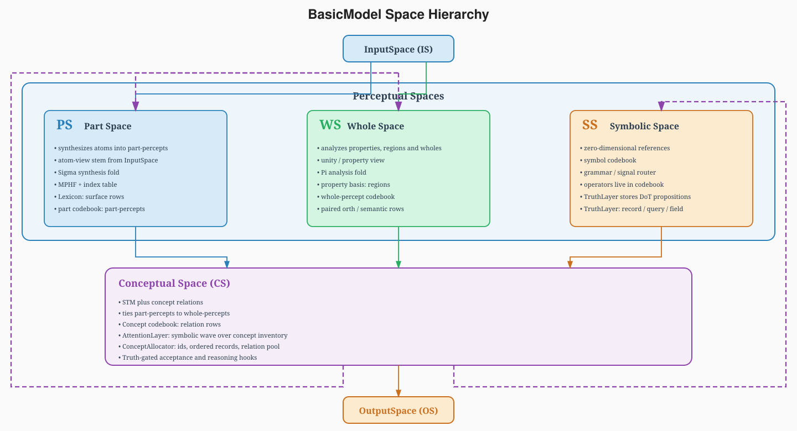

# Spaces

> **Architecture relation.** The Space/SubSpace split is where BasicModel most
> directly departs from conventional LLMs: hidden state is routed through named
> percept, concept, symbol, STM, and codebook stores instead of one residual
> stream. PartSpace/WholeSpace plus the Concept codebook provide the fuzzy
> Formal Concept Analysis reading (extent, intent, and concept order), while
> SymbolSpace and the grammar host provide the DisCoCat-like composition path
> from typed syntax to vector meaning.

> **2026-06-21 terminology note (one noun per-space).** This doc follows the
> percept / concept / symbol convention: a **percept**
> is a PartSpace/WholeSpace thing (dimensionally-embedded, extensional; the two
> subtypes are **part-percepts** = atoms, $\sigma$, and **whole-percepts** =
> properties/regions, $\pi$); a **concept** is a ConceptualSpace relation tying one
> part-percept $\leftrightarrow$ one whole-percept (the Concept codebook); a **symbol** is a
> SymbolSpace 0-D reference to a concept. The prose below
> reserves "symbol" for genuine SymbolSpace things; WholeSpace content is
> whole-percepts. Symbols are formed strictly downstream of ConceptualSpace;
> they are references to concept ids, not WholeSpace rows. Code identifiers
> (e.g. `get_symbols`, `subspace.what`) are
> unchanged — those get a separate code pass.

> **2026-06-12 update (part/whole rename — the perceptual split).**
> `PerceptualSpace` $\to$ **`PartSpace`** and `SymbolSpace` $\to$
> **`WholeSpace`**; both now subclass a thin shared
> `PerceptualSpace(Space)` base (no parameters, no submodules —
> state-dict keys unchanged). Both views are *perceptual*: PartSpace
> synthesizes bottom-up over atoms (Sigma), WholeSpace analyses
> top-down over unity (Pi). XML config sections and grammar-file
> scopes are renamed to `<PartSpace>` / `<WholeSpace>` to match. The
> PS/SS shorthand in older notes reads part-side/whole-side. The freed
> name `SymbolSpace` was **reintroduced 2026-06-19** as the grammar/word
> space-role (formerly `WordSpace`).
>
> **At the corpus callosum, objects are analysed and synthesized** —
> by sending them back to PerceptualSpace: wholes get split and parts
> get chunked. In symbolic "mode", the objects that get sent back are
> *symbols*.
>
> **Terminology (semiotics).** There are **objects** and
> **references**. A reference is either a **sign** or a **symbol**. A
> *sign* is a quantized version of the referent (same space, snapped
> to a codebook row). A *symbol* is a downstream, zero-dimensional
> reference to a concept id. It is not a special kind of WholeSpace
> percept and has no learned WS row.
>
> **2026-07-20 inventory migration — `subspace.what`: atoms vs properties.** On
> `PartSpace` the `.what` rows are **atoms** (letters and words — the
> existing lexicon / BPE / MPHF front ends, gathered by
> `Codebook.lookup`). On `WholeSpace` the `.what` rows are **properties**,
> and properties are what wholes *are*: a `.what` row is a binary
> proposition over the field, and only a proposition can bifurcate the
> input into two clearly-identified regions (`+1` has-type / `-1`
> complement) the way `materialize_property` does below. Types apply to
> **runs of characters, not single characters**. BasicModel begins with a
> small basis of roughly eight ASCII-class properties (letters, capitals,
> digits, punctuation, whitespace, and the remaining byte classes), one
> codebook row per property. This is an initial learned basis rather than a
> permanently closed ontology: dynamic properties may grow the WS inventory,
> potentially toward PartSpace scale. Such growth never allocates a concept or
> symbol in WholeSpace. Property activation may overlap: for example, an ASCII
> capital activates both `letter` and `capital`; that conjunction does not mint
> a ninth property row. A whole is a
> **maximal constant-type run**; words are runs of letters, punct, or
> digits.
> `materialize` hands the per-position selection (`subspace._index`,
> renamed from `_active` 2026-06-12) to the codebook so it produces the
> materialized object: atoms via `lookup`, or a per-position **region
> membership** via `Codebook.materialize_property` (`mode="property"`) —
> the region that has the property (`> 0`) and the region that doesn't
> (`<= 0`). The continuous sinusoid backend is wired as the worked
> example; the content-keyed (whitespace/words) backend reuses the
> meronymic analyzer's span segmentation and is a documented seam.
> Properties are **low-frequency by construction**: there is too much
> detail to learn a codebook over the whole input unless the atoms are
> low-frequency, so the property basis frequency is tied to the input
> length (the k-th harmonic completes only ~k/2 cycles over the whole
> field, mirroring `EndpointSumWhere`'s sub-half-period `div_term`). The
> learnable property row is the low-frequency atom; the basis enforces
> the coarseness.

> **Perception after 11c (September 24).** PartSpace combines ordered
> parts; WholeSpace divides the field by primitive properties. Neither owns
> a sigma/pi fold layer. Native codes stay in the same `[0,1]^D` cube;
> rank is mereological level, not a change of dimensional space. Sigma and
> pi are conceptual and grammatical operations. Concept presence keeps two
> nonnegative poles; negation exists only for concepts, not percepts (or
> symbols). The membership read is independent of distributed codes.

> Grammar dispatch lives on `SymbolSubSpace.languageLayer`. `LiftLayer`
> and `LowerLayer` own their grammatical operations; perceptual towers do
> not supply their parameters.

## Overview

BasicModel is a pipeline of five **spaces** plus a grammar host
(`SymbolSpace`), each performing a distinct representational
transformation. Data flows forward from raw input to task output; the
reverse pass reconstructs the original input from the symbolic
representation. The legacy `SubwholeSpace` and `SyntacticSpace`
classes have been retired — the subsymbolic role is filled by
`PartSpace` itself, and the grammar runs from
`SymbolSubSpace.languageLayer` (the signal router; subsumed the retired
`Chart`).

**`SymbolSpace` literally subclasses `Space`** (`class
SymbolSpace(Space)`, [`bin/Language.py`](../bin/Language.py)), but it is the
downstream reference/grammar coordinator rather than a third learned percept
inventory. It constructs via
`nn.Module.__init__` directly, deliberately SKIPPING `Space.__init__`'s
object/what/where/when VQ-basis build, and holds a `SymbolSubSpace`
coordinator (the typed-STM stack + grammar dispatch carrier) as
`self.subspace`. `SymbolSpace` is a transparent container: reads that
miss its own attrs fall through `__getattr__` to the held coordinator,
and writes forward through `__setattr__`, so `symbolSpace.X` call sites
are unchanged whether `X` lives on `SymbolSpace` or on the coordinator
it forwards to.

```
Forward (space ownership): InputSpace -> {PartSpace, WholeSpace, SymbolSpace,
                              LanguageSpace} -> ConceptualSpace -> OutputSpace
Reverse:                    OutputSpace -> SymbolSpace -> ConceptualSpace
                              -> {PartSpace, WholeSpace} -> InputSpace
```

The forward line describes ownership rather than a same-tick linear chain:
PS/WS form the subsymbolic peer result; SS returns a symbol reference; and
LanguageSpace returns a grammar/routing plan. ConceptualSpace is the sole
reducer and owner of its `CSsub`, `CSsym`, and `CSLang`/STM commits.

### SymbolSpace and LanguageSpace: reference, grammar, and scheduling

`SymbolSpace` is the discrete, inspectable boundary of the model: a symbol is
a typed, zero-dimensional reference to a ConceptualSpace concept, carrying its
reference activation rather than a third perceptual codebook row.  This makes
the concept-to-symbol transition the natural place to expose grammatical role,
derivation provenance, and a stable reference for an external truth or
reasoning system.  It does **not** make SymbolSpace the owner of a separate
continuous concept store; concept allocation, conceptual STM, and their
mutation remain ConceptualSpace responsibilities.

The grammar operator inventory is executed by `LanguageLayer`, registered once
under `SymbolSubSpace.languageLayer`.  `LanguageSpace` is the runtime
scheduling facade for that same layer: in the serial peer pipeline it consumes
the completed symbolic result, chooses grammar operations, returns immutable
choice tensors, and owns the grammar latch timing. It does not duplicate
`LanguageLayer` parameters or grammar state, and it cannot directly mutate
ConceptualSpace STM. ConceptualSpace applies each returned Binary or Unary
choice to its own buffer/depth/order/reference tensors through its `CSLang`
transaction lane. `CSLang` is only the ownership name of the existing CS STM;
it does not register another module or copy its state. This preserves an
inspectable separation between:

- **concept references** (`SymbolSpace`),
- **grammar execution and its persistent state** (`SymbolSubSpace` /
  `LanguageLayer`), and
- **pipeline timing** (`LanguageSpace`).

`SymbolSubSpace.reconstruction_stack` is the sole owner of the detached
sentence-construction teacher. It retains the exact radix spelling of every
word (`[B,W,P]` IDs plus mask), optional durable concept IDs, the exact percept
leaves, and the committed grammar rule IDs/arities. The complete compiled
sentence loop carries fixed tensor slots (two binary opportunities and one
unary opportunity per capacity position, followed by the bounded drain), but
its `torch.while_loop` writes only live word positions. Dense surface targets
are copied at the eager lexical boundary, outside capture. The compatibility
K=1/K=2 word cell writes the same fixed local layout; its eager adapter remaps
that slab into sentence-global slots without putting a changing chunk offset
in the compiled graph.
The old `BasicModel._stm_pre_reduce_slab`, `_stm_reduce_op_trace`, and
`_stm_trace_sentence_scope` caches no longer exist. These records are detached
targets for the statically registered `ReverseConstructionChooser`; the
chooser's only semantic input is `stopgrad(S)`. It predicts active
unary/binary slots, global rule IDs, and exact percept leaves. Compatibility
evaluation may still replay the trace, but canonical training does not: no
reverse loss derivative crosses back into the completed idea or its recurrent
construction.

When `forwardGrammarWeight` is nonzero, the same fixed trace layout also
carries a bounded local loss for each committed fold. Unary and binary layers
contrast their type-valid alternatives using detached child/candidate
evidence, so only the grammar chooser is updated. This gives the forward
derivation direct pressure without extending the autograd path across words.

An application-level truth engine may bind those stable references to typed
propositions, provenance, certainty, or an operator tree.  That policy belongs
above the BasicModel runtime; the model's invariant is that a symbolic result
can be traced back to its concept reference and grammar operation without
silently collapsing it into a perceptual row.

The pre-2026-05-27 "two feedback loops" (S $\to$ C per-stage, C $\to$ P
cross-forward) are retired. The recurrent character lives in (a) STM
accumulation across words in SERIAL / GRAMMATICAL mode, and (b) the T-pass
PARALLEL refinement loop driven by `<subsymbolicOrder>` via
`WS.forward(cs_out=...)` / `CS.forward(...)` iterations — PS itself runs
ONCE, at stage 0 only; the per-stage recurrence advances through the prior
stage's CS output, not repeated PS calls (see **Sigma / Pi ownership**
below).



---

## Base Class: Space

All spaces inherit from `Space`, which manages:

- **Shape management.** `inputShape` / `outputShape` as `[nObjects, nDim]`.
  Subclasses read dimensions from `TheObjectEncoding`.
- **Codebook / VQ quantization.** When `nVectors > nActive`, a codebook holds
  candidate vectors; top-k selection gives the bottleneck.
- **Reshape flag.** When in/out object counts differ, the `[B, nIdeas, nDim]`
  tensor is flattened before the next space and restored on the way back.
- **Attention.** The legacy boolean `hasAttention` is deprecated and inert
  (kept only as a backward-compat alias); use the `<attention>` element
  instead (`off` | `primer` | `second-order` | `low-rank`).
- **`set_sigma` propagation.** Ergodic-mode noise level cascades from the
  top-level model down through every child layer.

### Reset cascade: hard vs. soft {#reset-cascade-hard-vs-soft}

Every space exposes `Reset(batch=None, hard=True)`. The signature is required
(legacy zero-arg fallback removed).

| Call form | Scope | Use |
|-----------|-------|-----|
| `space.Reset()` | All rows | Whole-state wipe (epoch boundary) |
| `space.Reset(batch=b, hard=True)` | Row `b` only | Document boundary |
| `wordSpace.soft_reset(batch=b)` | Row `b` sentence-scoped state | Grammar `<start>` reduction |

Hard-reset clears: parse stack, `_last_svo`, `_stm_fired`, codebook commit
accumulator, discourse history, `serial_cache`, `_ar_embedded`,
`_end_of_stream` for the affected rows.

Soft-reset clears per-sentence working buffers (parse stack rows, `_last_svo[b]`,
category and reconstruction stacks) and re-arms `_stm_fired[b]`. Does **not**
touch discourse history (`InterSentenceLayer` ring buffer) or codebook EMA ---
those are document-scoped.

Reset is dispatched from `runEpoch`, never from inside `runBatch` (the pure
compute brick --- see [Architecture.md](Architecture.md)).

---

## Perceptual and conceptual ownership {#sigma-pi-ownership}

Perception is analysis and synthesis of what is present. PartSpace combines
ordered parts with AND; WholeSpace divides allowed primitive sets with OR
and reads their pervasion with min over positions. Sigma and pi are
conceptual operations: pi within the order-0 field, sigma there and over
previous-order symbols, with symbolization raising order.

| Space | Owns | Forward |
|---|---|---|
| PartSpace | native percept inventory, radix ids and ordered witnesses | synthesize located parts; code = max of constituent codes |
| ConceptualSpace | persistent definitions, transient attended rows, codes and STM | read memberships, compose field pi/sigma, then symbolize and union |
| WholeSpace | primitive property memberships and analysis spans | read allowed sets per position and pervasion over runs |

The two perceptual `forward(in_sub, cs_out=None)` signatures remain.
Subsymbolic passes can change attention or level but apply no learned fold
inside a tower. There is no perceptual layer stack kept beside this route.

**Composition (per-mode):**

- **SERIAL / GRAMMATICAL** (`<serial>true</serial>`): one
  iteration per word.

  ```
  CSSub(w):    IS(w) -> { PS(w), WS(w) } -> CS reduction
  CSSym(w-1):  symbolicOrder x (CS -> SS -> CS)
  CSLang(w-2): word-reference deposit -> object-reference resolution
               -> LS Binary choice -> CS Binary apply
               -> LS Unary choice  -> CS Unary apply/STM commit
  ```

  These are three peer-pipelined dependency stages over adjacent word indices.
  The braces inside CSSub are peers, not a left-to-right call order: Input is
  never routed from PS into WS. The eager lexical boundary stages a separate
  property activation for every WS word, so WS reads only the current word
  rather than repeatedly analysing the full padded sentence. Within CSSym,
  the `CS -> SS -> CS` recurrence is intentionally sequential and runs exactly
  `<symbolicOrder>` times to promote conceptual order. CSLang deposits the
  word concept into CS STM; interpreting that reference replaces it with the
  paired object concept before Language builds the object concepts into a
  syntax tree. The pre-deposit capacity Binary and ordinary post-deposit
  Binary are separate grammar opportunities and both remain present; the
  ordinary Binary is the reduction that constructs a parent. Binary apply
  precedes Unary choose because Unary reads that parent. `CSsub`/`CSsym`
  snapshots handed to a non-owner are read-only, and only CS computes or
  commits conceptual or STM transitions. Production carries all three stages
  through one tensor `while_loop`; W is a storage capacity, and the
  loop drains the final CSSym product, final CSLang transaction, and one
  deterministic CSLang-to-CSSym grammar register after the last live word.
  The forward CSSub→CSSym and CSSym→CSLang “latches” merely retain completed
  tensor products; they are not duplicated Space state.

- **PARALLEL** (`<serial>false</serial>`): T iterations of PS over
  CS.

  ```
  contribution = PS.forward(IS)      # PS runs ONCE, at stage 0 only -- not
                                     # repeated per stage (single-pass subsymbolic decision)
  for t in 1..T = <subsymbolicOrder>:
      # Universe glue contract (dual-towers rev 2): sparse-parallel
      # (symbolicOrder > 0) offers the universe EVERY stage; otherwise it
      # bootstraps stage 0 only and t > 0 stays carrier-driven.
      WS_t = WS.forward(unity if (sparse_parallel or t == 0) else None,
                        cs_out=prevCS_forSS)
      CS_t = CS.forward(contribution, WS_t)   # STM[t] = combine (parallel write; no shift)
      contribution = CS_t             # stage k+1's contribution IS stage k's CS output
  router.dispatch_at_C(STM)           # grammar ops after STM population
  ```

The legacy formula `C = sigma_percept(pi_input(IS) + pi_concept(C_prev))`
is retired entirely.

### Lift / Lower in the new ownership

`LiftLayer` and `LowerLayer` are no longer "rule-id annotators over
shared substrate." They are first-class binary `GrammarLayer`
subclasses (Stage 4 of the substrate refactor):

- `LiftLayer(GrammarLayer)`: `arity=2`, `rule_name="lift"`, `space_role='CS'`.
  Owns an internal `self._sigma: SigmaLayer` for the pairwise additive
  (sigma-style) math. `forward(left, right)` delegates to `_sigma.compose`.
- `LowerLayer(GrammarLayer)`: `arity=2`, `rule_name="lower"`, `space_role='CS'`.
  Owns an internal `self._pi: PiLayer` for the pairwise multiplicative
  (pi-style) log-domain math. `forward(left, right)` delegates to
  `_pi.compose`.

Both reverse cleanly via their internal layer's reverse. Both gain
butterfly mode for free via `GrammarLayer` base inheritance (Stage 5).

Both charts are bounded in the backward on the grammar's fold layers
(2026-09-12): the internal `SigmaLayer` of `lift` and the internal
`PiLayer` of `lower` (and their subclasses) carry `_bounded_backward`, so
their `atanh(x)` and `log((1+x)/(1-x)) = 2 atanh(x)` keep exact forward
values and clamps while the gradient slope is capped at the tangent at
`|x| = 0.9` (`Layers.bounded_atanh`, `PiLayer._log_mult`; custom autograd
Functions saving only the input). Operands at +-1 are ordinary (max-law
unit codes, `chunk` sums, saturated folds), and the exact derivative
`1/(1-x^2)` (5e6 at the clamp) compounded through the nested folds of a
long packed row into NaN parameters
(doc/benchmarks/2026-09-11-fold-ladder-throughput.md). Space-level and
readout layers keep the exact chart: the cap under-converged the crisp
XOR fits (`test_explicit_dimensions.py`), and the compounding needs the
nesting.

The signal router dispatches them as binary reduce ops at the CS,
weighted by `Grammar.rule_probability` (the per-position copy/reduce
score head).

### Butterfly mode on `GrammarLayer` (Stage 5)

`GrammarLayer(butterfly=True, N=N)` allocates an FFT-style
**element-pair** cascade over a flattened `[B, M]` view (`M` = `N`
padded to the next power of two; `n_levels = log2(M)`), NOT a packed
per-node matrix Parameter. Storage is three per-node LDU-triplet
`nn.Parameter`s shared by every `GrammarLayer` subclass ---
`butterfly_L: [n_levels, M//2]`, `butterfly_d: [n_levels, M//2, 2]`,
`butterfly_U: [n_levels, M//2]` (sub-diagonal, the two diagonal
scalars, super-diagonal of each node's `2 x 2` LDU block) plus a
`butterfly_perms` buffer (per-level bit-reversal permutations placing
XOR-neighbour elements adjacent). Identity init (`L=0, d0=d1=1, U=0`)
makes the cascade identity at construction. `_butterfly_pair_forward`
/ `_butterfly_pair_reverse` (`GrammarLayer`,
[`bin/Layers.py`](../bin/Layers.py)) implement the closed-form `2x2`
LDU pair op ONCE at the base class -- sign-flip on the off-diagonals +
reciprocals on the diagonals, no `torch.linalg.solve`. Every
`GrammarLayer` subclass (`SigmaLayer`, `PiLayer`, `LiftLayer` /
`LowerLayer`, `IntersectionLayer` / `UnionLayer`,
`ConjunctionLayer` / `DisjunctionLayer`, ...) reuses this SAME pair op
via `self._butterfly_forward` / `self._butterfly_reverse` in butterfly
mode; there is no per-subclass `_butterfly_pair_op` override or
distinct pairwise math (atanh/einsum/tanh, min/max, etc.) --- the
subclass identity only matters for the non-butterfly forward/reverse
math.

Parameter savings: `O(N · log N)` scalars per cascade vs `O(N² · D²)`
for a single big matrix. The `<sigmaPi>` mode selects the grammatical
layers' implementation. Perceptual passes do not allocate these layers.
The primitive XOR gate uses located conceptual definitions and sigma over
their symbols; see [Testing](Testing.md#item-11c-located-xor-and-native-perception-2026-09-24).

---

## Normalization and Ranges

| Space | Data Contract | Geometry |
|-------|--------------|----------|
| InputSpace | Measured tensor features scale to presence; signed text embeddings retain sign | `[0,1]` for presence data; `[-1,1]` for text embeddings |
| PartSpace | Modal/demuxed what/where/when encoding. Marked radix/meronomy percept stores expose one-sided presence; the orthographic Lexicon remains signed | `[0,1]^d` for percept-store rows; signed projective unit ball for Lexicon rows |
| ConceptualSpace | One opaque code per concept: no where/when band (`canonical_shape` is `(0, 0)`); a concept has generalised over the where and when modalities and cannot be divided (Architecture, "Concepts are opaque; percepts and symbols are located"). Positive concept atoms are scaled by signed, tanh-bounded activations | positive atom geometry with activation in `[-1,1]` |
| WholeSpace | Whole-percept property memberships | `[0,1]` presence |
| SymbolSpace | 0-D references to ConceptualSpace concept ids | reference activation |
| OutputSpace | Rescaled from activation range to original data range | Data range |

`SyntacticSpace` is retired (see Section "SyntacticSpace --- retired" below).
Grammar / chart machinery lives on downstream `SymbolSpace`; it is not owned
by the WholeSpace property inventory.

**Data scaling.** `Data` computes global `input_min`/`input_max` and
`output_min`/`output_max` at load time. InputSpace uses `Data.normalize(x,
"input")` to scale measured presence data to `[0,1]`; signed text embeddings
remain in `[-1,1]`. OutputSpace uses `Data.denormalize(x, "output")` to restore
the original output range.

**Whole-percept presence.** Whole-percepts live in `[0, 1]`; since conceptual
activations range `[-1, 1]`, the mapping is `presence = (activation + 1) / 2`.
`SubSpace.get_symbols()` / `set_symbols()` (code identifiers unchanged) perform
the conversion.

**Demuxed mode.** When `InputSpace.demuxed=true`, what/where/when components
are stored independently in the SubSpace rather than concatenated. ModalSpace
routes each component through independent PartSpaces; downstream spaces
see an identical muxed tensor via `materialize()`.

---

## Percept Geometry: Positive Unit Hypercube {#percept-geometry-positive-unit-hypercube}

> **Design.** A percept is a vector of independent **presence** features. Each
> coordinate is a membership in `[0,1]`: `0` is absent or nothing, `1` is fully
> present or everything, and intermediate values are partial presence. A
> percept is one-sided; its opposite is the complement `1-x`, not the signed
> negation `-x`.

The percept hypercube is the grounded extent side of the architecture. An LLM
usually learns such grounding indirectly through token statistics; BasicModel
keeps percept presence as an explicit carrier. Formal Concept Analysis enters
when perceptual extents are paired with whole/property intents to form concept
order. DisCoCat enters later, when grammar composes conceptual meanings rather
than raw percept memberships.

Percepts and concepts therefore use different geometries: percepts use the cube
for presence, while concepts use a positive atom whose signed scalar activation
carries polarity and certainty. Keeping the roles distinct avoids treating a
percept's unused negative half as if it were sensory content.

### Presence, Not Signal {#percept-presence}

A percept feature answers *how present is this?*

| Value | Meaning |
|---|---|
| `0` | nothing or absent; the empty corner |
| `1` | everything or fully present |
| `x in (0,1)` | partial presence |

There is no negative presence. On the percept path:

- `ConceptualSpace.factor_percept` (a staticmethod, [`bin/Spaces.py`](../bin/Spaces.py))
  keeps the percept INPUT non-negative (`percept.clamp(min=0)`; percepts are
  one-sided) but the EVIDENCE it returns against a CS concept row is
  SIGNED in `[-1, +1]` (2026-07-06 correction: abs-argmax selection so an
  anti-aligned row — a "known false" exclusion — is reachable, not clamped
  away); a zero percept yields zero evidence (the dot-product tautology).
- The meronymic membership folds (`SigmaLayer2` / `PiLayer2` in
  [`bin/Layers.py`](../bin/Layers.py)) operate on memberships in `[0,1]` through
  `log`/`exp`, flooring the bottom element with `EPS_LOG` before `log(0)`.
- A marked radix/meronomy Codebook (`is_percept_store`) is read through a UNORM
  straight-through clamp, so forward lookup and reverse decode see the same
  `[0,1]` rows while the float master remains trainable.

The signed orthographic Lexicon is a separate path. Its sign is form content,
so it stays in the projective unit-ball geometry described under
[Lexicon](#lexicon-projective-unit-ball).

### Complement, Copart, and Negation {#percept-complement}

A percept's opposite is its complement:

```text
antipode_percept(x) = 1 - x
```

Mereologically, the complement of a part is its **copart**, the rest of the
whole. With the whole normalized to `1`, the carrier `[part, copart] = [x,
1-x]` has dependent axes; the copart is derived rather than stored.

This is not the catuskoti/tetralemma carrier. That truth representation has two
independent axes so it can distinguish BOTH from NEITHER:

| Carrier | Axes | Redundant? | Layer |
|---|---|---|---|
| part/copart `[x, 1-x]` | dependent | yes; collapse to one `[0,1]` coordinate | percept |
| catuskoti `[TRUE, FALSE]` | independent | no | concept/truth |

Complement on `[0,1]` and negation in centered signed coordinates are the same
reflection. Let `y = x - 1/2`; then `1-x = 1/2-y`. The operation is shared, but
the stored carriers and their semantics remain distinct.

**Consequence for expectation and attention (2026-09-20).** The cube has a
complement but no additive inverse: `x + (1 - e)` leaves `[0,1]`, and nothing
added to a presence cancels it. Expectation enters the mind as a
*negative image*, the sign-reversed predicted idea added to what was composed,
so it cannot be formed over percepts or over the order-0 presence field; it
is formed over the sealed idea, at order 1 and above, where the signed carrier
exists. Sensation is therefore never subtracted from. What the unsigned
carrier does support is withdrawal, the non-affirming `non`, and that is how
attention works here: the reading scope and the priority surface exclude
the non-object without predicting it. See the
[accessible-mind spec §2.6.2](specs/2026-09-20-accessible-mind-subsystems.md#262-negation-exists-only-for-concepts-not-percepts-or-symbols)
and [Philosophy](Philosophy.md#expectation-as-a-negative-image-attention-as-exclusion-2026-09-20).

### Sigma/Pi Membership Lattice {#percept-membership-lattice}

The meronymic fold/split operators form a bounded lattice:

| Operator | Role | Identity | Absorber |
|---|---|---|---|
| sigma | synthesis / union | `0`: `x union empty = x` | `1`: `x union everything = everything` |
| pi | analysis / intersection | `1`: `x intersection everything = x` | `0`: `x intersection empty = empty` |

These are set-membership roles, distinct from evidence on two conceptual
poles. A membership zero rules out pervasion at an observed position;
conceptual `(0,0)` is uncertainty and adds no evidence.

### The Fold Ladder (2026-09-10, updated 11c) {#fold-ladder}

WholeSpace's constant-signature runs supply positions and word units supply
extents. The ordered canonical PartSpace ids, masks and brackets retain the
surface witness. Recurrence admits composite parts at the boundary, and a
part formed in a turn does not aggregate again in that turn. Higher rank
means a larger part or a finer whole, in the same membership cube. It is not
a sequence of learned perceptual transforms.

A word's distributed code is the **coordinatewise max of its constituent
codes**. Repeated constituents are idempotent. **Anagrams share this code**;
only the ordered containment read and retained witness distinguish them.
The code is useful for similarity and reconstruction but cannot be the
word's presence test. WholeSpace properties are max over allowed primitive
memberships, then min over every observed position in a run. The 11a priors
and segmentation are unchanged.

### Percept-to-Concept Seam {#percept-concept-seam}

The order-0 definition addresses PartSpace percept rows and WholeSpace
property rows. A present feature contributes to the pole selected by its
signed conceptual weight. Required evidence is min over nonzero
contributions on each pole; alternative definitions are max. Missing
percepts assert neither. No projection onto codes or evidence floor occurs
at the seam. Pi edges above this membership read intersect order-0 field
readings, retaining designated occurrence brackets before the extent union.

*Item 9b (decided in direction, Alec 2026-09-25):* the seam becomes a
per-bracket read. Each percept row's presence and observed complement are
pooled over the occurrences inside the one convex bracket of attention
before the definition matrix reads them; the per-extent, per-position
tensors and the retained pairs in the conceptual field go, and exact
co-location stays in perception (fused parts, pervading runs). See
[Architecture](Architecture.md#one-where-one-when-many-whats-the-field-attention-and-the-two-modes-item-9b-september-25).

Concept ids persist; order-0 field rows bind per turn. The field is common
to all concepts, and precision belongs only to location. Max over occurrences
inside the subject keeps both poles. Symbolization raises order; subsequent
rows use sigma over the preceding symbols, never pi edges.

### Geometry Split {#percept-geometry-split}

The implementation keeps percept and concept/symbol carriers distinct:

| Property | Percepts |
|---|---|
| space | positive unit hypercube `[0,1]^D` |
| coordinate | per-axis presence |
| opposite | complement `1-x` |
| sides | one-sided |
| metric | membership distance; presence MSE for the marked store |
| magnitude | presence per axis |

| Property | Concepts / symbols |
|---|---|
| space | signed unit concept atom scaled by a signed activation |
| coordinate | atom direction plus activation polarity and certainty |
| opposite | negation `-x` |
| sides | two-sided sign is semantic content |
| metric | dot product for concepts; projective lookup for Lexicon rows |
| magnitude | scalar activation carries certainty |

The parallel conceptual field uses independent `(c⁺, c⁻)` presences and two
symbols per code, as detailed below. The table above describes the signed
vector geometry of an individual serial reference, not storage of that pair.

In the aligned serial conceptual implementation, the stored `ConceptDim` atom
is a signed unit direction. Magnitude lives in the scalar activation:
`concept_code = signed_activation * atom`. The canonical serial dictionary is
initialized on that sphere and is not an Adam parameter: after a sentence
completes, its owner takes one detached contextual snapshot, reduces all
evidence for a row, and applies an exact tangent rotation. Its
construction-time Parameter is converted into a persistent non-grad buffer.
Its eager read-only lookup boundary gives compiled consumers a working tensor
without an autograd edge to the dictionary. A rotation keeps the original unit
norm, so there is no post-step codebook normalization pass or large-table
indexed Adam write. The percept input is still *not* normalized; only the
temporary contextual update direction is normalized.

A symbol is also not a synonym for a concept or a whole. A concept is a
`ConceptualSpace` relation over percepts; a symbol is a reference to a concept.
Their epistemic roles remain distinct even when a signed geometry is shared by
an implementation path.

### SBOW Situates Concepts, Not Percepts {#percept-sbow}

The legacy `conceptual_sbow_loss_codes` path in
[`bin/embed.py`](../bin/embed.py) remains available for non-serial experiments.
The canonical serial path instead uses a detached, deterministic contextual
SBOW reducer: leave-one-out sentence context attracts each observed concept
atom, hashed detached negatives repel it, repeated observations are reduced by
row, and the codebook owner commits one tangent rotation. This has the same
angular geometry without making the million-row dictionary optimizer-owned or
allocating RowLocalAdam state in the recurrent training path.

Percepts are deliberately not SBOW-situated:

1. Percept identity is grounded by nearest-row decode in its perceptual metric;
   moving a row changes the token or signal it denotes.
2. Byte spans, `.where`/`.when`, and the meronymic tower anchor its structural
   role.

Distributional movement would therefore break grounding even if the
composition algebra remained invertible. Concept codes can move by
substitutability because their identity is mediated; percept rows cannot.

### Bounded Encodings {#percept-bounded-encodings}

The bounded ranges admit efficient fixed-point storage:

| Format | Range | Intended carrier |
|---|---|---|
| UNORM | `[0,1]` | percept presence |
| SNORM | `[-1,1]` | signed concept/symbol values |
| Q-format fractional | bounded signed or unsigned range | CPU/DSP equivalent |

Training remains in `float32`/`bf16`. Forward-time range enforcement keeps a
float master and uses a straight-through clamp or row projection; the
percept-to-concept seam does not use tanh/atanh. Over a bounded unit range,
SNORM16 has a roughly `3e-5` uniform grid and is finer than bf16 across most of
the interval; SNORM8 is materially coarser.

### Live Paths and Migration Status {#percept-live-path}

The tracked baseline enables the global meronomy chart, but the actual carrier
still depends on the input and synthesis mode:

| Path | Live representation |
|---|---|
| measured tensor (`input_presence=True`) | normalized to `[0,1]` |
| text embedding (`input_presence=False`) | retained in `[-1,1]` |
| radix/meronomy percept store | UNORM `[0,1]`; presence decode |
| orthographic Lexicon | signed projective unit ball |
| conceptual atom | signed unit atom; bounded signed concept value |

The canonical radix/property path is membership-native throughout: codebook
read, many-to-one word union, and learned invertible sigma/pi order raises all
consume and return `[0,1]` directly. The signed truth evaluation chart is not
used at this seam. The orthographic Lexicon remains a compatibility store and
is not the canonical `BasicModel.xml` surface path.

### Mereological Guarantees {#percept-guarantees}

The encoding is hybrid.

**Guaranteed by construction:**

- Byte-position structure - radix longest-match, slot order, the exact
  id-to-bytes table, `.where`/`.when` brackets, and run containment - does not
  depend on vector position.
- When a fold is configured as invertible/butterfly,
  `compose(generate(y)) == y` follows from its LDU/butterfly form. A bare linear
  fold does not provide that guarantee.

**Anchored by the perceptual metric:**

- Vector-to-token identity uses complement-aware presence MSE on the marked
  percept store and wrapped/projective lookup on the signed Lexicon path.
- The learned sigma composition determines which whole a part set produces.
  Radix supplies ordered references through a trie; it is not place-value
  arithmetic.

Moving percept rows would leave byte structure and configured invertibility
intact while redirecting nearest-row decode. The model could compose and
decompose consistently yet name the wrong token, which is precisely why
percepts remain anchored.

See also [Mereology](Mereology.md) and [Logic](Logic.md).

---

## Codebook Similarity Metric

`Codebook` wraps `VectorQuantize`. Similarity metric per space:

| Store | Geometry and metric | Retrieves |
|---|---|---|
| PartSpace radix/meronomy | `[0,1]^d`; presence MSE | percept-presence row |
| WholeSpace property basis | `[0,1]^d`; property-membership metric | whole-percept property row |
| SymbolSpace | two pole symbols sharing one concept code; serial references keep their event contract | ConceptualSpace concept id and pole |
| Conceptual similarity codebook | unit rows; dot product | SBOW concept row |

The ConceptualSpace entry is the concept dictionary's *situating* metric, not
the forward concept-production path. Its input magnitude carries belief
certainty, and lookup ranks $\arg\max_i(x \cdot c_i)$.

### Presence and Wrapped-MSE (Perceptual / Symbolic)

These codebooks store *what something looks like*, so the right notion is
coordinate-wise distance. The marked percept store uses
`_presence_mse_score`: ordinary unwrapped MSE on `[0,1]^d`, monotonically
remapped so identical rows score `1` and complementary corners score `-1`.
The signed Lexicon and unmarked stores use `_wrapped_mse_score`, which first
wraps the coordinate difference into the signed unit cell. In both cases,
lookup chooses the row with the largest similarity (equivalently, the smallest
MSE in the active geometry).

For an ordinary, unwrapped Euclidean codebook, retrieval expands
$\|x - c_i\|^2$:

$$
\|x - c_i\|^2 = \|x\|^2 + \|c_i\|^2 - 2\,(x \cdot c_i)
$$

$\|x\|^2$ is constant across $i$ and drops from argmin:

$$
\arg\min_i \|x - c_i\|^2 = \arg\max_i (x \cdot c_i - \tfrac{1}{2}\,\|c_i\|^2)
$$

`VectorQuantize` can therefore keep $\|c_i\|^2$ in `_b_norms_sq`:

```python
indices = (flat @ codebook.T - 0.5 * b_norms_sq).argmax(dim=-1)
```

One matmul + one broadcast subtract + one argmax. Skips the `sqrt`, the per-row
$\|x\|^2$ add, and the cdist autograd plumbing.

### Dot product (Conceptual)

> **Note.** This dot-product metric is the `similarity_codebook`'s retrieval
> metric (used by the substitutability / SBOW *situating* signal), NOT the
> forward concept-production path. When the sparse transform is
> active, a paired field is produced by the snap and the concept pyramid,
> using independent min/max reductions per pole and a per-batch taper. Its two symbols scale
> opposite directions of one stored concept code. Dictionary identity and
> evidence are separate. See **ConceptualSpace → The symbolic phase**.

ConceptualSpace concepts are *named directions* in belief space. $x \cdot
c_i$ gives the *signed strength of belief that $x$ affirms concept $i$*:

- $+1$ fully affirms; $0$ orthogonal; $-1$ fully denies

Two consequences:

1. **Codebook must be unit L2-norm.** The canonical concept table is unit at
   initialization and context-owned updates are exact rotations; compatibility
   VQ/EMA paths maintain their own unit invariant.
2. **Input must NOT be normalized.** The magnitude *is* the certainty signal.
   Cosine similarity would divide it out.

For *ranking*, $x \cdot c_i$ and $\cos(x, c_i) = (x \cdot c_i) / \|x\|$ are
monotone-equivalent (positive constant cancels). Omitting input normalization
preserves certainty and costs less:

```python
# codebook is unit L2-norm (maintained by EMA)
indices = (flat @ codebook.T).argmax(dim=-1)
```

### Configuring the metric

`use_dot_product` is a class attribute on `Codebook` (default `False`). Set it
on a Space subclass to opt in --- `ConceptualSpace` does this. The underlying
`VectorQuantize.use_cosine_sim` flag is historical; after the April 2026 perf
pass, input-side normalization is gone, so the effective meaning is "codebook
unit-norm; rank by dot product".

---

## Mereological rank and conceptual order

Native PartSpace and WholeSpace codes remain in the same cube as their
rank changes. Rank describes the size of a part or the fineness of a whole
cut. There is no perceptual fold sequence to invert.

Conceptual order counts symbolizations: observations are order 0,
particulars are order 1, kinds are order 2. The persistent allocator records
the order by concept id. One word form can address concepts at several
orders; selected grammar roles resolve that reference, as specified in
[Lexicon](Lexicon.md#word-forms-and-concept-orders). A proper name selects
a particular, not an order-0 event. Order-0 field slots are rebound each
turn and do not define concept identity.

## Codebook Uniqueness Contract

Every codebook entry is identified by its **row index** and must carry
**distinct `.what` (`WhatEncoding`) content**; the old `.where`-keyed
uniqueness scheme is retired:

- **`.where` --- positional / spatial-extent key (no longer a codebook
  row key).** The cross-codebook **`.where` slice registry was RETIRED**
  (modality re-architecture, 2026-06-04; `WhereEncoding`,
  [`Spaces.py`](../bin/Spaces.py)). `allocate_codebook_slice` /
  `global_max_val` / `reset_codebook_registry` were removed: there is no
  shared where-space to allocate disjoint slices in. Codebook identity is
  now the **row index** (the `_index` selection), `.where` keeps only its
  positional / spatial-extent role, and CS$\to$WS reverse decode is
  **content-match** (nearest row). Cross-codebook taxonomy is row/position-keyed
  via WholeSpace's explicit dicts (`category_ids`, `part_parents`).
- **`.what` --- distinct prototype content.** Identical `.what` collapses to the
  same parthood identity (`equal(A, A) = 1`) --- a redundant pair the network
  can't distinguish.

Current enforcement:

| Source | Mechanism | Status |
|---|---|---|
| WholeSpace codebook | `ImpenetrableLayer` overlap penalty + variance floor; five-relations classifier pushes pairs toward **disjoint** | Opt-in (`<impenetrableOverlap>` / `<impenetrableVariance>` default `0.0`, [`bin/Spaces.py`](../bin/Spaces.py)) |
| ConceptualSpace codebook | `ImpenetrableLayer` available; not yet wired by default | Opt-in |
| PartSpace Lexicon | Cosine-margin pode/antipode SBOW training | Active for trained Lexicons |
| InputSpace vocabulary | Shares PartSpace's Lexicon | Inherited (text); manual (raw) |

`.where` is now a positional / spatial-extent carrier (the slice registry is
retired — see above); codebook identity is the **row index**. `.what`
uniqueness is **learned** (encouraged by `ImpenetrableLayer` + antipodal
quotient) and, together with the distinct row indices, keeps the parthood
lattice well-formed.

---

## Lexicon (Projective Unit Ball)

The **Lexicon** ([`bin/Layers.py`](../bin/Layers.py)) backs PartSpace
word embeddings and WholeSpace whole-percept prototypes. Each row is a vector
$w_i$ in the **projective unit ball** --- the closed ball $B^D = \{x : \|x\|_2
\le 1\}$ with the **negation identification** $w \sim -w$ realizing real
projective space $\mathbb{RP}^D$.

**Terminology pin** --- three notions sometimes conflated:

- **Pode** of $(a, b)$: midpoint $(a + b)/2$; SBOW positive-pair attractor.
- **Wrapped pode**: midpoint via the $\pm$-quotient, $(a - b)/2$; the
  midpoint through *negation* of $b$.
- **Antipode** of a single point $p$: furthest point. On the flat torus
  unique ($\mathrm{wrap}(p + 1)$); on $\mathbb{RP}^D$ **not unique** --- the
  maximum-distance set is the orthogonal hyperplane.

So $-w$ is the **negation** of $w$, *not* the antipode.

### Distance and lookup

For $a, b \in B^D$ the projective squared distance is

$$
d_{\mathbb{RP}}^2(a, b) = \min(\|a-b\|_2^2,\; \|a+b\|_2^2)
= \|a\|_2^2 + \|b\|_2^2 - 2\,|\langle a, b\rangle|.
$$

With $\operatorname{pode}(a, b) = (a + b)/2$ and $\operatorname{wpode}(a, b)
= (a - b)/2$, $d_{\mathbb{RP}}(a, b) = 2 \cdot \min(\|a -
\operatorname{pode}\|,\ \|a - \operatorname{wpode}\|)$. The lookup picks
whichever rep of $b$ ($b$ or $-b$) is closer to $a$.

Sorting by smallest $d_{\mathbb{RP}}^2$ = sorting by largest
$\operatorname{score}(x, w_i) = |\langle x, w_i\rangle| - \tfrac{1}{2}\|w_i\|_2^2$.

Implementation: cache `W_norm2 = W.square().sum(-1)` once per optimizer
step; top-k is `(x @ W.T).abs() - 0.5 * W_norm2` followed by `torch.topk` ---
dense matmul + abs + broadcast subtract. No $V \cdot D$ outer-product.

The `Lexicon` API:

```python
lexicon = Lexicon(V, D)
lexicon.project_unit_ball_()         # after optimizer.step()
W_index, W_norm2 = lexicon.lookup_index()

# Projective (RP^D) --- antipode-aware, default.
idx, dist_sq, scores = Lexicon.topk_rp(x, W_index, W_norm2, k=32)

# Plain L2 --- for sites where w and -w are distinct.
idx, dist_sq, scores = Lexicon.topk_l2(x, W_index, W_norm2, k=32)

# Pairwise primitives:
Lexicon.rp_distance_sq(a, b)
Lexicon.rp_similarity(a, b)
Lexicon.rp_pode(a, b)
Lexicon.rp_wrapped_pode(a, b)
Lexicon.rp_closer_rep(a, b)          # sign(<a, b>) * b
```

For $V \gtrsim 10^5$, use `topk_rp_chunked` to bound peak score-tensor size.

### SBOW training: pode (attractor) and antipode (repulsion target)

- **Pode (attractor).** Positive-pair updates pull $a$ and $b$ toward
  $\operatorname{pode}(a, b)$; the gradient picks the closer of $b$ and $-b$
  for shorter-arc attraction.
- **Antipode (balancing repulsion target).** Negative-pair updates push the
  row toward the furthest point. On $\mathbb{RP}^D$ this is a $(D-1)$-sphere,
  so SBOW samples a representative orthogonal direction.

Negative-sampling gradient has two regimes by $\mathrm{sign}\langle a,
b\rangle$: positive case is standard contrastive repulsion along $(a - b)$;
negative case pushes $a$ away from $-b$ along $(a + b)$.

After every optimizer step the trainer calls `lexicon.normalize()`, clipping
$\|w_i\| \le 1$. `W_norm2` should be refreshed when weights change.

Torus primitives (`Lexicon.wrap`, `Lexicon.delta`, etc.) and the
`torus=True` constructor flag remain as **legacy** static methods (the
earlier Lexicon used the flat torus $T^D = [-1, 1)^D$ with wrapped MSE). New
code must use the `rp_*` primitives.

---

## InputSpace

**Role.** Receives the raw source buffer and lifts it into the model's
internal working dimensionality.

**Text mode forward.** Delegates tokenization to `Lex`, producing a span table
of `(start, end, type)`. Each span $\to$ a vector with two components:

- `nWhat` dims --- token content, encoded via `Basis` / `Codebook` (the word
  embedding lookup).
- `nWhere` dims (4) --- the **2-rung start LADDER** (`WhereEncoding`,
  2026-07-09 multi-rung pass; mirrors the `.when` v2 ladder below):
  $[\sin(p\,\omega_{lf}), \cos(p\,\omega_{lf}), \sin(p\,\omega_{hf}),
  \cos(p\,\omega_{hf})]$ — two TRUE quadrature pairs over ONE quantity, the
  byte **START** position $p$ only (the END is NOT in the band; content
  terminates the tile), with $P_{lf} = $ `<wherePeriod>` (default 8192 input
  bytes; the full-sentence RANGE) and $P_{hf} = P_{lf} / $ `<whereRungRatio>`
  (default 32; the fine RESOLUTION rung — one byte at $\approx$ 0.0245 rad at
  the default period, above the $\approx$ 0.02 rad measured reverse-transport
  noise, the Gate-B closing measurement). `decode` = atan2 per pair + HF
  branch resolution by LF (the canonical positional identifier across IS /
  PS / SS taxonomies). The 2026-06-16 **endpoint-sum BRACKET** form (angle =
  span center, magnitude = span extent, with a `decode_span`) was RETIRED
  from `.where` on 2026-07-09 in favor of this start-only ladder;
  `WhereEncoding` has no `decode_span` (the analyzer-side `EndpointSumWhere`
  in `bin/perceptual_analyzer.py` is a separate codec that keeps the bracket
  form for its own span key). The period is config-derived:
  `<architecture><wherePeriod>`, decoupled from `nObjects`; the build seam
  raise-to-fits with a warn-once for longer inputs (2026-07-04 encoding
  pass).
- `nWhen` dims (4) --- the **2-rung start LADDER** (`WhenStartDurationEncoding`,
  2026-07-04 encoding pass): $[\sin(s\,\omega_{lf}), \cos(s\,\omega_{lf}),
  \sin(s\,\omega_{hf}), \cos(s\,\omega_{hf})]$ — two TRUE quadrature pairs
  over ONE quantity, the event **onset** $s$, with $P_{lf}=$ `<whenPeriod>`
  (default $10^6$ ticks) and $P_{hf} = P_{lf}/$`<whenRungRatio>` (default 32;
  safe branch bound $\approx 35$ at the dense-support phase floor). Constant
  norm $\sqrt 2$; decode = atan2 per pair + HF branch resolution by LF.
  **Shared-HF caveat:** at the default short HF, start-fine is a LOCAL phase
  fingerprint (sharp neighbor discrimination), absolute branch unresolved
  band-only — **absolute addressing rides the exact long-int clock**
  (`BasicModel.when_time`), the Option-C hybrid side-band. DURATION left the
  band (it was write-only: `decode_span` had zero callers, tense rotates the
  onset only, aspect is retired) — exact extents belong to the record store
  when aspect is built. Tense is the onset-vs-`now` relation; `shift_time`
  rotates BOTH pairs coherently, each at its own $\omega$. Both `.where` and
  `.when` are now START-only 2-rung ladders; the endpoint-sum bracket each
  once carried in the muxed band is retired from both (`WhereEncoding` /
  `WhenStartDurationEncoding`) and survives only in the analyzer-side
  `EndpointSumWhere` span codec.

Result: `[nActive, nWhat + nWhere + nWhen]` tensor.

**Text mode reverse.** Inverts the span encoding: each vector $\to$ nearest
codebook entry, then spans $\to$ characters via the stored offset table.

**Numeric mode.** Tensor data passes through unchanged; `LiftingLayer` projects
native input dim (e.g. 784 for MNIST) to `nDim`. Non-embedding inputs are
scaled to `[-1, 1]` via the global data min/max.

**Key parameters.**

| Parameter | Description |
|-----------|-------------|
| `nActive` | Sequence length |
| `nDim` | Output dim per vector |
| `lexer` | (Moved to `<WholeSpace>`, Phase 4b — lexing is analytic cutting. InputSpace executes the intake; the knob lives SS-side.) |
| `codebook` | Whether input values are discrete |
| `demuxed` | Store what/where/when independently |

> 2026-05-28: per-Space `<nWhere>` / `<nWhen>` XML knobs are retired.
> The band is architectural: `architecture.canonical_shape(section)` —
> (nWhere=4, nWhen=4) on every interior space, (0, 0) on OutputSpace
> (the 2026-07-04 encoding pass widened `.when` 2 $\to$ 4; the 2026-07-09
> multi-rung pass widened `.where` 2 $\to$ 4 to match, [`bin/architecture.py`](../bin/architecture.py)).

**Invertibility.** Always non-invertible; reverse is a separate reconstruction
using the span table.

### Document streaming and `valid_mask`

Documents longer than `nOutput` bytes are not truncated. `TheData` maintains a
per-row cursor `(doc_idx[b], offset[b])` and `next_tick()` returns
`(input, output, hard_eos)` where `input` is a `[B, nOutput]` slab containing
the next $\le$ `nOutput` bytes from each row's current document. `hard_eos[b]` is
a host-side bool set when row `b`'s cursor exhausts the current document. A
short fill at document end NULL-pads the slab tail; `valid_mask: [B, K] bool`
flips False for padded positions, and state-mutation propagation skips them.

**Cursor universal --- trial mode for non-AR data.** `next_tick()` is the single
dispatch for both AR text byte (rolling cursor) and non-AR data (numeric).
In trial mode (`slab_bytes` not set), each tick yields one batch of trials
with `hard_eos = [True] * B`. The runEpoch outer loop drives `ds.next_tick()`
directly for both modes; the DataLoader exists only so existing tests can
grab `loader.dataset`.

**Packed word-loop training.** A self-supervised word model may instead set
`<packSentences>true</packSentences>`. `runEpoch` then drives
`next_packed_tick()` over the same B contiguous streams. Each row appends
chronologically consecutive, complete sentences until another sentence would
overflow W, the raw byte slab, or the root FIFO. Boundary tensors let CSLang
soft-reset that row between sentences without padding all rows to a shared
sentence length. The last sentence drains through loss and backward before
the eager boundary resets it. `hard_eos` retains its stronger meaning:
exhaustion of that row's contiguous corpus stream.

`_end_of_stream` is a host-side `list[bool]` diagnostic only; the canonical
hard-reset signal is the cursor's `hard_eos`.

### AR cursor unfold retirement (2026-05-13)

The legacy AR-training path padded + unfolded the embedded sentence
into `[B, K, N, D]` cursor windows so the body could see a
`[B*K, N, D]` parallel view of every prefix. At `bs=128`, `K=128`,
`N=1024`, `D=10`, the unfolded tensor alone was ~320 MB.

The unfold was retired for AR training on 2026-05-13, replaced with a
serial K-cursor loop (`_forward_per_stage_no_unfold`) that walked
the same prefixes with a `[B, N, D]` tensor and a per-cursor causal
mask.

### Within-sentence AR retirement (2026-05-14)

The serial K-cursor loop itself was retired one day later: the
benchmark showed `_forward_per_stage_no_unfold` running at ~18
sent/sec (the K body+head calls dominate) vs the single-shot IR
fast-path's ~61 sent/sec, and the real AR objective in this
architecture is **next-sentence** prediction (the discourse layer) ---
not next-token within a sentence.

**Within-sentence training is now IR-only.** `InputSpace.forward`
emits `[B, N, D]` (left-aligned, right-padded to N) and
`_forward_per_stage` runs a single masked-LM pass:

1. **Stem**: `InputSpace.forward` + `PartSpace.forward` $\to$
   `[B, N, D]`.
2. **Mask**: `create_ir_mask` replaces a `mask_rate` fraction of WHAT
   positions with `NULL_PERCEPT`; pre-mask event stored on
   `_ir_pre_mask_input` as the loss target.
3. **Body**: T stages on B rows (no per-cursor walk, no causal
   mask).
4. **Head**: `outputSpace` $\to$ `[B, N, predDim]`. The head is a side
   channel --- IR loss is computed at the subsymbolic (PS), not at the head.

`runBatch` reads `_ir_mask_positions` and `_ir_pre_mask_input` and
computes `MSE(perceptualSpace.subspace at masked positions,
_ir_pre_mask_input at masked positions)`. The
`<reconstruct>` element (and its `reconstructEnum`) is RETIRED
(A1, 2026-06-09): the ConceptualCombine now unconditionally
integrates all three streams (PS + SS + CS), so reconstruction
is unconditionally from concepts — the former `concepts|symbols|both`
selection (target derived by lifting `_ir_pre_mask_input` through
`sigma_percept`; see Plan Section "Reconstruction-loss target shape"
Option B) is no longer a knob.

`<maskedPrediction>` is retired; `<reconstruct>` is
retired (the `output` mode was the only path that fired the reverse pipeline);
`<reverseScale>` is renamed to `<reconstructionScale>` (the legacy
name remains parseable with a one-shot deprecation warning).

Sentence-level AR moves to `InterSentenceLayer` --- see
`doc/Architecture.md` Section "Sentence-level AR (`InterSentenceLayer`)"
for the ARMA(p, q) design.

---

## PartSpace

**Role.** Synthesize parts in their designated order and extent. Native
percept ids come from the canonical radix tiling; a first witness keeps the
ordered group, and recurrence forms a row at the boundary. Membership reads
containment by ids, without re-expanding and re-matching bytes.

PartSpace owns the percept store and the configured synthesis front end.
`synthesize_word_parts` takes the max of active constituent codes in `.what`
and retains the first active constituent's position band. There is no
`sigma`, per-pass fold stack or learned transformation of the native cube.
The ordered witness supplies the exact reverse. `forward(in_sub, cs_out=None)`
keeps the shared perceptual interface, and conceptual pass-back scales
attention with a strictly positive floor; it cannot hide novel content.

---

## ConceptualSpace

**Role.** Forms concepts from perceptual and symbolic sources. With
`symbolicOrder > 0` in parallel mode, the post-pump snap produces paired
positive/negative evidence per occurrence. A feedforward pyramid composes
that field over the bounded taper span S. `W_sigma` stores disjunctive parts;
`conceptualPi` additionally reads conjunctive parts in `W_pi` within order 0. Both poles
share each part's nonnegative exponent, reducing each pole independently. Two symbols
share one stored concept code. The field feeds the symbol leg and conceptual
losses, without replacing the subsymbolic carrier. `CS.forward` itself
performs STM bookkeeping; the pyramid runs once at `_forward_body`'s cutover.
The [settled design](Architecture.md#decided-in-direction-a-concept-is-sigma-over-pi-alec-2026-09-21)
define the current representation.

**Aligned serial geometry.** The BasicModel path is distinct from the
sparse-parallel phase described below. PS and WS each expose eight live
locations. With `subsymbolicOrder=4`, their three cumulative sigma/pi folds
are fitted without moving feature coordinates across locations and stacked as
`[B, 6, 8, D]`. CS emits the equal local mean while retaining that six-source
carrier and the ordered fold paths. The concept written to STM carries actual
subsymbolic order 3 plus support from orders 1, 2, and 3 on both towers. Its
row comes from one fixed, unpartitioned `nVectors` namespace; row address does
not imply order. The same location rule applies when aligned binding is chosen
in parallel. `ConceptualCombine` is the separate conditional mixing-matrix
path and is not part of serial BasicModel.

**Geometry.** A concept code is `signed_activation × softplus(atom)`: the
dictionary atom is a **strictly-positive** ConceptDim feature signature
(`F.softplus`), and the **sign / magnitude** live in the signed scalar
activation — magnitude = certainty, sign = present vs anti-present, low
magnitude = chosen radially but uncertain. The sign comes from the signed
sparse **weights** (a negative weight = a feature's presence anti-correlates
with the concept), not from a stored signed unit direction. (The legacy
"named unit-norm direction + `argmax` retrieval" view is retired on the
forward path.)

**Owned definitions and carrier.** The conceptual inventory owns sparse
feature references, order-0 conjunctive and disjunctive edges, and higher-order
disjunctive edges. The clean-stack STM retains the incoming event and its
reconstruction witness. Conceptual presence is computed separately from
native memberships; a distributed code is used for retrieval and tied
reconstruction. Reverse conceptual demand descends through cases and then
attributes their percept memberships, using observed evidence when present
and a case choice when imagining.

**The symbolic phase.** With `symbolicOrder > 0` and `serial=false`,
`BasicModel._forward_body` runs the continuous perceptual pump and then
`cs_symbolic_phase` on the settled terminal field:

```text
a0 = cs_read_memberships(percepts, extents) # native definitions, pi/sigma at order 0
a  = pad_concept_axis(a0, sum(caps))
for order in 1..K:
    candidate = sigma_previous_order(a)    # max independently on each pole
    candidate *= detached_use_gate
    rank = max_pole(union_occurrences(candidate))
    a[order_slice(order)] = admit_pairs(candidate, top_k(rank, caps[order]))
pair = union_occurrences(a)                # max; both stays distinct
symbols[2*i]   =  pair[i, :, 0] * code[i]
symbols[2*i+1] = -pair[i, :, 1] * code[i]
```

A negated literal swaps source poles. Requirements reduce nonzero
contributions by min separately on each pole; alternatives use max.
An empty pole asserts zero. Exponents qualify individual memberships;
there is no product or probabilistic union across inputs. Located pi
patterns must match each requested pole at its field bracket before
readout. Pi edges exist only at order 0. Exact forward rails use bounded
log charts for gradients. The dictionary is stored once, and a signed
scalar never collapses both into neither in the field.

`_order_caps()` allocates a tile-based taper `[base, base>>1, ..., 1]`,
shrinking it to fit the dictionary. Only its span S is materialized.
`order_slice(0)` reserves the snap rows; higher slices hold compositions and
the provisional pool. Exponents are trainable and projected nonnegative;
participation is detached EWMA use. Discovery fixes its gate at one.
Contexts are a dense CPU S-by-S tensor. Sparse values and pool metadata
persist once, in the structural sidecar. The module registration supplies
optimizer identities, not a second checkpoint copy.

The concept allocator also owns ordered constituent records. Existing word,
object and chain writers remain until item 7 replaces the sequence and
object-testimony path with the two-truths seal. There is one concept row
inventory, with conjunctive or disjunctive parts, not different row kinds.
`symbolicOrder=0` disables this parallel cutover; aligned serial grammar
continues to use its own event/STM path.

**Activation carrier.** `subspace.activation` remains the ordinary pipeline
presence gate. The conceptual knowing field is the separate paired
`_concept_activations` tensor, whose occurrence axis is retained in the
checkpoint and whose two poles travel through thought effects and the SS
leg. Serial idea vectors and the pending item-7 LTM seal have their own
contracts; neither is a substitute for this paired field.

**MASK on `SubSpace._active`.** Two orthogonal per-position tensors:
`activation` and `_active: [B, N, M]` (modality presence flags).
`_apply_mask` is shape-disambiguated:

| Mask shape | Effect |
|------------|--------|
| Aligns with `out.shape[-1]` (feature axis) | Element-wise multiply on output |
| Aligns with `out.shape[-2]` (position axis) | Zero masked rows of `_active`; `materialize()` gates downstream |

### Word auto-bind deferred to `Reset` (fullgraph forward)

The compiled per-batch forward (`BaseModel.enable_compiled_step`,
`torch.compile(fullgraph=True)`) must carry **zero graph breaks**. Concept/META
allocation and ConceptualSpace taxonomy updates are irreducibly host-side:
`.item()` loops, Python dict/set mutation, and reserve activation cannot be
traced safely. They therefore do not run inside the compiled forward. This
allocation is entirely separate from any dynamic WholeSpace property growth.

Instead (2026-06-03 refactor) it is **deferred to the sentence/document
boundary**. `PartSpace._embed_radix` stashes the encountered percept
ids (`_forward_input['indices']`) and the pre-pi seed (`_embedded_input`)
during the forward --- a side-effect dynamo simply replays. On the next
hard `ConceptualSpace.Reset` (fired on `hard_eos`, between sentences),
`_commit_autobind_from_stash` reads that stash and performs the *same*
allocation in eager Python. Same words, same SS rows --- only moved from
mid-stage to the between-sentence reset, so a downstream tensor op in the
same forward no longer sees a mid-forward codebook growth (verified
behaviour-preserving across the radix / meta-taxonomy / `mm_xor`
convergence suites). Whole-slab configs run one forward per sentence, so
the stash is the whole sentence; a per-word/serial config commits the last
forward's stash per reset.

Two smaller forward-purity fixes accompany it: `SymbolSubSpace._synthesize_
rule_probs` normalizes branchlessly (`probs / row_sums.clamp_min(tiny)`
instead of `if nz.any()`), and the fail-loud `isfinite` guards (here and in
`insert_meta` / `record_lbg_pull`) are gated behind `util.MODEL_DEBUG` --- a
constant the tracer folds away when off, so the data-dependent `.all()`
host sync leaves the compiled graph while divergence still raises under
`MODEL_DEBUG` runs and the eager finite-loss guard. (`BASIC_FULLGRAPH=0`
relaxes the strict gate to enumerate any remaining breaks;
`MODEL_COMPILE=eager` traces without the Inductor C++ backend.)

### ShortTermMemory

ConceptualSpace owns `self.stm` — a `ShortTermMemory` instance, a
per-batch stack of unquantized CS "ideas." Post-substrate-refactor,
`CS.forward` is STM bookkeeping (shift + push), with no atomic fold layer.
(Two-phase rework, 2026-07-02: the symbolic transform no longer
runs inside `forward` at all — it fires once at the post-pump cutover and
its outputs never enter the STM; see **The symbolic phase**.)

| Property | Default | Configurable via |
|---|---|---|
| Capacity | 8 (within Miller's $7 \pm 2$ band) | `<ConceptualSpace><stmCapacity>N</stmCapacity></ConceptualSpace>` |
| Storage | `[batch, capacity, concept_dim]` buffer + `[batch]` depth pointers | `persistent=False` (working state, not saved) |
| Cleared on | Hard `Reset` (sentence boundary) | Soft reset leaves it intact |

API: `push(b, idea)`, `pop(b)`, `peek(b, n=0)`, `snapshot(detach=False)`,
`size(b)`, `is_full(b)`, `is_empty(b)`, `clear(b=None)`,
`ensure_batch(batch)`.

**STM transition by mode:**

- **SERIAL / GRAMMATICAL**: `_stm_shift_and_push(idea)` — shift slots 0..(cap-2)
  to take values from slots 1..(cap-1), write new idea to the top slot
  (default cap = 8, so slots 0..6 take from 1..7 and the new idea lands in
  slot 7). Per-word cadence: one push per `PS.forward(IS_t)` call.
- **PARALLEL**: T iterations of `PS.forward(CS)` write to STM slots
  simultaneously; no shift. T = `<subsymbolicOrder>`.

The signal router (`SymbolSubSpace.languageLayer`) consumes
`stm.snapshot()` as its slab input for grammar op dispatch.

Both transitions follow a **predict-then-perceive** discipline (the
in-STM `IntraSentenceLayer` predicts the free slot / slab from the
retained context before the new event is written). The full STM
treatment — predict-then-perceive, attentional filtering (serial runs
WITH attention by design), relative-vs-absolute end-states, and the LTM
chain of end-states — is in the dedicated [STM.md](STM.md) chapter.

### Lift / Lower as binary GrammarLayer subclasses

`LiftLayer` and `LowerLayer` are now first-class **binary GrammarLayer
subclasses**, each owning its own internal sub-layer for the pairwise
math:

```python
class LiftLayer(GrammarLayer):
    arity = 2
    rule_name = "lift"
    space_role = 'CS'
    # Internal substrate: self._sigma = SigmaLayer(...)
    def forward(self, left, right):
        return self._sigma.compose(left, right)
    def reverse(self, parent):
        return self._sigma.generate(parent)

class LowerLayer(GrammarLayer):
    arity = 2
    rule_name = "lower"
    space_role = 'CS'
    # Internal substrate: self._pi = PiLayer(...)
    def forward(self, left, right):
        return self._pi.compose(left, right)
    def reverse(self, parent):
        return self._pi.generate(parent)
```

Both register with the signal router (`SymbolSubSpace.languageLayer`) as
CS reduce ops via the existing host-layer registry path. Both
inherit `GrammarLayer` butterfly mode (Stage 5) — set
`butterfly=True, N=N` at construction to enable cross-position cascade.

Cognitive correspondence:
- **Lift** (sigma-style additive synthesis) — "lifting features onto
  concepts" / predication: `"the boy runs"`.
- **Lower** (pi-style multiplicative contraction) — "lowering concepts
  into specific percept-realizations" / attribution: `"the running boy"`.

The distinction is preserved at the rule-id level (parser records which
op fired) plus the operational difference in the per-pair math.

See [Language.md](Language.md#grammar) for the
GrammarLayer specifics.

---

## WholeSpace

**Role.** WholeSpace is the top-down analysis tower over whole-percepts. Its
inventory consists only of properties that divide the input field into regions.
It is perceptual and therefore strictly upstream of concepts and symbols.

**Owned state.**

- `self.subspace.what` is the one canonical whole-percept/property codebook at
  width `nDim`. BasicModel initially contains roughly eight ASCII-class
  properties. There is no second `analysis_store` codebook.
- The `<analysis>` policy reads primitive memberships and partitions the field.
  There is no `PiLayer` in WholeSpace.
- Dynamic property learning may add rows to this inventory. Its allocator and
  checkpoint policy are independent of ConceptualSpace capacity.

WholeSpace does **not** own word meanings, concepts, META relations, taxonomy,
grammar symbols, or symbol prototypes. Those old responsibilities migrated to
ConceptualSpace (concepts/META/taxonomy) and SymbolSpace (downstream references
and grammar dispatch). Consequently a WholeSpace state dict must not contain a
tensor sized like the conceptual inventory merely because aligned binding is
enabled.

**Whole-percept presence.** Each property records graded presence in `[0, 1]`.
A property allows primitive alternatives by max and pervades an observed
run by min over positions. Absence supplies no conceptual counterevidence.

**Alignment.** At concept formation, native PS and WS readings bind within
the same attentive field. This is an alignment of the transient `nOutput`
axis, not equality of the two codebook inventories. PS, WS, and CS may therefore
have different `nVectors` values.

**Codebook geometry.** `subspace.what.getW().shape == (nVectors, nDim)`.
Each row describes one whole-percept property. As new properties become useful,
`nVectors` may eventually approach PartSpace scale without changing what the
rows mean.

**Checkpoint boundary.** Schema-1 checkpoints used the same WS paths for
concept/symbol prototypes and carried a second `analysis_store`. Schema 2 drops
those semantically incompatible tensors instead of treating their leading rows
as properties, and quarantines their host-side WS taxonomy state for explicit
ConceptualSpace import. This migration never rewrites the source artifact.

See [Philosophy.md](Philosophy.md), [Logic.md](Logic.md),
[Mereology.md](Mereology.md), and [Language.md](Language.md).

---

## Monotonicity of the lift / lower chain

With `monotonic=true`, the P $\to$ C $\to$ S chain is an
**order-preserving map on a positive cone**.

Three pieces:

1. **Truth-set activations may live on the positive cone** `[0, 1]^{2K}`
   as user-supplied paired `[pos, neg]` bivectors. The componentwise
   partial order $\leq$ is the parthood order for that truth surface.

2. **The Pi / Sigma maps are restricted to $W \geq 0$** entry-wise
   (`monotonic=True` selects `NonNegativeInvertibleLinearLayer` or
   `NonNegativeLinearLayer`):

$$
a \leq b \text{ componentwise} \Longrightarrow Wa \leq Wb \text{ componentwise}
$$

3. **Therefore Pi / Sigma preserve parthood pole-by-pole for truth-set
   bivectors and other positive-cone activations.**

The bivector layout keeps the contradiction corner `[1, 1]` distinct from the
ignorance corner `[0, 0]` under positive matmul --- a single bitonic axis would
let $aP - aN$ cancel under summation.

The `ImpenetrableLayer` regularizer maintains separation among same-rank
prototypes when its XML weights are enabled. See
[Logic.md Section Parthood as Projection](Logic.md) and
[Philosophy.md](Philosophy.md).

---

## SyntacticSpace --- retired

The standalone `SyntacticSpace` class has been retired. `WholeSpace`
itself has no `compose` method — dispatch instead runs through two
cooperating layers: `build_space_syntactic_layer`
([`bin/Language.py`](../bin/Language.py)) constructs a per-space
`SyntacticLayer` and stores it as `space.syntacticLayer` (one instance
per PartSpace / ConceptualSpace / WholeSpace, registered with the
`SymbolSpace` coordinator's host-layer registry), and the signal router
`SymbolSubSpace.languageLayer` (a `LanguageLayer`) is the canonical
parser — its `compose` / `generate` do the binary-derivation work the
retired `SyntacticSpace` used to do. Words are still concepts encoding
grammatical rules, and the derivation is still stored as word tuples ---
just dispatched through `WholeSpace.syntacticLayer` /
`symbolSpace.languageLayer` rather than living on a separate Space.

See [Language.md](Language.md) for grammar and parser dispatch.

---

## OutputSpace

**Role.** Maps symbolic (or syntactic) vectors to task targets. Three
branches, selected at construction ([`bin/Spaces.py`](../bin/Spaces.py)):

- **Nonlinear / activation mode** (`<nonlinear>` on `<OutputSpace>`,
  `self.nonlinear_output`): an `InvertibleLinearLayer` acts on the scalar
  SYMBOL ACTIVATION vector (`[B, nSymbols] -> [B, nOutput]`), wrapped with
  `atanh` $\to$ linear $\to$ `tanh` to reproduce the nonlinearity a
  `PiLayer` would apply internally — only PS / CS may own a
  `SigmaLayer`/`PiLayer`, so this path builds the same nonlinear surface
  directly instead of delegating to one. `forward` reads
  `vspace.materialize(mode="activation")`; `reverse` mirrors it:
  `tanh(linearLayer.reverse(atanh(x)))`.
- **Unquantized regression head** (`self._regression_head`, true when
  `nVectors <= 1` or `<codebook>none</codebook>`): a head that can only
  name a single codebook prototype would have a VQ snap collapse to the
  row-mean, so this branch NEVER snaps regardless of a configured
  `<codebook>quantize</codebook>`. `forwardLinear` is bias-free
  (`x @ W`); a learned scalar intercept `self._readout_bias` (zero-init)
  is added by `_apply_readout` so a `{0,1}` target (e.g. XOR) can still
  shift off the feature mean. `reverse` undoes it via `_invert_readout`
  before the inverse linear. The former `<readout>` enum
  (`identity`/`sigmoid`) was retired 2026-06-19 — the head is always
  linear+bias, never squashed.
- **Codebook (quantized, symbolic) head** (`elif self.codebook`, when
  `nVectors > 1` with a codebook): the post-linear event snaps through
  `self.subspace.get_vectors().forward(output)` — genuinely symbolic,
  multi-vector outputs only.

**Forward.** Vector-mode (the two non-activation branches): `y = W_out * x +
b_out` through the configured linear chain (`InvertibleLinearLayer` when
`<invertible>`, else a `LinearLayer` pair), then the regression-head or
codebook branch above. Always `reshape=True` --- the `[B, nSymbols,
symbolDim]` tensor is flattened before projection (`OutputSpace` is the
sole flattener, 2026-06-07 dim-explicitness pass).

**Reverse.** Pseudoinverse of `W_out` (vector-mode; regression-head
un-readout runs first), or the activation-mode inverse above. Text mode
snaps each output vector to the nearest codebook entry (nearest-neighbour
lookup).

**`getEmbeddedIO()` override.** Returns raw target dimensions rather than
encoded dimensions, so loss is computed in the output vocabulary space.

**Text mode generation.** Autoregressive: each step's predicted token vector
is snapped to its nearest codebook entry and fed back as input until
`maxResponseLength` or EOS.

**Key parameters.** `nActive`, `nDim`, `nVectors`.

**Layer.** `LinearLayer` / `InvertibleLinearLayer` (vector-mode) or the
wrapped `InvertibleLinearLayer` (activation-mode), with `(bias, temp)` for
ergodic mode.

**Range.** Forward rescales `[-1, 1]` to the original data range via
`Data.denormalize()`. Reverse applies `Data.normalize(x, "output")`.

**Invertibility.** Pseudoinverse (vector-mode); the activation-mode branch
is exactly invertible via its `InvertibleLinearLayer`; not exactly
invertible in general.
