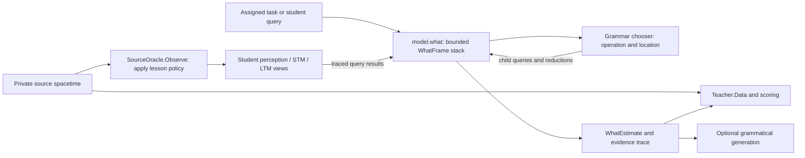

# What, queryable spacetime, and grammatical thinking

> **Status:** high-level target design, 2026-09-03. The
> [unified Teacher specification](specs/2026-07-27-teaching-modes-and-next-iteration.md)
> is normative for scope, learning objectives, migration, and acceptance gates.
> This document explains the interfaces and their ownership; it does not claim
> that the addressed student, thinking stack, or contextual chooser is already
> implemented.

## 1. One question, different authority

The common question is **what is at this place and time?** Its answer depends
on who is allowed to look and whether the answer is observed or estimated.

| Interface | Meaning | Caller and authority |
|---|---|---|
| `Teacher.Data(address)` | Exact source datum and provenance for scoring | Teaching controller/evaluation only; privileged source access |
| `SourceOracle.Observe(address, policy)` | Only the perception this lesson permits | Controller applies the observation policy before presenting evidence |
| `SpacetimeView.what(address)` | Records available in this particular view | Read-only, source-scoped, policy-bound, and limited to an evidence cutoff |
| `model.what(address)` | Student's best conceptual estimate of the requested state | Student-owned evidence and grammar; no Teacher/data-source capability |
| `model.generate(estimate)` | Grammatical/surface realization of an estimate | Uses the estimate and its derivation, not the hidden target's forward cache |

The Teacher's semantic `what()` is deliberately spelled `Data` at the API
boundary so it cannot be confused with the student's learned `what()`.
The existing `Teacher.What(where, when)` becomes a deprecated controller-side
adapter to `Data`; it is not a student reasoning operation. No new synonymous
`teacher.what` entry point is required.

Queryable spacetime is an interface over addressed records, not one global
store that everyone can read. A private source view can contain the complete
corpus; a student's perception view contains only permitted observations;
STM/LTM views contain student-visible records; a thought view contains
provisional constructions. Sharing a query shape does not share authority.



There is no student-to-Teacher lookup edge. Scores train the student after an
estimate is produced; clean targets are not fed back as evidence for that
same estimate.

## 2. Addresses, locations, and time

For text, the resolved objective address identifies context/corpus, split,
document, sentence, and character span, with a direct row index and source
version. Target sequence/event time and relative offsets distinguish past,
present, and future. Other source adapters can represent world-event support
without pretending that a text row is a physical coordinate.

Keep the following independently typed:

| Coordinate | Example | Purpose |
|---|---|---|
| Objective source/event address | Document D, sentence 8; object O at event t | State being asked about |
| Source version | Corpus snapshot/content digest | Which recorded source is authoritative |
| Evidence cutoff (`as_of`) | Information visible before predicting sentence 8 | Which observations/memories may support the estimate |
| Assertion time and event validity | Claim made at t, about t+1 | Provenance of memories and predictions |
| Grammatical location | Argument role, input span, generated constituent slot | Where an operation consumes or places a constituent |
| Subjective `.where` / `.when` | Student's current attentional presentation | Internal workspace; never supplied or supervised by Teacher |

Opaque identity hashes key categorical embeddings; their numerical order has
no meaning. Ordered positions are represented separately. An absent field has
an explicit mask, not a fabricated ID or an ordinary zero-valued concept.

An internal question has a tagged address such as an episode/frame ID plus a
role-bound query. It is not silently converted into a corpus row. Public
`model.what(ObjectiveAddress)` starts the addressed task; its internal frames
may ask typed constituent questions as well as objective-address queries.
Only source-supported objective addresses can be passed to `Teacher.Data`.

## 3. Queryable spacetime and Teacher interfaces

The following are logical contracts, not prescribed Python class layouts:

```text
SpacetimeResolver.resolve(StudentQuery, public_cursor_context)
    -> ResolvedQuery(requested, resolved_address, resolution_trace)

SpacetimeView.what(address)
    -> EvidenceResult(status, records, provenance)

SourceOracle.Observe(resolved_address, observation_policy)
    -> PresentedObservation(address, perception, availability_mask)

Teacher.Data(resolved_address)
    -> TeacherDatum(address, source_version, clean_value, provenance)

Teacher.Score(resolved_address, WhatEstimate, TeacherDatum)
    -> separately reported loss_components
```

The resolver checks source version, context, split, document/sentence/span,
and legal cursor movements. It never silently crosses a document or invents
missing provenance. If a request is explicitly snapped to a legal location,
both forms are preserved. An assigned target is fixed; a chooser cannot
replace it with a more convenient target. A permitted context switch must be
an explicit action with the corresponding row-local state reset.

Each `SpacetimeView` is bound at construction to a source namespace, immutable
read snapshot, access policy, and `as_of` cutoff. Student calls cannot request
a broader capability or a later cutoff. An `EvidenceResult` retains record
IDs, address/version, observation/assertion time, represented-event support,
availability, confidence, and epistemic status. A retrieved prediction is
still a prediction, not an observation. Unavailable or denied content returns
no hidden payload, clean trace, or target-derived shape metadata.

The conceptual common operation is `what`; it has distinct implementations:

- The Teacher's private source adapter looks up an exact recorded datum.
- The observation adapter degrades or blanks the permitted presentation.
- Student perception/STM/LTM adapters retrieve only admitted evidence.
- The student constructs an estimate from that evidence through grammar.

Read operations do not automatically write memory, advance the cursor, or
admit truth. `model.observe` is the explicit ingestion boundary; cursor moves
and provisional thought writes are explicit traced actions. Future source
records may be prefetched privately without becoming visible in any student
view. During recall/prediction, a failed memory query cannot fall back to the
private source. If the Teacher lacks a valid datum, scoring is unavailable or
deferred; the student's estimate is not manufactured into ground truth.

### Ownership of a teaching episode

The controller owns the complete lesson, scheduling, observation policy, and
private `TeacherDatum`. It passes a separate public task and permitted
observation to the student. Naming fields "private" inside a shared lesson
does not establish this boundary.

The student owns conceptual state, current permitted perception, STM/LTM
views, grammar state, query policy, and the episode stack. It owns no Teacher,
loader, target callback, or privileged source view. Policy enforcement belongs
outside the student's mutable state. A physical in-process split is possible,
but the learned call graph must still lack those capabilities.

The current `Model.teacher` / shared `ReconstructionLesson` arrangement is a
migration concern, not the proposed boundary. Temporary source contexts must
restore source version, cursor, and lesson state as well as context identity.

## 4. The student's What and thinking stack

```text
model.observe(address, permitted_perception) -> updated student state
model.what(address) -> WhatEstimate
model.generate(WhatEstimate) -> optional surface/perceptual realization
```

`model.what` snapshots the episode's permitted evidence views and budgets.
Its estimate contains the requested/resolved target, bounded conceptual
state, derivation, root/constituent frame references, evidence references,
confidence, and provisional/verified status. Generation can run after the
target's forward/reverse caches are cleared. A thought need not become a
sentence before it can support another thought.

A `WhatFrame` is one unresolved question and its continuation:

```text
WhatFrame:
    id, parent_id, target_address_or_internal_question
    expected_role, identity_bindings, permitted_sources, as_of
    selected_query_or_reduction, pending_children, returned_evidence
    partial_conceptual_result, trace_ref, remaining_budget
    status = unresolved | waiting | resolved | failed
```

The stack supplies work to the chooser; the chooser decides the next legal
grammatical action. For example, `query_perception`, `query_stm`, and
`query_ltm` return identifiable records. `bind`, `compare`, and a named
construction or `predict_state` reduction consume those records explicitly.
These names illustrate operation families rather than fixing a new grammar
file format.

1. Push the root desire to know `what(address)`.
2. Construct the public chooser context for the active frame.
3. Choose a legal evidence query, child question, reduction, or completion.
4. Push unresolved constituents; mark the parent waiting.
5. Return each resolved child's conceptual result to its parent role.
6. Apply the recorded reduction; pop the parent when complete.
7. Return the root estimate, optionally generate its surface, then score it
   if a Teacher datum exists.

For example, a controlled future-state question may create two child tasks:
obtain the current object's state from permitted perception/STM, and retrieve
relevant transition evidence from LTM as of the prediction. Their results are
bound to the same tracked object and reduced by the traced `predict_state`
operation into an estimated future noun state. This does not assume the later
reusable verb-induction machinery already exists.

The Teacher supplies and scores the root task, but does not push child frames,
select memory records, or choose a hidden target derivation. In `THINK`, the
student originates the root task as well. Its result enters bounded working
memory or a provisional claim log, not the historical truth store.

### Bounded and replayable, not recursive oracle access

The stack is a logical dependency structure, not a requirement for Python
recursion. A chart or iterative agenda can batch independent children while
retaining parent/child roles and deterministic replay order. All frames share
the root's decreasing step, depth, retrieval, and wall-clock budgets; pushing
a child does not reset them. Cycles or exhausted budgets terminate with an
explicit failure/partial status, never an unrestricted fallback query.

Memoization uses source/query/`as_of` within an episode whose namespace,
source version, policy, and read snapshot are fixed. Those identities must
also be included in a cache key if results outlive that scope. No cache reuse
may cross a policy, version, or evidence-cutoff change.

Constituents are conceptual results within one shared root derivation, not
independent sentence parses. Construct one root forest, sample one root
derivation, and normally render only the root. Retrieval results are reused
across applicable candidates. The trace records queries, returned record IDs,
bindings, operations, locations, random choices, and model/grammar version
needed to replay the answer under the same parameters.

## 5. Context for the grammar chooser

The chooser must decide both **which grammatical construction applies** and
**where its operands/results belong**. Some choices also issue a source query
that determines which sentence is read. These are related but distinct
decisions, with the following context:

| Context | Contribution to a choice |
|---|---|
| Root question and active frame | Intended target, expected parent role, unresolved dependencies |
| Mode and linguistic stage | Allowed observations, actions, and productions; noun-first constraints |
| Active domain, document, and cursor | Legal source sentence locations and relative movements |
| Objective address and `as_of` | Requested event/offset and cutoff on supporting evidence |
| Permitted perception and masks | Which surface evidence is actually present |
| Conceptual references and identity/role bindings | Which objects and operands participate |
| Explicit STM/LTM results | Accessible history, referents, transition evidence, confidence/provenance |
| Partial derivation and grammatical state | Admissible rules, unresolved roles, input spans, and output slots |
| Episode budgets and seeded exploration | Legal remaining work and reproducible stochastic selection |

These are public references and typed constraints, not permission to turn
every semantic payload into an unrecorded context vector. Any subsymbolic
comparison/transformation used in choice evaluation must be a named operation
in the symbolic trace. The exact grammar-native scoring architecture remains
open; this design does not reinstate the withdrawn context-MLP/FiLM proposal.

### Source sentence versus grammatical position

For `READ_REQUESTED`, a cursor operation such as `next sentence` is chosen
from the current public context **before** receiving the next passage. The
resolver returns a legal source address; the controller then returns the
permitted observation at that address. Source selection is traceable even
when it is one action inside a larger derivation. In `READ_ASSIGNED`, source
selection is fixed by the task and cannot be optimized away by the chooser.

Within a construction, the chooser selects a legal rule and operand locations:
for instance, bind one returned concept to a subject role and another to a
predicate argument, then place their realizations in that rule's output
slots. An input token span, an output constituent slot, and a source sentence
address are never interchangeable. For blank prediction, output slots and
length are constructed by grammar, not copied from a private target mask or
parse. Explicitly supplied public address spans do not license reading hidden
constituent boundaries or clean tokenization.

The resolved root address remains fixed while the derivation is completed.
Word choice follows the selected grammatical role and concept binding. A
future-state estimate passes through the ordinary generator; it does not
directly select output words through an independent prediction head.

The chooser retains admissible alternatives and learns from one sampled
derivation's Teacher-scored task loss, with the exploration and credit
assignment specified in section 6.3 of the unified spec. It does not render
every candidate to decide which one is best. The required trace ties each
choice to its evidence, operation, source request if any, and grammatical
location. Changing location cannot change the hidden scoring target.

## 6. Prediction, verification, and failure boundaries

A prediction episode has this ordering:

```text
observe permitted current data
freeze student evidence views as of the prediction
estimate = model.what(future_address)       # blank target perception
isolate estimate and its evidence/trace
future_datum = Teacher.Data(future_address) # controller-only scoring
score estimate against future_datum
```

The exact datum may already exist in the offline source, but it cannot enter
the student stack, chooser, address encoder, or memory. A detached future
conceptual target is paired when that address undergoes ordinary later
analysis; if unavailable, state alignment is deferred. Scoring does not run
a second target grammar forest. Surface reconstruction also remains a target
so a collapsed conceptual estimate cannot satisfy learning by itself.

When reality becomes observable, a later `VERIFY` event compares the stored
prediction with newly available evidence. It may label a provisional claim
supported or contradicted without rewriting history. Predictions keep their
assertion time, represented-event support, confidence, and provenance. Reads,
thoughts, and scores do not autonomously admit global truth.

Before enabling the full design, tests must demonstrate oracle isolation,
as-of-correct retrieval and caches, address-sensitive reconstruction, distinct
source/grammar/subjective locations, bounded stack termination, trace replay,
target-independent generation, and one-forest operation. The unified spec
defines the capability and throughput gates. Concrete class extraction,
grammar-native scoring, and future truth-admission policy remain implementation
decisions or explicitly deferred work.
