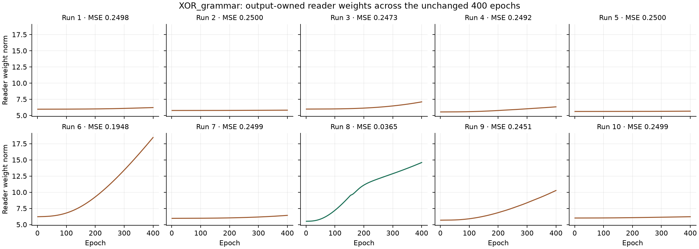
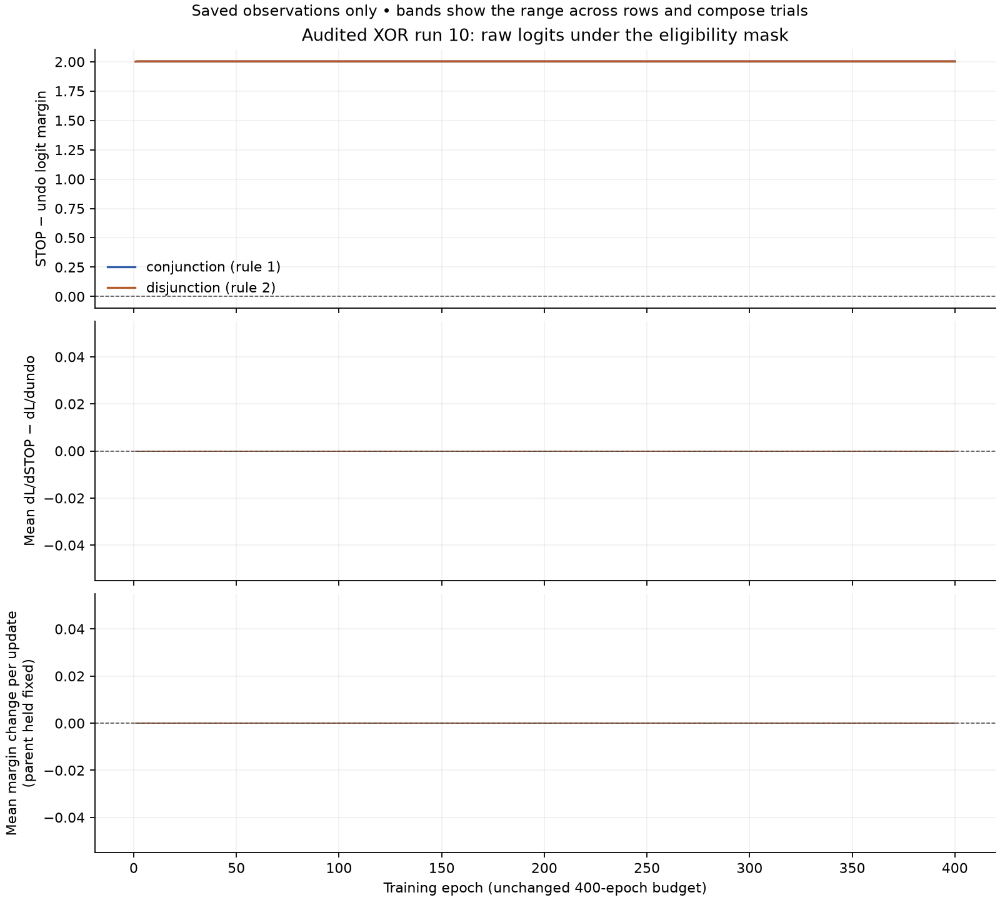

# Decoder, operators and 6.8 — §14 and architecture addendum, held for Claude

2026-10-04. HEAD remains `802abb1acc95e1bddc8cb237b13230a336681c49`. One working tree; nothing committed. The [§13 receipt](README-before-review14.md) and every earlier measurement stand without retry.

**Measured result:** XOR class 1/10, reconstruction 8/10, joint 1/10; sum 10/10 and MM_xor 10/10. The full sweep has 74 failed tests. This is a measured candidate held for review, not an acceptance claim.

## Architecture addendum: two spaces, one index

A concept lives in conceptual space; its symbol, its form, lives in perceptual space. The shared index pairs them. `[form | meaning]` stays the implementation: the form is the symbol's perceptual position (the interval midpoint over letters and WS types, perception's), and the order-zero meaning is only the detached context mean. Same-context concepts coinciding in conceptual space is correct and is not counted or repaired.

**Item 6 resolved:** the automatic allocation of conceptual rows for referenced percepts, its basis-address buffer and the 256-percept reserve are deleted. ConceptualSpace `nVectors` is restored from 262 to **6** in XOR_grammar and from 264 to **8** in MM_grammar. Native perception retains its 256 rows. Letters that are no concept's symbol need no conceptual row. The derivation reads their existing PS/WS rows directly. No binding kernel, inverse, interval formula, room rule, reader, optimizer or learning objective changed in this addendum.

Identity comes from below through the fold of forms, and meaning from above through contexts, at every order. At orders ≥ 1, composition of meanings also joins from below. Perception's codes have one writer, perception's reconstruction; the sentence path trains choosers through the live root. Architecture, GradientFlow, the current catalogue implementation note, the retired unit-sphere row and todo 6.8 use this reading. Incoming review text and the distributional catalogue row are preserved.

**What the XOR table measures:** the concepts are empty in these gate configurations (identical contexts, no bootstrap). Class and reconstruction therefore measure perception's composition of forms by this round's binding kernel, its inverse, the affine read at unit norm, and one owner. The connectives over meanings are measured where meanings exist, in MM_xor's field path. The saved form/code and root geometry is not a demand that same-context concepts separate.

**Carried to the operators update:** the fold composing forms at every order (the kernel does it today); Kleene meet and join on meanings; bootstrap of the complement from conceptual wholes' locations and its co-activation learning; the `not` items; expectation's negative image acting on the concept face only (item 2).

**Verification:** the [same 16-file list](review14-addendum-focused-files.txt) ran before and after removing letter allocation: all 15 §14 focused files plus `test_review14_addendum.py`, with none dropped. The [before probe](probes/review14-addendum-before/process.json) saved its complete source and six failures before repair (139 passed, 1 skipped). These included unwanted allocation/admission exhaustion and a nonzero sentence gradient. The [final probe](probes/review14-addendum-after/process.json) passed **145 tests, 1 skipped**, in 150.3 guarded seconds at 2.08 GiB peak. Both small inventories hold four word symbols without letter rows; the exact zero sentence-gradient assertion and the one-batch audit wiring pass. No tolerance, seed, bar, gate assertion, budget or resource guard changed. Assertions tied to the removed basis-address API are ported to the symbol/concept pairing contract.

The [addendum verification](review14-addendum-verification.json) retains complete old/new changed test ports and confirms all **1,390 original measurement files are unchanged**. This addendum ran no new gate campaign or full sweep. The counts below belong to the frozen §14 source with capacities **262/264**, not a remeasurement of the current **6/8** candidate. The original receipt is preserved in [README-before-review14-addendum.md](README-before-review14-addendum.md); the current source and complete ports are in [the addendum delivery](review14-addendum-delivery/).

## Frozen §14 implementation before the addendum

Form codes are perception’s. The sentence derivation detaches native PS/WS prototypes and 11b evidence; sentence pair search, byte scoring and the affine answer cannot train them. The free word row stays removed. Perception reconstruction retains the native parameters.

With `d = relu(e_for − e_against)`, the content bounds are `L = max_parts(d*c)` and `U = min_WS_property_wholes(1-d*(1-c))`, defaulting to one without wholes. The code is `(W_P*L + W_W*U)/(W_P+W_W)`, or `L` without wholes. The both corner is attention’s. Repeated native part addresses do not multiply an evidence edge. Type location/time coordinates stay zero; occurrence rows remain the detached context mean on the complement, not upper-bound wholes.

The deterministic room pass moves the maximal part down and minimal property whole up by half each positive `L-U+m`, clamped to [0,1]. `ConceptualSpace.latticeMargin=0`. Missing towers retain their fixed bounds. Fractional evidence, clipping and floating-point arithmetic can leave residual violations; exact counts and maxima are reported before and after. No objective was added.

Pair-search candidate codes are detached in residuals and the soft blend; the parent remains live. Residuals use the parent mean square before the unchanged `.01` temperature. Exactly zero parents use the existing zero-target penalty convention (divisor one); positive scales have no floor. Byte scoring detaches the bank and keeps the recovered leaf live.

XOR_grammar reads the root at unit norm through a fixed transform, with both affine reader paths still output-owned. The sum control retains its existing unnormalized affine reader: normalizing an additive root would change the control’s zero-contrast property. This scope choice was stated before freezing; the receipt-local XML diff records it. Learning rates, budgets and optimizers are unchanged.

The antipode function, reporting key, model helper and exactly two antipode tests were deleted. This measured source retained the 256-percept reserve at capacities 262/264; the addendum above withdraws that justification and removes the reserve. Its §13 widths remain unchanged.

**Deferred:** Kleene connectives; the form-band fold; complement bootstrap from wholes’ locations and its co-activation learning; the catalogue §3.8 / plan §13.4 `not` items. These belong to the operators update. The gate’s context complement is empty, so it establishes no learned context result.

## Preserved §14 measurement (capacities 262/264)

The original §14 final focused probe passed **141 tests, 1 skipped**. Every original §14 focused probe used the same [15-file list](review14-focused-files.txt); no file was dropped. The audit wiring check uses one ordinary four-item training batch in its own guarded process. Failing probe sources, commands and logs were saved before each repair.

Collection selected **5173 tests**. The full default sweep ran once with **10 workers**, preserving the published slow guards: **4813 passed, 285 skipped, 74 failed, 1 xfailed**, 844.0 seconds. Counts are per test, with failures taking precedence over a passed call and failed teardown. Complete reports are in [the sweep](review14-sweep/report.html) and [failure details](review14-sweep-summary.json). PCH reuse was disabled from the outset to avoid compiler-cache recovery reruns. The outer sweep made **0 retries**. That sweep and its gate campaign used the same unchanged source; the addendum was applied afterward.

Sum was read first and required 10/10, followed by ten XOR trainings, then ten MM_xor trainings. Each XOR training supplied both unchanged bars. There were **30 gate trainings, zero retries or tuning**. The sweep and gates share the frozen source.

| Gate | 6.9 closing | §12 | §13 | §14 |
|---|---|---:|---:|---:|
| XOR class | single-run MSE .1147481948 | 0/10 | 0/10 | 1/10 |
| XOR reconstruction | 0/4 sentences | 7/10 | 0/10 | 8/10 |
| XOR joint | — | 0/10 | 0/10 | 1/10 |
| MM_xor | red through 6.9 §17 | 10/10 | 10/10 | 10/10 |
| Sum control | — | 10/10 | 10/10 | 10/10 |

The accepted closing record retains **zero ownership conflicts**. Earlier **class 9/10 and reconstruction 5/10** remain historical comparisons, not rerun measurements. The XOR table is the composition mechanism gate (§12.1), not a grammatical-learning gate.

Bands (§20.5): at 0 means MSE < .05; at ¼ means within .02 of .25; remaining values are between or above ¼. Counts: **1 at 0**, **8 at 1/4**, **1 between**, **0 above 1/4**.

## Per-run results

Operator abbreviations: C = conjunction, D = disjunction, N = not. Each entry follows the saved sentence order: hello world / hello there / loving world / loving there. Full named derivations and raw measurements are in [summary.json](review14-measurements/summary.json).

| Run | Class MSE | Band | Class | Reconstructed | Joint | Final operators | Code / priming / tie | Before learning |
|---|---:|---|---|---:|---|---|---|---:|
| 1 | 0.2497719 | at 1/4 | fail | 4/4 | fail | D / D / D / D | 8 / 0 / 0 | 4/4 |
| 2 | 0.24996017 | at 1/4 | fail | 2/4 | fail | D / D / D / D | 6 / 2 / 0 | 4/4 |
| 3 | 0.24732012 | at 1/4 | fail | 4/4 | fail | D / D / D / D | 8 / 0 / 0 | 4/4 |
| 4 | 0.24920541 | at 1/4 | fail | 4/4 | fail | D / D / D / D | 8 / 0 / 0 | 4/4 |
| 5 | 0.24996446 | at 1/4 | fail | 3/4 | fail | D / D / D / D | 7 / 1 / 0 | 4/4 |
| 6 | 0.194804 | between | fail | 4/4 | fail | C / C / C / C | 8 / 0 / 0 | 4/4 |
| 7 | 0.24992957 | at 1/4 | fail | 4/4 | fail | C / C / C / C | 8 / 0 / 0 | 4/4 |
| 8 | 0.03645727 | at 0 | pass | 4/4 | pass | C / C / C / D | 8 / 0 / 0 | 4/4 |
| 9 | 0.2451015 | at 1/4 | fail | 4/4 | fail | C / C / C / C | 8 / 0 / 0 | 4/4 |
| 10 | 0.24991784 | at 1/4 | fail | 4/4 | fail | D / D / D / D | 8 / 0 / 0 | 4/4 |

“Before learning” reads the first already-costed training trial, before any optimizer step; it adds no forward or gate training. The forecast of reconstruction without learning is met in all ten recorded first trials. The unchanged final reconstruction bar passes 8/10. Each emitted word has its own [read-back annotation](review14-word-readbacks.json), including the code-only winner and whether priming changed it. A missing emitted word has no winner and still fails reconstruction.

The forecast that every class run ends at 0 or ¼ does not hold for these ten final measurements. The saved reader trajectories show weight movement; the final error band alone is not a measurement of a plateau. No cause is assigned from an additional run.

MM_xor best errors (unchanged < .20 bar): 0.17153697, 0.19110547, 0.16530821, 0.1991529, 0.19521281, 0.17442028, 0.15178254, 0.19659455, 0.18858644, 0.15508431.

Sum contrasts (unchanged absolute ≤ 1e-4 and no class-bar pass): 0, 0, 0, -2.9802322e-08, -5.9604645e-08, 2.9802322e-08, -2.9802322e-08, -2.9802322e-08, -5.9604645e-08, -2.9802322e-08.

## Reader, geometry and room

Each [run audit](review14-measurements/) retains all 400 reader-weight norms, start/end code and root cosine matrices, centered singular values, exact per-word support, and first/final room projections. Weight norms below combine the output-owned weight matrices; individual matrices are retained.

| Run | Reader norm after epoch 1 | Epoch 400 | Norm change, epoch 350 → 400 | Root third centered singular value, start → end | Minimum word support, start → end | Room violations, first before/after → final before/after |
|---|---:|---:|---:|---|---|---|
| 1 | 5.9638141 | 6.2171311 | 0.066059724 | 0.0022688457 → 5.5708792e-06 | 1 → 1 | 24 (max 0.052122973) / 9 (max 0.01414169) → 0 (max 0) / 0 (max 0) |
| 2 | 5.7675404 | 5.8141447 | 0.010197924 | 0.00035920384 → 2.9730301e-05 | 1 → 1 | 20 (max 0.044843856) / 7 (max 0.0081520453) → 0 (max 0) / 0 (max 0) |
| 3 | 5.9841249 | 7.0982643 | 0.3555944 | 0.00076155679 → 7.6754339e-05 | 1 → 1 | 24 (max 0.06858784) / 9 (max 0.014958443) → 0 (max 0) / 0 (max 0) |
| 4 | 5.5412973 | 6.3279218 | 0.15493858 | 0.00070803548 → 2.0702877e-05 | 0.83333333 → 1 | 23 (max 0.043526005) / 5 (max 0.009709591) → 0 (max 0) / 0 (max 0) |
| 5 | 5.6132854 | 5.6626817 | 0.013508024 | 0.00011992128 → 5.7326633e-06 | 1 → 1 | 16 (max 0.035595477) / 3 (max 0.0060702655) → 0 (max 0) / 0 (max 0) |
| 6 | 6.2146119 | 18.456068 | 2.604208 | 0.0003352566 → 2.0836238e-05 | 0.83333333 → 1 | 22 (max 0.058776367) / 7 (max 0.013417911) → 0 (max 0) / 0 (max 0) |
| 7 | 5.959842 | 6.4216109 | 0.14344685 | 0.00010218428 → 5.81719e-06 | 0.83333333 → 1 | 14 (max 0.038336806) / 6 (max 0.0085100932) → 0 (max 0) / 0 (max 0) |
| 8 | 5.5113383 | 14.586328 | 0.9010699 | 0.00018517008 → 8.2037041e-05 | 0.83333333 → 1 | 23 (max 0.050242633) / 9 (max 0.019594684) → 0 (max 0) / 0 (max 0) |
| 9 | 5.6792397 | 10.26612 | 0.9969903 | 6.5493114e-05 → 3.6788426e-06 | 1 → 1 | 24 (max 0.046382863) / 4 (max 0.011876302) → 0 (max 0) / 0 (max 0) |
| 10 | 6.0119298 | 6.2109199 | 0.037014455 | 0.00058492925 → 3.9947067e-06 | 0.83333333 → 1 | 19 (max 0.043209307) / 7 (max 0.0070559513) → 0 (max 0) / 0 (max 0) |

Room “start” is the first post-step projection; geometry start is the first trial before training. Counts aggregate the reported conceptual stages. No tolerance is used to hide positive room residuals or nonzero code coordinates. Root distinctness is measured, not presumed.

## Tenth-run audit

**0 ownership conflicts**. The [sentence-path audit](review14-measurements/xor-10/ownership/sentence-path-ownership.json) includes the full saved perception pullback and records zero gradient at native prototypes and 11b evidence. Absent and zero gradients are distinguished. The complete [owner list](review14-measurements/xor-10/ownership/ownership.json) retains inactive parameters.

The audit has **1200 optimizer steps**, **1600 first-step logit records** and **800 steps with decoder observations**. The saved [events](review14-measurements/xor-10/ownership/events.jsonl) retain STOP-minus-undo margins, actual logit gradients and fixed-parent margin changes. [Numerical summaries](review14-measurements/audit-summary.json) include legal masks and kept-path stability. A masked STOP is read as masked, not as a slow-learning policy.

| Undo action | Nonzero margin-gradient differences | Nonzero fixed-parent margin changes |
|---|---:|---:|
| conjunction | 0 | 0 |
| disjunction | 0 | 0 |

The table below pools the decoder calls for both compose trials. Each trial forces a different binary undo. The [same saved events grouped by compose trial](review14-decoder-stability-by-trial.json) show one decoder path for each sentence in each trial, stable through all 400 epochs. The [kept compose derivation](review14-measurements/xor-10/ownership/derivation-stability.json) is disjunction for all four sentences throughout. The pooled ½ modal share and zero adjacent stability in the raw walk counter therefore reflect alternating compose trials.

| Sentence | Pooled kept-path modal share | Distinct kept paths | Pooled greedy modal share | Distinct greedy paths |
|---|---:|---:|---:|---:|
| hello world | 0.5 | 2 | 0.5 | 2 |
| hello there | 0.5 | 2 | 0.5 | 2 |
| loving world | 0.5 | 2 | 0.5 | 2 |
| loving there | 0.5 | 2 | 0.5 | 2 |

First-step eligibility: `{'compound': 6400}`. Activated-competitor observations: **6392**, of which **0** outrank own words. These are observation counts, not unique word counts. Walk departures remain sampled among eligible actions; both paths share pre-update parameters and only strictly lower owner cost keeps exploration.

| Walk | Comparisons | Explorable | Explore kept | Strict-cost violations |
|---|---:|---:|---:|---:|
| attention.input | 1600 | 1600 | 0 | 0 |
| generate.decoder | 3200 | 0 | 0 | 0 |
| compose | 1600 | 1600 | 0 | 0 |

## Evidence and review

- [Frozen source and complete test ports](review14-source/): 710 files, 169 complete old/new test ports against accepted HEAD; zero seed-call differences. The outgoing §13 candidate is in [review14-before](review14-before/).
- [Contract verification](review14-contracts-before-freeze.json) preserves all gate assertions and resource guards. The declared mechanism assertion ports replace live-code/signed-fold and retired antipode expectations. The two inverse fixtures use close candidates for the relative residual, retaining their original gradient assertions.
- [Focused file list](review14-focused-files.txt), [saved failing and repaired probes](probes/), and [final focused run](probes/review14-final2/process.json).
- [Measurement provenance verification](review14-verification.json), [sum read first](review14-measurements/sum-read-first.json), and [all gate processes](review14-measurements/complete.json).

- [Measured §14 review delivery](review14-delivery/): the same measured source with updated documents, complete old/new ports, and a supplement containing this receipt, the saved §14 probes and measurements. [Final contracts](review14-contracts-final.json) retain the gate and guard checks.

The authorized addendum changed the source after the frozen measurement, with the focused verification above. No gate, full-sweep or attribution rerun was performed. No standalone native run or fresh BasicModel scoring was performed. Frozen evaluation still admits no definitions; the trained NanoChat gate waits for item 4’s checkpoint.

**Nothing committed. Held for Claude’s review.** The full-sweep failures and every gate result stand as measured.
