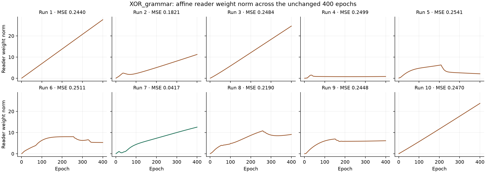

# Decoder, operators and 6.8 — §17 measured candidate

2026-10-05. The frozen §16.3 candidate was committed on `main` as **`eb1fbefb5f4a33a22cbb4a590cc0927d6a60761d`**, tagged **`6.8-s16.3-candidate`**, before any §17 change. Its 693 runtime files match the §16.3 source manifest; the requested current plan, FutureWork, other documentation and historical receipts are included. See the [commit proof](review17-candidate-commit.json) and [incoming receipt](README-before-review17.md). The parent WikiOracle index still points to `802abb1a`. **The §17 work is uncommitted; nothing was pushed. Review is required before the next commit or any push.** One working tree; conceptual capacities remain **6 / 8**.

The final ten-worker sweep is green: **5,195 completed, 4,908 passed, 286 skipped, 0 non-strict XPASS, 1 XFAIL, zero failed**, in **892.3 seconds**. The once-only campaign then measured **sum 10/10**, **XOR class 1/10, reconstruction 10/10, joint 1/10**, and **MM_xor 10/10**. Sum was read first. There were no gate retries, source changes during measurement, or tuning.

## What changed

The forward chooser's reconstruction-owned surrogate is `K · R · p(a_dep | shared prefix) · (C_explore − C_greedy)`, with both costs detached and the existing active-row mean reduction. K is the number of value-distinct eligible alternatives at the sampled round; R is the number of eligible rounds in that sentence. K·R cancels the uniform proposal's probability, giving the sum of baseline-subtracted gradients over those eligible alternatives and rounds. The proposal, greedy argmax, eligibility exclusions and strictly-lower-cost keep rule are unchanged. A tie adds no term.

The selected undo now has its own five-weight decomposition scorer over the existing shortlist: negative relative residual, left/right activation and left/right priming. Softmax supplies cross-entropy; hard argmax supplies the pair. Initialization `[1, 0, 0, 0, 0]` reproduces the old residual argmin and consumes no RNG. Teacher targets are the resolved input-word identities at the composition's operand positions. Codes, parent features and context features are detached; only the separate decomposition weights receive this teacher gradient. Targets absent from the shortlist, including compound operands with no word-bank identity, are counted and omitted from CE. CaseSelection retains its separate non-word candidate algebra.

Both trial teacher graphs are built before either update. Their CE enters reconstruction's owner step **after** the existing byte-cost comparison and keep decision, so target labels never enter free decoding or choose the understanding. The walk policy, §11.6 eligibility mask and byte scorer are unchanged. Perception owns prototypes and evidence. No capacity, seed, learning rate, optimizer, budget, gate bar or resource limit changed.

The campaign guard now follows pytest: a **non-strict XPASS is a pass**; a strict XPASS still fails. The .8 overlap assertion and `xfail(strict=False)` on `test_topk_recovered_words_overlap_input` are untouched. Claude's §17 observation was **5 of 8 unseeded passes**, with the other three at overlap .5 because two of four words coincide under the join in that small content width. Those eight runs are Claude's observation; this round ran the overlap test only within its full sweeps, with no standalone reruns to reproduce that estimate. The limitation remains with the operators update.

## Once-only measurements

Both XOR bars consume the same model from one training per run. The unchanged class bar requires all four answers correct and MSE < .05; reconstruction requires all four sentence word-multisets recovered without an unavailable decode. Bands are §20.5: “at 0” means MSE < .05; “at ¼” means |MSE−.25| ≤ .02; the remaining values are between or above ¼. The sum criterion is unchanged: |checkerboard contrast| ≤ 1e-4 and the class bar not met. MM_xor keeps best MSE < .20.

| Run | MSE | Band | Answers | Read-back | Joint | Final greedy operators | Affine reader norm, epoch 1 → 400 |
| --- | --- | --- | --- | --- | --- | --- | --- |
| 1 | 0.2439668 | at 1/4 | 4/4 | 4/4 | no | conjunction | 0.06918293 → 27.64082 |
| 2 | 0.182099 | between | 4/4 | 4/4 | no | hello world: conjunction; hello there: conjunction; loving world: disjunction; loving there: disjunction | 0.06298114 → 11.24392 |
| 3 | 0.2484093 | at 1/4 | 4/4 | 4/4 | no | conjunction | 0.05735338 → 24.6351 |
| 4 | 0.2498911 | at 1/4 | 2/4 | 4/4 | no | disjunction | 0.01295605 → 0.8435131 |
| 5 | 0.2541058 | at 1/4 | 2/4 | 4/4 | no | conjunction | 0.06880072 → 2.111705 |
| 6 | 0.2510609 | at 1/4 | 2/4 | 4/4 | no | conjunction | 0.06486177 → 5.30693 |
| 7 | 0.04165008 | at 0 | 4/4 | 4/4 | yes | hello world: conjunction; hello there: disjunction; loving world: conjunction; loving there: conjunction | 0.06897193 → 12.56373 |
| 8 | 0.2189868 | between | 3/4 | 4/4 | no | disjunction | 0.0601538 → 9.11145 |
| 9 | 0.244835 | at 1/4 | 2/4 | 4/4 | no | disjunction | 0.01925588 → 6.140459 |
| 10 | 0.2470419 | at 1/4 | 4/4 | 4/4 | no | conjunction | 0.06204108 → 23.77232 |

Bands: **at 0: 1**, **at 1/4: 7**, **between: 2**, **above 1/4: 0**.

The advance forecast of reconstruction 10/10 is met; the forecast of a majority of class runs at 0 is not met. Quarter-error runs retain their geometry and reader trajectories below; no convergence cause is inferred from a scalar weight norm alone.

All ten affine reader norms changed during training; some flattened late while others continued to grow. All **80 final word read-backs were code-decided**, with none decided by priming. The forms themselves had **zero coordinate change** in all ten runs; mean cos(L) ranged from **.7505434 to .9486687**. These are [checks of the saved observations](review17-results-validation.json), with no additional training.

[Complete per-run results](review17-measurements/summary.json) preserve all four named greedy derivations, predictions and **each word's read-back annotation** (code versus priming, winner IDs, ties and scores). Per-epoch reader norms are in each `xor-NN/run-audit.json`, including the actual affine head and the other output parameters separately. The [reader plot](review17-measurements/reader-weight-trajectories.png) shows only `answer_record_reader.weight`; a flat aggregate over all output parameters is not evidence of a stationary reader.

Historical comparisons remain observations of their stated sources and capacities:

| Record | CS XOR / MM | Class | Reconstruction | Joint | MM_xor | Sum |
| --- | --- | --- | --- | --- | --- | --- |
| 6.9 closing | accepted source | MSE .1147481948 | 0/4 sentences | — | red through 6.9 §17 | — |
| §12 | 6 / 8 | 0/10 | 7/10 | 0/10 | 10/10 | 10/10 |
| §13 | 262 / 264 | 0/10 | 0/10 | 0/10 | 10/10 | 10/10 |
| §14 before addendum | 262 / 264 | 1/10 | 8/10 | 1/10 | 10/10 | 10/10 |
| §15 and §16.3 | 6 / 8 | not measured | not measured | — | — | — |
| §17 | 6 / 8 | 1/10 | 10/10 | 1/10 | 10/10 | 10/10 |

The accepted closing record's zero ownership conflicts and prior **9/10 class / 5/10 reconstruction** are preserved. Under two spaces and one index, this XOR table measures composition of **forms**, the inverse, the raw-root affine read and ownership. The gate contexts have empty order-zero meanings; their coincidence is correct. MM_xor's field path measures the connectives where meanings exist.

Compared with §14, no measured count is lower. These results stand without retries or tuning.

## Geometry, evidence and room

| Run | Mean cos(L), start → end | Centered root singular values, start → end | Unit-root XOR interaction, start → end |
| --- | --- | --- | --- |
| 1 | 0.8410546 → 0.8410546 | [0.002290134, 0.0009386129, 0.0002833644, 1.132633e-10] → [0.002290134, 0.0009386129, 0.0002833644, 1.132633e-10] | 0.3677247 → 0.3677247 |
| 2 | 0.879038 → 0.879038 | [0.1262387, 0.02049044, 0.000175489, 8.348198e-10] → [0.1262387, 0.02049044, 0.000175489, 8.348198e-10] | 0.3124221 → 0.3124221 |
| 3 | 0.8725281 → 0.8725281 | [0.002685003, 0.0006794779, 0.000109379, 1.064792e-10] → [0.002685003, 0.0006794779, 0.000109379, 1.064792e-10] | 0.08458236 → 0.08458236 |
| 4 | 0.9395174 → 0.9395174 | [0.03013358, 0.01326888, 0.0001201405, 3.374106e-09] → [0.03013358, 0.01326888, 0.0001201405, 3.374106e-09] | 0.0214114 → 0.0214114 |
| 5 | 0.940415 → 0.940415 | [0.002962359, 0.001011968, 0.0001173888, 8.308347e-11] → [0.002962359, 0.001011968, 0.0001173888, 8.308347e-11] | 0.1510448 → 0.1510448 |
| 6 | 0.9486687 → 0.9486687 | [0.02481494, 0.0166476, 0.0004311482, 4.234178e-09] → [0.001108272, 0.0008489259, 0.0001026622, 3.344098e-10] | 0.01270057 → 0.07480958 |
| 7 | 0.7505434 → 0.7505434 | [0.004231066, 0.002692193, 0.0003560868, 2.399541e-10] → [0.1225665, 0.003386146, 0.0007794028, 1.627273e-09] | 0.8844742 → 0.5779663 |
| 8 | 0.7680132 → 0.7680132 | [0.07395276, 0.02993118, 0.007472027, 1.180462e-08] → [0.07395276, 0.02993118, 0.007472027, 1.180462e-08] | 0.1069435 → 0.1069435 |
| 9 | 0.8698795 → 0.8698795 | [0.04767191, 0.02845468, 0.001548923, 5.031336e-09] → [0.04767191, 0.02845468, 0.001548923, 5.031336e-09] | 0.05369701 → 0.05369701 |
| 10 | 0.8660317 → 0.8660317 | [0.001776007, 0.001173763, 0.0001753451, 2.000482e-10] → [0.001776007, 0.001173763, 0.0001753451, 2.000482e-10] | 0.1795816 → 0.1795816 |

The interaction is `‖r_hw − r_ht − r_lw + r_lt‖` after normalizing each root for this **audit only**. The class reader remains raw and affine. Each run audit saves complete pairwise word cosine matrices, code and root values, singular values and support per word (fraction nonzero and minimum absolute coordinate), at start and end.

`d = relu(e⁺ − e⁻)` is net 11b evidence for a native part or whole address. `d > 0` selects a part at full presence; it does not scale its code. The next table gives all nonempty stages' evidence ranges and room-clamp counts / largest violations. Room remains `L + m ≤ U`, m = 0: only the minimal whole moves upward, with the existing [0,1] clamp. Any remaining violation is recorded as measured.

| Run | d range, start → end | First clamp: before → after | Last clamp: before → after |
| --- | --- | --- | --- |
| 1 | parts [1, 1] (n=19); wholes [1, 1] (n=8) → parts [1, 1] (n=4); wholes [1, 1] (n=8) | 23 / 0.03183153 → 5 / 0.006529354 | 0 / 0 → 0 / 0 |
| 2 | parts [1, 1] (n=19); wholes [1, 1] (n=8) → parts [1, 1] (n=4); wholes [1, 1] (n=8) | 20 / 0.05189227 → 5 / 0.02459437 | 0 / 0 → 0 / 0 |
| 3 | parts [1, 1] (n=19); wholes [1, 1] (n=8) → parts [1, 1] (n=4); wholes [1, 1] (n=8) | 24 / 0.04515835 → 4 / 0.01381965 | 0 / 0 → 0 / 0 |
| 4 | parts [1, 1] (n=19); wholes [1, 1] (n=8) → parts [1, 1] (n=4); wholes [1, 1] (n=8) | 24 / 0.04710009 → 2 / 0.004290139 | 0 / 0 → 0 / 0 |
| 5 | parts [1, 1] (n=19); wholes [1, 1] (n=8) → parts [1, 1] (n=4); wholes [1, 1] (n=8) | 20 / 0.06537586 → 5 / 1.490116e-08 | 0 / 0 → 0 / 0 |
| 6 | parts [1, 1] (n=19); wholes [1, 1] (n=8) → parts [1, 1] (n=4); wholes [1, 1] (n=8) | 24 / 0.04794516 → 6 / 0.01340403 | 0 / 0 → 0 / 0 |
| 7 | parts [1, 1] (n=19); wholes [1, 1] (n=8) → parts [1, 1] (n=4); wholes [1, 1] (n=8) | 18 / 0.05266413 → 3 / 0.01881174 | 0 / 0 → 0 / 0 |
| 8 | parts [1, 1] (n=19); wholes [1, 1] (n=8) → parts [1, 1] (n=4); wholes [1, 1] (n=8) | 17 / 0.05670409 → 7 / 0.01435569 | 0 / 0 → 0 / 0 |
| 9 | parts [1, 1] (n=19); wholes [1, 1] (n=8) → parts [1, 1] (n=4); wholes [1, 1] (n=8) | 16 / 0.04627087 → 4 / 0.02346047 | 0 / 0 → 0 / 0 |
| 10 | parts [1, 1] (n=19); wholes [1, 1] (n=8) → parts [1, 1] (n=4); wholes [1, 1] (n=8) | 18 / 0.04332874 → 6 / 0.01501493 | 0 / 0 → 0 / 0 |

## Tenth-run audits

The tenth training supplies **1600 sentence/step records**, **1600 departures** and **37 nonzero advantages**. [Its run audit](review17-measurements/xor-10/run-audit.json) records departure/action, both costs, advantage, K, R, probability before/after and all 400 epoch logit ranges. Finite logits span **[5.465583e-05, 0.2857766]**. Maximum analytical gradient error is **2.328306e-10** and finite-difference error **2.029654e-10**.

| Feature | Initial weight | Final weight |
| --- | --- | --- |
| negative_relative_residual | 1 | 2.46171 |
| left_activation | 0 | 4.321413 |
| right_activation | 0 | -4.185598 |
| left_priming | 0 | 1.809795 |
| right_priming | 0 | 1.797896 |

| Decomposition audit | Start | End |
| --- | --- | --- |
| True pair in shortlist | 4/4 | 4/4 |
| Pick equals true ordered pair | 2/4 | 4/4 |
| Absent target count | 0 | 0 |

The target metric uses **ordered input identities**; the unchanged reconstruction gate compares word multisets. Sentence-path gradient at prototypes and evidence is **0**, with **0 nonzero gradient observations**. Ownership conflicts: **0**. [Ownership](review17-measurements/xor-10/ownership/ownership.json), [sentence gradients](review17-measurements/xor-10/ownership/sentence-path-ownership.json) and [audit summary](review17-measurements/audit-summary.json) retain the parameter-level evidence.

The same training supplies 1600 decoder first-step records and 1200 owner steps. STOP-over-undo logit margins, gradients and actual fixed-parent changes are saved by epoch and named operation; the [raw events](review17-measurements/xor-10/ownership/events.jsonl) and audit summary preserve them. Pooled across both compose trials, kept-path modal fractions by input are 0.5, 0.5, 0.5, 0.5; distinct kept paths are 2, 3, 3, 2. The [same saved records separated by compose trial](review17-results-validation.json) give modal fractions **1, 1, 1, 1** for greedy compose and **1, .965, .9425, 1** for explore compose (400 observations per input per trial). Strictly lower reconstruction is checked on every kept-path decision.

## Mechanism checks and sweep repairs

The [ordinary batch](review17-ordinary-batch.json) retains seed 613, batch `["a b c d e", "f g h i j"]`, its original optimizer, one training batch and **no cost override**. Its two `non` departures have K = 1, R = 31. The gradients agree with `K·R·ΔC·∇p` after the existing two-row reduction, and probabilities move in the expected directions:

| Row | ΔC | p before → after | Max gradient error | Finite-difference error |
| --- | --- | --- | --- | --- |
| 0 | -0.3064761 | 0.1664562 → 0.1665899 | 1.490116e-08 | 1.502312e-08 |
| 1 | 0.231753 | 0.1666012 → 0.1665686 | 1.490116e-08 | 2.274901e-08 |

The [decomposition tests](../../../test/test_decomposition_chooser.py) verify exact argmin initialization without RNG, supervised recovery of the true shortlisted pair in a misleading-context fixture, no absent-target gradient, K×R counts, and use of resolved physical word IDs when the legacy WORD lane is absent. The existing controlled tie/win/dearer chooser tests retain their seed, batch and assertions. The [one-batch XOR wiring audit](review17-mechanism/probe-context.json) is a mechanism check, not a gate run.

Failures were saved before repair, with complete old/new bodies:

- [First full sweep](review17-sweep/summary.json): 4,893 passed, 286 skipped, one XPASS and 14 failures. **13 ports** supplied the new scorer in minimal decoder fixtures or updated the exact independent-parameter inventory. **One regression** omitted the scorer from the explicit optimizer parameter list; it was fixed in production, retaining the ownership assertion.
- [Repaired focused probe](probes/review17-repaired/process.json): 144 passed, one skipped, one failure. The strengthened teacher-coverage audit exposed a **regression**: legacy program word rows were absent. Training now uses reconstruction's resolved physical input rows, matching its candidate bank. [Old/new repair](review17-teacher-row-repair.json); the coverage assertion stays.
- [Same-list repaired probe](probes/review17-row-repaired/process.json): **146 passed, one skipped** across the same twelve files, including the new row-identity regression case.
- [Next full sweep](review17-green-sweep/summary.json): **4,907 passed, 286 skipped, one XPASS, one failure**. This was a **port** of the assertion that reconstruction's registry contains only byte loss; §17 adds decomposition CE. [Complete old/new file](review17-registry-port-proposed.json). Its checks that target leaves do not change decoding or the byte cost are unchanged.
- [Final full sweep](review17-final-sweep/summary.json) and [HTML report](review17-final-sweep/report.html): green. All sixteen original output-gradient regressions pass with assertions intact. All [59 focused files](review17-focused-files.txt), including every file in each repair probe, are included; none dropped. The separate ordinary-batch probe names only its measurement file because it checks the requested estimator identity, not repair coverage.

The [frozen source](review17-final-source/source.zip), [round contracts](review17-contracts-final.json) and [delivery](review17-delivery/source.zip) preserve hashes, complete test ports and zero changed seed calls. Historical receipts are [hash-checked](review17-historical-preservation.json). Resource guards are unchanged; the sole runner semantic change is the authorized non-strict XPASS handling. Collection and every failing probe remain available. The final sweep's skips are the existing default-suite selection, not new exclusions; the 30 explicit gate trainings run separately.

Only todo 6.8, the 6.9 §20.3 status, GradientFlow's chooser descriptions and this receipt are updated here from §17. The plan's concurrent clarification that teacher CE stays outside the byte-cost comparison is [preserved separately](review17-external-docs.json); the implementation already keeps that boundary. Architecture, Philosophy, Spaces, the accessible-mind spec, the operator catalogue and FutureWork remain as committed. Unit-sphere codes stay retired; magnitude/certainty stays returned in cube form; the antipode row stays removed; the distributional row is unchanged. Carried work remains deferred: Kleene connectives, the fold composing forms, complement bootstrap, the not items, the negative image on the concept face, form-density questions and any dense control variate. No native benchmark or fresh bulk BasicModel scoring ran. Frozen evaluation admits nothing; the trained NanoChat gate waits for item 4's checkpoint. **Stop here for review: §17 uncommitted, candidate local, nothing pushed.**
