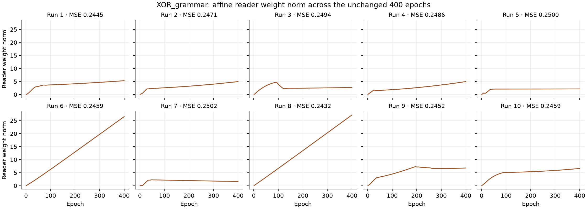

# Decoder, operators and 6.8 — §18 full-presence initialization

2026-10-05. One production change from the measured §17 source: initialize `perceptualSpace._percept_store.byte_fallback.byte_codebook` by per-row max-absolute normalization and the `[0, 1]` presence-cube clamp. **New work is uncommitted; nothing was pushed. Stop for review before any commit.** `main` remains at the local §16.3 candidate `eb1fbefb5f4a33a22cbb4a590cc0927d6a60761d`, tag `6.8-s16.3-candidate`; the parent WikiOracle index remains `802abb1a`. One working tree; conceptual capacities **6 / 8**.

The once-only ten-worker sweep is green: **5,196 completed, 4,909 passed, 286 skipped, 1 non-strict XPASS, 0 XFAIL, zero failures**, in **887.7 seconds**. The same thirty trainings then measured **sum 10/10**, **XOR class 0/10, reconstruction 10/10, joint 0/10**, and **MM_xor 10/10**. Sum was read first. No retries, tuning or changes to seeds, bars, budgets, assertions or guards.

## Sole production change

```python
init = torch.randn(256, self.dim)
init = init / init.abs().amax(dim=-1, keepdim=True).clamp(min=1e-8)
self.byte_codebook = nn.Parameter(init.clamp(0.0, 1.0))
```

This replaces `torch.randn(256, self.dim) * 0.02`. It consumes the same single random draw, preserves the Parameter registration and changes only initialization. The clamp clips negative coordinates to zero; it does not impose a unit L2 norm. No training writer, loss, chooser, inverse, reader, projection, capacity or data changes accompany it. The [complete initializer before/after and numerical check](review18-change-verification.json) and [one-function diff](review18-only-change.patch) verify that every other runtime file and function matches §17. No test was ported this round; the earlier complete old/new bodies remain in the [§17 delivery](review17-delivery/test-ports.json).

The first initialization-check harness used a CPU replay generator against the platform's default MPS device and stopped before checking the table. Its [saved failure](review18-init-check-first-attempt.json) precedes the CPU-environment correction in the [probe](review18-init-check.py); no model trained and no production repair followed. The corrected check verifies the exact normalization/clamp, identical RNG consumption and unchanged parameter ownership.

## Why the observed forms remain small

The requested fallback table is initialized at full presence, but **the gate's word forms do not read that table**. The frozen source's `ensure_atomic_bytes()` calls `RadixLayer.insert(chunk)` without an initializer; `insert()` overwrites the admitted what-basis row with `normal_(mean=0, std=0.02)`. `MereologicalCodes._native(0)` returns the perceptual what-basis, and `_interval()` looks up those admitted row IDs. Its part join therefore still sees small random rows. The [source trace](review18-form-source-trace.json) preserves the exact functions and hashes. This corrects §18.1's identification of the source of letter codes; the static trace is corroborated by the measured form norms below. No second initializer or derivation path was changed, and no training was retried.

## Starting form and root norms

These are **Euclidean (L2) norms**, computed from already saved raw vectors at the first reconstruction trial of the first training batch, before an owner update. Forms use their content coordinates; roots use the full recorded vector. No reader normalization, extra forward pass or fresh-model scoring was added. [Per-word and per-sentence norms](review18-measurements/start-norms.json) also include maximum absolute coordinates and vector widths for all twenty lexical trainings (XOR and sum); MM_xor retains its field-path gate.


| Source | Corpus | Form L2 range (mean) | Root L2 range (mean) |
| --- | --- | --- | --- |
| §17 | xor | 0.04809391–0.08816845 (mean 0.06839605) | 0.002673159–0.1596641 (mean 0.06490771) |
| §17 | sum | 0.03653137–0.08035673 (mean 0.06071455) | 0.04093687–0.07265606 (mean 0.05872359) |
| §18 | xor | 0.03691236–0.08623055 (mean 0.06172587) | 0.002249001–0.1407048 (mean 0.04815356) |
| §18 | sum | 0.03463889–0.09202484 (mean 0.06573479) | 0.0347796–0.0855714 (mean 0.06354803) |

| XOR run | Form norms: hello, world, there, loving | Root norms: hw, ht, lw, lt |
| --- | --- | --- |
| 1 | [0.05374784, 0.0415891, 0.0479987, 0.05141804] | [0.09310162, 0.09916672, 0.09086871, 0.09694874] |
| 2 | [0.0495573, 0.06433852, 0.05921678, 0.04399891] | [0.1107074, 0.1058395, 0.1055066, 0.1006102] |
| 3 | [0.06938443, 0.07142301, 0.06108801, 0.07308746] | [0.004955646, 0.004238557, 0.005220127, 0.004464767] |
| 4 | [0.06232169, 0.06277528, 0.03798265, 0.07518036] | [0.003912262, 0.002367143, 0.004719468, 0.002855549] |
| 5 | [0.06092811, 0.06464038, 0.03691236, 0.06537271] | [0.003938416, 0.002249001, 0.004225716, 0.002413061] |
| 6 | [0.04901544, 0.07523638, 0.05650836, 0.06069316] | [0.003687744, 0.002769782, 0.004566334, 0.003429671] |
| 7 | [0.05615455, 0.07649551, 0.06755846, 0.0594772] | [0.1283545, 0.1199193, 0.131423, 0.1230175] |
| 8 | [0.06727731, 0.05256628, 0.06522092, 0.06019417] | [0.003536518, 0.004387888, 0.003164184, 0.003925919] |
| 9 | [0.06401556, 0.06406875, 0.0608098, 0.08188212] | [0.1239829, 0.1209326, 0.1407048, 0.1377127] |
| 10 | [0.06732785, 0.06797176, 0.07736889, 0.08623055] | [0.004576393, 0.00520908, 0.005861242, 0.006671561] |

Norm comparisons are unpaired observations of the two frozen sources, not reseeded trials. Root norms also depend on the selected operator. The starting and final pairwise word cosines, root singular values, unit-root XOR interaction, form support and room reports remain in the unchanged run audits.

## Once-only gates

The unchanged XOR bars share one trained model per run: class requires all four labels correct and MSE < .05; reconstruction requires all four sentence word-multisets recovered without an unavailable decode. §20.5 bands: “at 0” is MSE < .05; “at ¼” is |MSE−.25| ≤ .02; the remaining values are between or above ¼. The sum bar is |checkerboard contrast| ≤ 1e-4 and the class bar not met; MM_xor keeps best MSE < .20. Budgets remain 400 epochs for XOR/sum and at most 200 for MM_xor.


| Run | MSE | Band | Answers | Read-back | Joint | Final greedy operators | Reader norm, epoch 1 → 400 |
| --- | --- | --- | --- | --- | --- | --- | --- |
| 1 | 0.2444921 | at 1/4 | 3/4 | 4/4 | no | disjunction | 0.04931397 → 5.317703 |
| 2 | 0.2470707 | at 1/4 | 2/4 | 4/4 | no | disjunction | 0.0676506 → 4.974905 |
| 3 | 0.2494363 | at 1/4 | 2/4 | 4/4 | no | disjunction | 0.06613837 → 2.688589 |
| 4 | 0.248611 | at 1/4 | 3/4 | 4/4 | no | conjunction | 0.06952049 → 4.970103 |
| 5 | 0.2500233 | at 1/4 | 2/4 | 4/4 | no | conjunction | 0.06905867 → 2.160673 |
| 6 | 0.2458749 | at 1/4 | 4/4 | 4/4 | no | conjunction | 0.05621098 → 26.52119 |
| 7 | 0.2501679 | at 1/4 | 2/4 | 4/4 | no | disjunction | 0.01373645 → 1.642842 |
| 8 | 0.2432377 | at 1/4 | 4/4 | 4/4 | no | conjunction | 0.06869981 → 27.15104 |
| 9 | 0.2451709 | at 1/4 | 2/4 | 4/4 | no | disjunction | 0.06809401 → 6.809138 |
| 10 | 0.2459247 | at 1/4 | 3/4 | 4/4 | no | conjunction | 0.06957877 → 6.628335 |

Bands: **at 0: 0**, **at 1/4: 10**, **between: 0**, **above 1/4: 0**.

Final word read-back annotations: **{'code': 80}**, total 80. [Complete results](review18-measurements/summary.json) retain every word's code/priming decision, winner and scores, and every named derivation. Maximum code-coordinate displacement across the ten XOR trainings: **0**. All 400 reader-weight observations per run are preserved, with the actual affine head separated from other output parameters.



| Record | CS XOR / MM | Class | Reconstruction | Joint | MM_xor | Sum |
| --- | --- | --- | --- | --- | --- | --- |
| 6.9 closing | accepted source | MSE .1147481948 | 0/4 sentences | — | red through 6.9 §17 | — |
| §12 | 6 / 8 | 0/10 | 7/10 | 0/10 | 10/10 | 10/10 |
| §13 | 262 / 264 | 0/10 | 0/10 | 0/10 | 10/10 | 10/10 |
| §14 before addendum | 262 / 264 | 1/10 | 8/10 | 1/10 | 10/10 | 10/10 |
| §17 | 6 / 8 | 1/10 | 10/10 | 1/10 | 10/10 | 10/10 |
| §18 | 6 / 8 | 0/10 | 10/10 | 0/10 | 10/10 | 10/10 |

Against §17, class_pass: 1/10 → 0/10; joint: 1/10 → 0/10. These are the measured counts; no failed gate is retried or tuned.

The accepted 6.9 closing record remains MSE .1147481948, reconstruction 0/4, zero conflicts, with prior class 9/10 and reconstruction 5/10. The XOR table measures perception's composition of forms, its inverse, the affine reader and ownership. Its context-only order-zero meanings are empty; same-context coincidence is correct. MM_xor measures the field path where meanings exist.

## Geometry, evidence and room


| Run | Mean cos(L), start → end | Centered root singular values, start → end | Unit-root XOR interaction, start → end |
| --- | --- | --- | --- |
| 1 | 0.8636407 → 0.8636407 | [0.0342449, 0.01788735, 0.001998385, 2.391784e-09] → [0.0342449, 0.01788735, 0.001998385, 2.391784e-09] | 0.05191075 → 0.05191075 |
| 2 | 0.8421614 → 0.8421614 | [0.03302331, 0.01117559, 0.001100018, 1.914928e-09] → [0.03302331, 0.01117559, 0.001100018, 1.914928e-09] | 0.02618391 → 0.02618391 |
| 3 | 0.8845284 → 0.8845284 | [0.002823926, 0.0004046987, 5.013398e-05, 2.06937e-10] → [0.05004803, 0.00807895, 0.000324407, 4.902701e-09] | 0.04153227 → 0.01111158 |
| 4 | 0.7990236 → 0.7990236 | [0.004261083, 0.0008069413, 0.0003520365, 7.574782e-11] → [0.004261083, 0.0008069413, 0.0003520365, 7.574782e-11] | 0.2496367 → 0.2496367 |
| 5 | 0.8711667 → 0.8711667 | [0.002633541, 0.0009046705, 0.0001083223, 1.100161e-10] → [0.002633541, 0.0009046705, 0.0001083223, 1.100161e-10] | 0.2499368 → 0.2499368 |
| 6 | 0.8728455 → 0.8728455 | [0.001923939, 0.001052523, 0.0001661846, 2.302293e-10] → [0.001923939, 0.001052523, 0.0001661846, 2.302293e-10] | 0.1527697 → 0.1527697 |
| 7 | 0.8759022 → 0.8759022 | [0.02313923, 0.01493763, 0.0001896711, 5.375011e-09] → [0.02313923, 0.01493763, 0.0001896711, 5.375011e-09] | 0.01721456 → 0.01721456 |
| 8 | 0.7704952 → 0.7704952 | [0.002727401, 0.001614732, 0.0002961031, 9.710219e-11] → [0.002727401, 0.001614732, 0.0002961031, 9.710219e-11] | 0.3603393 → 0.3603393 |
| 9 | 0.9185427 → 0.9185427 | [0.04554465, 0.009829151, 0.001404346, 7.215895e-09] → [0.04554465, 0.009829151, 0.001404346, 7.215895e-09] | 0.03035955 → 0.03035955 |
| 10 | 0.8272437 → 0.8272437 | [0.00452203, 0.002551431, 0.0008418763, 2.494931e-10] → [0.00452203, 0.002551431, 0.0008418763, 2.494931e-10] | 0.5285417 → 0.5285417 |

The interaction is `‖r_hw − r_ht − r_lw + r_lt‖` after normalization for this audit only. The reader remains raw and affine. Complete cosine matrices and coordinate support (fraction nonzero and minimum absolute value) are saved for every word at start and end.

`d = relu(e⁺ − e⁻)` is the net 11b evidence per native address. `d > 0` selects a part at full presence; it does not scale it. Room remains `L + m ≤ U`, m = 0, with only the minimal whole moving upward. The room columns give count / largest violation before and after the first and last clamps.

| Run | d ranges, start → end | First clamp: before → after | Last clamp: before → after |
| --- | --- | --- | --- |
| 1 | parts [1, 1] (n=19); wholes [1, 1] (n=8) → parts [1, 1] (n=4); wholes [1, 1] (n=8) | 13 / 0.04064039 → 5 / 0.02255582 | 0 / 0 → 0 / 0 |
| 2 | parts [1, 1] (n=19); wholes [1, 1] (n=8) → parts [1, 1] (n=4); wholes [1, 1] (n=8) | 23 / 0.03625472 → 3 / 0.007292673 | 0 / 0 → 0 / 0 |
| 3 | parts [1, 1] (n=19); wholes [1, 1] (n=8) → parts [1, 1] (n=4); wholes [1, 1] (n=8) | 20 / 0.05560923 → 3 / 0.03255175 | 0 / 0 → 0 / 0 |
| 4 | parts [1, 1] (n=19); wholes [1, 1] (n=8) → parts [1, 1] (n=4); wholes [1, 1] (n=8) | 19 / 0.04357198 → 3 / 0.01937959 | 0 / 0 → 0 / 0 |
| 5 | parts [1, 1] (n=19); wholes [1, 1] (n=8) → parts [1, 1] (n=4); wholes [1, 1] (n=8) | 20 / 0.04114119 → 4 / 1.490116e-08 | 0 / 0 → 0 / 0 |
| 6 | parts [1, 1] (n=19); wholes [1, 1] (n=8) → parts [1, 1] (n=4); wholes [1, 1] (n=8) | 24 / 0.03882874 → 5 / 0.01391249 | 0 / 0 → 0 / 0 |
| 7 | parts [1, 1] (n=19); wholes [1, 1] (n=8) → parts [1, 1] (n=4); wholes [1, 1] (n=8) | 15 / 0.04480101 → 5 / 0.01281329 | 0 / 0 → 0 / 0 |
| 8 | parts [1, 1] (n=19); wholes [1, 1] (n=8) → parts [1, 1] (n=4); wholes [1, 1] (n=8) | 22 / 0.05392237 → 6 / 0.02112841 | 0 / 0 → 0 / 0 |
| 9 | parts [1, 1] (n=19); wholes [1, 1] (n=8) → parts [1, 1] (n=4); wholes [1, 1] (n=8) | 19 / 0.04739072 → 5 / 0.03242936 | 0 / 0 → 0 / 0 |
| 10 | parts [1, 1] (n=19); wholes [1, 1] (n=8) → parts [1, 1] (n=4); wholes [1, 1] (n=8) | 20 / 0.05727364 → 2 / 0.0008794293 | 0 / 0 → 0 / 0 |

## Tenth-run audits

The tenth run records **1600 sentence/step observations, 1600 departures and 509 nonzero advantages**. Finite chooser logits range from **-0.001946643 to 0.2857238**. Maximum error against `K·R·ΔC·∇p` is **1.862645e-09**; maximum finite-difference error is **8.866106e-10**. [All records](review18-measurements/xor-10/run-audit.json) preserve actions, both costs, advantages, probabilities before/after, K/R and every epoch's range.

| Decomposition feature | Initial weight | Final weight |
| --- | --- | --- |
| negative_relative_residual | 1 | 2.611886 |
| left_activation | 0 | -1.048567 |
| right_activation | 0 | 1.494167 |
| left_priming | 0 | 1.736517 |
| right_priming | 0 | 1.793629 |

| Decomposition measure | Start | End |
| --- | --- | --- |
| true_pair_in_shortlist | 4/4 | 4/4 |
| pick_equals_true | 2/4 | 3/4 |
| absent_targets | 0/4 | 0/4 |

Sentence-path prototype/evidence gradient: maximum **0**, **0** nonzero observations. Ownership conflicts: **0**. [Audit summary](review18-measurements/audit-summary.json), [ownership](review18-measurements/xor-10/ownership/ownership.json) and [sentence gradients](review18-measurements/xor-10/ownership/sentence-path-ownership.json) retain the parameter-level checks.

The decoder audit contains **1600 first-step logit records and 1200 owner steps**. STOP-over-undo margins, gradients, fixed-parent changes and named paths remain in the [raw events](review18-measurements/xor-10/ownership/events.jsonl). Kept-path modal fractions conditioned on compose trial: exploit [1, 1, 1, 1]; explore [1, 0.81, 0.915, 1]. All keep decisions are checked for strict improvement; ties stay greedy.

## Verification and review hold

The [full sweep summary](review18-sweep/summary.json), [HTML report](review18-sweep/report.html), collection, worker requests and logs are saved. The sweep covers the same complete test list as §17, plus the documentation-link case for `README-before-review18.md`; nothing was dropped and no assertion was ported. Non-strict XPASS retains pytest's passing semantics. All sixteen original output-gradient regression tests remain unchanged and pass.

The [source archive](review18-source/source.zip) and hashes match collection, the green sweep and all thirty trainings. [Campaign changes](review18-campaign-changes.patch) are only receipt paths and the historical comparison row; all §17 training observers are reused byte-for-byte. [Result validation](review18-results-validation.json) checks source/observer hashes, both XOR bars consuming the same training, zero retries, read-back annotations, code displacement, gradient ownership and kept-path decisions. [Preservation](review18-preservation.json) hashes the prior evidence; the incoming receipt is [archived intact](README-before-review18.md). The [delivery manifest](review18-delivery/bridge.json) binds the exact source and this round's complete evidence.

Architecture and design documents, todo, tests and XML configurations are unchanged by this round. Claude's existing §18 plan review was preserved. Carried operators work remains deferred: the form fold, Kleene connectives over meanings, complement bootstrap, not items, concept-face negative image, form density, and any dense control variate. No native run or bulk fresh-model scoring was added. Frozen evaluation admits nothing; the trained NanoChat gate still waits for item 4. **Stop for review: all post-candidate work remains uncommitted, with nothing pushed.**
