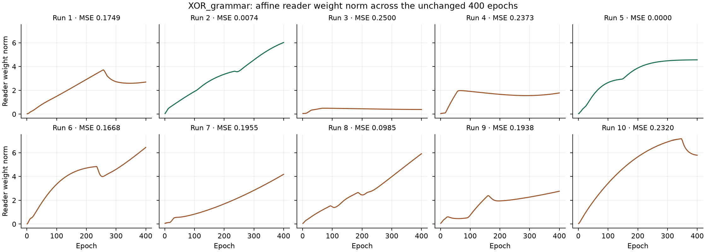

# Decoder, operators and 6.8 — §20 activation magnitude

2026-10-05. **Review hold: all new work is uncommitted, nothing pushed.** Main remains at the local §16.3 candidate `eb1fbefb5f4a33a22cbb4a590cc0927d6a60761d`, tagged `6.8-s16.3-candidate`. The parent WikiOracle index remains `802abb1a`. One working tree, conceptual capacities **6 / 8**.

The complete ten-worker sweep is green: **5,203 completed; 4,916 passed, 286 skipped, 1 non-strict XPASS, 0 XFAIL, zero failures**, in 895.3 seconds. The subsequent once-only campaign measured **sum 10/10**, **XOR class 2/10, reconstruction 8/10, joint 2/10**, and **MM_xor 10/10**. Sum was read first. No gate retries or tuning; seeds, bars, budgets, optimizers, capacities, XML configurations and guards unchanged.

## Causes reported before ports

1. **Tied chooser test: production regression.** The score-function term was zero. `reconstruction.free_bytes` nevertheless reached the shared MLP/tool embedding through input attention's straight-through credit, the cached perception graph and its pullback. The greedy trial's gradient norm at `mlp.0.weight` was .0065753693; there was no grammar-lesson or local preference term. Detaching attention credit at the sentence handoff closes that unintended path. The original no-movement tie assertion is retained.
2. **Distinct case's generator assertion: port.** Every live decoder step had one legal action, hence an exactly zero softmax derivative. Six-action records were an already-empty batch row with parent norm zero. The test still requires movement whenever a live choice exists and requires no movement otherwise. The fixture's seed and batch are unchanged.
3. **MM_grammar row 4: port, not a letter or chunk-promotion regression.** In the original sweep order, the untrained grammar chose a `part` relation. `ClauseTaxonomyPlan` created the native order-one concept `('pool', 9)` at row 4, symbolizing object 4 with part 2. There is no magnitude threshold in that admission. The test now asserts the exact four-word inventory immediately after word admission and checks that any later rows are higher-order native concepts with conceptual parts. It continues to reject concept rows for letters. No admission rule, capacity or promotion threshold was changed.

[Diagnosis and classifications](review20-diagnosis.json), [per-objective gradients and optimizer movements](review20-diagnosis-before-worker-reproduction/test_normal_text_reconstruction_updates_the_grammar_chooser[tie].json), [inventory allocation trace](review20-diagnosis/test_small_inventory_pairs_words_without_allocating_letter_rows[MM_grammar-8].json), and [original-order failing probe](probes/review20-inventory-worker-order/run.log) preserve the evidence. Two observer setup errors (wrong row-owner class, then unsupported optimizer hooks) are saved separately; they changed neither production code nor tests. The expanded observer includes the perception pullback, which a direct-only gradient query misses.

Claude's §21 note arrived after the starting snapshot and is [preserved unchanged](review20-external-plan.txt), with [hashes and provenance](review20-external-docs.json). The delivered repair detaches the sentence handoff; it does **not** add §21.1's proposed attention score-function objective. Our saved seed-613 trace differs from §21.2: its initial legal counts are `[1,1]`, followed by `[6,1]` with zero parent in the six-action row; no live row in that trace has zero legal actions. Both one-code and recomposed-pair eligibility residuals are mean-square errors against the same parent, so dividing both by that parent's positive mean square leaves their comparison unchanged. No eligibility threshold was changed. The §21.3 allocation question is resolved by the call stack: `ClauseTaxonomyPlan` tests a selected `part` relation, positive native references outside truth rows, distinct objects, order compatibility and capacity. It symbolizes the parent when no matching symbol exists; it compares no code norm, similarity or co-activation threshold. The random grammar's selection may respond to changed inputs, but that is different from a scale threshold in admission. These differences remain explicit for review.

## Kernels and ownership

Both binding kernels separate **code direction** from **activation magnitude**. Write `u=unit(x)`, `v=unit(y)` and let a,b be the operand activations: conjunction is `a*b*unit(u*v)`; disjunction is `(a+b-a*b)*unit(u+v-u*v)`. The tensor API treats a supplied nonzero bare code as present; explicit activation arguments override presence. A zero code remains zero. Signed input directions retain polarity; magnitudes use the absolute activation. A repeated conjunction reference retains its direction and activation. The serial chooser supplies native leaves' projection coefficients; a composed kernel root already carries its activation as its norm. The minimal two-tensor chooser API remains supported at full presence.

The sum control still computes its mean and the affine reader still reads the raw root. There is no reader normalization, new trainable parameter or new loss. Pair search remains hard, relative-residual and detached at candidate codes; the byte bank remains detached. The score-function loss, K·R scale, sampled exploration and strict keep rule are unchanged. Perception retains the sole writer of prototypes and evidence. Both full-presence initializers from §§18–19 remain in place.

The first zero-step observation, before any backward or optimizer step, gave forms `[.624036, 2.058787, 1.285894, 2.329995]` in hello/world/there/loving order and four root norms within 1.2e-7 of one. [Raw observation](review20-start-norms.json). This is an unseeded mechanism observation, not an additional training or acceptance gate.

## Verification and ports

The first frozen sweep attempt was stopped after the saved failures were known: 4912/5203 completed. Three additional tests encoded norm-as-certainty; one minimal-state fixture exposed an indexing regression, fixed without changing that test. The interrupt also stopped a nested training-device test; that consequence was classified separately, with no repair. [Preserved initial sweep](review20-sweep-initial/result.json), [classification](review20-sweep-classification.json).

All final focused probes retained the earlier file lists and added the affected contracts: **170 passed, 18 skipped** over the [complete 24-file list](review20-focused-files.json). [Final focused output](probes/review20-final-repaired-focused/run.log). The full delivered-source sweep then completed all tests. All sixteen original output-gradient regression assertions pass. The overlap fixture retains `xfail(strict=False)` and the .8 assertion; its historical unseeded result was about 5/8 passes, otherwise overlap .5 from small-width join collisions. Non-strict XPASS counts as pass; strict XPASS still fails.

[Complete old/new test files](review20-source/test-ports.json) preserve every port, including the binding formula expectations and the decoder credit fixture whose old norm threshold could no longer separate roots from form codes. [Seed audit](review20-source/seed-port-audit.json), [changes from §19](review20-source/changes-from-review19.patch), [full sweep](review20-sweep/summary.json), [HTML report](review20-sweep/report.html).

## Once-only gates

Both XOR bars consume the same training in each run. Class requires four correct answers and MSE < .05; reconstruction requires all four input word-multisets recovered without unavailable decoding. Bands: at 0 means MSE < .05; at ¼ means |MSE−.25| ≤ .02; remaining errors lie between or above. Sum keeps |checkerboard contrast| ≤ 1e-4 and the class bar unmet. MM_xor keeps best MSE < .20. XOR/sum budgets remain 400 epochs; MM_xor at most 200.

| Run | MSE | Band | Answers | Read-back | Joint | Final greedy operators | Reader norm, epochs 1 → 400 |
| --- | --- | --- | --- | --- | --- | --- | --- |
| 1 | 0.1749236 | between | 4/4 | 4/4 | no | conjunction | 0.02777773 → 2.696542 |
| 2 | 0.007416322 | at 0 | 4/4 | 4/4 | yes | conjunction | 0.0433245 → 6.022847 |
| 3 | 0.2500153 | at 1/4 | 2/4 | 1/4 | no | disjunction | 0.0540182 → 0.3888595 |
| 4 | 0.2372782 | at 1/4 | 2/4 | 4/4 | no | hello world: conjunction; hello there: disjunction; loving world: conjunction; loving there: disjunction | 0.04422166 → 1.780048 |
| 5 | 5.460259e-07 | at 0 | 4/4 | 4/4 | yes | conjunction | 0.03808232 → 4.564685 |
| 6 | 0.1667626 | between | 4/4 | 3/4 | no | conjunction | 0.01242124 → 6.444399 |
| 7 | 0.1954714 | between | 4/4 | 4/4 | no | conjunction | 0.05730205 → 4.182237 |
| 8 | 0.09852814 | between | 4/4 | 4/4 | no | conjunction | 0.05272431 → 5.914244 |
| 9 | 0.1937543 | between | 4/4 | 4/4 | no | conjunction | 0.06028624 → 2.76104 |
| 10 | 0.2320257 | at 1/4 | 2/4 | 4/4 | no | disjunction | 0.03906601 → 5.788633 |

Bands: **at 0: 2**, **at 1/4: 3**, **between: 5**, **above 1/4: 0**.

| Record | CS XOR / MM | Class | Reconstruction | Joint | MM_xor | Sum |
| --- | --- | --- | --- | --- | --- | --- |
| 6.9 closing | accepted source | MSE .1147481948 | 0/4 sentences | — | red through 6.9 §17 | — |
| §12 | 6 / 8 | 0/10 | 7/10 | 0/10 | 10/10 | 10/10 |
| §13 | 262 / 264 | 0/10 | 0/10 | 0/10 | 10/10 | 10/10 |
| §14 pre-addendum | 262 / 264 | 1/10 | 8/10 | 1/10 | 10/10 | 10/10 |
| §17 | 6 / 8 | 1/10 | 10/10 | 1/10 | 10/10 | 10/10 |
| §18 | 6 / 8 | 0/10 | 10/10 | 0/10 | 10/10 | 10/10 |
| §19 | 6 / 8 | not run | not run | not run | not run | not run |
| §20 | 6 / 8 | 2/10 | 8/10 | 2/10 | 10/10 | 10/10 |

The accepted closing record remains .1147481948, reconstruction 0/4 and zero ownership conflicts; prior measurements remain class 9/10 and reconstruction 5/10. This XOR table measures composition of perceptual forms, its inverse, the raw affine read and ownership. Order-zero meanings are context-only and empty here; their coincidence is correct. MM_xor measures the field path where meanings exist. Counts are unpaired measurements, not causal attributions.

**Counts below the preceding measured §18 campaign:** reconstruction_pass: 8/10 versus 10/10. These results stand; the green sweep does not imply that every gate passes. No source repair or retraining followed these observations.

| Reconstruction failure | Saved read-backs | Exact form collisions, start → end |
| --- | --- | --- |
| 3 | hello world → '' (unavailable=True); hello there → 'hello there' (unavailable=False); loving world → '' (unavailable=True); loving there → 'there' (unavailable=True) | [['world', 'loving']] → [['world', 'loving']] |
| 6 | hello world → 'hello hello' (unavailable=False); hello there → 'there hello' (unavailable=False); loving world → 'loving world' (unavailable=False); loving there → 'loving there' (unavailable=False) | [] → [] |

These collision comparisons read the saved vectors exactly, without a tolerance, forward call or training. They concern perceptual forms; coinciding empty meanings remain correct. They do not establish a causal comparison with earlier random runs.

Final read-back annotations: **{'code': 75}**, 75 word decisions. Maximum code displacement across XOR runs: **0**. [Complete per-word annotations, named derivations and 400 reader observations per run](review20-measurements/summary.json).

Five word positions in run 3 produced no read-back decision; their unavailable/partial sentence outputs are shown above. No final winner was decided by priming. The forecast of 10/10 reconstruction and a majority of class runs at zero was not met. The reader trajectories are retained without tuning or assigning a common cause to the class failures.

## Starting norms and geometry

| XOR run | Form L2: hello, world, there, loving | Root L2: hw, ht, lw, lt |
| --- | --- | --- |
| 1 | [1.96901, 2.045344, 2.086872, 2.22075] | [1, 1, 1, 1] |
| 2 | [1.643242, 1.897285, 1.041307, 2.065117] | [1, 1, 1, 0.9999999] |
| 3 | [1.834448, 1.901887, 1.969972, 1.901887] | [1, 1, 1, 1] |
| 4 | [1.965715, 1.234314, 1.768932, 1.966625] | [1, 1, 1, 1] |
| 5 | [1.11804, 1.590059, 1.601564, 1.819862] | [1, 1, 1, 1] |
| 6 | [1.600372, 1.269649, 1.845745, 1.82432] | [1, 1, 1, 1] |
| 7 | [2.040329, 2.163806, 2.183467, 1.682927] | [1, 1, 1, 1] |
| 8 | [1.639951, 1.767341, 1.693818, 2.111931] | [1, 0.9999999, 1, 1] |
| 9 | [1.86337, 2.334515, 2.029317, 1.893533] | [1, 1, 0.9999999, 1] |
| 10 | [1.819022, 2.061883, 1.775874, 2.148296] | [1, 1, 1, 1] |

[All start norms](review20-measurements/start-norms.json), including sum runs and unpaired §§17–18 history, are computed from saved first-trial vectors before owner updates. No extra forwards or trainings were added.

| Run | Mean cos(L), start → end | Centered root singular values, start → end | Unit-root XOR interaction, start → end |
| --- | --- | --- | --- |
| 1 | 0.9313566 → 0.9313566 | [0.2400051, 0.08790563, 0.00995682, 3.473838e-08] → [0.4354553, 0.1921495, 0.037453, 4.223827e-08] | 0.05220944 → 0.1970195 |
| 2 | 0.8500479 → 0.8500479 | [0.5939286, 0.3816212, 0.1798007, 7.980979e-08] → [0.6352055, 0.3918576, 0.102355, 2.062884e-08] | 0.5113221 → 0.316262 |
| 3 | 0.9583984 → 0.9583984 | [0.4163298, 0.1108939, 0.002542971, 2.848494e-08] → [0.1408187, 0.03284493, 0.0008426163, 1.755549e-08] | 0.02776884 → 0.00470187 |
| 4 | 0.7645366 → 0.7645366 | [0.8546564, 0.06165302, 0.01361596, 5.655736e-08] → [0.8546564, 0.06165302, 0.01361596, 5.655736e-08] | 0.03881811 → 0.03881811 |
| 5 | 0.7478231 → 0.7478231 | [0.4327317, 0.143392, 0.04829895, 7.299087e-08] → [0.7171798, 0.5515064, 0.1875638, 2.453845e-08] | 0.1297023 → 0.5243867 |
| 6 | 0.8443189 → 0.8443189 | [0.3655231, 0.143267, 0.01138971, 6.067259e-08] → [0.3015158, 0.1729517, 0.03068497, 5.296526e-08] | 0.0248131 → 0.06868862 |
| 7 | 0.9362527 → 0.9362527 | [0.4590199, 0.2063169, 0.02407911, 7.376838e-08] → [0.4590199, 0.2063169, 0.02407911, 7.376838e-08] | 0.06864183 → 0.06864183 |
| 8 | 0.8792088 → 0.8792088 | [0.5043154, 0.4166547, 0.06477085, 4.992868e-08] → [0.5043154, 0.4166547, 0.06477085, 4.992868e-08] | 0.1460965 → 0.1460965 |
| 9 | 0.8841831 → 0.8841831 | [0.3718451, 0.245963, 0.01960864, 4.998052e-08] → [0.5364877, 0.3451832, 0.01610238, 5.123057e-08] | 0.2580644 → 0.1195376 |
| 10 | 0.8730876 → 0.8730876 | [0.4663064, 0.3904013, 0.03712548, 5.784727e-08] → [0.3066806, 0.1759088, 0.01048382, 8.009153e-08] | 0.08510568 → 0.02927404 |

Each run audit also retains full pairwise word/root cosines and per-word support (fraction nonzero, minimum absolute coordinate). The interaction is `‖r_hw−r_ht−r_lw+r_lt‖` on unit roots for observation only. `d=relu(e⁺−e⁻)` is net 11b evidence: positivity selects a part at full presence, not a scale. Room remains L+m≤U, m=0; only the minimal whole moves upward. Room entries below are count / maximum violation.

| Run | d range, start → end | First clamp, before → after | Last clamp, before → after |
| --- | --- | --- | --- |
| 1 | parts [1, 1] (n=19); wholes [1, 1] (n=8) → parts [1, 1] (n=4); wholes [1, 1] (n=8) | 24 / 0.9999999 → 1 / 0.5975178 | 0 / 0 → 0 / 0 |
| 2 | parts [1, 1] (n=19); wholes [1, 1] (n=8) → parts [1, 1] (n=4); wholes [1, 1] (n=8) | 24 / 0.9999999 → 2 / 0.1194323 | 0 / 0 → 0 / 0 |
| 3 | parts [1, 1] (n=19); wholes [1, 1] (n=8) → parts [1, 1] (n=4); wholes [1, 1] (n=8) | 24 / 0.9999999 → 2 / 0.3554693 | 0 / 0 → 0 / 0 |
| 4 | parts [1, 1] (n=19); wholes [1, 1] (n=8) → parts [1, 1] (n=4); wholes [1, 1] (n=8) | 21 / 0.9999999 → 1 / 0.0890682 | 0 / 0 → 0 / 0 |
| 5 | parts [1, 1] (n=19); wholes [1, 1] (n=8) → parts [1, 1] (n=4); wholes [1, 1] (n=8) | 22 / 0.9999999 → 4 / 0.6977829 | 0 / 0 → 0 / 0 |
| 6 | parts [1, 1] (n=19); wholes [1, 1] (n=8) → parts [1, 1] (n=4); wholes [1, 1] (n=8) | 20 / 0.9999999 → 3 / 0.883961 | 0 / 0 → 0 / 0 |
| 7 | parts [1, 1] (n=19); wholes [1, 1] (n=8) → parts [1, 1] (n=4); wholes [1, 1] (n=8) | 24 / 0.9999999 → 0 / 0 | 0 / 0 → 0 / 0 |
| 8 | parts [1, 1] (n=19); wholes [1, 1] (n=8) → parts [1, 1] (n=4); wholes [1, 1] (n=8) | 24 / 0.9999999 → 4 / 0.3558978 | 0 / 0 → 0 / 0 |
| 9 | parts [1, 1] (n=19); wholes [1, 1] (n=8) → parts [1, 1] (n=4); wholes [1, 1] (n=8) | 23 / 0.9999999 → 1 / 0.1891826 | 0 / 0 → 0 / 0 |
| 10 | parts [1, 1] (n=19); wholes [1, 1] (n=8) → parts [1, 1] (n=4); wholes [1, 1] (n=8) | 23 / 0.9999999 → 3 / 0.7212324 | 0 / 0 → 0 / 0 |

## Tenth-run audits

**1600 sentence/step records; 1600 departures; 860 nonzero advantages.** Logits range from -0.01570457 to 0.3771969. Maximum error against K·R·ΔC·∇p: 2.793968e-09; finite-difference error: 8.744525e-10. [Raw costs/actions/advantages/p before-after and per-epoch ranges](review20-measurements/xor-10/run-audit.json).

The nonzero-advantage count is not near zero: it is 860/1600 (53.75%) in this measurement. The comparison continued to train the compose chooser; all reported logit ranges are finite.

| Decomposition feature | Start weight | End weight |
| --- | --- | --- |
| negative_relative_residual | 1 | 3.998387 |
| left_activation | 0 | -0.4057914 |
| right_activation | 0 | 0.4199509 |
| left_priming | 0 | 1.70171 |
| right_priming | 0 | 1.702335 |

| Decomposition measure | Start | End |
| --- | --- | --- |
| true_pair_in_shortlist | 4/4 | 4/4 |
| pick_equals_true | 2/4 | 3/4 |
| absent_targets | 0/4 | 0/4 |

Sentence-path prototype/evidence gradient maximum **0**, with **0** nonzero observations. Ownership conflicts **0**. [Ownership](review20-measurements/xor-10/ownership/ownership.json) and [audit summary](review20-measurements/audit-summary.json).

The decoder audit has 1600 first-step records and 1200 owner steps, preserving STOP-over-undo margins and gradients, paths and derivation stability in the [events](review20-measurements/xor-10/ownership/events.jsonl). Kept-path modal fractions by compose trial: exploit [0.8675, 0.83, 0.805, 0.885]; explore [0.8675, 0.83, 0.925, 0.885]. Every keep decision is checked against strict improvement; ties stay greedy.

## Review package

[Source and hashes](review20-source/source.json), [source archive](review20-source/source.zip), [result validation](review20-results-validation.json), [historical preservation](review20-preservation.json) and [delivery manifest](review20-delivery/bridge.json). The incoming receipt is [preserved intact](README-before-review20.md). The campaign reuses the prior observation helpers unchanged and measures the same frozen source that passed collection and the full sweep.

No fresh bulk BasicModel scoring or native benchmark. Frozen evaluation admits nothing; the trained NanoChat gate waits for item 4. Complement bootstrap learning, form fold, Kleene connectives, not items, the concept-face negative image, form density, and the dense control variate remain deferred. **Stop for Claude's review before any commit. Nothing has been pushed.**
