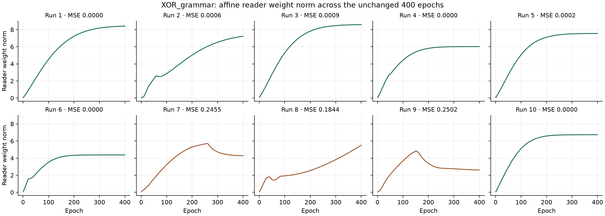

# Decoder, operators and 6.8 — §22 initialization and content capacity

**Accepted by Alec on 2026-10-05.** Commit, push and WikiOracle submodule bump authorized. The review-hold statements below describe the frozen measurement state; its source, results and archived hashes remain unchanged. Claude's acceptance review is [6.8 plan §23](../../plans/2026-09-27-item-6-8-one-attention.md#23-review-of-the-22-measurement-acceptance-claude-2026-10-05). [Acceptance record](review22-acceptance.json).

2026-10-05. **Review hold: all new work is uncommitted, nothing pushed.** Main remains at the local §16.3 candidate `eb1fbefb5f4a33a22cbb4a590cc0927d6a60761d`, tagged `6.8-s16.3-candidate`. The parent WikiOracle index remains `802abb1a`. One working tree.

The complete ten-worker sweep is green: **5,204 completed; 4,917 passed, 286 skipped, 1 non-strict XPASS, 0 XFAIL, zero failures**, in 893.1 seconds. The subsequent once-only campaign measured **sum 10/10**, **XOR class 7/10, reconstruction 9/10, joint 6/10**, and **MM_xor 10/10**. Sum was read first. No gate retries or tuning; seeds, bars, budgets, optimizers and guards unchanged.

## The two declared changes

1. `RadixLayer.insert()` draws the same Gaussian row, divides by its L2 norm, then clamps to [0,1]. The normalization precedes the clamp; there is no second normalization afterward. Explicit initializers and duplicate admission retain their behavior and parameter identity. The §18 byte-fallback initializer is unchanged. [Exact initializer/RNG check and XML-value comparison](review22-change-verification.json).
2. **Declared capacity increase:** `nDim` is 14 → 22 in InputSpace, PartSpace, ConceptualSpace and WholeSpace of both `XOR_grammar.xml` and `MM_grammar.xml`. Each processing event now has **14 content + 4 where + 4 when coordinates**, previously 6 + 4 + 4. Concept-row capacities remain **6 / 8**. The separate MM_grammar WholeSpace output-width override remains 14; all XML values other than the eight declared `nDim` values are unchanged. Fixture comments name the current content width. `MM_xor.xml` is unchanged.

The kernels retain §20's activation magnitudes and code directions. Forms remain joins of positively evidenced parts at full presence. Attention credit stays detached at the sentence handoff; the attention chooser's estimator is the operators update's. The forward score-function K·R term, decomposition chooser, hard pair search, byte scorer, room rule, raw-root affine reader and §20 ports are unchanged. Perception retains the sole writer of its codes and evidence. Architecture, GradientFlow, FutureWork and the 6.8 plan are preserved byte-for-byte from the starting state.

## Verification and ports

The initializer check used no seed override, forward, backward or training. It verified the exact L2-then-clamp row, the same single Gaussian draw, unchanged other rows, parameter identity, duplicate admission and explicit initializers, at widths 6 and 14. Its first XML comparison mistakenly included indentation affected by comment edits; the [failed checker](review22-init-check-before-whitespace-fix.py) and [output](review22-init-check-first-attempt.log) are preserved. The repaired checker compares XML values, with no production repair.

The initial full sweep was interrupted after **5030/5204** cases to port two old six-coordinate assertions. The failures were `test_actual_serial_code_uses_six_native_coordinates_and_no_context_bootstrap` and the nested audit-wiring probe's support-dimension assertion. Both now expect the declared fourteen-coordinate content band; the first test's name and address-band slice follow that width. The historical §17 probe remains intact; the wrapper selects a §22 copy. No regression assertion, gate bar, ownership assertion or seed changed. [Initial source](review22-source/source.zip), [initial sweep](review22-sweep/result.json), [failure classification](review22-sweep-classification.json), [complete test-file ports](review22-delivered-source/test-ports.json), [complete nested-probe port](review22-observer-port.json).

The final focused probe retained its first file and added the second affected file: **21/21 passed**, over [the declared file list](review22-focused-files.json). [Focused result](probes/review22-final-focused/result.json). The subsequent full sweep completed all tests on the delivered source, including all sixteen original output-gradient regression assertions. Non-strict XPASS counts as a pass; the overlap fixture retains `xfail(strict=False)` and its .8 assertion (historically about 5/8 unseeded passes, otherwise overlap .5 from small-width join collisions). [Full sweep](review22-final-sweep/summary.json), [HTML report](review22-final-sweep/report.html), [seed audit](review22-delivered-source/seed-port-audit.json), [changes from §20](review22-delivered-source/changes-from-review20.patch).

## Once-only gates

Both XOR bars consume the same training in each run. Class requires four correct answers and MSE < .05; reconstruction requires all four input word-multisets recovered without unavailable decoding. Bands: at 0 means MSE < .05; at ¼ means |MSE−.25| ≤ .02; remaining errors lie between or above. Sum keeps |checkerboard contrast| ≤ 1e-4 and the class bar unmet. MM_xor keeps best MSE < .20. XOR/sum budgets remain 400 epochs; MM_xor at most 200.

| Run | MSE | Band | Answers | Read-back | Joint | Final greedy operators | Reader norm, epochs 1 → 400 |
| --- | --- | --- | --- | --- | --- | --- | --- |
| 1 | 1.715357e-05 | at 0 | 4/4 | 4/4 | yes | conjunction | 0.05780351 → 8.415808 |
| 2 | 0.0005832326 | at 0 | 4/4 | 4/4 | yes | conjunction | 0.05838229 → 7.229935 |
| 3 | 0.0008697595 | at 0 | 4/4 | 4/4 | yes | conjunction | 0.09013153 → 8.58875 |
| 4 | 7.127259e-10 | at 0 | 4/4 | 4/4 | yes | conjunction | 0.06989342 → 6.019396 |
| 5 | 0.0001592712 | at 0 | 4/4 | 4/4 | yes | conjunction | 0.06793531 → 7.553932 |
| 6 | 3.129654e-05 | at 0 | 4/4 | 4/4 | yes | conjunction | 0.08667617 → 4.371605 |
| 7 | 0.2454728 | at 1/4 | 2/4 | 4/4 | no | disjunction | 0.07044662 → 4.278137 |
| 8 | 0.1843632 | between | 4/4 | 4/4 | no | disjunction | 0.084051 → 5.500618 |
| 9 | 0.2501699 | at 1/4 | 2/4 | 4/4 | no | disjunction | 0.0484488 → 2.60461 |
| 10 | 1.347584e-05 | at 0 | 4/4 | 3/4 | no | conjunction | 0.07611185 → 6.731491 |

Bands: **at 0: 7**, **at 1/4: 2**, **between: 1**, **above 1/4: 0**.

| Record | CS XOR / MM | Class | Reconstruction | Joint | MM_xor | Sum |
| --- | --- | --- | --- | --- | --- | --- |
| 6.9 closing | accepted source | MSE .1147481948 | 0/4 sentences | — | red through 6.9 §17 | — |
| §12 | 6 / 8 | 0/10 | 7/10 | 0/10 | 10/10 | 10/10 |
| §13 | 262 / 264 | 0/10 | 0/10 | 0/10 | 10/10 | 10/10 |
| §14 pre-addendum | 262 / 264 | 1/10 | 8/10 | 1/10 | 10/10 | 10/10 |
| §15–§16.3 | 6 / 8 | not measured | not measured | not measured | not measured | not measured |
| §17 | 6 / 8 | 1/10 | 10/10 | 1/10 | 10/10 | 10/10 |
| §18 | 6 / 8 | 0/10 | 10/10 | 0/10 | 10/10 | 10/10 |
| §19 | 6 / 8 | not run | not run | not run | not run | not run |
| §20 | 6 / 8 | 2/10 | 8/10 | 2/10 | 10/10 | 10/10 |
| §22 (content 14) | 6 / 8 | 7/10 | 9/10 | 6/10 | 10/10 | 10/10 |

The accepted closing record remains .1147481948, reconstruction 0/4 and zero ownership conflicts; prior measurements remain class 9/10 and reconstruction 5/10. This XOR table measures composition of perceptual forms, its inverse, the raw affine read and ownership. Order-zero meanings are context-only and empty here; their coincidence is correct. MM_xor measures the field path where meanings exist. Counts are unpaired measurements, not causal attributions.

| Reconstruction failure | Saved read-backs | Exact form collisions, start → end |
| --- | --- | --- |
| 10 | hello world → 'world hello' (unavailable=False); hello there → 'hello hello' (unavailable=False); loving world → 'loving world' (unavailable=False); loving there → 'loving there' (unavailable=False) | [] → [] |

These collision comparisons read the saved vectors exactly, without a tolerance, forward call or training. They concern perceptual forms; coinciding empty meanings remain correct. They do not establish a causal comparison with earlier random runs.

Final read-back annotations: **{'code': 80}**, 80 word decisions. Maximum code displacement across XOR runs: **0**. [Complete per-word annotations, named derivations and 400 reader observations per run](review22-measurements/summary.json).

Missing final read-back decisions: **0/80** word positions. Priming-decided winners and ties are retained in the annotations; the full [per-position annotation file](review22-measurements/readback-annotations.json) includes unavailable positions. The forecast of 10/10 reconstruction is not met; a majority of class runs at zero is met.

## Starting norms and geometry

| XOR run | Form L2: hello, world, there, loving | Root L2: hw, ht, lw, lt |
| --- | --- | --- |
| 1 | [1.114553, 1.419222, 1.154222, 1.284848] | [0.9999999, 1, 1, 1] |
| 2 | [1.36475, 1.398593, 1.3216, 1.4776] | [1, 1, 1, 1] |
| 3 | [1.504376, 1.303783, 1.317549, 1.503042] | [1, 1, 1, 1] |
| 4 | [1.4134, 1.410537, 1.234225, 1.490219] | [1, 1, 1, 1] |
| 5 | [1.056932, 1.33531, 1.082739, 1.386518] | [1, 1, 1, 1] |
| 6 | [1.247271, 1.322935, 1.188491, 1.549057] | [1, 1, 1, 1] |
| 7 | [1.450182, 1.442087, 1.274592, 1.471379] | [1, 1, 1, 1] |
| 8 | [1.138187, 1.309556, 1.09454, 1.156305] | [0.9999999, 1, 1, 1] |
| 9 | [1.29821, 1.477198, 1.262022, 1.321047] | [1, 1, 1, 1] |
| 10 | [1.003894, 1.178365, 0.8782687, 1.349279] | [1, 1, 1, 1] |

[All start norms](review22-measurements/start-norms.json), including sum runs and unpaired §§17–18 and §20 history, are computed from saved first-trial vectors before owner updates. No extra forwards or trainings were added.

| Run | Mean cos(L), start → end | Centered root singular values, start → end | Unit-root XOR interaction, start → end |
| --- | --- | --- | --- |
| 1 | 0.8323023 → 0.8323023 | [0.6276515, 0.310093, 0.1167502, 6.178546e-08] → [0.6276515, 0.310093, 0.1167502, 6.178546e-08] | 0.2571256 → 0.2571256 |
| 2 | 0.8160946 → 0.8160946 | [0.369271, 0.2640556, 0.02474478, 7.342969e-08] → [0.661087, 0.434509, 0.08450774, 6.121013e-08] | 0.05333817 → 0.3263355 |
| 3 | 0.8067139 → 0.8067139 | [0.9076831, 0.4678241, 0.1016647, 4.774244e-08] → [0.9076831, 0.4678241, 0.1016647, 4.774244e-08] | 0.2594329 → 0.2594329 |
| 4 | 0.7960691 → 0.7960691 | [0.7016319, 0.4477988, 0.1394897, 4.075016e-08] → [0.7016319, 0.4477988, 0.1394897, 4.075016e-08] | 0.417949 → 0.417949 |
| 5 | 0.8348439 → 0.8348439 | [0.6375207, 0.4634247, 0.1014824, 6.971118e-08] → [0.6375207, 0.4634247, 0.1014824, 6.971118e-08] | 0.3202541 → 0.3202541 |
| 6 | 0.7962987 → 0.7962987 | [0.6277686, 0.3687156, 0.1719462, 6.111275e-08] → [0.7352916, 0.4124627, 0.1317644, 5.433536e-08] | 0.5721058 → 0.5064778 |
| 7 | 0.9154117 → 0.9154117 | [0.3859017, 0.3062633, 0.04058994, 7.153896e-08] → [0.2350686, 0.120712, 0.01208656, 8.73159e-08] | 0.2568893 → 0.02571862 |
| 8 | 0.8231282 → 0.8231282 | [0.6334602, 0.4112744, 0.1156702, 4.273522e-08] → [0.3485103, 0.1409531, 0.02464296, 8.385347e-08] | 0.242155 → 0.05358979 |
| 9 | 0.8949533 → 0.8949533 | [0.5329769, 0.2196397, 0.05381908, 4.33928e-08] → [0.2137871, 0.09651984, 0.008628804, 6.742894e-08] | 0.1374339 → 0.02377051 |
| 10 | 0.7819168 → 0.7819168 | [0.6306167, 0.4012849, 0.150804, 7.014229e-08] → [0.6306167, 0.4012849, 0.150804, 7.014229e-08] | 0.3348488 → 0.3348488 |

Each run audit also retains full pairwise word/root cosines and per-word support (fraction nonzero, minimum absolute coordinate). The interaction is `‖r_hw−r_ht−r_lw+r_lt‖` on unit roots for observation only. `d=relu(e⁺−e⁻)` is net 11b evidence: positivity selects a part at full presence, not a scale. Room remains L+m≤U, m=0; only the minimal whole moves upward. Room entries below are count / maximum violation.

| Run | d range, start → end | First clamp, before → after | Last clamp, before → after |
| --- | --- | --- | --- |
| 1 | parts [1, 1] (n=19); wholes [1, 1] (n=8) → parts [1, 1] (n=4); wholes [1, 1] (n=8) | 48 / 0.6466667 → 10 / 0.2032053 | 0 / 0 → 0 / 0 |
| 2 | parts [1, 1] (n=19); wholes [1, 1] (n=8) → parts [1, 1] (n=4); wholes [1, 1] (n=8) | 50 / 0.6843448 → 9 / 0.309332 | 0 / 0 → 0 / 0 |
| 3 | parts [1, 1] (n=19); wholes [1, 1] (n=8) → parts [1, 1] (n=4); wholes [1, 1] (n=8) | 49 / 0.7610624 → 10 / 0.2798901 | 0 / 0 → 0 / 0 |
| 4 | parts [1, 1] (n=19); wholes [1, 1] (n=8) → parts [1, 1] (n=4); wholes [1, 1] (n=8) | 53 / 0.6965761 → 9 / 0.3344577 | 0 / 0 → 0 / 0 |
| 5 | parts [1, 1] (n=19); wholes [1, 1] (n=8) → parts [1, 1] (n=4); wholes [1, 1] (n=8) | 54 / 0.6599448 → 19 / 0.2309811 | 0 / 0 → 0 / 0 |
| 6 | parts [1, 1] (n=19); wholes [1, 1] (n=8) → parts [1, 1] (n=4); wholes [1, 1] (n=8) | 51 / 0.6340008 → 11 / 0.196436 | 0 / 0 → 0 / 0 |
| 7 | parts [1, 1] (n=19); wholes [1, 1] (n=8) → parts [1, 1] (n=4); wholes [1, 1] (n=8) | 54 / 0.6438968 → 10 / 0.2780679 | 0 / 0 → 0 / 0 |
| 8 | parts [1, 1] (n=19); wholes [1, 1] (n=8) → parts [1, 1] (n=4); wholes [1, 1] (n=8) | 52 / 0.5703661 → 11 / 0.1781371 | 0 / 0 → 0 / 0 |
| 9 | parts [1, 1] (n=19); wholes [1, 1] (n=8) → parts [1, 1] (n=4); wholes [1, 1] (n=8) | 49 / 0.594929 → 5 / 0.2776086 | 0 / 0 → 0 / 0 |
| 10 | parts [1, 1] (n=19); wholes [1, 1] (n=8) → parts [1, 1] (n=4); wholes [1, 1] (n=8) | 43 / 0.6471633 → 9 / 0.3806789 | 0 / 0 → 0 / 0 |

| Run | Exact form collisions at start | Exact form collisions at end |
| --- | --- | --- |
| 1 | [] | [] |
| 2 | [] | [] |
| 3 | [] | [] |
| 4 | [] | [] |
| 5 | [] | [] |
| 6 | [] | [] |
| 7 | [] | [] |
| 8 | [] | [] |
| 9 | [] | [] |
| 10 | [] | [] |

## Tenth-run audits

**1600 sentence/step records; 1600 departures; 80 nonzero advantages.** Logits range from -0.05221737 to 0.3608396. Maximum error against K·R·ΔC·∇p: 1.862645e-09; finite-difference error: 1.020065e-09. [Raw costs/actions/advantages/p before-after and per-epoch ranges](review22-measurements/xor-10/run-audit.json).

Nonzero advantages account for 5.00% of the sentence/step records; finite logit ranges: True.

| Decomposition feature | Start weight | End weight |
| --- | --- | --- |
| negative_relative_residual | 1 | 5.341804 |
| left_activation | 0 | -2.315888 |
| right_activation | 0 | 2.110353 |
| left_priming | 0 | 1.674845 |
| right_priming | 0 | 1.741537 |

| Decomposition measure | Start | End |
| --- | --- | --- |
| true_pair_in_shortlist | 4/4 | 4/4 |
| pick_equals_true | 2/4 | 3/4 |
| absent_targets | 0/4 | 0/4 |

Sentence-path prototype/evidence gradient maximum **0**, with **0** nonzero observations. Ownership conflicts **0**. [Ownership](review22-measurements/xor-10/ownership/ownership.json) and [audit summary](review22-measurements/audit-summary.json).

The decoder audit has 1600 first-step records and 1200 owner steps, preserving STOP-over-undo margins and gradients, paths and derivation stability in the [events](review22-measurements/xor-10/ownership/events.jsonl). Kept-path modal fractions by compose trial: exploit [1, 1, 1, 1]; explore [1, 1, 1, 1]. Every keep decision is checked against strict improvement; ties stay greedy.

## Review package

[Source and hashes](review22-delivered-source/source.json), [source archive](review22-delivered-source/source.zip), [result validation](review22-results-validation.json), [historical preservation](review22-preservation.json) and [delivery manifest](review22-delivery/bridge.json). The incoming receipt is [preserved intact](README-before-review22.md). The campaign reuses the prior training observers unchanged; the separate audit-wiring probe is ported for the declared width. It measures the same frozen source that passed collection and the full sweep.

The comparison is unpaired and includes a declared content-capacity change; it does not isolate the effects of initialization and width. No fresh bulk BasicModel scoring or native benchmark. Frozen evaluation admits nothing; the trained NanoChat gate waits for item 4. Complement bootstrap learning, form fold, Kleene connectives, not items, the concept-face negative image, form density, and the dense control variate remain deferred. **Stop for Claude's review before any commit. Nothing has been pushed.**
