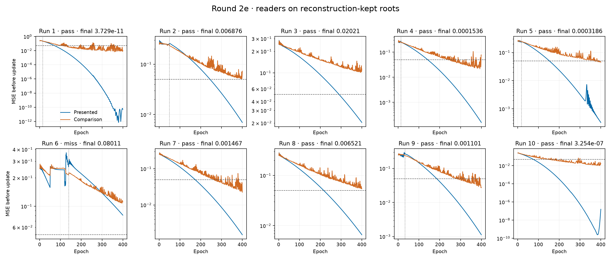
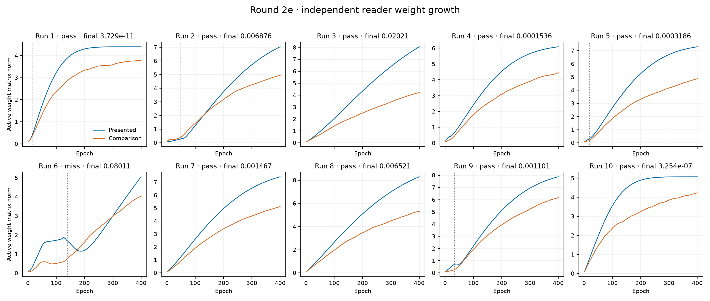

# Round-2e reader trajectories

MSE is measured before either trial update on reconstruction-kept roots; final gate MSE uses ordinary evaluation after training. Norms include active weight matrices only, excluding unused matrices and bias vectors. The plateau rule uses the epoch-350 to epoch-400 endpoint change; the full tail range is also reported. Flip uses the 2d greedy-policy convention. Actual committed disjunction exposure is reported separately. Categories describe the saved evidence and do not establish causation.

| Run | Final gate MSE | Class | All greedy conjunction from epoch | Training epochs from flip | Presented MSE before epoch 400 | Comparison MSE before epoch 400 | Presented norm change, final 50 epochs | Miss category |
| --- | ---: | --- | ---: | ---: | ---: | ---: | ---: | --- |
| [1](measurements/xor-01/run-audit.json) | 3.72895048e-11 | pass | 15 | 386 | 5.11457543e-11 | 0.0113968477 | +0.002% | — |
| [2](measurements/xor-02/run-audit.json) | 0.00687594264 | pass | 49 | 352 | 0.00697644614 | 0.0730375051 | +8.924% | — |
| [3](measurements/xor-03/run-audit.json) | 0.0202075404 | pass | 1 | 400 | 0.0203880705 | 0.113823459 | +10.614% | — |
| [4](measurements/xor-04/run-audit.json) | 0.000153554436 | pass | 14 | 387 | 0.000158083451 | 0.0771247074 | +2.661% | — |
| [5](measurements/xor-05/run-audit.json) | 0.000318584207 | pass | 18 | 383 | 0.00032755945 | 0.0452256538 | +3.061% | — |
| [6](measurements/xor-06/run-audit.json) | 0.0801115114 | fail | 140 | 261 | 0.0805749074 | 0.111055657 | +24.876% | late_flip |
| [7](measurements/xor-07/run-audit.json) | 0.00146726917 | pass | 1 | 400 | 0.00149540592 | 0.0223850515 | +5.167% | — |
| [8](measurements/xor-08/run-audit.json) | 0.00652075451 | pass | 1 | 400 | 0.00660469569 | 0.0555371009 | +7.551% | — |
| [9](measurements/xor-09/run-audit.json) | 0.00110106565 | pass | 33 | 368 | 0.00112510286 | 0.0272399988 | +4.962% | — |
| [10](measurements/xor-10/run-audit.json) | 3.25428486e-07 | pass | 1 | 400 | 1.60336924e-07 | 0.0185926482 | +0.015% | — |

The dashed horizontal line is the class MSE threshold. It is shown as a reference for these pre-update training reads; the gate itself uses the final presented output. Vertical dotted lines mark stable greedy conjunction. Each MSE panel has its own logarithmic scale; values below 1e-16 are drawn at 1e-16.

Every raw curve, per-row prediction, training weight, optimizer counter and committed operator is retained in each run’s audit. [All diagnostic values](reader-diagnostics.json).
