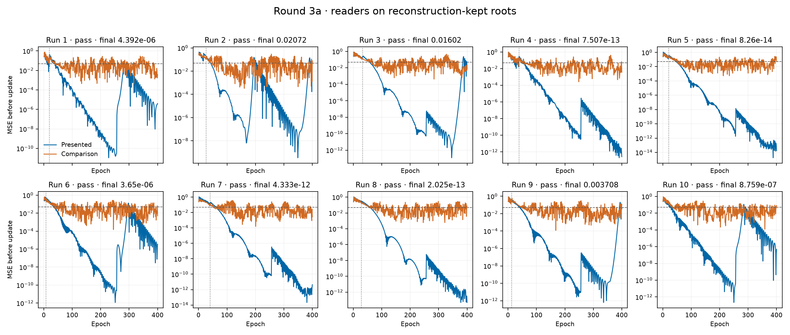
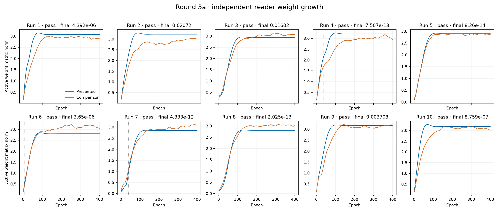

# Round-3a reader trajectories

MSE is measured before either trial update on reconstruction-kept roots; final gate MSE uses ordinary evaluation after training. Norms include active weight matrices only, excluding unused matrices and bias vectors. The plateau rule uses the epoch-350 to epoch-400 endpoint change; the full tail range is also reported. Flip uses the 2d greedy-policy convention. Actual committed disjunction exposure is reported separately. Categories describe the saved evidence and do not establish causation.

| Run | Final gate MSE | Class | All greedy conjunction from epoch | Training epochs from flip | Presented MSE before epoch 400 | Comparison MSE before epoch 400 | Presented norm change, final 50 epochs | Miss category |
| --- | ---: | --- | ---: | ---: | ---: | ---: | ---: | --- |
| [1](measurements/xor-01/run-audit.json) | 4.39248359e-06 | pass | 20 | 381 | 3.94291055e-06 | 0.00368562248 | +0.000% | — |
| [2](measurements/xor-02/run-audit.json) | 0.0207201172 | pass | 27 | 374 | 0.0468540192 | 0.075931482 | +0.009% | — |
| [3](measurements/xor-03/run-audit.json) | 0.0160247575 | pass | 33 | 368 | 0.00708203018 | 0.0114009846 | +0.000% | — |
| [4](measurements/xor-04/run-audit.json) | 7.50732809e-13 | pass | 39 | 362 | 2.73780998e-13 | 0.00365650654 | -0.000% | — |
| [5](measurements/xor-05/run-audit.json) | 8.2600593e-14 | pass | 21 | 380 | 1.687539e-14 | 0.0506535694 | -0.000% | — |
| [6](measurements/xor-06/run-audit.json) | 3.64993565e-06 | pass | 8 | 393 | 3.51506469e-06 | 0.00507945148 | -0.002% | — |
| [7](measurements/xor-07/run-audit.json) | 4.33253433e-12 | pass | 41 | 360 | 4.34852154e-12 | 0.00275215413 | -0.000% | — |
| [8](measurements/xor-08/run-audit.json) | 2.0250468e-13 | pass | 29 | 372 | 5.06261699e-14 | 0.0753593743 | -0.000% | — |
| [9](measurements/xor-09/run-audit.json) | 0.00370835332 | pass | 13 | 388 | 0.0355457179 | 0.0919013917 | -0.004% | — |
| [10](measurements/xor-10/run-audit.json) | 8.75934553e-07 | pass | 1 | 400 | 4.88589933e-07 | 0.0823177844 | -0.000% | — |

The dashed horizontal line is the class MSE threshold. It is shown as a reference for these pre-update training reads; the gate itself uses the final presented output. Vertical dotted lines mark stable greedy conjunction. Each MSE panel has its own logarithmic scale; values below 1e-16 are drawn at 1e-16.

Every raw curve, per-row prediction, training weight, optimizer counter and committed operator is retained in each run’s audit. [All diagnostic values](reader-diagnostics.json).
