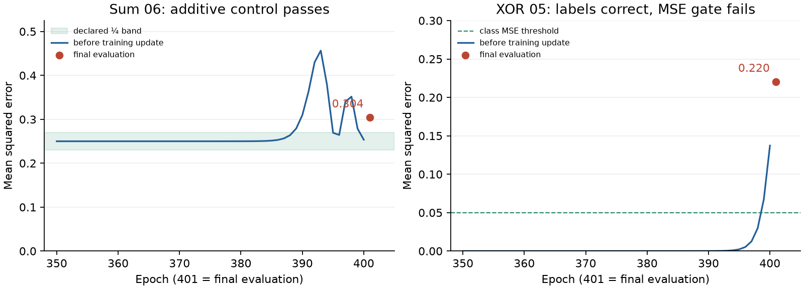

# Operators round 4a-0 — review candidate

Baseline: `cce3a4f7b6e72fab4a9a27fd70d3fa7602553814` (round 3a).
No commit has been made. Bipolar meanings are paused and preserved in the
original working tree; this receipt measures the address change by itself.
**Held for Claude's review: storage checks pass, but two expected final MSE
counts are below 10/10.**

Implementation: content-keyed document addresses; one-based relative `.when`;
upserts that replace committed vectors, refresh timestamps and join evidence
poles; signed 64-bit references; compaction and old-checkpoint migration;
explicit overflow and capacities. The 3a net-pole existence reader is unchanged.

[Reader inventory](when-readers.md) · [Measurement protocol](measurement-protocol.json)

The frozen sweep completed all **5,313 cases**: 5,022 passed, 290 skipped,
one XPASS, zero failures. Exactly **thirty unseeded trainings** completed in
1,196.5 seconds, with no retry or replacement. Source and measurement-helper
hashes match the freeze. The same ten XOR trainings supply both bars.

| Measurement | Round-3a expectation | Round 4a-0 |
|---|---:|---:|
| XOR class: all labels correct and MSE < .05 | 10/10 | **9/10** |
| Reconstruction | 10/10 | **10/10** |
| Additive sum control | 10/10 | **10/10** |
| Sum within the declared ¼ band (± .02) | 10/10 | **9/10** |
| Raw MM_xor: best MSE < .20 within 200 epochs | 10/10 | **10/10** |

[All thirty runs](measurement-results.md), [validation](results-validation.json),
[sweep case counts](sweep-case-counts.json), and
[campaign completion](measurements/complete.json) retain the outcomes.
The supervisor emits four reports for one flags test; case totals count its
node ID once. The raw report counts remain in validation. All engineering
failures and short probes are retained in the
[development record](development/README.md).

## Storage and addressing

Every sum/XOR run uses **8/1,024 rows: four sentences and four DEFs**.
Each sentence has exactly **400 training witnesses**, then 401 after the
existing final evaluation. All twenty runs retain the same four address keys
and four distinct identified-word content keys. No address is added by
evaluation. The tests also cover a new document or position, replacement of
vectors, timestamp refresh, per-pole maximum, signed references, compaction,
overflow, checkpoint migration and relative `.when`.

All ten raw MM runs use **4/1,024 rows**, comprising four DEFs and zero
sentence rows. That exception to the requested MM sentence-row expectation is
described below. BasicModel declares 262,144 rows; the grammar gates and raw MM
declare 1,024. This receipt does not train the full BasicModel corpus.

## The two MSE misses

`sum-06` ends at **0.3041536212**, with checkerboard contrast
`−5.96e−8`; its predictions are approximately 0.733 for all four rows.
Its roots are byte-identical at the start and end, and their raw checkerboard
residual is `1.19e−7`. It passes the additive control but misses the final
¼ band. [Saved evidence](sum-floor-outlier.json).

`xor-05` ends at **0.2202780658**. All four threshold labels are correct;
the outputs are approximately `[0.469, 1.470, 1.469, 0.469]`. Its MSE rises
from `7.90e−5` before epoch 391's update to the final value. Its four final
operators are conjunction. [Saved evidence](xor-class-outlier.json).

The saved trajectories show late common-offset reader errors. Both runs'
root address tails are zero. **No `.when` reader has been causally identified
as responsible for either count change.** These are separate unseeded
campaigns; removing the old random store namespace also changes RNG
consumption. The receipt does not claim RNG as a proven cause, and no paired
replay or replacement run was performed. The count expectations therefore
remain unmet and require review.

Across the twenty grammar runs, all 32,000 comparisons tie on R and keep
greedy. Every saved R and E cost is exactly zero
([absolute cost check](absolute-cost-check.json)). All forty final XOR roots are conjunction.
There are 8,034 nonzero compose advantages; narrowing advantages remain zero,
as in 3a's empty-meaning configuration. The predeclared tenth XOR run reports
zero ownership conflicts. [Saved aggregate audit](aggregate-audit.json).

## Provenance and review scope

The isolated checkout uses the original virtualenv and mirrors the enclosing
repository's Ethics document and five historical test receipts for existing
relative documentation links. `before/source.zip` is made from the exact Git
landing, including its post-measurement repairs, rather than copied from an
older campaign snapshot. Source and observation helpers were frozen before
measurement; the fixture and protocol are included in the helper hash manifest.
The user-provided plan and toy specification are preserved as inputs in
`specification-inputs.zip`, with original paths and hashes in
`specification-inputs.json`. The paused 4a implementation files match their saved snapshot byte for byte
(`paused-4a-preservation.json`). The original workspace plan changed separately
during this isolated run and has been preserved without overwriting it.
The candidate source is in `/Users/arogers/github/basicmodel-round4a0`;
the original working tree retains 4a. `candidate.patch` contains this step's
code, tests, fixture and primary-document changes against the landing.
`delivered-source/source.zip` preserves the measured code/configuration/test
tree. See [4a resume notes](4a-resume-notes.md).

The unchanged raw `MM_xor` control has no completed sentence closing: its store
contains four DEF rows and zero sentence rows. Its receipt reports that actual
path explicitly. XOR grammar and its sum control do close sentences; they must
retain four sentence addresses through all 400 epochs. Adding a new raw-MM
closing would change the baseline forward path and is outside this address step.

Old checkpoints lack document keys and identified word sequences. Migration
preserves their rows and rekeys their references in an explicit legacy document;
it cannot reconstruct missing source provenance or retrospectively collapse
old presentation copies. New reads use the source's document key.

Capacity checks include retained estimates and observations. The previous
behavior that dropped a forecast to fit its observation has been removed.
Existing pairs can be re-witnessed at capacity; a required new address raises.
