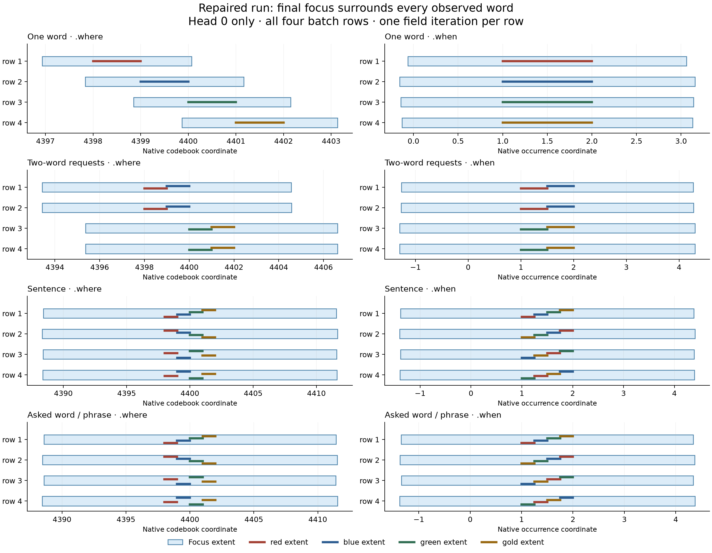

# Item 6.1 — seven-region attention candidate

The objective candidate is implemented. **6.1 remains open: the focus
saturates at attend-all, and isolation/movement and multiword readback have
not passed. Not accepted, committed or closed.** The previous closing is 6.2
(`ed0d031b`); the next queued item is
6.1. The publish sequence in `todo.md` requires Claude's review after the
source-matched full receipt and before any commit or push.

The collapse and pending-decision sections below are retained historical
evidence. The accepted objective resumption and its new measurements are
appended at the end; they do not erase or reinterpret those earlier runs.

## Decisions implemented

- Exactly seven spatial/temporal regions, produced by an ordinary
  `nn.Linear → nn.Tanh → nn.Linear` MLP wrapped in `Layer`. Initial hidden
  width 64; output width 28 (center/radius on each of two axes).
- All regions cover the configured field initially. Forward membership is
  exact containment; the four smooth boundary factors provide a
  straight-through derivative. Their Boolean union never counts evidence
  twice. Seven regions impose no admitted-item cap.
- Inputs are native activation after priming, codebook heat, occurrence
  times, working PS/WS content, the occupied conceptual slots and their
  locations, the open reference, the complete three-role prediction and
  the row-local gist. Inputs are read-only for autograd; the mask's
  importance derivative trains the MLP.
- The conceptual eight-space has fixed sinusoidal slot addresses, disjoint
  from codebook addresses. Changing a slot's content does not change its
  location. A semantic LTM read retains an existing location, or presents
  its one/three slots in conceptual space. It does not receive a new
  spatial address based on its semantic row ID. Episodic spatial banks
  remain in FutureWork §7 as requested.
- Canonical sentence trials cache PS/WS observation, then recompute
  admission and the concept read from each trial's current STM. The
  perceptual, symbolic, conceptual and reference readers share that word's
  seven regions. Eager memory/generation boundaries move the regions from
  their current needs. Exclusion does not erase stored sources or refund
  traversal work.
- The MLP has a single attention optimizer owner, currently receiving
  reconstruction plus answer credit through momentum SGD at the configured
  learning rate. Tiny boundary derivatives keep their magnitude instead of
  receiving Adam's variance normalization. `AttentionCredit.fixed_input` exposes
  only its parameters to answer gradients; it preserves the existing cut
  at source representations. Expectation ownership remains unchanged.
- The initial lexical evidence used to evaluate reading remains an
  observation independent of the learned mask. The actual concept read is
  masked; the mask cannot remove its own observation target.

## Batch and lifecycle repairs

Gist no longer pools different batch rows. Both recall histories reject
live batch-size changes and clear on the corresponding document reset.
Word-reference readers check all slab shapes, commits validate before
publication, and start/reset clears stale references. Taxonomy priming
cannot keep overlapping rows when a live batch is resized. These repairs
do not add a stream-state registry. Already retired closing-image/open
thought/pending-credit caches are not reintroduced.

## Evidence in progress

Development logs are under `output/item6-1-*`. The final receipt will list
the frozen source and exact outcomes here. Intermediate evidence includes:

- Native mask/ownership/checkpoint probes and a real fullgraph
  forward/backward across runtime lengths: 12 passed. The graph probe found
  and fixed mutation through `ensure_reference_state` at a read boundary.
- A 214-case affected run completed with one gradient-boundary failure;
  the MLP could revisit a live reference query through its input features.
  Detaching those read features fixes it. The corresponding six-file
  regression selection passes 62 tests.
- A native two-document, two-epoch, B=2 supplied-answer diagnostic completes
  with finite parameters and updates the MLP. The earlier version omitted
  labels and correctly observed zero attention updates; both raw runs are
  retained. Neither is a context-learning result.
- The opt-in packing reconstruction parity failure was reproduced on the
  unchanged starting commit and with the MLP disabled. Its raw logs remain
  visible; this candidate does not claim that slow parity gate passes.

The first full sweep (`output/item6-1-full`) stopped at its 8 GiB worker
memory limit after 5,481/5,695 cases, with 15 assertion/error failures.
This is an incomplete failing run, not an acceptance receipt. Its source
was held unchanged throughout. An isolated copy supplied the following
repairs while that sweep finished:

- Answer metadata is detached; only the numerical idea carries the
  attention parameter cotangent. The existing representation boundary
  assertions remain intact.
- Priming reads no longer resize or republish state inside a compiled
  loop. A neutral batch mismatch supplies a local all-ones view; a live
  mismatch raises.
- The final sentence-driver callback remains compose. Observer fixtures
  propagate the native observation reader's explicit attention keyword.
- The time-reader inventory includes the new readers. A supplied-reading
  fixture keeps its attention/unary distinction tensor-valued under compile.
- The two perception pullbacks per trial correspond to separate
  reconstruction and attention owners, with the parameter-version check
  retained.

That regression run passed 290 tests and exposed a further inactive-row
defect. Applying a conceptual view now preserves every inactive row's
original tensors. A new failing probe also found that direct `What.past`
answers bypassed memory admission; that boundary now uses the same region
reader without erasing history. The subsequent affected selection passed
54 tests, with four skips. Two behavior fixtures now use the existing eager
reading fixture to avoid compiling their incidental loops; explicit compile
checks retain their fullgraph path.

The unseeded SGD diagnostic in `output/item6-1-standing-sgd` ran one of
each declared case on the isolated source:

| Case | Measurement |
| --- | --- |
| Grammar XOR, 400 epochs | 4/4 correct; MSE 3.55e-15; 4/4 word-multiset readbacks |
| MM XOR | Existing .20 convergence bar passed within its 200-epoch budget |
| Affine sum control, 400 epochs | MSE .25; checkerboard contrast 0; 0/4 readbacks |

The MM fixture supplies its own legacy Adam optimizer; it does not validate
production optimizer ownership. These are development measurements, not the
standing thirty-run acceptance campaign or the new context-learning gates.
The earlier Adam diagnostic attempted only sum and stopped after its empty
readbacks; the unattempted XOR/MM cases are explicitly recorded. Empty
readbacks alone do not establish that the attention regions excluded the
field. A further predeclared enabled/disabled sum comparison records actual
admission to distinguish that failure from generation's stopping behavior.

## Current blocking training defect

The enabled/disabled comparison in `output/item6-1-sum-admission` confirms
that the mask itself collapses. Both runs used the same sum-only composition
control for 400 epochs, with one unseeded initialization each and no retries:

| Measurement | Mask enabled | Mask disabled |
| --- | --- | --- |
| Final MSE | .2499999851 | .25 |
| Word-multiset readbacks | 0/4 | 4/4 |
| Final eligible symbolic-word reads admitted | 0/12 | Mask bypassed |
| Final eligible generation-field candidates admitted | 0/384 | Mask bypassed |

Both source manifests match. These runs supersede the earlier inference
from empty text alone: exclusion was directly observed. Momentum SGD did
not repair recovery after the field became empty.

`output/item6-1-reconstruction-credit.py` then ran one native training batch
with the seven temporal regions deliberately moved beyond the current
occurrence. In both actual sentence trials, the reconstruction objective
was nonzero (2.31053948), but its total gradient norm to the attention MLP
was exactly zero. The answer objective also had zero attention gradient
once the field was empty. The native sparse-identity reconstruction audit
in `_byte_word_cost` intentionally supplies a hard identity error; the
downstream hard reading decisions remove the missing content's numerical
path. The differentiable region primitive alone does not repair that path.

The remaining design choice was put to Alec: a loss-side differentiable
reconstruction surrogate restricted to the MLP, keeping reported scores
unchanged; or sampled region movements in the existing departure learner,
credited by actual reconstruction and answer costs. Neither alternative
has been installed pending that answer. No loss bar, seed, grammar control,
or default admission bypass was changed to conceal the failure.

The second full sweep (`output/item6-1-full-final`) was deliberately
interrupted at 569/5,699 completed cases when this defect was confirmed.
Two nested runner tests reported interruptions during shutdown; those are
not independent assertion regressions. It is not a passing receipt. The
actual fullgraph forward/backward probe on the current source passed in
91 seconds (`output/item6-1-final-fullgraph.log`). A final source-matched
full sweep and Claude review remain required after the training fix.

## Learning limits and pending decisions

None of the required context-learning stages is accepted by these mechanism
tests. They still require declared corpora, training budgets, held-out
measurements and controls: XOR pairs among fillers; question/document
selection; different referents in parallel documents; return after
interruption; situated versus shared truth; priming as a prior; and
expectation selected from the right history. No new passing seed is chosen,
and a nonzero MLP update is not counted as a learned result.

The row-local gist is still an open-field mean. Chronological expectation
windows remain existing holders; region prediction images and their
replacement are the pending discussion in plan §6.4. Situation codes are
assigned to 5.5, and the episodic spatial bank is future work. The user has
been asked whether this landing should close the mechanism after review
and carry learning gates to item 0, or keep 6.1 open until they pass. Until
that decision, **the gates stay with 6.1**.

The old sum-only grammar control also needs measurement: adding a nonlinear
attention MLP makes the combined model nonlinear even when composition is
an affine mean. No grammar-specific bypass or relaxed bar is installed to
hide that change. The initial diagnostic uses the unchanged control and
preserves its raw result.

## Objective resumption — October 9

Alec accepted the executable amendments to the supplied proposal, recorded
in [plan §7.6](../../plans/2026-10-08-stream-state.md#76-executable-objective-and-traversal-alec-accepted-codexs-amendments-2026-10-09).
The candidate keeps the seven-output-pair MLP, hard containment, straight-through
edges and the existing parameter owners. `attentionFloor=.1` and
`hetTolerance=1` are declared in the XML and schema. The latter is a no-op
at the paired symbolic-input read; no expectation image is installed.

The numerical objective is `sum(m * abs(o - reconstructed)) +
attentionFloor * sum((1 - m) * abs(o)) + .01 * iterations`. The existing
Error registry normalizes field error by the complete immutable observation,
then applies the configured reconstruction priority. Missing admitted leaves
and excess emitted leaves count. The actual free decoder runs before its
leaves are aligned with observations; no target selects its operations or
length. The original hard byte/identity error is reported separately. The
new objective has its ordinary derivative, with no loss-side replacement
backward. The outside complement alone attracts a boundary toward residual;
the **total** derivative also includes admitted reconstruction error and
therefore does not guarantee attraction to an unreconstructed item.

The native sentence driver now places the focus over its complete observed
word field. One placement may admit several words, which still pass through
the native grammar one at a time. An empty read stops a row, the native end
closes it, and the existing shared work allowance bounds attempts. The meter
charges each field iteration, including a terminating empty read, once for
the kept trial. This count is not the number of primitive grammar operations.
Word admission and iteration records expose both quantities. The other six
heads remain available to existing memory reads over the shared address range.

Stored `.when` remains sentence-relative; live word intervals subdivide it.
Known words use their symbol-codebook `.where`; novel words use their native
part-codebook extent. Selection and the actual content read share that extent.
A blocked focus makes one sampled region translation available through the
existing paired-cost departure learner. The sample uses unread observations,
never targets. Its use and whether it won are measured separately.

Part lessons encode the prompt's words with existing native form keys and
put that content into the open-need input. Only the loss sees the desired
answer words. There is no ordinal parser or supervised region. This remains
a tiny training-corpus gate, with no held-out generalization claim. The
outside cost currently covers this native word field; this receipt does not
claim that all context holders or internal memory readers have passed their
later context-learning gates.

The first predeclared campaign used two fresh models, enabled then disabled,
64 epochs per stage, learning rate .01, B=4, no seed, no retries and no selected
checkpoint. Each model proceeded through all four stages; later stages are
diagnostics after a failed prerequisite. The disabled control keeps the same
objective and work accounting. Raw per-iteration regions, word extents,
admissions, readbacks and backup counts are retained in its JSON/JSONL files.
The exact initial executable source is preserved in
[this archive](development/objective-initial-source.tar.gz).

The accompanying first full sweep stopped at its 8 GiB per-worker memory
ceiling after 3,033/5,716 completed cases, with eight recorded assertion/error
failures. It is an incomplete failing run. The actual fullgraph
forward/backward check passed separately in 89.37 seconds. The code remained
unchanged throughout those measurements; repairs were developed in an
isolated copy, and the first run's results are not promoted to the repaired
source.

The repair pass addresses stale priming after a document reset and novel-word
reads using inconsistent spatial coordinates. It also retains actual
per-trial field costs and distinguishes the reconstruction identity audit
from the existing code-dictionary identity audit. Contract tests now expect
the new trained field/work terms while checking that the hard identity score
is reporting-only. The evidence-storage fixture supplies an absolute reading
so an untrained exclusion operator cannot change the evidence being tested.
Two host-observer/driver fixtures use the existing eager-reading fixture;
explicit compilation tests retain their compiler path. Markdown link checking
now resolves percent-encoded filenames, preserving the supplied document links.

The initial campaign's final readback counts were:

| Probe | Mask enabled | Mask disabled | Admitted / eligible, both modes |
| --- | --- | --- | --- |
| One word | 4/4 | 4/4 | 4/4 |
| Two-word field, requested first/second word | 2/4 | 0/4 | 8/8 |
| Sentence | 0/4 | 0/4 | 16/16 |
| Asked word/phrase | 0/4 | 0/4 | 16/16 |

Every row used one field iteration. No blocked row, attempted region backup
or kept region backup occurred in either mode. This is measured attend-all
behavior, not evidence that backup recovery is unnecessary in general. The
explicitly blocked native mechanism probe separately exercises a real
departure and verifies that its observation survives the two-trial boundary.
The initial campaign's `identity_audit` field contained the existing
code-dictionary check, not the decoded reconstruction audit; the repaired
harness reports those separately. The initial readbacks and admissions are
unaffected by that reporting defect.

The initial [compact results](development/objective-initial-results.json)
and [complete raw evidence](development/objective-initial-evidence.tar.gz)
are retained alongside their executable source archive. Both initial
learning modes finished, and the final source comparison matched.

**Protocol limit:** the two-word probe used separate first/second-word
requests in batch rows. It does not demonstrate §7.3's required successive
single-word reconstructions and movement within one traversal. All eight
words were admitted in one iteration, so isolation already fails, but this
probe must not be reported as a completed movement gate. No per-iteration
decoded-word trajectory was measured. The current driver can accumulate
several admitted words through the existing grammar before the final
reconstruction; this receipt does not establish a one-word conceptual
bottleneck. Those limitations and the failed sentence/part readbacks keep
6.1 open even if the mechanical full suite passes.

## Repaired-source learning diagnosis

The repaired enabled run passed one-word readback (4/4) but then returned
0/4 exact requested readbacks in each later probe. It admitted all eligible
words in every final measurement. The one-word stage expanded the temporal
focus to 3.125–3.313 times the full observed word interval; after the two-word
stage that range was 5.536–5.604. This is an **open-mask saturation**, distinct
from the preserved earlier collapse to an empty mask.

Replaying the production boundary derivative at the recorded initial and
final bounds found nonzero spatial and temporal edge derivatives before
training, then **exactly zero on both axes for all four rows** after the
one-word stage and at every later measurement. This is a read-only derivative
inspection, not another training run. Its [results](development/objective-boundary-derivatives.json)
and [reproduction script](development/inspect_boundary_derivatives.py) are
retained. It establishes that the focus's edge path is saturated; it does
not claim that every other attention input or parameter has zero gradient.

For a perfectly reconstructed admitted item the approved objective's
derivative with respect to admission is `-attentionFloor * abs(o)`. With
straight-through edges, that supplies outward credit even though hard
admission is already one. The measured expansion is consistent with that
pressure and unbounded positive region radii. The backup's empty-read trigger
does not fire for an oversized focus, so its absence in this run cannot fix
the measured saturation. No radius cap, replacement derivative, extra loss,
optimizer retuning or selected retry was introduced to conceal this result.

This plot shows the enabled run's final focus on both axes, in native units,
for every batch row at each stage. Colored word bars are offset vertically
within a row for legibility; their horizontal coordinates are unchanged.
The other six heads are retained in the raw results. The
[SVG](development/objective-focus-extents.svg) and
[plotting source](development/plot_focus_extents.py) reproduce this view
without running or training the model.

Both repaired-source modes completed their declared 64 epochs per stage:

| Probe | Enabled readbacks | Disabled readbacks | Admitted / eligible, both modes | Iterations per row |
| --- | --- | --- | --- | --- |
| One word | 4/4 | 4/4 | 4/4 | 1 |
| Two-word field, requested first/second word | 0/4 | 0/4 | 8/8 | 1 |
| Sentence | 0/4 | 0/4 | 16/16 | 1 |
| Asked word/phrase | 0/4 | 0/4 | 16/16 | 1 |

Across all stages and both modes there were zero blocked rows, zero region
departures attempted, and zero kept region departures. Initial/final
readbacks, identity audits, per-trial costs, all seven region extents and
the corresponding word extents are in the
[repaired results](development/objective-repaired-results.json). Per-epoch
records, the declared plan and source check are in the
[raw evidence archive](development/objective-repaired-evidence.tar.gz).
The model was freshly initialized after the integration repairs; this was
one run per mode on the repaired source, not a retry or checkpoint selection
on the initial source. Both sets of results remain visible.

The repaired fullgraph forward/backward check passed in 89.88 seconds.
The next frozen full sweep was deliberately stopped at 3,005/5,716 cases
after four behavior workers remained in graph capture for several minutes
(over fifteen minutes for a sampled worker). It had one assertion failure:
an older bootstrap test still expected total R to be zero. That assertion
now checks both trials' unchanged hard identity audit separately from the
new field/work objective; all 11 tests in its file pass. The four behavior
probes now use the existing eager fixture. Their affected run passed seven
cases and **failed one**: the eight-corpus-sentence fixture opened no ordinary
thought episode, so its footprint check could not run. That assertion is
retained unchanged; the failure is not dismissed as a successful null.

At that point the subsequent changes touched only five contract-test files.
The next frozen sweep reached 5,705/5,717 completed cases before being
interrupted after a forced-reading worker spent over fifteen minutes in
graph capture. It recorded six assertion failures: two reference-bank stubs
missing conceptual addresses, two routing fixtures with no work remaining,
one zero-gradient NOT projection in the standalone XOR router, and one
forced bound-answer fixture that unexpectedly opened a thought episode.
This remains an incomplete, failing attempt; its
[summary](development/objective-review-attempt-suite.json),
[raw evidence](development/objective-review-attempt-evidence.tar.gz), and
[source](development/objective-review-attempt-source.tar.gz) are retained.
The explicit output-walk fullgraph/parity check passed during that attempt
in 56.81 seconds.

The final fixture corrections supply the stand-in reference model with the
native conceptual registry (two cases pass), and reserve work in the
sixteen-word routing fixture (all seven cases pass). The latter previously
spent all 32 units on bracket work, leaving zero field iterations; it now
declares 48 units, enough for brackets plus up to one field iteration per
word. Production and curriculum budgets are unchanged. The default-budget
zero-read behavior remains a production limitation and is visible in the
retained diagnostic; the fixture's larger budget does not repair it.
The observed slow
behavior cases use the existing eager fixture, preserving their assertions
and leaving explicit compilation checks intact. Three forced-reading cases
pass; the c/e closing case fails because only one of two expected episodes
opens. The provisioning, generation-credit and answer-materialization probes
pass. Neither the episode failures nor the standalone router-gradient
failure was removed, seeded away or marked expected.

The entire production source, XML/schema, curriculum harness and
model-building helper remain byte-identical to the repaired learning
campaign and fullgraph probe. The final differences touch eight test files.
The [source comparison](development/objective-review-source.json) names every
changed file rather than claiming the earlier full manifests are identical.
The [review source archive](development/objective-review-source.tar.gz)
contains the current executable tree and the time-reader inventory. A fresh
full sweep on precisely that tree supplies the final suite record below.

## Final source-matched default sweep

`output/item6-1-review-final-full` completed **5,717/5,717 unique cases**:
**5,425 passed, 286 skipped, five failed and one non-strict XPASS**. Exit 1.
The run took 1,429.58 seconds (23.83 minutes), with eight workers and no
compile-cache retry, continuation, memory stop or timeout. Peak worker and
aggregate memory were 3.59 and 9.93 GiB, under the declared 12 and 24 GiB
ceilings. The runner warns that the separate weekly slow-test record is
7.6 days old; this default sweep does not renew that coverage.

All 759 executable/configuration source hashes match the frozen run and
the review archive. The time-reader inventory hash also matches. The
[suite summary](development/objective-review-suite.json) retains these
checks, counts, limits and exact failure reports; the
[complete evidence archive](development/objective-review-evidence.tar.gz)
contains the raw suite, worker logs and final affected-probe logs.

The five unresolved failures are:

- `test_forced_ordinary_answer_fills_committed_question_without_its_own_episode`:
  the committed question is closed but does not identify the required `five`.
- `test_forced_ordinary_bound_declaratives_open_no_episode`: the forced
  declaratives do not all satisfy the closed/no-episode assertion.
- `test_forced_c_e_closings_exercise_empty_search_mint_and_question_storage`:
  the observer receives a missing sentence field and cannot read its row ID.
- `test_real_packed_ends_train_before_the_next_sentence[False]`: the committed
  meaning differs from the selected candidate snapshot (64/312 entries;
  maximum absolute difference .1596883).
- `test_xor_router_gradients_reach_all_three_ops`: no gradient reaches the
  OR projection. The earlier attempt's missing NOT gradient remains recorded.

The unexpected pass is `test_topk_recovered_words_overlap_input`; its
existing expected-failure marker is unchanged. Earlier episode failures
remain in the record even where a later run passes. No failed assertion
was removed or converted to an expected failure.

The new attention objective, traversal, lesson, native-field, native-reader,
region and coordinate tests pass. The complete sweep is nevertheless
**failing**, and the curriculum still fails isolation and later readbacks.
The within-traversal movement gate remains unmeasured, the one-word
conceptual bottleneck is not established, and the default-budget zero-read
limit remains. None of these is deferred to item 0 or counted as accepted.

**Review boundary:** the candidate and its failures are ready for Claude's
source review. 6.1 stays open. No commit or push has been made; review and
resolution are required before publication.

The final documentation-link check passes all 356 cases in 2.59 seconds,
and `git diff --check` passes. These checks do not override the failing
default sweep or the unmet learning gates.

## Support-mask redirect, 2026-10-09 (§7.9–§7.11)

**6.1 remains open.** This append records the redirected implementation,
its repairs and its failing gates. It does not replace or revise the
preceding receipt or the collapse record. The original 26,996-byte prefix
still has SHA-256
`29c3524c8db0533ebd330aea26747830fa1e460e0bcedeaa1249bfa360a8d021`.
No commit or push has been made. Claude's review remains before publication.

### Implemented path

`CandidateAttention(Layer)` is one shared MLP: a 64-wide tanh hidden layer
and a scalar readout per candidate. Its readout starts at zero, giving no
learned preference and source-order ties. Inputs retain activation after
spreading, needs, native keys and structural relations, including all
occupied conceptual slots. The hard choice has no pathwise derivative.
The existing uniform walk/round/action departure and paired-cost estimator
credit the candidate scorer, with its own objective owner.

`SentenceField` constructs the unread candidates from the native word-whole
field. Each candidate carries its part/whole evidence lanes and native
symbol pair; negative evidence is significant, and zero in both lanes is
no support. `hetTolerance` acts on the lanes, with 1 a no-op. A selected
candidate is re-read through the ordinary native numerical path. Its
structural extent supplies the original `.where`/`.when` stamp. No learned
radius, sigmoid edge, straight-through admission weight, region output or
region departure remains in `bin/` or the executable tests.

One candidate is read per placement. The existing eight-space holds the
values; sentence-local witness indices beside its slots retain the masks
and origin stamps. Pushes move these witnesses with their slots, unary
operations retain them, and binary operations join them. The scorer sees
all occupied slots and their composed content. These indices are not a
second value store or an episodic bank. The eight-space's fixed sinusoidal
slot addresses remain separate from content addresses; episodic retention
and retrieval into a slot remain future work.

The field objective is the selected support's numerical reconstruction
error, plus every never-read source item's residual at `attentionFloor`,
plus `WHAT_STEP_COST` per read. The outside image is zero until 4.5. The
floor changes cost only. Free decoded leaves are aligned to admitted
source positions after decoding; no desired words, source offsets or
attention labels enter the decoder. The registry normalizes the field
error by the fixed whole-observation baseline and adds the work term.
Identity reconstruction is a separately reported, untrained audit on this
path. `AttentionCredit`, XML/schema parameters and the batch repairs remain.
The native field path is canonical: the mixing architecture retains its
landing byte-reconstruction objective and has no `SentenceField` traversal.

### Repairs and what they establish

1. **Readers.** `Queries.py` is byte-identical to HEAD `ed0d031bd`.
   `_thought_grammar_context`, `_selected_thought_memory`,
   `_addressable_spaces`, `_answer_attention_step` and `_reasoning_spaces`
   match its AST. `_resolve_answer` retains only the explicit batch check
   at chronological recall. `_sentence_reference_bank` retains the
   structural exclusion of the same occurrence and embedded rows being
   replaced: otherwise repeated presentation can install a self-reference.
   It has no learned field mask or relevance filter. The
   [reader comparison](development/support-readers.json) and
   [exact differences](development/support-reader-differences.patch)
   make these exceptions explicit. Returning these readers to their
   landing paths has **not** established c/d closure. The retained trace
   shows candidate learning reordering the answer before the forced grammar
   runs, and the field cost can keep that reading. That is an observed
   upstream failure, not proof that all remaining failures have one cause.
   A separate source-order diagnostic also fails c while d passes, so
   fixing candidate order alone would not certify the answer path.

2. **Sentence state.** Run entry clears the live and last field, field
   costs, read order and meters; exit clears live trial state even on an
   exception. Each trial and commit starts from the original source leaf
   mask. `part_lesson` restores its prior holder in `finally`, preserving an
   explicitly active lesson during the batch. Priming and recall retain
   the batch-shape guards. A separate closing bug was reproduced: an
   explore fork joined its saved NULL-closing state during the last ordinary
   word visit, then the actual closing overwrote the fold journal. The
   fork now waits for the closing phase and respects the current batch rows.
   The zero-budget path also keeps the landing's cached word instead of
   performing a second native promotion before grammar.

   The **original** region candidate's packed failure was not reproduced.
   Its exact source and eight-test worker selection were replayed eight
   times, unseeded: every replay passed seven and skipped the same slow case.
   The [replay record](development/support-original-packed-replays.json)
   has zero source differences. The first incorrectly
   launched replay attempts used the system interpreter instead of the
   virtual environment; those errors are retained separately. The new
   lifetime checks and closing-phase fix are concrete repairs, but they do
   not prove the cause of the old sweep-only failure. No inter-test leak is
   claimed found by those replays.

3. **XOR routing.** The gradient certificate executes
   NOT → AND → OR → AND → STOP through the real dispatcher, using fixed
   nonzero operands and identity projections. It asserts the operation
   trace before checking each gradient. Coverage is constructed, with no
   seed; the change is recorded under operators plan §20.

4. **Read allowance.** Field reads have their own allowance and meter,
   independent of bracket expenditure. A retained 16-word diagnostic at
   budget 32 spends all 32 bracket units and still makes 15 reads, costing
   `.15` per row. The bracket path offers only 15 eligible candidates in
   that diagnostic. Thus its original 16/16 assertion **fails and remains
   recorded**: this proves that bracket work no longer reduces the field
   allowance to zero, not that all sixteen words were read or reconstructed.

The first completed support sweep also exposed teacher targets indexed in
source order after a candidate permutation. Decomposition targets now
follow the actual read order. Supplied annotation targets get a separate
source-ordered teacher view after the student reading is fixed; free
decoding is unchanged. A constructed reversed-read test checks the actual
native target identities. The NULL closing also preserves the final word's
published activation instead of writing its zero payload over it.

The operation-owned learning fixture explicitly isolates the operation
departure from the newly added candidate departure. Mixing-path objective
certificates return to their landing assertions, including the original
zero-reconstruction certificates. The c/d/g and packed acceptance assertions
have not been relaxed, seeded or marked expected failures.

### Staged measurement

| Stage | Mode | Exact readbacks | Reads per row | Candidate departures attempted / kept |
| --- | --- | ---: | --- | ---: |
| 1: one word | disabled | 4/4 | 1, 1, 1, 1 | 0 / 0 |
| 2: two words | disabled | 4/4 | 2, 2, 2, 2 | 0 / 0 |
| 3: four-word sentence | disabled | 0/4 | 4, 4, 4, 4 | 0 / 0 |
| 3: three-word fallback | disabled | 0/4 | 3, 3, 3, 3 | 0 / 0 |
| 4: asked parts | disabled | not run | — | — |
| 1: one word | enabled | 4/4 | 1, 1, 1, 1 | 0 / 0 |
| 2: two words | enabled | 1/4 | 2, 2, 2, 2 | 97 / 26 |
| 3: four-word sentence | enabled | 0/4 | 4, 4, 4, 4 | 83 / 19 |
| 3: three-word fallback | enabled | 0/4 | 3, 3, 3, 3 | 90 / 0 |
| 4: asked parts | enabled | not run | — | — |

Every final read supports exactly one word candidate. Native support size also
counts that word's nonzero part/whole and symbol-lane entries; it is not a
learned region width. Full final readbacks, in field-row order:

- disabled, one_word: `red`; `blue`; `green`; `gold`.
- disabled, two_words_in_turn: `red blue`; `blue red`; `green gold`; `gold green`.
- disabled, sentence_four_words: `red green`; `gold red`; `blue red`; `green red`.
- disabled, sentence_three_words: `red green`; `gold green`; `blue red`; `green red`.
- enabled, one_word: `red`; `blue`; `green`; `gold`.
- enabled, two_words_in_turn: `blue red`; `blue red`; `gold green green`; `green`.
- enabled, sentence_four_words: `green`; `green red`; `gold`; `red`.
- enabled, sentence_three_words: `green green`; `blue`; `red`; `green green`.

The protocol is one fresh unseeded campaign per mode, with 64 epochs per
stage, learning rate `.01`, four fields per batch, and no retries on that
source. Each mode keeps its learned weights as it advances through the
stages. No collapsed region parameters are loaded. Both modes use the same
support path, objective and independent allowance; disabled selects source
order. The enabled run is a separate fresh initialization, not a common-seed
pair. The table counts candidate-scorer departures. It does not combine
the separate compose and decoder departure mechanisms.

The disabled four-word control ends in one slot and emits two primitive
leaves in each row, without exhausting the decoder allowance. The
permitted three-word fallback also ends in one slot and emits two
leaves per row; neither sentence control passes. The free lexical
binary inverse chooses its children from the primed word bank, which
has no composed child states. This is a compound-decoding gap on the
observed one-slot paths, not proof that all four-leaf trees are
impossible: the native three-slot ending can expose more than one
root. Shortening to three words does not rescue this control.
The enabled sentence results therefore cannot establish attention
quality, and asked-part training is not run in either mode.

The [stage summary](development/support-stages.json) and
[per-read report](development/support-reads.json) record each candidate,
native support size, one-word support count, original extent and stamp,
decoded word, and raw inside/outside/work terms. The per-read decoded word
is the corresponding final free-decoder leaf aligned after decoding; it is
not a separate prefix-decoder call. Outside is the remaining-field floor
cost after that read, so those intermediate outside values must not be
summed as the final outside charge. Raw epoch reports and both initial and
final measurements are retained in the evidence archive. No target supplies
an attention action. Reading currently ends at exhaustion or the independent
allowance; no additional STOP candidate was installed.
If the decoder emits surplus leaves, their magnitude also contributes to
the stage's inside cost. They do not acquire another read or disappear
from the full readback, so per-read inside errors alone need not sum to
the stage total in that case.

### Source, attempts and checks

The measured executable/configuration snapshot is
`4efe4d5ac880bbbba3aaf025755bfebc0fe495aa63de37f5b0da879f12db50a3`
(759 paths; [manifest](development/support-source.json),
[archive](development/support-source.tar.gz)). The curriculum and complete
default sweep use exactly this snapshot. Both source checks match.

The complete sweep finishes **5,706/5,706 cases**:
**5,415 passed, 286 skipped,
4 failed, one non-strict XPASS**, exit 1, in
1423.50 seconds. Peak worker/aggregate memory is
3.08/8.63 GiB against 12/24 GiB.
There is no compile-cache retry or incomplete worker. The runner's separate
weekly slow-test record is 7.7 days old; this default sweep does not renew it.
The [suite summary](development/support-suite.json) and
[raw suite evidence](development/support-suite-evidence.tar.gz) retain every
failure report and worker result.

The four recorded failures are:

- c: the answer opens an unwanted ordinary thought episode.
- d: forced bound declaratives do not all remain closed with no episode.
- `test_teacher_uses_resolved_input_rows_when_the_legacy_word_lane_is_absent`:
  its stand-in lacks `_sentence_leaf_positions`.
- `test_sentence_generation_lesson_keeps_its_weighted_output_gradient`:
  its stand-in lacks the same new helper.

The last two are fixture adapters, repaired after the freeze; their two
modules pass six cases with the original target and gradient assertions.
The [fixture diff](development/support-fixture-differences.patch) is two
added adapter lines.
The [current review source](development/support-review-source.json) and
[source comparison](development/support-source-comparison.json) list exactly
those two test-file differences. **No production, configuration, curriculum
harness or model-building helper differs from the measured source.** This
is not a second full sweep with a rewritten result: the frozen four failures
remain above, and c/d remain open. The
[review source archive](development/support-review-source.tar.gz) contains
the current tree and relevant documentation.

On the measured source, g, both pending-premise variants, the packed eager
certificate and the XOR gradient certificate pass. The packed compiled
certificate and fullgraph runtime-length check pass separately: **2 passed
in 75.41 seconds**. The 22 focused native/fork/inventory checks also pass.
The [remaining evidence](development/support-evidence.tar.gz) contains the
entire staged campaign, preflight, compilation and fixture logs, diagnostic
scripts, and the source-order certificate counterexample.

All earlier attempts remain visible. The initial support run was
interrupted after 1,256/5,704 suite cases because its reporting helper indexed
the `_attention_forms` tuple instead of its forms member; candidate labels
were tensor strings. The model actions, identities and costs were retained,
and the reporting fix changed only the harness. That interrupted campaign
and sweep are not counted as completed gates. An earlier one-epoch harness
smoke failed with a structural self-reference, and the repaired one-epoch
smoke is retained as development only.

The next completed support source had 5,406 passes, 286 skips, eleven
failures and one non-strict XPASS in 5,704 cases. Its learning campaign
passed the one-word stage in both modes, but the disabled two-word control
decoded only 2/4 and both sentence controls failed. Its enabled later stages
decoded 0/4. Those failures led to the teacher-order, closing-phase and
zero-budget repairs described above; they were not reruns to select a
successful initialization. The
[preceding source](development/support-pre-repair-source.json),
[suite](development/support-pre-repair-suite.json),
[stages](development/support-pre-repair-stages.json) and
[development evidence](development/support-development-evidence.tar.gz)
remain available, including unsuccessful probes and diagnostics.
One isolated repair run also failed the unchanged, unseeded initial
binding-distribution check (observed probability ratios
`.94637–1.10706`, against its `.9–1.1` bounds). That failure is retained;
it was not seeded away or used to relax the bounds.

**Review boundary:** the support-mask candidate is implemented, but 6.1
is not complete. Certificates c/d still fail, the original packed
sweep-only cause is not established, the enabled two-word gate fails,
and neither sentence control passes. Stage 4 has not been measured.
These are retained blockers, not deferred successes or item-0
substitutes. `todo.md` and the STM/episodic notes reflect the
support-mask direction; Claude review and resolution precede commit.

## Curriculum and derivation reconstruction — §7.13–§7.14

This append follows Alec's October 9 handoff in stream-state §7.14. The
preceding receipt, including the collapse and both rejected candidates,
is unchanged. This is a candidate for review; no commit or push has been
made. Acceptance depends on the measurements below, not implementation
completion alone.

### Changes and their boundaries

The inside field term now reads each admitted word by following the actual
compose forest. `DerivationReconstruction.reconstruct` uses the recorded
operator and its actual detached co-operand through the existing numerical
inverse. Children can themselves be compounds; no word-bank search chooses
their identities. A relative clause's temporary STM name resolves to the
live numerical result recorded for that operation before inversion. The
existing inverse's unavailable status is reported; it is not replaced with
a target word. The free decoder, its byte identity audit and its public
`_recon_ideas` report remain independent. The ordinary field objective,
never-read floor and per-read work charge are unchanged.

`reading_lesson` is an explicit, scoped curriculum context. It resolves the
corpus's named word part to an unread supported candidate, adds candidate
cross-entropy and teacher-forces that read in training. Repeated spellings
can be named by occurrence. Desired text and occurrence labels do not enter
the scorer. Only the lesson supplies the read sequence. Evaluation and
non-lesson stages retain the hard choice and paired-cost departures. The
candidate's existing `.when` endpoints are expressed in current-field units
before the MLP, to make their scale comparable to the content keys; this
adds no ordering rule or move cost. The scorer still starts with a zero
readout and no learned checkpoint. At that initial tie, the existing hard
argmax selects the first eligible candidate in the field enumeration.
Initial source-order reads therefore do not, by themselves, demonstrate
learned order; the lesson CE and subsequent free choices must be read
alongside them.

The cached word payload is now reduced and promoted once, before its
candidate read. The former redundant native reduction is removed. A trace
found identical numerical payloads across that second pass, so this is not
claimed as the cause of c. `hetTolerance` remains at the evidence-lane read.
The one-read support masks, eight-space witnesses, separate read allowance,
XML/schema declarations, batch repairs and AttentionCredit remain.

A supplied-answer smoke exposed another accounting issue: sentence readers
can spend shared work before the kept bracket trial is charged. The charge
now subtracts the trial's starting spend, rather than the meter's later
total. Reader work is retained, and field reads still have their own meter.
The native regression exercises the actual supervised text output path.

### Protocol

The candidate's `test/attention_curriculum_gates.py` declares the corpus and
runs one fresh, unseeded model per mode, disabled then enabled, with no
retries of a measured initialization. Each trainable stage has 64 batch
presentations at learning rate .01, B=4; each stage has a free initial and
final measurement. The same model carries learning between stages. The
control uses source order. Only stage 3 supplies candidate cross-entropy;
all reported final choices are free. These are training-corpus gates, not
held-out generalization measurements. Stage 1 presents four independent
percept wholes, repeats them, interposes another whole, and presents the
originals again. The retained native object identities are also read via
the read-only memory capability. Stage 2 verifies known words and a novel
word's first and second presentations. Stage 3 uses two-word permutations,
then four-word permutations. Stage 4 presents identities, noun phrases,
NP+VP sentences and relations, with reconstruction, asked parts and supplied
answers. An output stage runs only after that kind's reconstruction passes;
an enabled result is interpretable only when its corresponding control
passes. Target answers use the ordinary output-owned supervision path; they
do not name an attention action.

Every presentation records candidate names, support sizes, single-word
admission, support stamps and occupied-slot witnesses, derivation readbacks,
free readbacks, unavailable inverses, field inside/outside/work terms and
identity audit. Stage records include all lesson cross-entropies and
candidate departures attempted and kept. The answer readback is the
existing lexical inverse's output text, not the numeric output adapter and
not the input reconstruction.

### Certificate c diagnostic

The first unconstrained diagnostic runs were variable: c and d each passed
and failed with the scorer disabled. The redundant-payload removal's first
pass was therefore not a causal certificate. The original candidate later
passed once despite all twelve recorded payload deltas being exactly zero.
The folder misleadingly called `old_closing` disables the whole field and
restores its old objective; it is not an isolated closing-fork bisection.
Early purported landing runs also imported the current Models module via a
parent pytest configuration; they are invalid baseline evidence and are
retained with their import records. Correct isolated landing runs use their
own pytest configuration and source paths.

A stronger paired diagnostic captures one fresh unseeded landing's common
parameters, buffers and random state, then replays those only in isolated
copies. It does not set a seed, alter an assertion or impose a keep decision.
All eight rows' first-sentence greedy grammar inputs match the landing
bit-for-bit: occupied values, depths and reference scope. On that captured
initialization the current candidate fails c at the question presentation.
A cost-only control keeps the candidate traversal and computes the same
inverse, but restores the landing's trained free-byte objective. It passes
c. Its first-sentence greedy **and explore** grammar inputs match the failing
candidate exactly through scoring. The field objective keeps explore in
rows 0, 3, 5 and 7; one retained question has lost its required open referent.
This localizes this counterexample to reconstruction's keep decision, rather
than the greedy masked payload. It does not prove all possible departures
are equivalent, and the old objective is not restored in production.

The existing `equal` operator is declared lossy with `inverse_kind='search'`;
the derivation inverse deliberately supplies no free word-bank search.
Undefined inverse results remain visible in the per-read reports. This
inverse limitation is present in the path; it has not been isolated as the
sole cause of c. The field-cost preference is unresolved; no semantic bonus,
forced winner, changed certificate or seed conceals it.
The zero-budget branch is not taken in this c diagnostic (budget 32).

### Retained development evidence

Development includes four one-epoch curriculum smoke runs, inverse and
scorer probes, and focused tests. They are not learning-gate results. The
native four-word probe first failed because it inverted a relative address
code; resolving that code to its operation result made the test pass.
A first four-word smoke also encountered the existing explicit unavailable
inverses; their zero outputs were not silently counted as decoded words.
The answer harness initially reported the numeric adapter instead of output
text and had a missing source-address key; both were corrected before the
measured run.

The first measured source was interrupted after 2,716 of 5,712 sweep cases.
The sweep exposed a reporting regression: `_recon_ideas` had been replaced
with the derivation readback, although §7.14 keeps the free decoder as a
separate reported measure. One production line was removed to restore that
boundary. The existing live-reference certificate and six curriculum tests
then passed. A fresh run on the corrected source supplies the receipt below;
the interrupted results are preserved, not merged into it. Its completed
disabled stages passed identity, words, two-word and four-word reading,
identity sentences, supplied identity answers and noun phrases; asked parts
failed 0/4. Those are historical observations, not the corrected run's gates.

A second measurement was interrupted after 1,369 of 5,712 suite cases when
harness review caught a mixed-length gate error: inactive rows in the final
read were incorrectly required to admit a word. The gate now requires one
word exactly when that row is active. A native one-word/two-word batch
certifies this, together with six other curriculum tests. This second run
completed only the disabled stages through four-word reading, all passing;
it supplies no enabled result. This repair changes two test files only.
The final source and results are recorded separately below.

A third measurement was interrupted after 1,405 of 5,713 suite cases
(323 seconds) when harness review found that the output lesson carried its
prompt to the answer reader but not to the attention scorer. The new
`prompt_need` context supplies the existing fixed native form encoding
through the existing need input, without a target, part loss, or prescribed
read. The focused regression proves that different prompts change this
input and different answers do not. Nineteen focused tests then passed.
This repair does not add a scorer feature or change its width. The third
interrupted run's disabled stages through identity sentences passed; they
are not reused as the final measurements.

### Frozen-source measurements

The [762-file source manifest](curriculum/source.json) and
[source archive](curriculum/source.tar.gz) identify the measured candidate
above HEAD `ed0d031bdd36712a05f445d4979a13fbcb427be9`. Source archive SHA-256:
`e7eb72b97e194f84248cf50db5b979125fdd8fcdddf00a360171d90d5455674c`.
The [protocol](curriculum/protocol.json) records commands and the runtime.
Earlier source freezes are retained as `pre-report-source`, `pre-gate-source`
and `pre-need-source`; their results are not merged with this run.

The final source-order certificate invocation reports **c failed, d passed**
([log](curriculum/checks/source-order-certificates.log), 25.17 seconds).
The [paired bisection summary](curriculum/bisect-summary.json) concerns the
pre-report source; subsequent changes restore the separate public free
readback and repair the curriculum harness and prompt input. The final
source-order invocation above confirms c is still open.

Focused prompt, lesson, support and scorer checks: **19 passed**
([log](curriculum/checks/focused.log), 5.89 seconds). The explicit compiled
packed-sentence and query-mask checks: **2 passed**
([log](curriculum/checks/compiled.log), 79.89 seconds).

The four-word disabled control reconstructs **1/4**, down from **2/4** at its
initial measurement. It reads every row in exact source order, four reads
per row. Unavailable flags are all false; the large numerical error is in
the first reconstructed leaf, so this failure is distinct from the explicit
missing-inverse case above. Its exact operator cause has not been isolated
on the measured initialization. The
[control trace summary](curriculum/four-word-control.json) retains readbacks
and per-read errors. This blocks an attention conclusion from the enabled
four-word result, regardless of that result's score. No earlier successful
initialization replaces this one.

The complete bounded sweep ran all **5,714 selected test IDs** in
**1,433.36 seconds**: **5,425 passed, 286 skipped, 1 XPASS, 2 failed**
([summary](curriculum/sweep-summary.json), [HTML report](curriculum/sweep.html)).
Three additional passing unittest subtest reports belong to one already
counted parent test; the raw report count therefore shows 5,428 passes.
There were no compile-cache retries. The executable source matches the
archived manifest before and after the sweep. The two failures are:

- `test_ordinary_initial_binding_distribution_includes_every_retained_candidate`
  (b): its alternative ratios reached 1.1292958 against the permitted 1.1
  maximum; the minimum was 0.9352761. Its assertion is unchanged. This run
  does not establish whether that failure is specific to the new objective.
- `test_forced_ordinary_answer_fills_committed_question_without_its_own_episode`
  (c): the committed question did not match the supplied answer `five`.
  The separate source-order invocation also fails c, there with the
  referent still open after the answer. The paired diagnostic above remains
  a narrower, controlled counterexample.

The unchanged d and g certificates pass in the sweep, as do
`test_real_packed_ends_train_before_the_next_sentence[False]`, the
constructed three-operator XOR gradient test, the packed-observation LTM
test, and the public free-reconstruction report test. The prior
packed-only intermittent failure has not been causally explained by these
passes. `test_topk_recovered_words_overlap_input` is the XPASS; its existing
marker is retained.

The runner reports that the separate weekly slow-test record is 7.9 days
old. This receipt claims the complete bounded selection above and the two
explicit compiled checks, not a new weekly slow-test sweep.

### Curriculum outcomes

In the disabled control, identity/permanence and word identification pass.
Two-word reading reconstructs 4/4; the four-word permutation field
reconstructs 1/4. Every simple sentence kind reconstructs 4/4: identities,
noun phrases, NP + VP and the mixed four-/five-word relation batch. All
eight asked-part and supplied-answer controls return 0/4 correct answers.
The relation success means the failed permutation field is not evidence
for a universal four-word limit. The answer failures are independent of
input reconstruction, which remains 4/4 in those output gates.

Both enabled foundation stages pass as well: every observed form has one
concept identity, the originals retain their identities across the gap,
and every novel word has the same single identity on its second
presentation. These identities resolve to finite retained payloads.

The enabled two-word lesson reads in source order in 4/4 rows but
reconstructs only 3/4: the final `gold green` becomes `green green`.
Its mean lesson CE changes from 0.34657359 to 0.34598976. Four-word reading
is in source order in 2/4 rows and reconstructs 1/4; CE changes from
0.79356024 to 0.78324099. Its disabled control fails, so the four-word
result cannot establish an attention improvement or regression. There
are no candidate departures in either taught-order stage.

Enabled identity sentences reconstruct 2/4; their asked-part and
supplied-answer stages are therefore **not run**, rather than counted as
failed answer measurements. Noun phrases, NP + VP and relations each
reconstruct 4/4 at their reconstruction gate. In their later output
lessons the noun-phrase answers score 0/4 in both tasks; NP + VP scores
0/4 asked and 2/4 supplied. The relation asked-part stage scores 0/4
answers and 0/4 ordered input readbacks; its reads include `cat mat is on`
and `bigger than is x y`. That input failure includes changed read order,
so it must not be presented as an isolated numerical inverse failure.
All enabled output results remain uninterpretable as attention results,
because their respective disabled answer controls score 0/4.

The final enabled supplied-relation answer stage also scores 0/4 answers
and 0/4 ordered input readbacks, with the same reordered fields as the
asked-part stage. Answers are `is is cat`, `is is dog`, `than than x`, and
`than than y`; 76 candidate departures are attempted and none kept.

In the tables, `Order` counts rows whose actual free reads follow source
order; `Derivation` counts exact text readbacks in that read order. They are
separate measures. CE is averaged across the four rows after each row's
per-read average; first and last refer to training epochs 1 and 64. The
full sequence is retained in the raw stage records. Departures count
attention candidate alternatives, not the grammar's separate alternatives.
Disabled controls have no candidate scorer and no candidate departures.

| Mode | Stage | Derivation | Order | Free decoder | Answer | Result | CE first → last | Candidate departures attempted / kept |
| --- | --- | --- | --- | --- | --- | --- | --- | --- |
| disabled | identity_permanence | — | — | — | — | pass | — | 0 / 0 |
| disabled | identifying_words | — | — | — | — | pass | — | 0 / 0 |
| disabled | reading_two | 4/4 | 4/4 | 2/4 | — | pass | — | 0 / 0 |
| disabled | reading_four | 1/4 | 4/4 | 0/4 | — | fail | — | 0 / 0 |
| disabled | identities | 4/4 | 4/4 | 0/4 | — | pass | — | 0 / 0 |
| disabled | identities_asked_parts | 4/4 | 4/4 | 0/4 | 0/4 | fail | — | 0 / 0 |
| disabled | identities_supplied_answer | 4/4 | 4/4 | 0/4 | 0/4 | fail | — | 0 / 0 |
| disabled | noun_phrase | 4/4 | 4/4 | 0/4 | — | pass | — | 0 / 0 |
| disabled | noun_phrase_asked_parts | 4/4 | 4/4 | 0/4 | 0/4 | fail | — | 0 / 0 |
| disabled | noun_phrase_supplied_answer | 4/4 | 4/4 | 0/4 | 0/4 | fail | — | 0 / 0 |
| disabled | noun_verb | 4/4 | 4/4 | 0/4 | — | pass | — | 0 / 0 |
| disabled | noun_verb_asked_parts | 4/4 | 4/4 | 0/4 | 0/4 | fail | — | 0 / 0 |
| disabled | noun_verb_supplied_answer | 4/4 | 4/4 | 0/4 | 0/4 | fail | — | 0 / 0 |
| disabled | relations | 4/4 | 4/4 | 0/4 | — | pass | — | 0 / 0 |
| disabled | relations_asked_parts | 4/4 | 4/4 | 0/4 | 0/4 | fail | — | 0 / 0 |
| disabled | relations_supplied_answer | 4/4 | 4/4 | 0/4 | 0/4 | fail | — | 0 / 0 |
| enabled | identity_permanence | — | — | — | — | pass | — | 0 / 0 |
| enabled | identifying_words | — | — | — | — | pass | — | 0 / 0 |
| enabled | reading_two | 3/4 | 4/4 | 0/4 | — | fail | 0.34657 → 0.34599 | 0 / 0 |
| enabled | reading_four | 1/4 | 2/4 | 0/4 | — | fail; control failed | 0.79356 → 0.78324 | 0 / 0 |
| enabled | identities | 2/4 | 2/4 | 0/4 | — | fail | — | 79 / 9 |
| enabled | identities_asked_parts | — | — | — | — | not run | — | — |
| enabled | identities_supplied_answer | — | — | — | — | not run | — | — |
| enabled | noun_phrase | 4/4 | 4/4 | 0/4 | — | pass | — | 85 / 22 |
| enabled | noun_phrase_asked_parts | 4/4 | 4/4 | 0/4 | 0/4 | fail; control failed | — | 89 / 48 |
| enabled | noun_phrase_supplied_answer | 4/4 | 4/4 | 0/4 | 0/4 | fail; control failed | — | 96 / 68 |
| enabled | noun_verb | 4/4 | 4/4 | 0/4 | — | pass | — | 75 / 0 |
| enabled | noun_verb_asked_parts | 4/4 | 4/4 | 0/4 | 0/4 | fail; control failed | — | 82 / 0 |
| enabled | noun_verb_supplied_answer | 4/4 | 4/4 | 0/4 | 2/4 | fail; control failed | — | 84 / 0 |
| enabled | relations | 4/4 | 4/4 | 0/4 | — | pass | — | 85 / 2 |
| enabled | relations_asked_parts | 0/4 | 0/4 | 0/4 | 0/4 | fail; control failed | — | 90 / 1 |
| enabled | relations_supplied_answer | 0/4 | 0/4 | 0/4 | 0/4 | fail; control failed | — | 76 / 0 |

Elapsed stage times are diagnostic, not a throughput comparison: the
full sweep ran concurrently with the early disabled stages. A three-second
macOS process sample during the enabled noun-phrase supplied-answer lesson
showed active autograd/Python execution. No runtime setting was changed.
The sample is retained with the measured raw evidence; it does not isolate
the cause of the rising per-presentation runtime.

The generated fixture XML retains BasicModel.xml's `<seed>42</seed>`,
but this harness calls `init_config` and `BasicModel.from_config` directly.
`init_config` only loads configuration; the experiment-wide
Torch/Python/NumPy seeding is in `ModelFactory.run`, which is not called.
No experiment seed is applied by the curriculum harness. Existing fixed
code/coordinate generators remain part of the native model.

### Evidence and disposition

The [stage summary](curriculum/summary.json) retains each final readback,
read order, iteration count, free-decoder report, identity audit, field
cost, inverse availability, lesson CE and candidate departure count. The
[per-read table](curriculum/reads.tsv) contains all 776 rows from the
foundation presentations and initial/final measurements, including the
candidate, support size, decoded word, inside/outside/work terms and
`.where`/`.when` stamp. The [complete measured archive](curriculum/measured-evidence.tar.gz)
contains every training presentation and trial, the sweep's raw records,
the final source-order diagnostic and the runtime sample. Its
[archive metadata](curriculum/measured-evidence.tar.json) records 3,998
files, 13,383,041 bytes, SHA-256
`1f411c2ef219e5449cf497cfcef12b38fa99def7cf076ee2227a9b9c8aa6a65e`.

The [development archive](curriculum/development-evidence.tar.gz) preserves
the interrupted runs, invalid early baseline attempts, corrected paired
bisection, diagnostic common-state checkpoint and their sources. Its
[metadata](curriculum/development-evidence.tar.json) records 41,496,229
bytes, SHA-256
`87db6d3b44df0fc8c58001583fe7a373f490f1c4b56c279039044cb2dd6ba32b`.
No interrupted learning result is substituted into the measured run.

The [record audit](curriculum/record-audit.json) passes: 32 stage records
(30 run, two explicitly not run), 1,730 presentations, 1,664 training epochs
and 46,856 per-read rows including the separate grammar trials. Every
active read supports exactly one word; every inactive row supports none.
All 6,144 lesson-named read rows select their named support; 3,072 are in
the enabled, teacher-forced mode. All observed foundation identities are
singletons. The current 762-file source manifest, curriculum's starting
and ending source checks, and sweep source match. The previous 42,764
receipt bytes retain SHA-256
`c3a3d84338d7bb3f564c739c0b38bfbb82122a7fc4355a3e044706530b352135`.

**6.1 is not accepted or complete.** This round implements and measures
derivation reconstruction and the explicit order lesson, but the
four-word control still fails, the order lesson does not establish
consistent free reading, all answer controls fail, and b/c remain open in
the source-matched sweep. The paired c diagnostic identifies a concrete
cost-selection counterexample; it does not repair it. The successful
support audit and passing d/g certificates do not discharge these gates.
The candidate, all failures and the preserved earlier receipt are ready
for Claude's review. No commit or push has been made.

Final documentation validation: **357 passed** ([log](curriculum/checks/documentation.log));
`git diff --check` is clean. Both evidence archives and the source archive
match their recorded SHA-256 digests.

## Accepted mechanism landing — §7.15–§7.16 (2026-10-10)

Alec authorizes the two repairs and the mechanism landing regardless of
these measurements' outcomes. This is acceptance of the support mask,
one read per placement, the conceptual eight-space and its witnesses,
derivation reconstruction, the explicit order lesson and the curriculum
harness. It does not assert that the learning gates pass. The entire prior
receipt is preserved; the failed runs below are retained, not replaced.

### The two repairs

**Undefined inverse coordinates contribute no inside loss.** The
actual-derivation reader now returns its coordinate domain as well as its
values and per-word unavailability. A `search` inverse has no derivation
inverse and does not invoke a word-bank search or use a target. Hadamard
inversion keeps the coordinates where its co-operand is nonzero, with the
same domain threshold as the native inverse. Missing upstream coordinates
stay unavailable; a dense inverse requires its mixed input coordinates to
be defined. Non-finite inverse values and saturated nonlinear chart edges
are unavailable. The field inside term sums only defined coordinates,
implementing κ = 0 elsewhere. The never-read floor, read work and fixed
whole-observation normalization are unchanged.

Every read reports `defined_coordinates`, `unrecovered_words` and
`unrecovered_coordinates`, beside its candidate, decoded word and cost
terms. Unrecovered values remain unrecovered in the list readback; masking
their cost does not manufacture a successful reconstruction. Focused tests
cover a fully unavailable lossy inverse without a search, a product with
one undefined coordinate and an intact gradient on the other, the masked
inside gradient, and native per-read reporting.

**The candidate scorer's attention owner uses Adam**, at the learning rate
passed to `getOptimizer`, with no special scorer rate. Reconstruction's
momentum optimizer and the separate adaptive owners remain as before.
The native owner test checks Adam, the configured .01 rate, the scorer's
update and exclusive attention ownership; checkpoint round-tripping passes.

### Captured-initialization certificate c

The repaired candidate **passes c** on the same captured unseeded common
parameters, buffers and RNG state as the earlier controlled failure and
passing cost-only control. The [paired diagnostic](landing/paired-c.json)
retains the certificate, costs and comparison. All first-question traced
grammar inputs match the failed candidate in every row (12, 16, 16, 15,
16, 12, 13, 12 records respectively), including the explored trials.
Previously the greedy field inside charge was 69.451828 on every row,
while alternatives reduced it in rows 0, 3, 5 and 7. Both trials now have
inside charge zero where that inverse is unavailable. The outside and work
charges remain present. There is no altered assertion, semantic bonus,
forced keep decision, seed or restored free-decoder objective.

The [protocol](landing/protocol.json) identifies the unchanged captured
checkpoint by SHA-256; its bytes remain in the preceding curriculum's
development archive. The paired run uses the current source, with the
scorer disabled. Its [log](landing/checks/paired-c.log) reports 1 passed
in 15.17 seconds.

### Stage 3 remeasurement, including the native errors

The declared measurement is one fresh unseeded model per mode, 64
presentations of two-word fields then four-word permutations, with the
first two curriculum stages presented first. B=4, configured lr=.01 and
the original small corpus are unchanged. Stage 3 gates on one supported
word per read in the lesson's order, with free evaluation after the lesson;
list reconstruction is reported separately. The enabled CE gate was
predeclared as at most **.01 nats per read on every row at presentation 64**,
and lower than its initial value. Only training is teacher-forced.

Both modes again pass identity/permanence and word identification: singleton
identities, reuse across the gap, and a novel word minted once and
recognized on its second presentation. The remainder does **not** pass:

| Mode / field | Completed training presentations | Lesson CE first → last | Final free order | Final list reconstruction | Outcome |
| --- | ---: | --- | --- | --- | --- |
| Disabled / two words | 11 / 64 | Not applicable | No final measurement | No final measurement | Native error during presentation 12 |
| Disabled / four words | 0 / 64 | Not applicable | Not reached | Not reached | Prior stage stopped |
| Enabled / two words | 64 / 64 | .3465735912 → .3465735912 | 4/4 rows, one word per read | 0/4 | CE gate fails; disabled control incomplete |
| Enabled / four words | 7 / 64 | .7945134640 → .7945134640 | No final measurement | No final measurement | Native error during presentation 8 |

Both errors are the same native path: closing invokes a thought, its cued
LTM retrieval calls the index's code-row reader, and `Taxonomy.concept_reference`
rejects an unsupported reference with
`TypeError: taxonomy operands require a ('sym', positive concept id) reference`.
The failing presentations do not return complete per-read reports. No new
initialization retries either failure. After the disabled process stopped,
the previously unattempted enabled mode was run once in a fresh process,
on the same frozen source and protocol; the continuation is recorded in
the raw evidence. The four-word CE above is the last completed **training**
presentation, not an epoch-64 or free-evaluation result.

Adam alone did not teach order on this initialization. The two-word free
order is also the zero-readout tie's source order, so it cannot stand in
for the failed CE gate. Its eight final admitted words have 104 undefined
coordinates each, inside charge zero, and `<unresolved>` readbacks. No
successful list inverse is claimed. The four-word list inverse remains
unresolved, with no final remeasurement after the repair. The earlier 1/4
control result is retained in its original source's receipt.

The [stage summary](landing/gates.json), [per-read table](landing/reads.tsv)
and [record audit](landing/gate-audit.json) separate completed, stopped and
unreached stages. The audit covers all 98 recorded presentations: 82
training presentations and 16 foundation/initial/final measurements,
1,496 per-read rows including separate grammar trials. All recorded active
reads support one word. Unrecovered word/coordinate counts agree with each
read's coordinate mask. All 1,424 lesson-named read rows choose their named
support. The 72 foundation/initial/final per-read rows are in the TSV;
every training read is retained in the raw JSONL evidence.
Attention departures attempted/kept are **0/0** in each foundation stage
and across the completed training presentations of disabled/two words,
enabled/two words and enabled/four words. The order lesson teacher-forces
its named candidates; these counts do not count the grammar trials as
attention departures. The unreached disabled/four-word stage has no count.

### Source-matched validation and disposition

The [762-file source manifest](landing/source.json) and
[source archive](landing/source.tar.gz) identify the measured code.
Archive SHA-256:
`81df1c8c619cfdf546471c990baf3fce1df8f9141576f6f11b13d83c8b0a3c53`.
Focused checks: **29 passed** ([log](landing/checks/focused.log)). Explicit
compiled packed-sentence and fullgraph query checks: **2 passed**
([log](landing/checks/compiled.log), 76.18 seconds). The staged source must
match this manifest before publication.

Certificate b retains the review's classification: a **flaky unseeded
statistical bound**, with 3/3 at HEAD and 3/3 on the candidate in isolation,
and the preceding sweep's single maximum 1.129 against the .9–1.1 interval
(stream-state §7.15). This round does not seed it or change its assertion.
Its menu coverage is work to tighten by construction, as recorded in
operators §20 and todo.md.

The rising per-presentation runtime remains work for item 1. The previous
source's enabled two-word stage took 192.39 seconds and its final
relation-answer stage 1,001.95 seconds, each with 64 presentations plus
initial/final measurements. These involve different work, and early
stages also overlapped the sweep; they are not a controlled performance
comparison. The original timing traces and active-autograd process sample
remain available. This landing makes no throughput improvement claim.

The complete source-matched bounded sweep finished all **5,719 cases**:
**5,428 passed, 286 skipped,
1 non-strict XPASS and 4 failed**, exit 1,
in 1431.61 seconds. The [deduplicated summary](landing/sweep-summary.json)
and [HTML report](landing/sweep.html) retain every failure. Raw unittest
subtest reports are counted separately in the JSON; they do not add cases.
There were 0 compile-cache retries. No failed test was rerun
or seeded to change this receipt.

The failures are:

- `test/test_expectation_defaults.py::test_expectation_off_keeps_every_packed_observation_in_ltm`.
- `test/test_math_chain_repair2.py::test_eight_corpus_sentences_train_at_distinct_fork_rounds`.
- `test/test_math_chain_section14.py::test_forced_ordinary_answer_fills_committed_question_without_its_own_episode`.
- `test/test_math_chain_section14.py::test_forced_ordinary_pending_premise_in_both_orders[False]`.

Certificate **c still fails in the fresh sweep**: its selected answer has no
open slot but does not match `five`. The passing captured-initialization
diagnostic establishes that the undefined-inverse charge was repaired on
that initialization; it does not establish that all native answer paths
are repaired. The other three failures observe one packed LTM observation
where two are required, only departure round 12 where distinct rounds are
required, and one pending premise where at least two are required. These
assertions remain intact, and this receipt makes no unsupported claim
about which change caused each failure.

Certificate b passes this sweep and retains its flaky-bound classification.
Certificate d, the eager packed-sentence timing certificate and the
constructed XOR gradient certificate pass. The compiled packed path was
skipped by the bounded sweep and passed in the explicit compiled run above.
The XPASS is the existing non-strict cleared-cache top-k reconstruction
marker. The runner reports that weekly slow coverage is 8.3 days old;
this receipt is the bounded full sweep plus the two explicit compiled
checks, not a new weekly slow sweep.

The [raw evidence archive](landing/raw-evidence.tar.gz) retains the run commands,
mode continuation, native error logs, paired replay, every completed
per-read training record, and all sweep worker reports (3,984 files,
2,067,419 bytes; [checksum metadata](landing/raw-evidence.tar.json)).
SHA-256: `acb90d37b63657ba24475094b7190f7627db88686257a7ba54ea0a3b9e78ccac`.

**Disposition: item 6.1 is Done as an accepted mechanism landing under
§7.16.** The two repairs are present, identity/permanence and word
identification pass in both fresh modes, and the failed measurements above
remain part of the accepted record. The final documentation-link check is
retained in [its log](landing/checks/documentation.log).

Learning gates go to item 0's trained checkpoint: supplied answers and
asked parts, near-zero order-lesson CE and free order on permutations,
and stream-state §3's context stages. No success is claimed for them.
Correctness remains active alongside item 6: c and the other sweep
failures, the native taxonomy-reference error in both stopped curriculum
runs, and list-inverse recovery (including the unresolved four-word list).
These are not deferred to the learning checkpoint. Tighten b by construction
in operators §20; investigate the rising curriculum runtime in item 1.
The [acceptance record](landing/acceptance.json) carries the same disposition.
